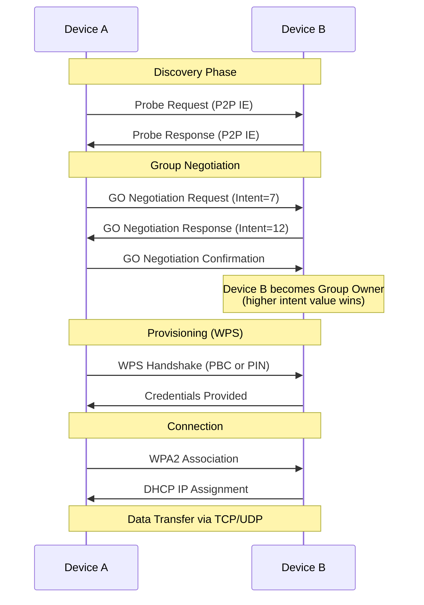

# Wi-Fi Direct

Wi-Fi Direct (also called **Wi-Fi P2P**) enables two devices to establish a direct Wi-Fi connection without an access point or internet connectivity. It offers **significantly higher throughput** than Bluetooth — making it the go-to choice for large file transfers, screen mirroring, and media streaming between nearby devices.

## How Wi-Fi Direct Works

Unlike traditional Wi-Fi where all devices connect to a router, Wi-Fi Direct creates an **ad-hoc group** where one device acts as the **Group Owner** (GO) — essentially a software access point — and the other devices connect as clients.



## Key Concepts

| Concept | Description |
|---|---|
| **Group Owner (GO)** | Acts as the access point; assigns IPs via DHCP. Determined by intent value (0–15) during negotiation |
| **Client** | Connects to the GO like a regular Wi-Fi client |
| **Intent Value** | Priority for becoming GO (0–15). Higher value = more likely to become GO. Tie = random |
| **Service Discovery** | Pre-association discovery of services (Bonjour, UPnP) without connecting first |
| **Persistent Group** | Saved group credentials for fast reconnection without full negotiation |
| **Concurrent Mode** | Some chipsets allow maintaining a Wi-Fi Direct group AND a regular Wi-Fi connection simultaneously |

!!! warning "Wi-Fi Radio Contention"
    On devices that **don't support concurrent mode**, forming a Wi-Fi Direct group will disconnect the device from its existing Wi-Fi network. Always check for concurrent operation support before initiating a connection if network connectivity matters.

## Wi-Fi Direct vs Bluetooth vs Hotspot

| Feature | Wi-Fi Direct | Bluetooth Classic | Mobile Hotspot |
|---|---|---|---|
| **Max throughput** | ~250 Mbps+ | ~3 Mbps | Varies (uses carrier data) |
| **Range** | ~200 m (line of sight) | ~10–100 m | ~30 m |
| **Power draw** | High | Medium | Very High |
| **Internet required** | No | No | Yes (cellular) |
| **Setup** | Group negotiation | Pairing | SSID/password |
| **Multi-client** | Yes (GO supports multiple) | Up to 7 | Yes |
| **Discovery** | Probe frames + service discovery | Inquiry scan | Manual |

## Android Implementation

### Permissions

```xml
<!-- AndroidManifest.xml -->
<uses-permission android:name="android.permission.ACCESS_FINE_LOCATION" />
<uses-permission android:name="android.permission.NEARBY_WIFI_DEVICES"
    android:usesPermissionFlags="neverForLocation" />  <!-- API 33+ -->
<uses-permission android:name="android.permission.ACCESS_WIFI_STATE" />
<uses-permission android:name="android.permission.CHANGE_WIFI_STATE" />
<uses-permission android:name="android.permission.INTERNET" />
```

### Discovering Peers

```kotlin
class WiFiDirectActivity : AppCompatActivity() {

    private lateinit var manager: WifiP2pManager
    private lateinit var channel: WifiP2pManager.Channel

    private val peerListListener = WifiP2pManager.PeerListListener { peerList ->
        val peers = peerList.deviceList.toList()
        // Update UI with discovered devices
        peers.forEach { device ->
            Log.d("P2P", "${device.deviceName} - ${device.deviceAddress}")
        }
    }

    override fun onCreate(savedInstanceState: Bundle?) {
        super.onCreate(savedInstanceState)
        manager = getSystemService(Context.WIFI_P2P_SERVICE) as WifiP2pManager
        channel = manager.initialize(this, mainLooper, null)
    }

    fun discoverPeers() {
        manager.discoverPeers(channel, object : WifiP2pManager.ActionListener {
            override fun onSuccess() {
                // Discovery started — results come via broadcast receiver
            }
            override fun onFailure(reason: Int) {
                // Handle P2P_UNSUPPORTED, ERROR, or BUSY
            }
        })
    }
}
```

### Connecting to a Peer

```kotlin
fun connectToPeer(device: WifiP2pDevice) {
    val config = WifiP2pConfig().apply {
        deviceAddress = device.deviceAddress
        wps.setup = WpsInfo.PBC  // Push Button Connect
        groupOwnerIntent = 0     // Prefer to be client (0-15)
    }

    manager.connect(channel, config, object : WifiP2pManager.ActionListener {
        override fun onSuccess() {
            // Connection initiated — result comes via WIFI_P2P_CONNECTION_CHANGED_ACTION
        }
        override fun onFailure(reason: Int) {
            // Handle failure
        }
    })
}
```

### Transferring Data

Once connected, the Group Owner's address is available via `WifiP2pInfo`. Data transfer uses **standard TCP/UDP sockets**.

=== "Server (Group Owner)"

    ```kotlin
    fun startFileServer(port: Int = 8888) {
        thread {
            val serverSocket = ServerSocket(port)
            val client = serverSocket.accept()  // Blocks until client connects

            val inputStream = client.getInputStream()
            val file = File(context.filesDir, "received_file")
            file.outputStream().use { output ->
                inputStream.copyTo(output)
            }

            serverSocket.close()
        }
    }
    ```

=== "Client"

    ```kotlin
    fun sendFile(hostAddress: InetAddress, port: Int, file: File) {
        thread {
            val socket = Socket()
            socket.connect(InetSocketAddress(hostAddress, port), 5000)

            val outputStream = socket.getOutputStream()
            file.inputStream().use { input ->
                input.copyTo(outputStream)
            }
            outputStream.flush()
            socket.close()
        }
    }
    ```

### Broadcast Receiver

```kotlin
class WiFiDirectReceiver(
    private val manager: WifiP2pManager,
    private val channel: WifiP2pManager.Channel,
    private val peerListListener: WifiP2pManager.PeerListListener,
    private val connectionListener: WifiP2pManager.ConnectionInfoListener
) : BroadcastReceiver() {

    override fun onReceive(context: Context, intent: Intent) {
        when (intent.action) {
            WifiP2pManager.WIFI_P2P_STATE_CHANGED_ACTION -> {
                val state = intent.getIntExtra(WifiP2pManager.EXTRA_WIFI_STATE, -1)
                // Check if P2P is enabled
            }
            WifiP2pManager.WIFI_P2P_PEERS_CHANGED_ACTION -> {
                manager.requestPeers(channel, peerListListener)
            }
            WifiP2pManager.WIFI_P2P_CONNECTION_CHANGED_ACTION -> {
                val networkInfo = intent.getParcelableExtra<NetworkInfo>(
                    WifiP2pManager.EXTRA_NETWORK_INFO
                )
                if (networkInfo?.isConnected == true) {
                    manager.requestConnectionInfo(channel, connectionListener)
                }
            }
        }
    }
}
```

## iOS Implementation

iOS does not expose Wi-Fi Direct APIs directly. Instead, Apple provides **Multipeer Connectivity** (covered in [Nearby APIs](nearby-apis.md)) which uses Wi-Fi Direct under the hood when both devices are nearby and Wi-Fi is enabled.

For explicit peer-to-peer Wi-Fi, iOS apps can use:

```swift
import NetworkExtension

// Wi-Fi Aware (iOS 16+) for peer-to-peer discovery
// Apple's Network framework for direct device-to-device connections
import Network

let params = NWParameters.tcp
let connection = NWConnection(
    to: .service(name: "my-device", type: "_myapp._tcp", domain: "local"),
    using: params
)
connection.start(queue: .main)
```

!!! note "Platform Asymmetry"
    Android provides full Wi-Fi Direct control. iOS abstracts it behind Multipeer Connectivity, making cross-platform Wi-Fi Direct connections between Android and iOS impractical without a shared protocol layer.

## Service Discovery

Wi-Fi Direct supports **pre-association service discovery** — devices can discover what services a peer offers before connecting.

```kotlin
// Register a local service
val serviceInfo = WifiP2pDnsSdServiceInfo.newInstance(
    "MyFileShare",         // Instance name
    "_myapp._tcp",         // Service type
    mapOf("port" to "8888", "available" to "yes")  // TXT records
)

manager.addLocalService(channel, serviceInfo, object : WifiP2pManager.ActionListener {
    override fun onSuccess() { /* Service registered */ }
    override fun onFailure(reason: Int) { /* Handle error */ }
})

// Discover remote services
manager.setDnsSdResponseListeners(channel,
    { instanceName, registrationType, device ->
        // Service found — instanceName is "MyFileShare"
    },
    { fullDomain, record, device ->
        // TXT record received — record["port"] is "8888"
    }
)

val serviceRequest = WifiP2pDnsSdServiceRequest.newInstance()
manager.addServiceRequest(channel, serviceRequest, actionListener)
manager.discoverServices(channel, actionListener)
```

## Real-World Use Cases

| Application | How Wi-Fi Direct Is Used |
|---|---|
| **AirDrop (conceptual)** | Apple uses a proprietary protocol over Wi-Fi Direct + BLE for discovery |
| **Miracast** | Screen mirroring standard built entirely on Wi-Fi Direct |
| **Google Files Nearby Share** | Falls back to Wi-Fi Direct for high-speed transfer after BLE discovery |
| **Printer/Camera Direct** | Many printers and cameras act as Wi-Fi Direct GOs for direct photo transfer |
| **Multiplayer Gaming** | Low-latency local multiplayer without router dependency |

## Common Pitfalls

| Pitfall | Solution |
|---|---|
| Discovery doesn't find peers | Ensure both devices have Wi-Fi enabled and location permission granted |
| Connection drops existing Wi-Fi | Check for concurrent mode support; warn users before connecting |
| GO always gets the same device | Set `groupOwnerIntent` explicitly; use 0 for client preference, 15 for GO preference |
| Firewall blocks socket traffic | Some ROMs block P2P socket traffic; test on multiple OEMs |
| Slow discovery on Android 10+ | Location must be enabled (not just permission); prompt user to turn on GPS |

??? question "Common Interview Questions"

    **Q: How does Wi-Fi Direct differ from a mobile hotspot?**

    Wi-Fi Direct creates a peer-to-peer connection without requiring cellular data or internet. A mobile hotspot shares the device's cellular connection. Wi-Fi Direct uses WPA2 with WPS for security setup and doesn't route traffic to the internet. The Group Owner acts as a DHCP server but not a NAT gateway.

    **Q: Can more than two devices participate in Wi-Fi Direct?**

    Yes. The Group Owner can accept multiple client connections simultaneously, similar to an access point. Some implementations support Wi-Fi Direct groups of up to 8–10 devices. However, performance degrades as more clients share the same radio channel.

    **Q: How is the Group Owner selected?**

    During Group Negotiation, each device sends an **intent value** (0–15). The device with the higher value becomes GO. If both send the same value, a tie-breaking bit decides. A device can force GO role by sending intent 15, or defer by sending 0. Applications can also create **autonomous groups** where a device becomes GO without negotiation.

    **Q: What is Wi-Fi Aware and how does it relate to Wi-Fi Direct?**

    Wi-Fi Aware (Neighbor Awareness Networking / NAN) is a newer standard that enables **continuous, low-power discovery** without forming a group. Devices publish and subscribe to services while in a low-power synchronized state. Once a match is found, devices can establish a Wi-Fi Direct or Wi-Fi Aware data path for transfer. Wi-Fi Aware is more power-efficient for discovery but requires Android 8.0+ and specific hardware.

!!! tip "Further Reading"
    - [Android Wi-Fi Direct Guide](https://developer.android.com/guide/topics/connectivity/wifip2p)
    - [Wi-Fi Alliance P2P Specification](https://www.wi-fi.org/discover-wi-fi/wi-fi-direct)
    - [Android Wi-Fi Aware](https://developer.android.com/guide/topics/connectivity/wifi-aware)
