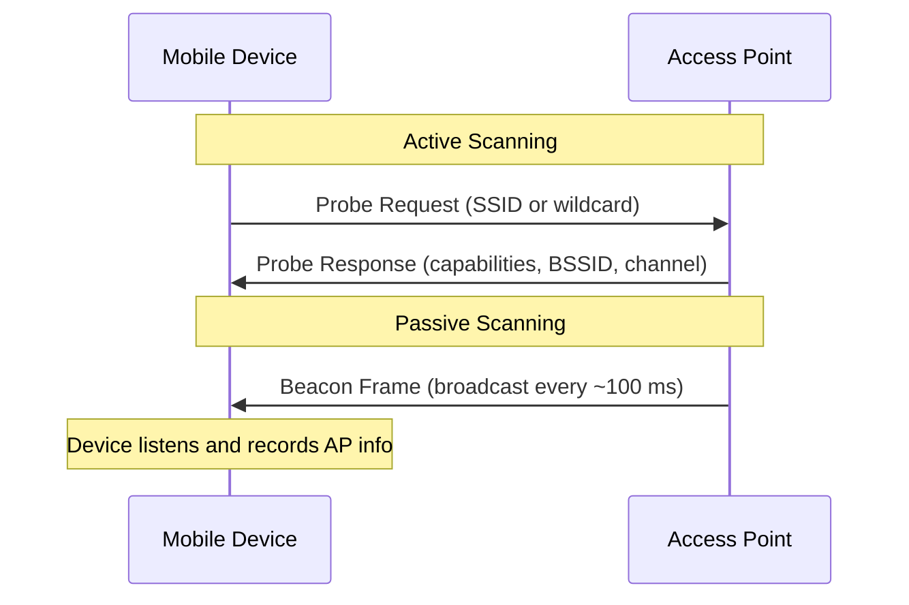
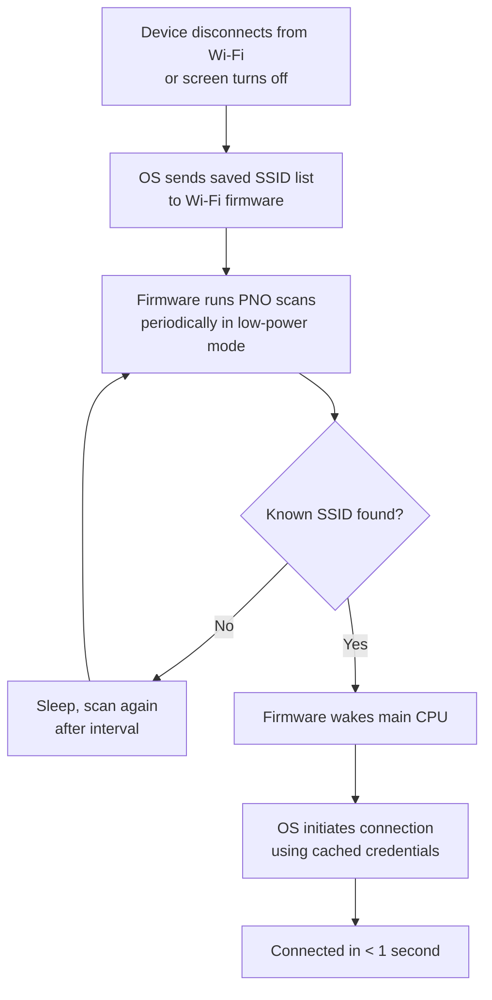
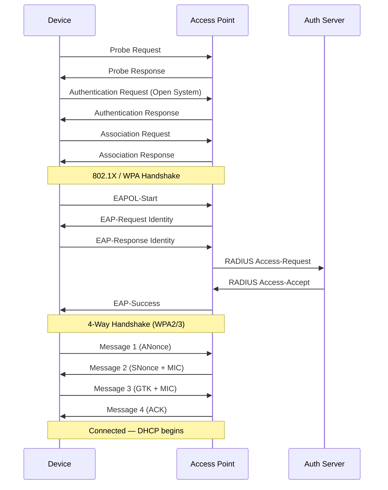
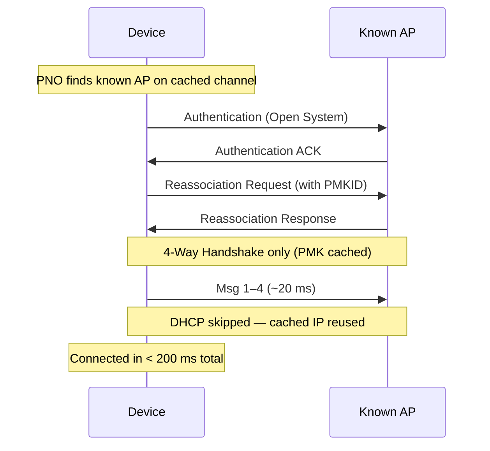
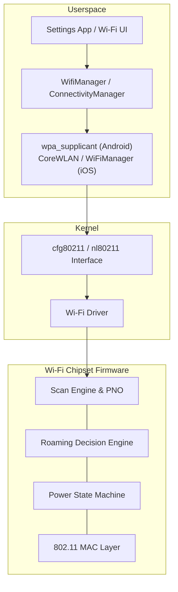
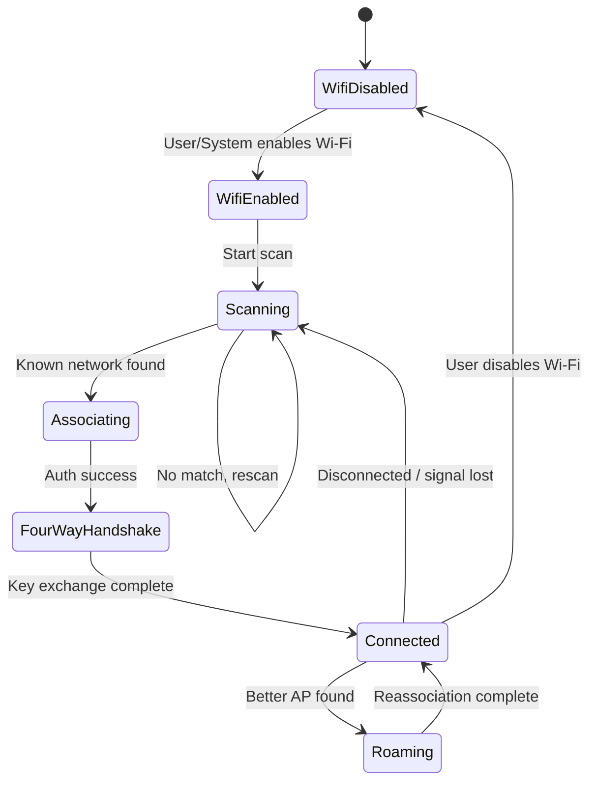
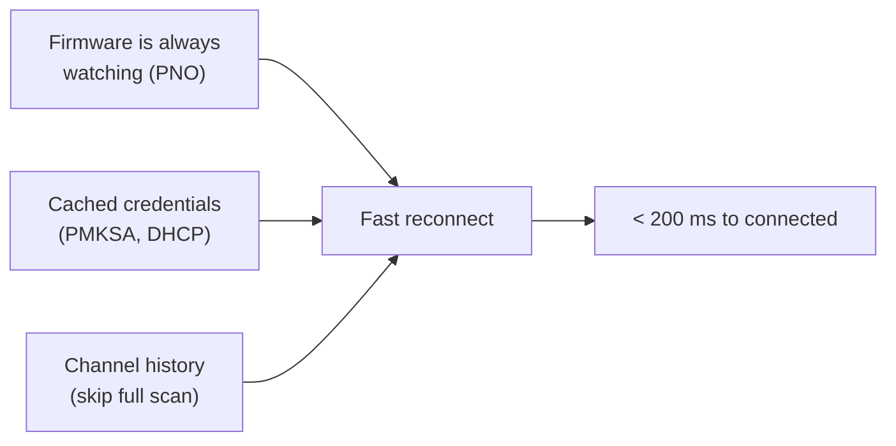

# Wi-Fi Scanning & Fast Connection

Mobile devices appear to connect to known Wi-Fi networks almost instantly — often before you've even unlocked the screen. This isn't magic; it's a combination of **hardware-offloaded scanning**, **cached network state**, and a streamlined **802.11 association handshake** that the OS and Wi-Fi firmware coordinate continuously in the background.

## The Two Scanning Modes

Wi-Fi scanning is how a device discovers available access points (APs). There are two fundamentally different approaches:

| Aspect | Passive Scanning | Active Scanning |
|---|---|---|
| **Mechanism** | Listen for AP beacon frames | Send probe requests, wait for probe responses |
| **Who transmits** | Only the AP | Both device and AP |
| **Speed** | Slow — must wait for beacons (~100 ms per channel) | Fast — AP responds immediately to probes |
| **Power cost** | Lower per scan (just listening) | Higher per scan (radio transmits) |
| **Channel coverage** | Must dwell on each channel long enough | Can probe specific SSIDs on specific channels |
| **Typical use** | Background discovery, regulatory compliance (DFS channels) | Foreground scans, reconnection to known networks |

!!! note "DFS Channels"
    On DFS (Dynamic Frequency Selection) channels (5 GHz bands shared with radar), **active scanning is prohibited** by regulation. Devices must use passive scanning on these channels, which is why 5 GHz discovery can be slightly slower.

## Why Connection Feels Instant — PNO & Offloaded Scanning

The key reason mobile devices reconnect so fast is that **scanning never truly stops**. The Wi-Fi chipset handles most of the work autonomously, even while the main CPU sleeps.

### Preferred Network Offload (PNO)

PNO is the mechanism that makes reconnection feel instant. The OS hands the Wi-Fi firmware a list of known/saved SSIDs, and the firmware scans for them **independently** — no CPU wake-up needed until a match is found.

| PNO Detail | Description |
|---|---|
| **What's offloaded** | The SSID list, scan channels, and scan schedule run entirely on the Wi-Fi chip |
| **Scan interval** | Typically starts at ~20 s, backs off to ~60–300 s over time |
| **Channels scanned** | Only channels where known SSIDs were last seen (from channel history) |
| **CPU involvement** | Zero until a match is found — then the chip raises an interrupt |
| **Power cost** | Minimal — firmware radio is duty-cycled at < 1% |

### Scan Scheduling Strategy

Mobile OSes don't scan at a fixed rate. They use **exponential backoff** with context awareness:

| State | Scan Behavior | Typical Interval |
|---|---|---|
| **Just disconnected** | Aggressive scanning | 5–10 s |
| **Screen on, no Wi-Fi** | Moderate scanning | 20–30 s |
| **Screen off, no Wi-Fi** | PNO offloaded to firmware | 60–300 s (backs off) |
| **Connected & stationary** | Roaming scans only | 60–120 s |
| **Connected & moving** | More frequent roaming scans | 10–30 s |
| **Airplane mode / Wi-Fi off** | No scanning | — |

!!! tip "Location-Aware Scanning"
    Both Android and iOS use **geofencing** to further optimize. If the device's coarse location (via cell towers) is far from any saved network, scan frequency drops even further. This is why your phone reconnects faster when you arrive home than when you're traveling.

## The 802.11 Connection Sequence

Once a known AP is found, the actual connection process has several steps — but optimizations collapse many of them:

### Full Association (First Time)

### Fast Reconnection — What Gets Skipped

For known networks, multiple optimizations drastically reduce this sequence:

| Optimization | What It Skips | Time Saved |
|---|---|---|
| **PMK Caching (PMKSA)** | Full 802.1X authentication | 500–2000 ms |
| **OKC (Opportunistic Key Caching)** | Re-authentication when roaming between APs of the same network | 500–2000 ms |
| **802.11r (Fast BSS Transition)** | Reassociation overhead during roaming | 50–100 ms |
| **DHCP caching** | Full DHCP Discover/Offer/Request/Ack | 200–1000 ms |
| **Cached channel + BSSID** | Scanning all channels | 500–3000 ms |

## Wi-Fi Subsystem Architecture

The Wi-Fi stack on mobile devices is split between userspace, kernel, and firmware:

| Component | Role |
|---|---|
| **wpa_supplicant** | Manages authentication, key negotiation, network selection (Android uses a modified version) |
| **cfg80211 / nl80211** | Linux kernel API for Wi-Fi configuration and events |
| **Wi-Fi firmware** | Runs on the chipset itself — handles scanning, power management, and low-level MAC operations autonomously |
| **Scan Engine** | Firmware component that executes PNO and scheduled scans without CPU involvement |
| **Roaming Engine** | Firmware decides when to switch APs based on RSSI thresholds, typically at -70 to -75 dBm |

## Android-Specific Behavior

### Wi-Fi State Machine

Android's `WifiStateMachine` (now `ClientModeImpl`) governs all transitions:

### Scan Throttling (Android 9+)

To protect battery and privacy, Android throttles foreground app-initiated scans:

| Context | Max Scans | Period |
|---|---|---|
| Foreground app | 4 scans | Per 2-minute window |
| Background app | 1 scan | Per 30-minute window |
| System / Settings | Unlimited | — |

!!! warning "Apps Can't Force Fast Scanning"
    Third-party apps cannot bypass scan throttling. Only the system Wi-Fi service and Settings app can trigger unrestricted scans. Apps should use `ConnectivityManager.NetworkCallback` to react to connectivity changes rather than polling.

### Network Selection Scoring

When multiple known networks are available, Android uses a scoring algorithm:

| Factor | Weight |
|---|---|
| **RSSI** | Primary factor — 5 GHz gets a bonus at close range |
| **Internet validation** | Networks that passed captive portal check score higher |
| **User preference** | Last manually selected network gets a temporary boost |
| **Security** | WPA3 > WPA2 > Open |
| **Band** | 5 GHz preferred over 2.4 GHz when RSSI is adequate |
| **Metered status** | Unmetered networks preferred |

## iOS-Specific Behavior

### Auto-Join & Known Network Ranking

iOS uses a private framework (`WiFiManager.framework`) with its own ranking heuristic:

| Factor | Behavior |
|---|---|
| **Last connected** | Most recently used SSID gets priority |
| **Private address** | Each SSID gets a unique random MAC (iOS 14+) |
| **Auto-Join toggle** | Per-network setting — if disabled, iOS never auto-connects |
| **Captive network** | Remembered networks that required portal login rank lower |
| **Managed networks** | MDM-pushed profiles can force priority and prevent removal |

### Wi-Fi Assist

iOS includes **Wi-Fi Assist** — when a connected Wi-Fi network has poor internet connectivity, iOS transparently falls back to cellular without disconnecting Wi-Fi. This creates the perception of even faster connectivity.

## Power Optimization — How Scanning Doesn't Kill Battery

| Technique | How It Saves Power |
|---|---|
| **PNO offload** | Wi-Fi chip scans independently; main CPU stays asleep |
| **Channel pruning** | Only scan channels where known networks were seen before |
| **Exponential backoff** | Scan less frequently the longer the device is disconnected |
| **Batched scan results** | Firmware queues results and delivers in batches to reduce CPU wakeups |
| **DTIM-based sleep** | While connected, radio sleeps between beacon intervals (DTIM period) |
| **Geofence gating** | Skip Wi-Fi scans when cell location is far from any known network |

!!! note "Typical Power Cost"
    A single Wi-Fi scan costs roughly **50–100 mW for 200–500 ms**. With PNO scanning every 60 seconds, Wi-Fi scanning consumes **< 1% battery per hour** — far less than the screen or cellular radio.

## Summary — Why It Feels Instant

| Misconception | Reality |
|---|---|
| "The phone scans when I unlock it" | The firmware has been scanning the whole time — it found the network before you unlocked |
| "It connects faster to my home Wi-Fi because it's close" | It reconnects fast because it has cached PMK keys, BSSID, channel, and IP address |
| "Wi-Fi scanning drains battery" | PNO offload makes background scanning negligible — < 1% per hour |
| "The phone polls the router" | The device does active probe scanning, not polling — it broadcasts and listens, not request/response over an existing connection |

??? question "Common Interview Questions"

    **Q: Does a mobile device continuously scan for Wi-Fi networks?**

    Not exactly "continuously." The Wi-Fi firmware performs periodic scans using **Preferred Network Offload (PNO)**. The OS provides a list of saved SSIDs to the firmware, which autonomously scans for them at increasing intervals (starting at ~20 s, backing off to ~5 min). The main CPU is not involved until a match is found. So it's periodic hardware-level scanning, not continuous polling.

    **Q: What's the difference between active and passive Wi-Fi scanning?**

    In **active scanning**, the device transmits probe requests and APs respond with probe responses — fast but uses more power. In **passive scanning**, the device silently listens for AP beacons broadcast every ~100 ms — slower but required on DFS channels where active probing is prohibited. Mobile devices primarily use active scanning for known SSIDs and passive scanning for discovery of new networks on restricted channels.

    **Q: How does a phone reconnect to a known Wi-Fi network in under a second?**

    Three key optimizations: (1) **PNO** means the firmware already found the AP before the OS even asks — no scan delay. (2) **PMK caching** (PMKSA) skips the full 802.1X authentication and only requires the 4-way handshake (~20 ms). (3) **DHCP caching** reuses the previously assigned IP address, skipping the full DHCP exchange. Combined, these reduce connection time from ~3–5 seconds to under 200 ms.

    **Q: Why does Android require location permission for Wi-Fi scanning?**

    Wi-Fi scan results include BSSIDs (MAC addresses of APs) and RSSI values, which can be mapped to physical locations using databases like Google's or Mozilla's. This makes Wi-Fi scans functionally equivalent to location lookups. Android 13+ further tightened this with the `NEARBY_WIFI_DEVICES` permission for non-location use cases.

    **Q: What happens to Wi-Fi scanning when a device enters Doze mode?**

    In Doze mode, the OS suspends most background activity, but **PNO continues at the firmware level** since it doesn't require the main CPU. However, scan intervals are stretched further, and the system may defer connection if there's no active network request. During maintenance windows, normal scan scheduling resumes briefly.

    **Q: How do mobile devices choose between 2.4 GHz and 5 GHz for the same SSID?**

    Both Android and iOS implement **band steering** on the client side. When both bands are available, the device prefers 5 GHz if the RSSI is above a threshold (typically > -65 to -70 dBm), because 5 GHz offers more bandwidth and less interference. Below that threshold, 2.4 GHz is preferred for its better range. Enterprise APs also do server-side band steering by delaying probe responses on 2.4 GHz.

!!! tip "Further Reading"
    - [Android Wi-Fi Overview — AOSP](https://source.android.com/docs/core/connect/wifi-overview)
    - [802.11 Wireless Networks — IEEE](https://www.ieee802.org/11/)
    - [Preferred Network Offload — Android Source](https://source.android.com/docs/core/connect/wifi-scan)
    - [Wi-Fi Power Consumption — Qualcomm](https://www.qualcomm.com/products/features/wi-fi)
    - [Understanding Wi-Fi Scanning — Aruba Networks](https://www.arubanetworks.com/techdocs/)
