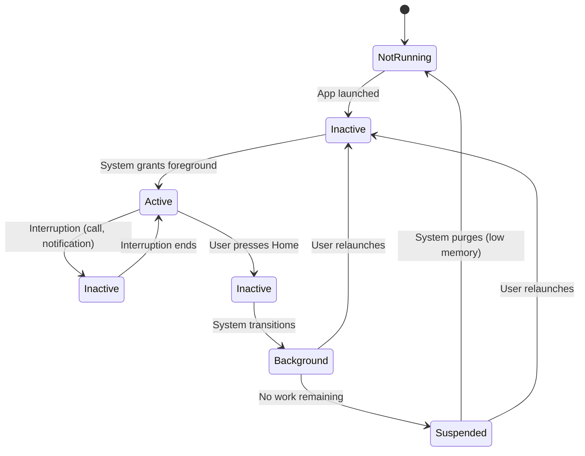
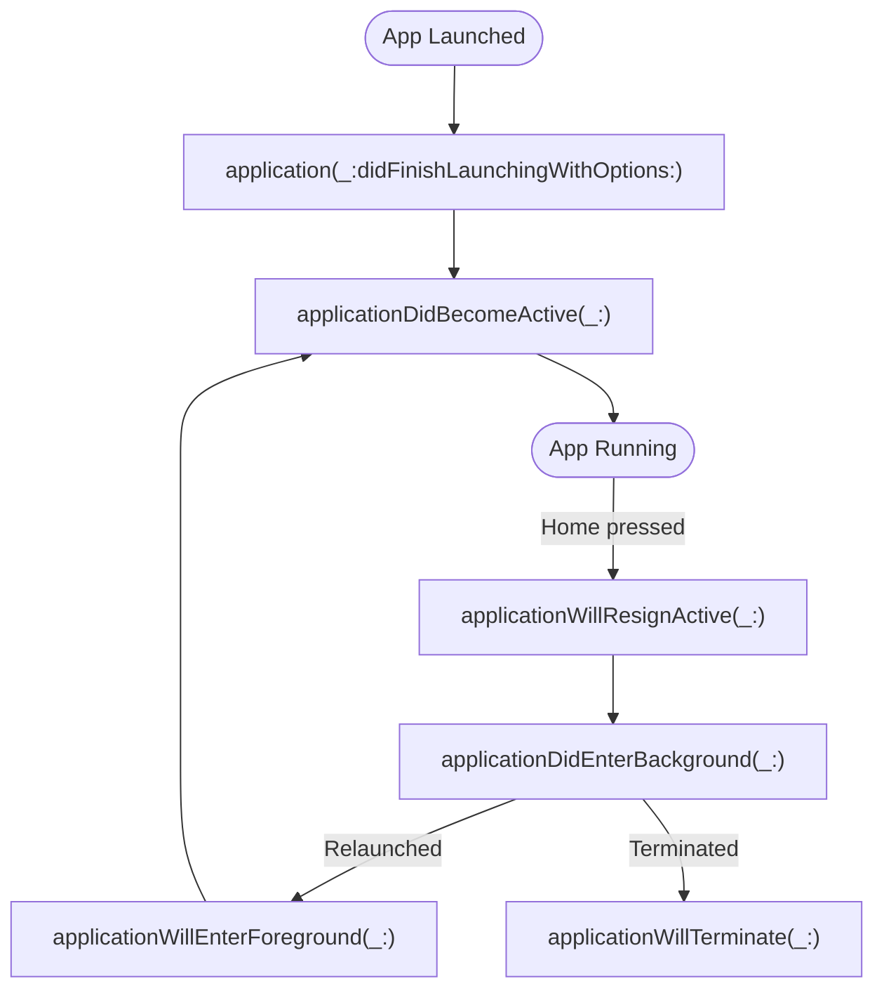
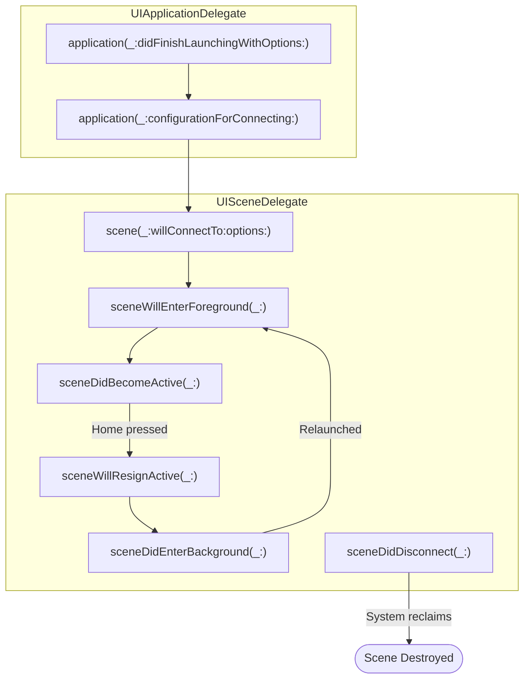
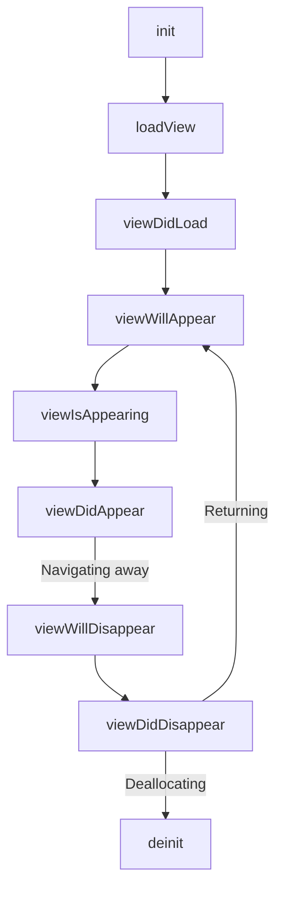
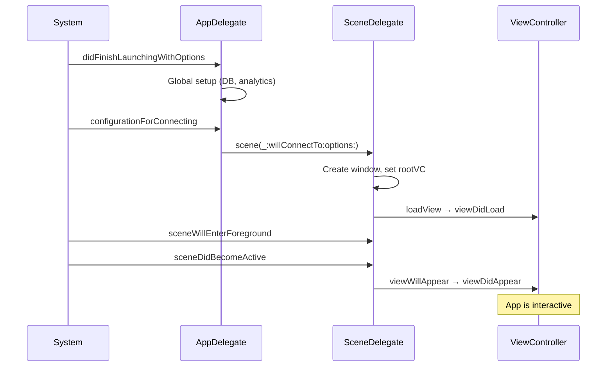

# iOS App Lifecycle

---

## App States



| State | Description | Code Runs? |
|---|---|---|
| **Not Running** | App has not been launched or was terminated by the system | No |
| **Inactive** | App is in the foreground but not receiving events (transitional) | Yes |
| **Active** | App is in the foreground and receiving events | Yes |
| **Background** | App is executing code but not visible | Yes (limited time) |
| **Suspended** | App is in memory but not executing code | No |

!!! note "Background Execution"
    Apps get ~5 seconds of background time by default. Request more with `beginBackgroundTask(expirationHandler:)`. Long-running tasks (audio, location, VoIP) need specific background mode entitlements declared in `Info.plist`.

---

## UIKit App Lifecycle (Pre-iOS 13)

Before iOS 13, `UIApplicationDelegate` handled all lifecycle events directly.



### Key Callbacks

| Callback | When | Typical Use |
|---|---|---|
| `didFinishLaunchingWithOptions` | App process starts | One-time setup, root view controller |
| `applicationDidBecomeActive` | App enters foreground | Resume paused tasks, restart timers |
| `applicationWillResignActive` | About to lose focus | Pause ongoing tasks, save transient state |
| `applicationDidEnterBackground` | App is now backgrounded | Save user data, release shared resources |
| `applicationWillEnterForeground` | Returning from background | Undo background changes |
| `applicationWillTerminate` | App is about to be killed | Final cleanup (not guaranteed to be called) |

---

## Scene-Based Lifecycle (iOS 13+)

iOS 13 introduced the scene architecture to support multiple windows (especially on iPad). Lifecycle responsibilities are split between `UIApplicationDelegate` and `UISceneDelegate`.



### Responsibility Split

| Concern | Pre-iOS 13 | iOS 13+ |
|---|---|---|
| Process-level setup | `UIApplicationDelegate` | `UIApplicationDelegate` |
| UI lifecycle (foreground/background) | `UIApplicationDelegate` | `UISceneDelegate` |
| Window management | `UIApplicationDelegate` | `UISceneDelegate` |
| New scene configuration | N/A | `UIApplicationDelegate` returns `UISceneConfiguration` |

### Scene Session Lifecycle

```swift
// AppDelegate — process-level
class AppDelegate: UIResponder, UIApplicationDelegate {
    func application(
        _ application: UIApplication,
        didFinishLaunchingWithOptions launchOptions: [UIApplication.LaunchOptionsKey: Any]?
    ) -> Bool {
        // One-time setup: database, analytics, logging
        return true
    }

    func application(
        _ application: UIApplication,
        configurationForConnecting connectingSceneSession: UISceneSession,
        options: UIScene.ConnectionOptions
    ) -> UISceneConfiguration {
        UISceneConfiguration(name: "Default", sessionRole: connectingSceneSession.role)
    }
}

// SceneDelegate — per-window UI lifecycle
class SceneDelegate: UIResponder, UIWindowSceneDelegate {
    var window: UIWindow?

    func scene(_ scene: UIScene, willConnectTo session: UISceneSession,
               options connectionOptions: UIScene.ConnectionOptions) {
        guard let windowScene = scene as? UIWindowScene else { return }
        window = UIWindow(windowScene: windowScene)
        window?.rootViewController = MainViewController()
        window?.makeKeyAndVisible()
    }

    func sceneDidBecomeActive(_ scene: UIScene) {
        // Resume tasks, restart timers
    }

    func sceneDidEnterBackground(_ scene: UIScene) {
        // Save state, release shared resources
    }
}
```

!!! warning "Scene Disconnect vs Destroy"
    `sceneDidDisconnect` means the system released the scene's UI to reclaim memory — **not** that the user closed the app. The scene session persists and the scene may reconnect later. Save per-scene state in `sceneDidDisconnect` and restore in `scene(_:willConnectTo:options:)`.

---

## SwiftUI App Lifecycle

SwiftUI apps use the `App` protocol, replacing `AppDelegate` and `SceneDelegate` entirely.

```swift
@main
struct MyApp: App {
    @Environment(\.scenePhase) var scenePhase

    var body: some Scene {
        WindowGroup {
            ContentView()
        }
        .onChange(of: scenePhase) { oldPhase, newPhase in
            switch newPhase {
            case .active:
                print("App is active")
            case .inactive:
                print("App is inactive")
            case .background:
                print("App is in background")
            @unknown default:
                break
            }
        }
    }
}
```

### ScenePhase

| Phase | Equivalent UIKit State |
|---|---|
| `.active` | `sceneDidBecomeActive` |
| `.inactive` | `sceneWillResignActive` |
| `.background` | `sceneDidEnterBackground` |

!!! tip "Accessing UIKit from SwiftUI"
    If you need `UIApplicationDelegate` callbacks (push notifications, deep links) in a SwiftUI app, use `@UIApplicationDelegateAdaptor`:

    ```swift
    @main
    struct MyApp: App {
        @UIApplicationDelegateAdaptor(AppDelegate.self) var appDelegate

        var body: some Scene {
            WindowGroup { ContentView() }
        }
    }
    ```

---

## UIViewController Lifecycle



### Callback Details

| Callback | Called | Use For |
|---|---|---|
| `loadView` | View hierarchy is created (once) | Custom view hierarchy (skip if using storyboard/XIB) |
| `viewDidLoad` | View loaded into memory (once) | One-time UI setup, data binding |
| `viewWillAppear` | Before view is added to window | Refresh data, start animations |
| `viewIsAppearing` | View has traits and geometry (iOS 17+) | Layout-dependent setup |
| `viewDidAppear` | View is visible and animated in | Start timers, analytics tracking |
| `viewWillDisappear` | View is about to be removed | Pause media, save draft state |
| `viewDidDisappear` | View is removed from hierarchy | Cancel network requests, stop timers |

!!! note "`viewIsAppearing` (iOS 17+)"
    Added to address a longstanding gap: in `viewWillAppear`, the view's size and traits aren't final yet. `viewIsAppearing` is called after the view has been added to the hierarchy with correct geometry and trait collections. Use it for layout-dependent configuration that previously required workarounds in `viewDidAppear`.

### Push/Pop Navigation (A → B and Back)

**Forward navigation (push B):**

1. A `viewWillDisappear`
2. B `viewDidLoad` (if first time)
3. B `viewWillAppear`
4. A `viewDidDisappear`
5. B `viewDidAppear`

**Back navigation (pop B):**

1. B `viewWillDisappear`
2. A `viewWillAppear`
3. B `viewDidDisappear`
4. A `viewDidAppear`
5. B `deinit` (if no strong references remain)

### Present/Dismiss Modal (A presents B)

**Present:**

1. B `viewDidLoad` (if first time)
2. A `viewWillDisappear` (only if B is fullscreen)
3. B `viewWillAppear` → `viewDidAppear`
4. A `viewDidDisappear` (only if B is fullscreen)

**Dismiss:**

1. B `viewWillDisappear`
2. A `viewWillAppear` (only if A was disappeared)
3. B `viewDidDisappear`
4. A `viewDidAppear` (only if A was disappeared)

!!! warning "Sheet/Page Sheet Presentation"
    Since iOS 13, the default modal style is `.pageSheet` (not fullscreen). The presenting view controller's `viewWillDisappear`/`viewDidDisappear` are **not called** because it remains partially visible behind the sheet.

---

## State Restoration

### UIKit (NSUserActivity)

```swift
// Save state
override func updateUserActivityState(_ activity: NSUserActivity) {
    activity.addUserInfoEntries(from: ["documentID": currentDocumentID])
    super.updateUserActivityState(activity)
}

// Restore state in SceneDelegate
func scene(_ scene: UIScene, willConnectTo session: UISceneSession,
           options connectionOptions: UIScene.ConnectionOptions) {
    if let activity = session.stateRestorationActivity {
        restoreState(from: activity)
    }
}
```

### SwiftUI (@SceneStorage)

```swift
struct ContentView: View {
    @SceneStorage("selectedTab") var selectedTab = 0
    @SceneStorage("draftText") var draftText = ""

    var body: some View {
        TabView(selection: $selectedTab) {
            EditorView(text: $draftText).tag(0)
            SettingsView().tag(1)
        }
    }
}
```

`@SceneStorage` automatically persists and restores per-scene state across app launches.

---

## Background Execution

### Background Tasks (BGTaskScheduler)

```swift
// Register in didFinishLaunchingWithOptions
BGTaskScheduler.shared.register(
    forTaskWithIdentifier: "com.app.refresh",
    using: nil
) { task in
    handleAppRefresh(task: task as! BGAppRefreshTask)
}

// Schedule
func scheduleRefresh() {
    let request = BGAppRefreshTaskRequest(identifier: "com.app.refresh")
    request.earliestBeginDate = Date(timeIntervalSinceNow: 15 * 60)
    try? BGTaskScheduler.shared.submit(request)
}

// Handle
func handleAppRefresh(task: BGAppRefreshTask) {
    scheduleRefresh()  // reschedule next refresh

    let operation = RefreshOperation()
    task.expirationHandler = { operation.cancel() }

    operation.completionBlock = {
        task.setTaskCompleted(success: !operation.isCancelled)
    }
    OperationQueue.main.addOperation(operation)
}
```

### Background Modes

Declared in `Info.plist` under `UIBackgroundModes`:

| Mode | Use Case |
|---|---|
| `audio` | Music/podcast playback |
| `location` | Continuous location updates |
| `voip` | VoIP call handling |
| `fetch` | Periodic background fetch |
| `remote-notification` | Silent push notifications |
| `processing` | Long-running maintenance tasks |

---

## Launch Sequence Summary



---

??? question "Interview Questions"

    **Q: What are the five app states in iOS?**
    Not Running, Inactive, Active, Background, and Suspended. Inactive is a brief transitional state (e.g., during alerts or app switching). Background gives limited execution time. Suspended means the app is in memory but not executing — the system may purge it without notice.

    **Q: What changed with the scene-based lifecycle in iOS 13?**
    Process-level events (launch, termination) stay in `UIApplicationDelegate`. Per-window UI lifecycle (foreground, background, disconnect) moved to `UISceneDelegate`. This enables multi-window support on iPad. Each scene has its own independent lifecycle.

    **Q: When is `viewDidLoad` vs `viewWillAppear` called?**
    `viewDidLoad` is called once when the view is loaded into memory — use it for one-time setup. `viewWillAppear` is called every time the view is about to be displayed — use it for refreshing data. After a navigation pop back, `viewWillAppear` fires but `viewDidLoad` does not.

    **Q: How do you handle state restoration?**
    UIKit: save state via `NSUserActivity` in `updateUserActivityState`, restore in `scene(_:willConnectTo:options:)`. SwiftUI: use `@SceneStorage` for automatic per-scene persistence. Both survive app termination by the system (not force-quit by the user).

    **Q: Why doesn't `viewWillDisappear` fire when presenting a sheet?**
    Since iOS 13, the default modal presentation style is `.pageSheet`, which leaves the presenting VC partially visible. `viewWillDisappear` only fires when the view is fully removed from the visible hierarchy. Use `.fullScreen` if you need those callbacks.

    **Q: How does background execution work?**
    Apps get ~5 seconds of background time by default. `beginBackgroundTask` extends this to ~30 seconds. For longer work, use `BGTaskScheduler` (app refresh or processing tasks). Specific background modes (audio, location, VoIP) allow continuous execution but require entitlements and App Store review justification.

    **Q: What is `sceneDidDisconnect` and how does it differ from app termination?**
    `sceneDidDisconnect` means the system released the scene's UI resources to free memory. The scene session still exists and may reconnect. App termination kills the entire process. Save per-scene state in `sceneDidDisconnect` and restore when the scene reconnects.

!!! tip "Further Reading"
    - [Managing Your App's Life Cycle (Apple)](https://developer.apple.com/documentation/uikit/app_and_environment/managing_your_app_s_life_cycle)
    - [UIViewController Lifecycle (Apple)](https://developer.apple.com/documentation/uikit/uiviewcontroller)
    - [WWDC 2019 — Architecting Your App for Multiple Windows](https://developer.apple.com/videos/play/wwdc2019/258/)
    - [WWDC 2023 — What's New in UIKit (viewIsAppearing)](https://developer.apple.com/videos/play/wwdc2023/10055/)
