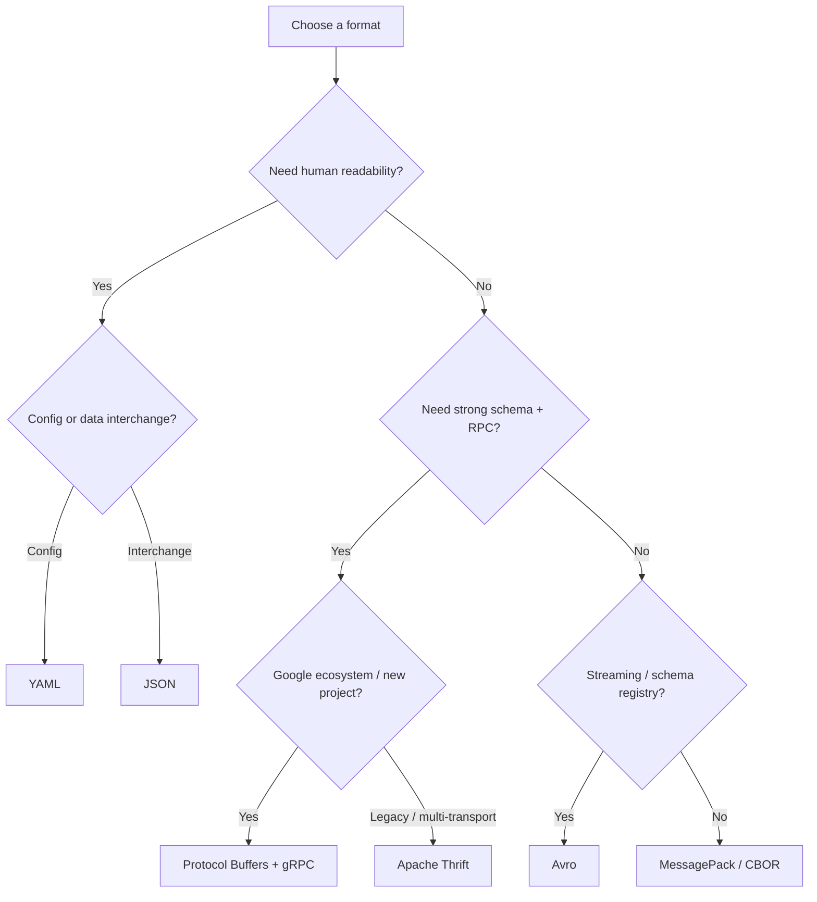

# Data Formats & Serialization

Choosing the right data format affects wire size, parsing speed, schema evolution, and developer ergonomics. This section covers the major serialization formats used across APIs, configuration, storage, and RPC.

---

## Format Landscape

| Format | Type | Human-Readable | Schema | Typical Use |
|--------|------|---------------|--------|-------------|
| **JSON** | Text | Yes | Optional (JSON Schema) | REST APIs, config, browser interchange |
| **YAML** | Text | Yes | Optional | Config files, CI/CD, Kubernetes manifests |
| **Protocol Buffers** | Binary | No | Required (`.proto`) | gRPC, high-throughput services, mobile |
| **Apache Thrift** | Binary | No | Required (`.thrift`) | Cross-language RPC, legacy Facebook services |
| **MessagePack** | Binary | No | Optional | JSON-compatible binary (Redis, Fluentd) |
| **Avro** | Binary | No | Required (JSON schema) | Hadoop, Kafka, schema registry |
| **CBOR** | Binary | No | Optional | IoT, constrained environments |

---

## Decision Matrix

---

## Performance Comparison

| Metric | JSON | YAML | Protobuf | Thrift (Binary) |
|--------|------|------|----------|-----------------|
| **Serialization speed** | Medium | Slow | Fast | Fast |
| **Deserialization speed** | Medium | Slow | Fast | Fast |
| **Message size** | Large (text + keys) | Larger (whitespace) | Small (varint + field numbers) | Small (field IDs + types) |
| **Schema evolution** | Fragile | Fragile | Strong (field numbers) | Strong (field IDs) |
| **Language support** | Universal | Universal | Wide (codegen) | Wide (codegen) |
| **Debugging** | Easy (readable) | Easy (readable) | Hard (binary) | Hard (binary) |

---

## Sub-Topics

| Topic | What It Covers |
|-------|---------------|
| [JSON & YAML](json-yaml.md) | Spec details, encoding, schemas, parsing internals, anchors, multiline strings |
| [Protocol Buffers](protobuf.md) | Wire format, varint encoding, schema evolution, proto2 vs proto3, gRPC integration |
| [Apache Thrift](thrift.md) | IDL, transport/protocol layers, server models, comparison with Protobuf |

---

??? question "Interview Questions"

    **Q: When would you choose Protobuf over JSON?**

    When bandwidth and latency matter (mobile, microservices), when you need strict schema evolution guarantees, or when using gRPC. JSON is better for public APIs (human-debuggable) and browser clients (native parsing).

    **Q: What's the difference between schema-on-write and schema-on-read?**

    Schema-on-write (Protobuf, Thrift, Avro) validates data against a schema at serialization time — invalid data never gets written. Schema-on-read (JSON, YAML) accepts any structure and validates at deserialization time — more flexible but less safe.

    **Q: Why is YAML risky for untrusted input?**

    YAML parsers historically support arbitrary code execution via tags like `!!python/object`. Always use safe loading (`yaml.safe_load` in Python, `YAML.safe_load` in Ruby). JSON does not have this attack surface.
