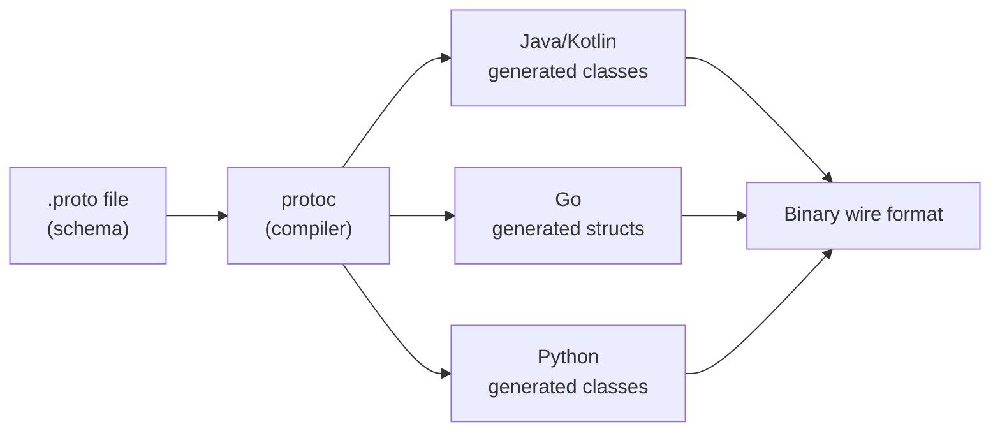

# Protocol Buffers (Protobuf)

Google's language-neutral, platform-neutral binary serialization format. Designed for structured data that needs to be small, fast, and evolvable.

---

## Architecture



1. Define your data schema in a `.proto` file
2. Run `protoc` compiler to generate language-specific code
3. Use generated classes to serialize/deserialize binary data

---

## Proto IDL (Interface Definition Language)

```protobuf
syntax = "proto3";

package example.user;

option java_package = "com.example.user";
option java_multiple_files = true;

message User {
    string id = 1;
    string name = 2;
    int32 age = 3;
    repeated string tags = 4;        // list
    Address address = 5;             // nested message
    optional string nickname = 6;    // explicitly optional
    
    enum Status {
        STATUS_UNSPECIFIED = 0;      // proto3 requires 0 as default
        ACTIVE = 1;
        INACTIVE = 2;
        BANNED = 3;
    }
    Status status = 7;
    
    oneof contact {                  // union — only one field set at a time
        string email = 8;
        string phone = 9;
    }
    
    map<string, string> metadata = 10;  // map type
}

message Address {
    string street = 1;
    string city = 2;
    string country = 3;
}
```

### Scalar Types

| Proto Type | Java/Kotlin | Go | Wire Type | Notes |
|-----------|-------------|-----|-----------|-------|
| `int32` | `int` | `int32` | Varint | Negative numbers use 10 bytes — use `sint32` instead |
| `int64` | `long` | `int64` | Varint | Same caveat for negatives |
| `sint32` | `int` | `int32` | Varint (ZigZag) | Efficient for signed values |
| `uint32` | `int` | `uint32` | Varint | Unsigned |
| `fixed32` | `int` | `uint32` | 32-bit | Always 4 bytes — better for values > 2^28 |
| `float` | `float` | `float32` | 32-bit | IEEE 754 |
| `double` | `double` | `float64` | 64-bit | IEEE 754 |
| `bool` | `boolean` | `bool` | Varint | |
| `string` | `String` | `string` | Length-delimited | Must be UTF-8 |
| `bytes` | `ByteString` | `[]byte` | Length-delimited | Arbitrary binary data |

---

## Wire Format Internals

Every field is encoded as a **key-value pair** on the wire. The key encodes the **field number** and **wire type**.

### Wire Types

| Wire Type | ID | Encoding | Used For |
|-----------|----|----------|----------|
| Varint | 0 | Variable-length integer | `int32`, `int64`, `bool`, `enum`, `sint*` |
| 64-bit | 1 | Fixed 8 bytes | `double`, `fixed64`, `sfixed64` |
| Length-delimited | 2 | Length prefix + bytes | `string`, `bytes`, nested messages, `repeated` (packed) |
| 32-bit | 5 | Fixed 4 bytes | `float`, `fixed32`, `sfixed32` |

### Field Key Encoding

```
key = (field_number << 3) | wire_type
```

Example: field number `2`, wire type `0` (varint):

```
key = (2 << 3) | 0 = 0x10 = 16
```

### Varint Encoding

Variable-length encoding where each byte uses 7 bits for data and 1 bit (MSB) as a continuation flag.

```
Value: 300

Binary: 100101100  (9 bits)

Split into 7-bit groups (LSB first):
  Group 1: 0101100  → with continuation bit: 1_0101100 = 0xAC
  Group 2: 0000010  → no continuation:       0_0000010 = 0x02

Wire bytes: AC 02
```

| Value | Bytes Used | Compared to int32 (4 bytes) |
|-------|------------|---------------------------|
| 0–127 | 1 byte | 75% savings |
| 128–16,383 | 2 bytes | 50% savings |
| 16,384–2,097,151 | 3 bytes | 25% savings |
| > 2^28 | 5 bytes | Worse — use `fixed32` |

### ZigZag Encoding (sint32/sint64)

Standard varint is terrible for negative numbers (`-1` as int32 → 10 bytes because of two's complement sign extension). ZigZag maps signed integers to unsigned:

```
 0 → 0
-1 → 1
 1 → 2
-2 → 3
 2 → 4
...
zigzag(n) = (n << 1) ^ (n >> 31)   // for sint32
```

!!! warning "Always use `sint32`/`sint64` for signed values"
    A plain `int32` field with value `-1` encodes as 10 bytes (max varint size). The same value as `sint32` encodes as 1 byte.

### Complete Wire Example

```protobuf
message Example {
    int32 a = 1;   // value: 150
    string b = 2;  // value: "hello"
}
```

```
Field 1 (a=150):
  Key: (1 << 3) | 0 = 0x08          → 08
  Value: varint(150) = 96 01         → 96 01

Field 2 (b="hello"):
  Key: (2 << 3) | 2 = 0x12          → 12
  Length: varint(5) = 05             → 05
  Value: UTF-8("hello")             → 68 65 6C 6C 6F

Total: 08 96 01 12 05 68 65 6C 6C 6F  (10 bytes)
JSON:  {"a":150,"b":"hello"}           (22 bytes)
```

---

## Schema Evolution

Protobuf's killer feature — **backward and forward compatibility** through field numbers.

### Rules for Safe Evolution

| Action | Safe? | Notes |
|--------|-------|-------|
| Add a new field | Yes | Old code ignores unknown fields |
| Remove a field | Yes | New code uses default values for missing fields |
| Rename a field | Yes | Wire format uses field numbers, not names |
| Change field number | **No** | Wire format breaks — old data becomes unreadable |
| Change field type | **Mostly no** | Some compatible changes (`int32` ↔ `int64`, `string` ↔ `bytes`) |
| Reuse a deleted field number | **No** | Old data with that number will be misinterpreted |

### Reserved Fields

Prevent accidental reuse of deleted field numbers:

```protobuf
message User {
    reserved 4, 8 to 12;
    reserved "old_field", "deprecated_name";
    
    string id = 1;
    string name = 2;
    // field 4 was 'phone' — removed in v3, never reuse
}
```

---

## Proto2 vs Proto3

| Feature | Proto2 | Proto3 |
|---------|--------|--------|
| **Default values** | User-defined | Language defaults (0, "", false) |
| **Required fields** | `required` keyword | Not supported |
| **Optional fields** | `optional` keyword | All fields optional; `optional` keyword for presence tracking |
| **Unknown fields** | Preserved | Preserved (changed in 3.5+, was dropped briefly) |
| **Enums** | First value can be any number | First value must be `0` |
| **Maps** | Not supported | `map<K, V>` syntax |
| **JSON mapping** | Not standardized | Built-in JSON ↔ Proto mapping |

!!! tip "Use Proto3"
    Proto3 is the current standard. Proto2 is only relevant for legacy systems. Proto3 removed `required` because it caused more backward-compatibility problems than it solved.

### Field Presence in Proto3

```protobuf
message Settings {
    int32 volume = 1;              // no presence — 0 means "not set" OR "set to 0"
    optional int32 brightness = 2;  // has presence — can distinguish "not set" from "set to 0"
}
```

```kotlin
settings.hasBrightness()  // true if explicitly set, false if absent
settings.volume           // 0 — but was it set to 0 or never set? Can't tell.
```

---

## gRPC Integration

Protobuf is the default serialization format for gRPC. Service definitions live in `.proto` files:

```protobuf
service UserService {
    rpc GetUser (GetUserRequest) returns (User);                       // Unary
    rpc ListUsers (ListUsersRequest) returns (stream User);            // Server streaming
    rpc UploadUsers (stream User) returns (UploadResponse);            // Client streaming
    rpc Chat (stream ChatMessage) returns (stream ChatMessage);        // Bidirectional streaming
}

message GetUserRequest {
    string id = 1;
}
```

| Pattern | Client | Server | Use Case |
|---------|--------|--------|----------|
| **Unary** | 1 request | 1 response | Standard RPC call |
| **Server streaming** | 1 request | N responses | Feed, notifications |
| **Client streaming** | N requests | 1 response | File upload, telemetry |
| **Bidirectional** | N requests | N responses | Chat, real-time sync |

---

## Protobuf in Practice

### Size Comparison

```
User { id: "abc123", name: "Alice Smith", age: 30, role: ADMIN }

JSON:  {"id":"abc123","name":"Alice Smith","age":30,"role":"ADMIN"}  → 61 bytes
Proto:  0A 06 61 62 63 31 32 33 12 0B ...                          → 27 bytes
                                                            ~56% smaller
```

### When NOT to Use Protobuf

| Scenario | Better Alternative |
|----------|-------------------|
| Public REST API for browsers | JSON (native parsing, debuggable) |
| Human-editable config | YAML / TOML |
| Small payloads (< 100 bytes) | JSON (overhead of schema not worth it) |
| Exploratory / rapidly changing schema | JSON (no codegen step) |
| Need to inspect data in logs | JSON (human-readable) |

---

??? question "Interview Questions"

    **Q: How does Protobuf achieve backward compatibility?**

    Through field numbers. The wire format uses field numbers (not names) as keys. New fields added with new numbers are ignored by old consumers. Removed fields just use default values in new consumers. As long as you never reuse or change field numbers, old and new code can communicate.

    **Q: Why does `int32` with value -1 take 10 bytes?**

    Protobuf's varint encoding treats `int32` as unsigned on the wire. Due to two's complement, `-1` in int32 is `0xFFFFFFFF`, which sign-extends to a 64-bit value `0xFFFFFFFFFFFFFFFF`, requiring the maximum 10 bytes. Use `sint32` which applies ZigZag encoding, mapping `-1` to `1` (1 byte).

    **Q: What happens when you rename a Protobuf field?**

    Nothing — the wire format uses field numbers, not field names. Renaming is always safe. Only the generated code changes.

    **Q: How does Protobuf compare to Avro?**

    Protobuf encodes field numbers in every message (self-describing per field). Avro sends the schema separately and encodes pure data (no field identifiers), making it more compact for batch processing. Avro is dominant in Hadoop/Kafka ecosystems; Protobuf dominates RPC/microservices.

!!! tip "Further Reading"
    - [Protocol Buffers Language Guide (proto3)](https://protobuf.dev/programming-guides/proto3/)
    - [Protobuf Encoding Reference](https://protobuf.dev/programming-guides/encoding/)
    - [gRPC Core Concepts](https://grpc.io/docs/what-is-grpc/core-concepts/)
