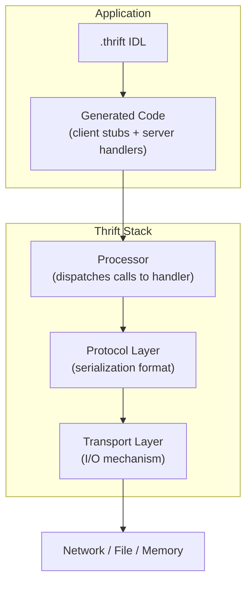
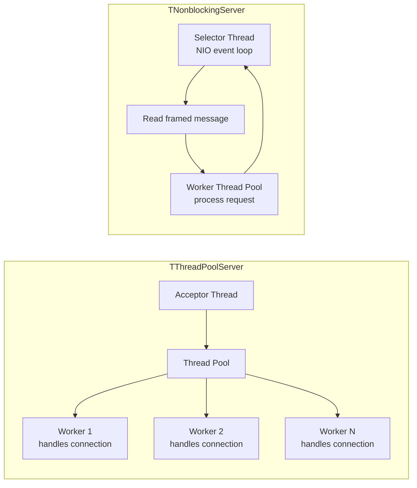

# Apache Thrift

Originally developed at Facebook, Apache Thrift is a cross-language RPC framework with its own IDL, serialization protocols, and transport layers. While Protobuf/gRPC has largely overtaken it for new projects, Thrift remains widely used in large-scale systems (Facebook/Meta, Uber, Twitter/X).

---

## Architecture

Thrift's layered architecture separates **what** you serialize from **how** it's transported.



| Layer | Responsibility | Options |
|-------|---------------|---------|
| **Transport** | How bytes move | Socket, HTTP, memory buffer, file |
| **Protocol** | How data is encoded | Binary, compact, JSON |
| **Processor** | How calls are dispatched | Generated from IDL |
| **Server** | How connections are managed | Simple, threaded, non-blocking |

---

## Thrift IDL

```thrift
namespace java com.example.user
namespace py example.user
namespace go example.user

enum UserStatus {
    UNKNOWN = 0,
    ACTIVE = 1,
    INACTIVE = 2,
    BANNED = 3
}

struct Address {
    1: required string street,
    2: required string city,
    3: optional string zip_code,
    4: string country = "US"        // default value
}

struct User {
    1: required string id,
    2: required string name,
    3: optional i32 age,
    4: list<string> tags,
    5: Address address,
    6: UserStatus status = UserStatus.UNKNOWN,
    7: map<string, string> metadata
}

exception UserNotFoundException {
    1: string user_id,
    2: string message
}

service UserService {
    User getUser(1: string id) throws (1: UserNotFoundException e),
    list<User> listUsers(1: i32 limit, 2: i32 offset),
    void createUser(1: User user),
    oneway void logEvent(1: string event)   // fire-and-forget
}
```

### IDL Types

| Category | Types |
|----------|-------|
| **Base types** | `bool`, `byte`, `i16`, `i32`, `i64`, `double`, `string`, `binary` |
| **Containers** | `list<T>`, `set<T>`, `map<K, V>` |
| **Structs** | Named collection of typed fields |
| **Enums** | Named integer constants |
| **Exceptions** | Structs that can be thrown |
| **Services** | RPC interface definitions |
| **Typedefs** | `typedef i64 Timestamp` |

!!! note "Required vs Optional"
    Unlike Proto3, Thrift retains `required`/`optional` keywords. `required` fields must always be set — if missing during deserialization, it throws an error. Use sparingly as it reduces schema evolution flexibility.

---

## Protocol Layer (Serialization)

| Protocol | Format | Size | Speed | Use Case |
|----------|--------|------|-------|----------|
| **TBinaryProtocol** | Binary | Medium | Fast | Default, general purpose |
| **TCompactProtocol** | Binary (varint) | Small | Fast | Bandwidth-sensitive |
| **TJSONProtocol** | JSON text | Large | Slow | Debugging, interop |
| **TSimpleJSONProtocol** | JSON (write-only) | Large | Medium | Logging |

### Binary Protocol Wire Format

Each field is encoded as: `type (1 byte) + field ID (2 bytes) + value`

```
Field: i32 age = 3, value = 30

Type:     08        (i32 = type 8)
Field ID: 00 03     (field number 3)
Value:    00 00 00 1E  (30 as 4-byte big-endian)

Total: 7 bytes per field
```

### Compact Protocol Wire Format

Uses varint encoding and delta field IDs for smaller messages.

```
Field: i32 age = 3, value = 30 (delta from previous field ID = 2)

Delta + Type: 25    (delta=2 << 4 | type=5 for i32)
Value:        3C    (ZigZag varint of 30)

Total: 2 bytes per field
```

| Metric | Binary Protocol | Compact Protocol |
|--------|----------------|-----------------|
| Field header | 3 bytes | 1 byte (with delta) |
| Integer encoding | Fixed-width | Varint |
| String/binary | 4-byte length prefix | Varint length prefix |
| Best for | Low-latency (no varint decode) | Bandwidth-constrained |

---

## Transport Layer

| Transport | Description | Use Case |
|-----------|-------------|----------|
| **TSocket** | Plain TCP socket | Standard RPC |
| **TFramedTransport** | Length-prefixed frames over TCP | Non-blocking servers |
| **THttpTransport** | HTTP/HTTPS | Firewall-friendly, load balancers |
| **TMemoryTransport** | In-memory buffer | Testing, internal use |
| **TZlibTransport** | Compressed transport | Large payloads |
| **TBufferedTransport** | Buffered I/O wrapper | Reduce syscalls |

!!! warning "Framed Transport Required for Non-Blocking"
    `TNonblockingServer` requires `TFramedTransport`. The server reads the length prefix to know when a complete message has arrived without blocking.

---

## Server Models

| Server | Threading Model | Use Case |
|--------|----------------|----------|
| **TSimpleServer** | Single-threaded, blocking | Testing only |
| **TThreadedServer** | Thread-per-connection | Low-concurrency services |
| **TThreadPoolServer** | Fixed thread pool | Production — bounded resources |
| **TNonblockingServer** | Event-driven (NIO) + worker threads | High-concurrency |
| **THsHaServer** | Non-blocking I/O + half-sync/half-async | High-throughput |



---

## Thrift vs Protobuf/gRPC

| Aspect | Thrift | Protobuf + gRPC |
|--------|--------|-----------------|
| **Origin** | Facebook (2007) | Google (2008 / 2015) |
| **IDL** | `.thrift` | `.proto` |
| **Transport** | Built-in (multiple) | gRPC handles transport (HTTP/2) |
| **Protocols** | Binary, Compact, JSON | Single binary format |
| **Streaming** | Not built-in (requires custom) | Native (server/client/bidirectional) |
| **Required fields** | Supported | Removed in proto3 |
| **Containers** | `list`, `set`, `map` | `repeated`, `map` (no set) |
| **Enums** | Can start at any value | Must start at 0 (proto3) |
| **Exceptions** | First-class | Encoded as status codes |
| **Code generation** | Built into thrift compiler | protoc + language plugins |
| **Ecosystem** | Shrinking | Growing (Cloud Native) |
| **HTTP/2** | Manual setup | Built-in (gRPC) |
| **Load balancing** | Application-level | gRPC-native + service mesh |

### When to Choose Thrift

- Legacy systems already using Thrift (migration cost > benefit)
- Need for multiple serialization protocols (binary for speed, JSON for debugging) without changing code
- Systems requiring custom transport layers
- Internal services where streaming is not a requirement

### When to Choose Protobuf/gRPC

- New projects (larger ecosystem, better tooling)
- Need for streaming RPCs
- Cloud-native environments (Kubernetes, Istio, Envoy natively support gRPC)
- Mobile clients (gRPC-Web, efficient binary format)

---

## Schema Evolution

Same principles as Protobuf — field IDs are the stable identifier.

| Action | Safe? | Notes |
|--------|-------|-------|
| Add optional field | Yes | Old code ignores unknown fields |
| Remove optional field | Yes | New code uses defaults |
| Add required field | **No** | Old code can't provide it |
| Remove required field | **No** | Old code still sends it, new code may not expect it |
| Change field ID | **No** | Wire format breaks |
| Rename field | Yes | Wire uses field IDs, not names |

!!! warning "Avoid `required` in Thrift"
    `required` fields cannot be safely removed later. Prefer `optional` with application-level validation. This is the same lesson Proto3 learned by removing `required` entirely.

---

??? question "Interview Questions"

    **Q: What are Thrift's layers and why does the layered architecture matter?**

    Thrift has four layers: transport (how bytes move), protocol (how data is encoded), processor (how calls are dispatched), and server (how connections are managed). This separation lets you swap any layer independently — switch from binary to compact protocol without changing transport, or move from threaded to non-blocking server without changing serialization.

    **Q: What's the difference between Binary and Compact protocol?**

    Binary protocol uses fixed-width encoding (3-byte field headers, 4-byte integers). Compact protocol uses varint encoding and delta-compressed field IDs, reducing message size by 30-50%. Binary is faster to parse (no varint decoding); Compact is better for bandwidth-constrained environments.

    **Q: Why did gRPC overtake Thrift for new projects?**

    gRPC offers native HTTP/2 streaming, better tooling ecosystem, Cloud Native integration (service meshes, load balancers), and a simpler mental model (one protocol, one transport). Thrift's flexibility (multiple protocols, transports, servers) is powerful but adds operational complexity.

    **Q: How does Thrift handle schema evolution differently from Protobuf?**

    Both use numeric field IDs for wire stability. The key difference is Thrift retains `required`/`optional` keywords — a `required` field can never be safely removed. Protobuf (proto3) eliminated `required` entirely, making all fields optional and improving evolution safety.

!!! tip "Further Reading"
    - [Apache Thrift Official Documentation](https://thrift.apache.org/docs/)
    - [Thrift: The Missing Guide](https://diwakergupta.github.io/thrift-missing-guide/)
    - [Facebook's Original Thrift Whitepaper](https://thrift.apache.org/static/files/thrift-20070401.pdf)
