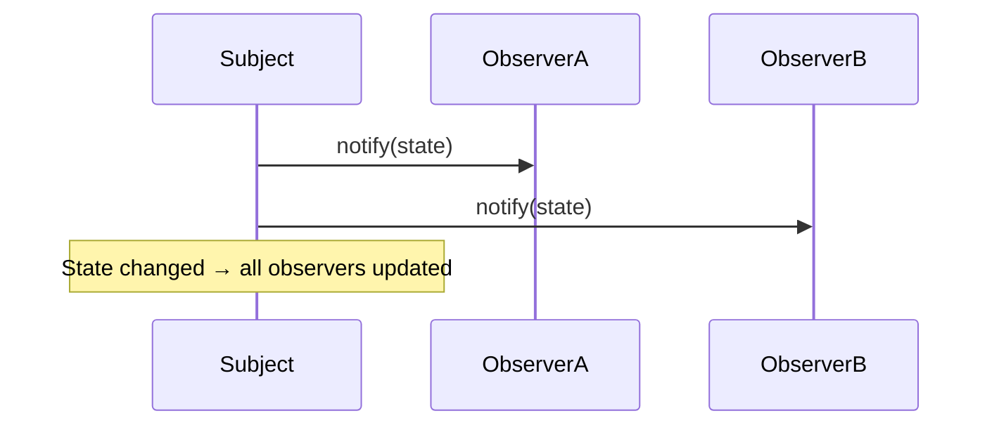
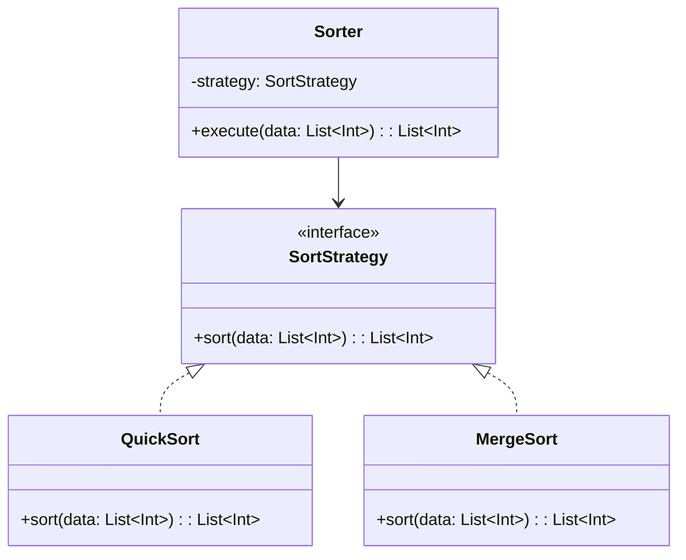
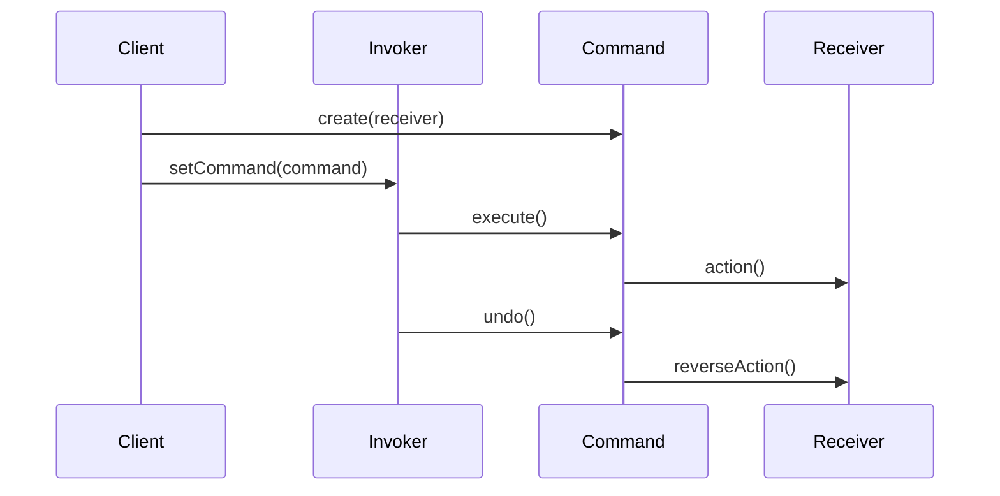
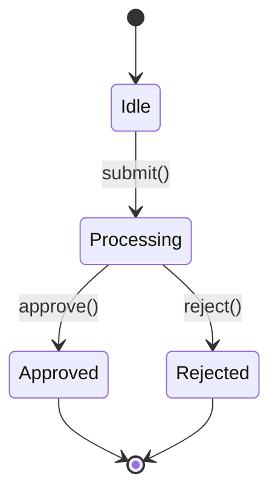
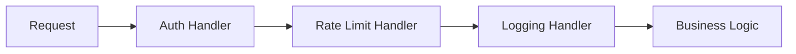
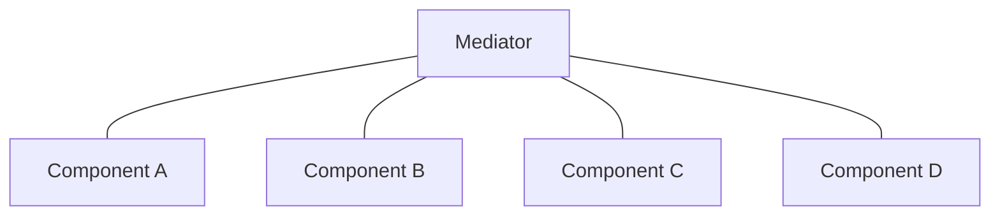

# Behavioral Patterns

Behavioral patterns manage **algorithms, responsibilities, and communication** between objects. They shift focus from structure to how objects interact and distribute work.

---

## Observer

Defines a **one-to-many dependency** — when the subject changes state, all registered observers are notified automatically.



```kotlin
interface Observer {
    fun update(event: String)
}

class EventBus {
    private val observers = mutableListOf<Observer>()

    fun subscribe(observer: Observer) = observers.add(observer)
    fun unsubscribe(observer: Observer) = observers.remove(observer)
    fun publish(event: String) = observers.forEach { it.update(event) }
}

class Logger : Observer {
    override fun update(event: String) = println("LOG: $event")
}

class Analytics : Observer {
    override fun update(event: String) = println("TRACK: $event")
}

val bus = EventBus()
bus.subscribe(Logger())
bus.subscribe(Analytics())
bus.publish("user_signed_in") // Both notified
```

| Implementation | Language/Framework |
|---|---|
| `LiveData`, `StateFlow`, `SharedFlow` | Android / Kotlin |
| `PropertyChangeListener` | Java Beans |
| `RxJava Observable` | Reactive Extensions |
| `addEventListener` | JavaScript DOM |
| `NotificationCenter` | iOS / Swift |

!!! warning "Memory leaks"
    Observers that aren't unsubscribed hold references to the subject (or vice versa). In Android, use lifecycle-aware observers (`repeatOnLifecycle`, `LiveData`) to auto-unsubscribe.

---

## Strategy

Defines a **family of algorithms**, encapsulates each one, and makes them **interchangeable** at runtime.



=== "Interface-based"

    ```kotlin
    interface CompressionStrategy {
        fun compress(data: ByteArray): ByteArray
    }

    class GzipCompression : CompressionStrategy {
        override fun compress(data: ByteArray): ByteArray { /* gzip */ return data }
    }

    class ZipCompression : CompressionStrategy {
        override fun compress(data: ByteArray): ByteArray { /* zip */ return data }
    }

    class FileProcessor(private val strategy: CompressionStrategy) {
        fun process(data: ByteArray) = strategy.compress(data)
    }
    ```

=== "Function-based (Kotlin)"

    ```kotlin
    // In Kotlin, higher-order functions often replace the Strategy pattern
    fun process(data: ByteArray, compress: (ByteArray) -> ByteArray): ByteArray {
        return compress(data)
    }

    process(data) { it.gzip() }
    process(data) { it.zip() }
    ```

**Real-world examples:** `Comparator` for sorting, `DiffUtil.ItemCallback`, `CoroutineDispatcher`, `Retrofit` `CallAdapter`/`Converter`

---

## Command

Encapsulates a **request as an object**, allowing you to parameterize clients, queue operations, and support undo/redo.



```kotlin
interface Command {
    fun execute()
    fun undo()
}

class TextEditor {
    var content = ""
    fun insert(text: String) { content += text }
    fun deleteLast(n: Int) { content = content.dropLast(n) }
}

class InsertCommand(
    private val editor: TextEditor,
    private val text: String
) : Command {
    override fun execute() = editor.insert(text)
    override fun undo() = editor.deleteLast(text.length)
}

class CommandHistory {
    private val stack = ArrayDeque<Command>()

    fun execute(command: Command) {
        command.execute()
        stack.addLast(command)
    }

    fun undo() {
        stack.removeLastOrNull()?.undo()
    }
}

val editor = TextEditor()
val history = CommandHistory()
history.execute(InsertCommand(editor, "Hello "))
history.execute(InsertCommand(editor, "World"))
println(editor.content) // "Hello World"
history.undo()
println(editor.content) // "Hello "
```

| Use Case | Example |
|----------|---------|
| **Undo/Redo** | Text editors, drawing apps |
| **Queuing** | Job queues, task schedulers |
| **Logging** | Transaction logs for replay |
| **Macro recording** | Batch execution of recorded commands |

---

## State

Allows an object to **alter its behavior** when its internal state changes — the object appears to change its class.



```kotlin
interface OrderState {
    fun proceed(order: Order)
    fun cancel(order: Order)
}

class Order {
    var state: OrderState = DraftState()

    fun proceed() = state.proceed(this)
    fun cancel() = state.cancel(this)
}

class DraftState : OrderState {
    override fun proceed(order: Order) {
        println("Order submitted for processing")
        order.state = ProcessingState()
    }
    override fun cancel(order: Order) = println("Draft discarded")
}

class ProcessingState : OrderState {
    override fun proceed(order: Order) {
        println("Order shipped")
        order.state = ShippedState()
    }
    override fun cancel(order: Order) {
        println("Order cancelled, issuing refund")
        order.state = CancelledState()
    }
}

class ShippedState : OrderState {
    override fun proceed(order: Order) = println("Order already shipped")
    override fun cancel(order: Order) = println("Cannot cancel shipped order")
}

class CancelledState : OrderState {
    override fun proceed(order: Order) = println("Cannot proceed cancelled order")
    override fun cancel(order: Order) = println("Already cancelled")
}
```

!!! note "State vs Strategy"
    Both swap behavior via composition, but the **intent** differs:

    - **Strategy**: client chooses the algorithm externally
    - **State**: the object transitions itself internally — states know about each other

---

## Template Method

Defines the **skeleton of an algorithm** in a base class, letting subclasses override specific steps without changing the overall structure.

```kotlin
abstract class DataMiner {
    // Template method — defines the algorithm skeleton
    fun mine(path: String) {
        val file = openFile(path)
        val data = extractData(file)
        val parsed = parseData(data)
        analyze(parsed)
        report(parsed)
    }

    abstract fun openFile(path: String): Any
    abstract fun extractData(file: Any): String
    abstract fun parseData(data: String): List<Map<String, Any>>

    // Default implementations — subclasses can override
    open fun analyze(data: List<Map<String, Any>>) = println("Analyzing ${data.size} records")
    open fun report(data: List<Map<String, Any>>) = println("Report: ${data.size} records processed")
}

class CsvMiner : DataMiner() {
    override fun openFile(path: String) = java.io.File(path)
    override fun extractData(file: Any) = (file as java.io.File).readText()
    override fun parseData(data: String) = data.lines().map { mapOf("row" to it) }
}
```

**Real-world examples:** `Activity.onCreate()` lifecycle, `RecyclerView.Adapter.onBindViewHolder()`, `AsyncTask` (deprecated), JUnit `setUp()`/`tearDown()`

---

## Chain of Responsibility

Passes a request along a **chain of handlers**. Each handler either processes the request or passes it to the next handler.



```kotlin
abstract class Handler {
    private var next: Handler? = null

    fun setNext(handler: Handler): Handler {
        next = handler
        return handler
    }

    fun handle(request: Request): Response {
        val result = process(request)
        if (result != null) return result
        return next?.handle(request) ?: Response(403, "Unhandled")
    }

    abstract fun process(request: Request): Response?
}

data class Request(val token: String?, val path: String, val ip: String)
data class Response(val code: Int, val body: String)

class AuthHandler : Handler() {
    override fun process(request: Request): Response? {
        if (request.token == null) return Response(401, "Unauthorized")
        return null // pass to next
    }
}

class RateLimitHandler : Handler() {
    private val requests = mutableMapOf<String, Int>()

    override fun process(request: Request): Response? {
        val count = requests.merge(request.ip, 1, Int::plus) ?: 1
        if (count > 100) return Response(429, "Rate limited")
        return null
    }
}

val chain = AuthHandler().apply {
    setNext(RateLimitHandler())
}
```

**Real-world examples:** OkHttp `Interceptor` chain, servlet filters, middleware pipelines (Express.js, Ktor), exception handling chains, Android touch event propagation

---

## Iterator

Provides sequential access to elements of a collection **without exposing** the underlying representation.

```kotlin
class PaginatedList<T>(private val pageSize: Int, private val allItems: List<T>) : Iterable<List<T>> {
    override fun iterator() = object : Iterator<List<T>> {
        private var currentIndex = 0

        override fun hasNext() = currentIndex < allItems.size

        override fun next(): List<T> {
            val page = allItems.subList(
                currentIndex,
                minOf(currentIndex + pageSize, allItems.size)
            )
            currentIndex += pageSize
            return page
        }
    }
}

val pages = PaginatedList(3, listOf("a", "b", "c", "d", "e", "f", "g"))
for (page in pages) {
    println(page) // [a, b, c], [d, e, f], [g]
}
```

Most languages have built-in iterator support (`Iterable`/`Iterator` in Java/Kotlin, `__iter__` in Python, `Symbol.iterator` in JS), so explicit GoF iterators are rare — but the concept underpins `for` loops, sequences, and streams.

---

## Mediator

Reduces chaotic dependencies between objects by having them communicate through a **central mediator** instead of directly.



```kotlin
interface ChatMediator {
    fun sendMessage(message: String, sender: User)
}

class ChatRoom : ChatMediator {
    private val users = mutableListOf<User>()

    fun join(user: User) = users.add(user)

    override fun sendMessage(message: String, sender: User) {
        users.filter { it != sender }
            .forEach { it.receive(message, sender.name) }
    }
}

class User(val name: String, private val mediator: ChatMediator) {
    fun send(message: String) = mediator.sendMessage(message, this)
    fun receive(message: String, from: String) = println("$name received '$message' from $from")
}

val room = ChatRoom()
val alice = User("Alice", room)
val bob = User("Bob", room)
room.join(alice)
room.join(bob)
alice.send("Hello!") // Bob received 'Hello!' from Alice
```

**Real-world examples:** `ViewModel` mediates between UI and data layer, air traffic control, `EventBus` / `BroadcastReceiver`, Redux store

---

## Visitor

Lets you **add new operations** to existing class hierarchies without modifying them. Separates algorithms from the objects they operate on.

```kotlin
interface DocumentElement {
    fun accept(visitor: DocumentVisitor)
}

class TextNode(val text: String) : DocumentElement {
    override fun accept(visitor: DocumentVisitor) = visitor.visit(this)
}

class ImageNode(val url: String, val altText: String) : DocumentElement {
    override fun accept(visitor: DocumentVisitor) = visitor.visit(this)
}

interface DocumentVisitor {
    fun visit(text: TextNode)
    fun visit(image: ImageNode)
}

class HtmlExporter : DocumentVisitor {
    val output = StringBuilder()
    override fun visit(text: TextNode) { output.append("<p>${text.text}</p>") }
    override fun visit(image: ImageNode) { output.append("") }
}

class WordCounter : DocumentVisitor {
    var count = 0
    override fun visit(text: TextNode) { count += text.text.split(" ").size }
    override fun visit(image: ImageNode) { /* images have no words */ }
}

val doc = listOf(TextNode("Hello world"), ImageNode("logo.png", "Logo"))
val counter = WordCounter()
doc.forEach { it.accept(counter) }
println(counter.count) // 2
```

!!! note "When to use Visitor"
    When you have a stable class hierarchy (elements rarely change) but frequently need new operations. If the hierarchy changes often, Visitor creates maintenance burden — every new element type requires updating all visitors.

---

## Summary

| Pattern | Intent | Key Signal |
|---------|--------|-----------|
| **Observer** | Notify many objects of state changes | Event systems, reactive data |
| **Strategy** | Swap algorithms at runtime | Configurable behavior, pluggable policies |
| **Command** | Encapsulate operations as objects | Undo/redo, queuing, logging |
| **State** | Change behavior based on internal state | Object with lifecycle/workflow stages |
| **Template Method** | Fixed algorithm, flexible steps | Framework hooks, lifecycle methods |
| **Chain of Responsibility** | Pass request through handler pipeline | Middleware, interceptors, filters |
| **Iterator** | Sequential access to collections | Custom traversal logic |
| **Mediator** | Centralize communication | Reduce many-to-many dependencies |
| **Visitor** | Add operations without modifying classes | Stable hierarchy, many operations |

---

??? question "Interview Questions"

    **Q: What's the difference between Observer and Mediator?**
    Observer is a broadcast mechanism — one subject notifies all observers. Mediator centralizes complex interactions between multiple objects. In Observer, the subject doesn't know what observers do with the notification. In Mediator, the mediator actively coordinates and routes communication.

    **Q: When would you prefer State over if/else chains?**
    When an object has many states with different behaviors, and transitions between them are complex. State pattern eliminates large switch statements, makes each state self-contained, and makes it easy to add new states without modifying existing ones.

    **Q: How does Strategy differ from dependency injection?**
    Strategy is about swapping algorithms at runtime — the client often selects the strategy. DI is about decoupling dependencies at construction time. DI can be used to inject a Strategy, but DI is a broader principle while Strategy is a specific behavioral pattern.

    **Q: Give a scenario where Command pattern is essential.**
    A text editor with undo/redo. Each edit (insert, delete, format) is a Command object with `execute()` and `undo()`. Commands are pushed onto a stack. Undo pops and reverses; redo re-executes. Without Command, implementing multi-level undo is extremely complex.

    **Q: Why is Chain of Responsibility popular in web frameworks?**
    HTTP request processing naturally fits a pipeline: authentication → rate limiting → logging → routing → business logic. Each middleware handles one concern and passes the request forward. New concerns (CORS, compression) are added as new handlers without modifying existing ones.

!!! tip "Further Reading"
    - [Refactoring Guru — Behavioral Patterns](https://refactoring.guru/design-patterns/behavioral-patterns)
    - [Game Programming Patterns](https://gameprogrammingpatterns.com/) — practical patterns for real-time systems
