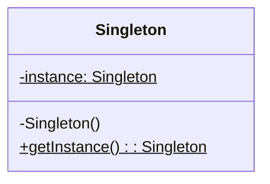
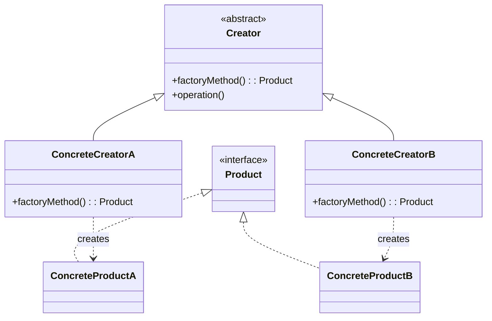
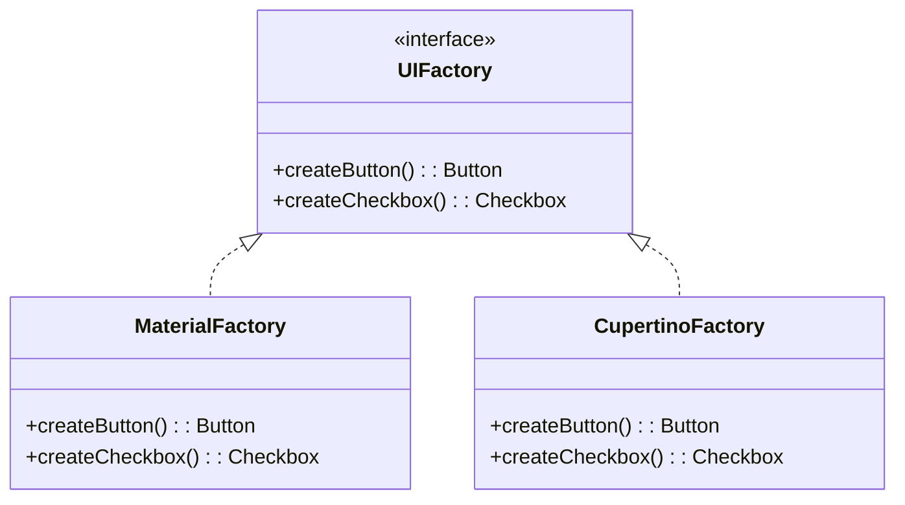
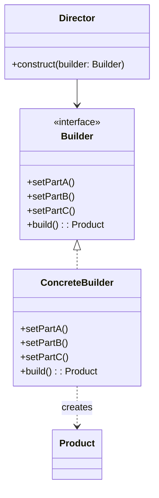

# Creational Patterns

Creational patterns abstract the instantiation process — they help make a system independent of how its objects are created, composed, and represented.

---

## Singleton

Ensures a class has exactly **one instance** and provides a global access point to it.



=== "Java"

    ```java
    public class Singleton {
        private static volatile Singleton instance;

        private Singleton() {}

        public static Singleton getInstance() {
            if (instance == null) {
                synchronized (Singleton.class) {
                    if (instance == null) {
                        instance = new Singleton();
                    }
                }
            }
            return instance;
        }
    }
    ```

=== "Kotlin"

    ```kotlin
    object Singleton {
        fun doWork() { /* ... */ }
    }
    ```

    Kotlin's `object` is thread-safe and lazy by default — no boilerplate needed.

=== "Python"

    ```python
    class Singleton:
        _instance = None

        def __new__(cls):
            if cls._instance is None:
                cls._instance = super().__new__(cls)
            return cls._instance
    ```

| Aspect | Details |
|--------|---------|
| **Use when** | Shared resource (DB connection pool, logger, config) |
| **Avoid when** | You need testability — singletons are global state |
| **Thread safety** | Must be handled explicitly (double-check locking, `volatile`, or language-level support) |
| **Alternative** | DI-scoped singletons (e.g., `@Singleton` in Dagger) — testable and swappable |

!!! warning "Singleton anti-pattern"
    Overuse creates hidden dependencies, tight coupling, and untestable code. Prefer dependency injection for managing shared instances.

---

## Factory Method

Defines an interface for creating objects, but lets **subclasses decide** which class to instantiate. The creator delegates instantiation to its subclasses.



=== "Java"

    ```java
    interface Notification {
        void send(String message);
    }

    class EmailNotification implements Notification {
        public void send(String message) {
            System.out.println("Email: " + message);
        }
    }

    class SMSNotification implements Notification {
        public void send(String message) {
            System.out.println("SMS: " + message);
        }
    }

    class NotificationFactory {
        public static Notification create(String type) {
            return switch (type) {
                case "email" -> new EmailNotification();
                case "sms" -> new SMSNotification();
                default -> throw new IllegalArgumentException("Unknown: " + type);
            };
        }
    }
    ```

=== "Kotlin"

    ```kotlin
    interface Notification {
        fun send(message: String)
    }

    class EmailNotification : Notification {
        override fun send(message: String) = println("Email: $message")
    }

    class SMSNotification : Notification {
        override fun send(message: String) = println("SMS: $message")
    }

    fun createNotification(type: String): Notification = when (type) {
        "email" -> EmailNotification()
        "sms" -> SMSNotification()
        else -> throw IllegalArgumentException("Unknown: $type")
    }
    ```

**Real-world examples:** `Calendar.getInstance()`, `NumberFormat.getInstance()`, `DocumentBuilderFactory.newInstance()`

---

## Abstract Factory

Produces **families of related objects** without specifying concrete classes. A factory of factories.



```kotlin
interface Button { fun render(): String }
interface Checkbox { fun render(): String }

interface UIFactory {
    fun createButton(): Button
    fun createCheckbox(): Checkbox
}

class MaterialFactory : UIFactory {
    override fun createButton() = object : Button {
        override fun render() = "Material Button"
    }
    override fun createCheckbox() = object : Checkbox {
        override fun render() = "Material Checkbox"
    }
}

class CupertinoFactory : UIFactory {
    override fun createButton() = object : Button {
        override fun render() = "Cupertino Button"
    }
    override fun createCheckbox() = object : Checkbox {
        override fun render() = "Cupertino Checkbox"
    }
}

// Client code works with any factory — swap the entire family at once
fun buildUI(factory: UIFactory) {
    val button = factory.createButton()
    val checkbox = factory.createCheckbox()
    println("${button.render()}, ${checkbox.render()}")
}
```

| | Factory Method | Abstract Factory |
|---|---|---|
| **Scope** | One product type | Family of related products |
| **Mechanism** | Inheritance (subclass overrides) | Composition (factory object) |
| **Extensibility** | Add new product → new subclass | Add new family → new factory |
| **Complexity** | Lower | Higher |

---

## Builder

Constructs complex objects **step by step**. Separates construction from representation so the same process can create different outputs.



=== "Java (classic)"

    ```java
    public class HttpRequest {
        private final String url;
        private final String method;
        private final Map<String, String> headers;
        private final String body;

        private HttpRequest(Builder builder) {
            this.url = builder.url;
            this.method = builder.method;
            this.headers = builder.headers;
            this.body = builder.body;
        }

        public static class Builder {
            private String url;
            private String method = "GET";
            private Map<String, String> headers = new HashMap<>();
            private String body;

            public Builder(String url) { this.url = url; }
            public Builder method(String m) { method = m; return this; }
            public Builder header(String k, String v) { headers.put(k, v); return this; }
            public Builder body(String b) { body = b; return this; }
            public HttpRequest build() { return new HttpRequest(this); }
        }
    }

    // Usage
    HttpRequest req = new HttpRequest.Builder("https://api.example.com")
        .method("POST")
        .header("Content-Type", "application/json")
        .body("{\"name\":\"Sandy\"}")
        .build();
    ```

=== "Kotlin (named params)"

    ```kotlin
    data class HttpRequest(
        val url: String,
        val method: String = "GET",
        val headers: Map<String, String> = emptyMap(),
        val body: String? = null
    )

    // Named parameters + defaults eliminate the need for Builder
    val req = HttpRequest(
        url = "https://api.example.com",
        method = "POST",
        headers = mapOf("Content-Type" to "application/json"),
        body = """{"name":"Sandy"}"""
    )
    ```

!!! tip "When Builder still matters in Kotlin"
    - Multi-step construction with validation (e.g., `Retrofit.Builder` validates base URL)
    - DSL-style builders using Kotlin's `apply` scope function
    - Java interop where named parameters aren't available

**Real-world examples:** `StringBuilder`, `Retrofit.Builder`, `OkHttpClient.Builder`, `Notification.Builder`, `AlertDialog.Builder`

---

## Prototype

Creates new objects by **cloning** an existing instance rather than constructing from scratch. Useful when object creation is expensive or complex.

```kotlin
data class Document(
    val title: String,
    val content: String,
    val metadata: MutableMap<String, String>
) {
    fun deepCopy() = Document(
        title = title,
        content = content,
        metadata = metadata.toMutableMap()
    )
}

val template = Document("Template", "Default content", mutableMapOf("author" to "Sandy"))
val doc1 = template.deepCopy().copy(title = "Report Q1")
val doc2 = template.deepCopy().copy(title = "Report Q2")
```

!!! note "Shallow vs Deep copy"
    Kotlin's `data class copy()` is **shallow** — it copies references for collections and nested objects. For true independence, implement deep copy manually or use serialization.

| Aspect | Details |
|--------|---------|
| **Use when** | Object creation is expensive (DB queries, heavy computation) |
| **Use when** | Many similar objects with small variations |
| **Pitfall** | Shallow copy bugs — mutable shared state between original and clone |
| **Languages** | Java `Cloneable`, Kotlin `data class copy()`, Python `copy.deepcopy()` |

---

## Summary

| Pattern | Intent | Key Benefit |
|---------|--------|-------------|
| **Singleton** | One instance globally | Controlled access to shared resource |
| **Factory Method** | Delegate instantiation to subclasses | Decouples creator from product |
| **Abstract Factory** | Create families of related objects | Swap entire product families |
| **Builder** | Step-by-step construction | Readable construction of complex objects |
| **Prototype** | Clone existing objects | Avoid expensive re-creation |

---

??? question "Interview Questions"

    **Q: What's the difference between Factory Method and Abstract Factory?**
    Factory Method creates one product type via inheritance (subclass overrides a method). Abstract Factory creates families of related products via composition (a factory object with multiple creation methods).

    **Q: Why is Singleton considered an anti-pattern by some?**
    It introduces global state, making code harder to test (can't swap implementations), harder to reason about (hidden dependencies), and potentially problematic in concurrent environments. DI-scoped singletons solve these issues.

    **Q: When would you choose Builder over a constructor with defaults?**
    When construction involves validation, multi-step logic, or when the object is mutable during construction but immutable after. Also for Java interop where named parameters don't exist.

    **Q: How does Prototype differ from just calling `new`?**
    Prototype copies an existing configured object, preserving its state. Useful when initialization is expensive (e.g., objects loaded from DB or involving heavy computation) or when you need many variants of a base configuration.

    **Q: Can you combine creational patterns?**
    Yes — Abstract Factory often uses Factory Methods internally. Builder can use Prototype to clone a partially-built object. Singleton can store a Factory instance.

!!! tip "Further Reading"
    - [Refactoring Guru — Creational Patterns](https://refactoring.guru/design-patterns/creational-patterns)
    - [Effective Java, Item 2](https://www.oreilly.com/library/view/effective-java/9780134686097/) — Builder pattern justification
