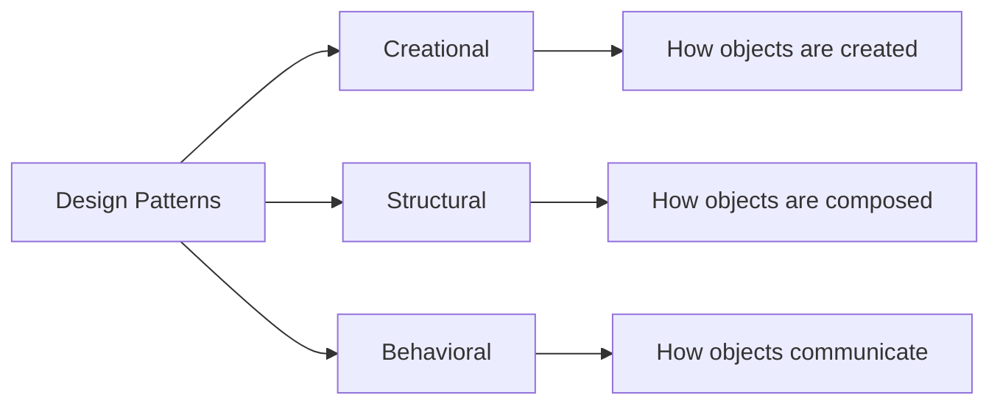
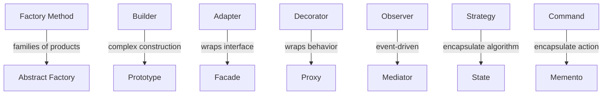

# Design Patterns

Design patterns are reusable solutions to recurring software design problems, cataloged by the **Gang of Four** (GoF) in 1994. They aren't code — they're templates for solving common structural, creational, and behavioral challenges.

---

## Pattern Categories

| Category | Purpose | Key Patterns |
|----------|---------|-------------|
| **[Creational](creational-patterns.md)** | Control object creation mechanisms | Singleton, Factory Method, Abstract Factory, Builder, Prototype |
| **[Structural](structural-patterns.md)** | Compose objects into larger structures | Adapter, Bridge, Composite, Decorator, Facade, Flyweight, Proxy |
| **[Behavioral](behavioral-patterns.md)** | Manage algorithms and object responsibilities | Observer, Strategy, Command, State, Template Method, Chain of Responsibility, Iterator, Mediator, Visitor |

---

## When to Apply Patterns

!!! warning "Don't force patterns"
    Patterns solve specific problems. Applying them preemptively leads to over-engineering. Recognize the problem first, then reach for the pattern.

| Signal | Likely Pattern |
|--------|---------------|
| Object creation logic is scattered or duplicated | Factory Method, Abstract Factory |
| Need exactly one instance globally | Singleton |
| Building complex objects step by step | Builder |
| Incompatible interfaces need to work together | Adapter |
| Want to add behavior without modifying a class | Decorator |
| Need to decouple event producers from consumers | Observer |
| Algorithm varies by context at runtime | Strategy |
| Need to undo/redo operations | Command, Memento |
| Complex conditional logic based on object state | State |

---

## Relationships Between Patterns

Many patterns overlap or complement each other. Factory Method is often used with Template Method. Decorator and Proxy both wrap objects but for different reasons. Strategy and State both swap behavior, but State transitions are internal.

!!! tip "Further Reading"
    - [Refactoring Guru — Design Patterns](https://refactoring.guru/design-patterns)
    - [Head First Design Patterns](https://www.oreilly.com/library/view/head-first-design/9781492077992/) — visual, example-driven introduction
    - [Design Patterns: Elements of Reusable Object-Oriented Software](https://en.wikipedia.org/wiki/Design_Patterns) — the original GoF book
