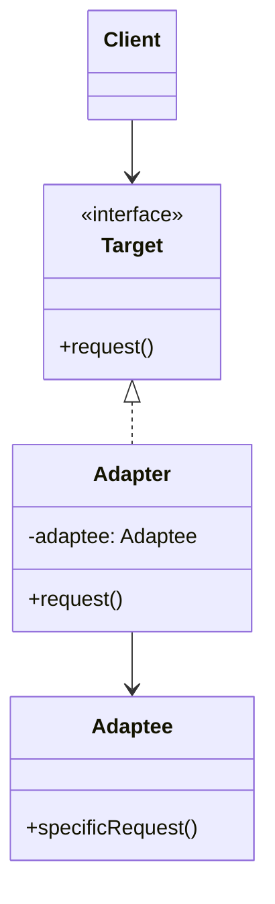
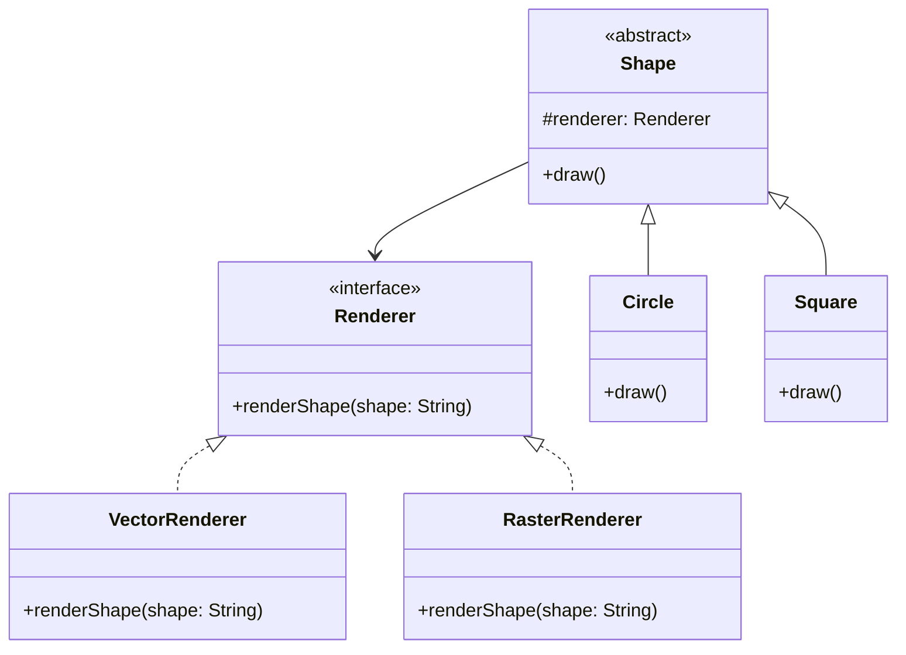
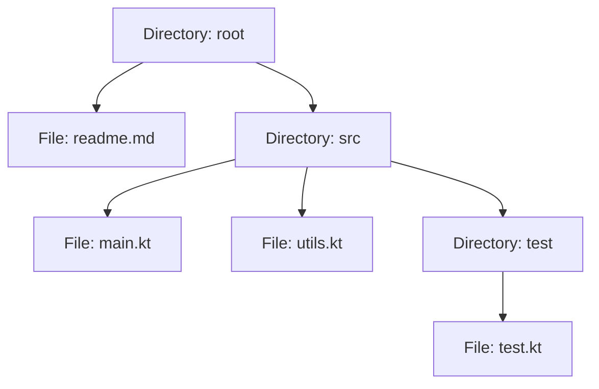
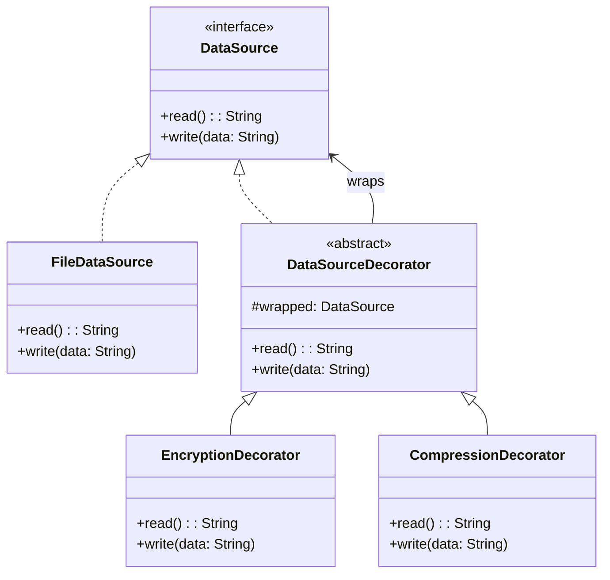
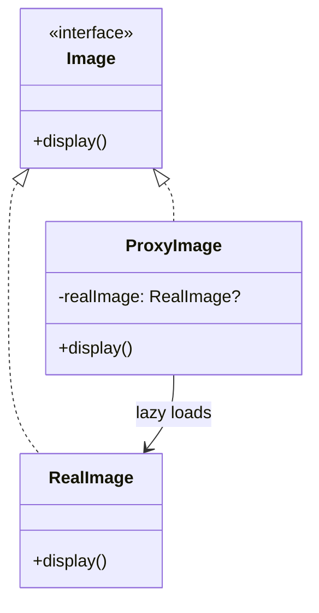

# Structural Patterns

Structural patterns deal with **object composition** — how classes and objects are assembled into larger structures while keeping those structures flexible and efficient.

---

## Adapter

Converts one interface into another that clients expect. Allows incompatible interfaces to work together.



```kotlin
// Legacy XML parser (third-party, can't modify)
class XmlParser {
    fun parseXml(xml: String): Map<String, Any> = mapOf("data" to xml)
}

// Your system expects this interface
interface DataParser {
    fun parse(input: String): Map<String, Any>
}

// Adapter bridges the gap
class XmlParserAdapter(private val xmlParser: XmlParser) : DataParser {
    override fun parse(input: String) = xmlParser.parseXml(input)
}

// Client code works with DataParser — doesn't know about XmlParser
fun processData(parser: DataParser, input: String) {
    val result = parser.parse(input)
}
```

| Aspect | Details |
|--------|---------|
| **Use when** | Integrating third-party or legacy code with incompatible interfaces |
| **Real-world** | `RecyclerView.Adapter`, `ArrayAdapter`, JDBC drivers, `InputStreamReader` |
| **Variants** | Object adapter (composition, shown above) vs Class adapter (multiple inheritance) |

---

## Bridge

Separates an **abstraction from its implementation** so both can vary independently. Prevents a combinatorial explosion of subclasses.



```kotlin
interface Renderer {
    fun renderShape(shape: String)
}

class VectorRenderer : Renderer {
    override fun renderShape(shape: String) = println("Drawing $shape as vectors")
}

class RasterRenderer : Renderer {
    override fun renderShape(shape: String) = println("Drawing $shape as pixels")
}

abstract class Shape(protected val renderer: Renderer) {
    abstract fun draw()
}

class Circle(renderer: Renderer) : Shape(renderer) {
    override fun draw() = renderer.renderShape("Circle")
}

class Square(renderer: Renderer) : Shape(renderer) {
    override fun draw() = renderer.renderShape("Square")
}

// Mix any shape with any renderer — no subclass explosion
val circle = Circle(VectorRenderer())
val square = Square(RasterRenderer())
```

Without Bridge, you'd need `VectorCircle`, `RasterCircle`, `VectorSquare`, `RasterSquare`... and every new shape or renderer doubles the classes.

---

## Composite

Composes objects into **tree structures** to represent part-whole hierarchies. Clients treat individual objects and compositions uniformly.



```kotlin
interface FileSystemNode {
    fun size(): Long
    fun display(indent: String = "")
}

class File(private val name: String, private val bytes: Long) : FileSystemNode {
    override fun size() = bytes
    override fun display(indent: String) = println("$indent📄 $name ($bytes bytes)")
}

class Directory(private val name: String) : FileSystemNode {
    private val children = mutableListOf<FileSystemNode>()

    fun add(node: FileSystemNode) = children.add(node)

    override fun size(): Long = children.sumOf { it.size() }

    override fun display(indent: String) {
        println("$indent📁 $name (${size()} bytes)")
        children.forEach { it.display("$indent  ") }
    }
}

val root = Directory("project").apply {
    add(File("readme.md", 1024))
    add(Directory("src").apply {
        add(File("main.kt", 2048))
        add(File("utils.kt", 512))
    })
}
root.display() // Treats the entire tree uniformly
```

**Real-world examples:** Android `ViewGroup`/`View` hierarchy, file systems, XML/HTML DOM, Compose layout nodes

---

## Decorator

**Wraps** an object to add behavior dynamically without modifying the original class. Follows the open/closed principle.



```kotlin
interface Coffee {
    fun cost(): Double
    fun description(): String
}

class Espresso : Coffee {
    override fun cost() = 2.0
    override fun description() = "Espresso"
}

// Decorators wrap the original and add behavior
abstract class CoffeeDecorator(private val coffee: Coffee) : Coffee {
    override fun cost() = coffee.cost()
    override fun description() = coffee.description()
}

class MilkDecorator(coffee: Coffee) : CoffeeDecorator(coffee) {
    override fun cost() = super.cost() + 0.5
    override fun description() = "${super.description()} + Milk"
}

class CaramelDecorator(coffee: Coffee) : CoffeeDecorator(coffee) {
    override fun cost() = super.cost() + 0.75
    override fun description() = "${super.description()} + Caramel"
}

// Stack decorators freely
val order: Coffee = CaramelDecorator(MilkDecorator(Espresso()))
println("${order.description()}: $${order.cost()}")
// Espresso + Milk + Caramel: $3.25
```

| Decorator vs Inheritance |
|---|
| Inheritance is static — decided at compile time for all instances |
| Decorator is dynamic — add/remove behavior per instance at runtime |
| Decorators compose (stack), subclasses don't |

**Real-world examples:** Java I/O streams (`BufferedInputStream(FileInputStream(...))`), OkHttp interceptors, middleware chains

---

## Facade

Provides a **simplified interface** to a complex subsystem. Doesn't add functionality — it hides complexity.

```kotlin
// Complex subsystem classes
class VideoDecoder { fun decode(file: String) = println("Decoding $file") }
class AudioDecoder { fun decode(file: String) = println("Extracting audio from $file") }
class SubtitleParser { fun parse(file: String) = println("Parsing subtitles for $file") }
class VideoRenderer { fun render() = println("Rendering video") }

// Facade — one clean entry point
class MediaPlayerFacade {
    private val video = VideoDecoder()
    private val audio = AudioDecoder()
    private val subtitles = SubtitleParser()
    private val renderer = VideoRenderer()

    fun play(file: String) {
        video.decode(file)
        audio.decode(file)
        subtitles.parse(file)
        renderer.render()
    }
}

// Client doesn't need to know about subsystem internals
MediaPlayerFacade().play("movie.mp4")
```

| Aspect | Details |
|--------|---------|
| **Use when** | Wrapping a complex library, API, or subsystem |
| **Real-world** | `Retrofit` (facades over OkHttp), `MediaPlayer` API, `Glide.with().load().into()` |
| **Not a lock-in** | Clients can still access subsystem directly when needed |

---

## Flyweight

Shares common state across many objects to **minimize memory** usage. Separates **intrinsic** (shared) state from **extrinsic** (unique) state.

```kotlin
// Intrinsic state — shared, immutable
class CharacterStyle(val font: String, val size: Int, val color: String)

// Flyweight factory — caches and reuses styles
object StyleFactory {
    private val cache = mutableMapOf<String, CharacterStyle>()

    fun getStyle(font: String, size: Int, color: String): CharacterStyle {
        val key = "$font-$size-$color"
        return cache.getOrPut(key) { CharacterStyle(font, size, color) }
    }
}

// Extrinsic state — unique per character
data class Character(val char: Char, val row: Int, val col: Int, val style: CharacterStyle)

// 10,000 characters but only a handful of unique styles in memory
val chars = (0 until 10_000).map { i ->
    Character('A' + (i % 26), i / 100, i % 100, StyleFactory.getStyle("Arial", 12, "black"))
}
```

**Real-world examples:** `String` interning (`String.intern()`), `Integer.valueOf()` cache (-128 to 127), game sprite pools, `Compose` modifier chains

---

## Proxy

Provides a **surrogate or placeholder** for another object to control access to it.



=== "Virtual Proxy (lazy loading)"

    ```kotlin
    interface Image {
        fun display()
    }

    class HighResImage(private val path: String) : Image {
        init { println("Loading $path from disk...") } // expensive
        override fun display() = println("Displaying $path")
    }

    class ImageProxy(private val path: String) : Image {
        private val realImage by lazy { HighResImage(path) }
        override fun display() = realImage.display() // loads only on first call
    }
    ```

=== "Protection Proxy (access control)"

    ```kotlin
    interface Document {
        fun read(): String
        fun write(content: String)
    }

    class SecureDocumentProxy(
        private val doc: Document,
        private val userRole: String
    ) : Document {
        override fun read() = doc.read()
        override fun write(content: String) {
            if (userRole != "admin") throw SecurityException("Write access denied")
            doc.write(content)
        }
    }
    ```

| Proxy Type | Purpose | Example |
|-----------|---------|---------|
| **Virtual** | Lazy initialization | Image loading, heavy object creation |
| **Protection** | Access control | Permission checks before operations |
| **Remote** | Network transparency | RPC stubs, Retrofit interface proxies |
| **Caching** | Store results | `Proxy` wrapping an API client with local cache |
| **Logging** | Record access | Audit trail on sensitive operations |

---

## Comparison

| Pattern | Wraps? | Purpose |
|---------|--------|---------|
| **Adapter** | Yes | Makes incompatible interfaces work together |
| **Bridge** | No | Separates abstraction from implementation |
| **Composite** | Contains | Treats individual and group objects uniformly |
| **Decorator** | Yes | Adds behavior dynamically |
| **Facade** | Contains | Simplifies a complex subsystem |
| **Flyweight** | Shares | Reduces memory by sharing common state |
| **Proxy** | Yes | Controls access to the real object |

!!! note "Adapter vs Decorator vs Proxy"
    All three wrap an object, but their **intent** differs:

    - **Adapter** changes the interface (makes A look like B)
    - **Decorator** enhances the interface (adds behavior to A)
    - **Proxy** controls access to the interface (same interface, different access rules)

---

??? question "Interview Questions"

    **Q: When would you use Adapter vs Facade?**
    Adapter makes one specific interface compatible with another — it's a 1:1 mapping. Facade simplifies an entire subsystem by providing a higher-level interface. Use Adapter for integration, Facade for simplification.

    **Q: How is Decorator different from subclassing?**
    Subclassing is static (compile-time) and affects all instances. Decorators are dynamic (runtime) and apply per-instance. Decorators also compose — you can stack `BufferedInputStream(GZIPInputStream(FileInputStream(...)))`. With subclassing, you'd need `BufferedGZIPFileInputStream`.

    **Q: What's the difference between Proxy and Decorator?**
    Both wrap an object, but Proxy controls **access** (lazy load, permissions, caching) while Decorator adds **behavior** (extra functionality). A Proxy manages the lifecycle; a Decorator enhances it.

    **Q: Give a real example of Flyweight.**
    Java's `Integer.valueOf()` caches values from -128 to 127. Instead of creating new objects for common integers, it returns cached instances. In game development, sprite textures are shared across thousands of entities.

    **Q: When would you choose Bridge over just using interfaces?**
    When both the abstraction and implementation need to vary independently. A plain interface handles implementation variation, but Bridge also allows the abstraction hierarchy to grow without creating an NxM class explosion.

!!! tip "Further Reading"
    - [Refactoring Guru — Structural Patterns](https://refactoring.guru/design-patterns/structural-patterns)
    - [Java I/O Streams](https://docs.oracle.com/javase/tutorial/essential/io/streams.html) — canonical Decorator example
