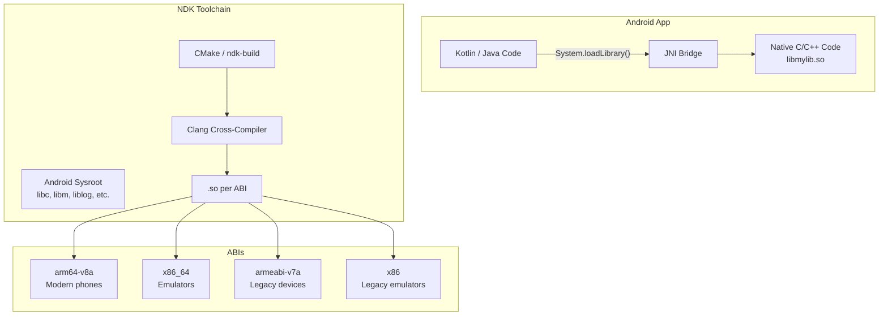
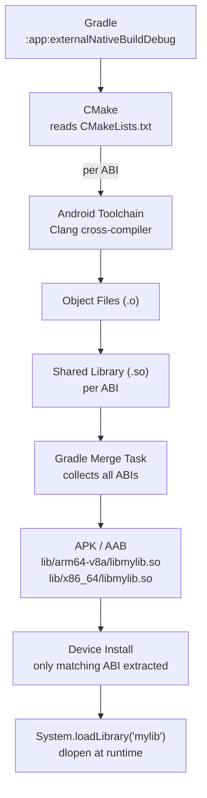

# Android NDK

The Android Native Development Kit (NDK) is a toolset for building C and C++ code that runs on Android. It provides cross-compilers, system headers, and libraries for each Android ABI, enabling performance-critical or platform-access code to run natively alongside JVM-based app code.

---

## Why Use the NDK

The NDK is **not** a replacement for Kotlin/Java — it complements it for specific use cases.

| Use Case | Why NDK |
|----------|---------|
| **Performance-critical code** | Image/audio/video processing, game engines, physics simulations |
| **Reusing existing C/C++ libraries** | OpenCV, FFmpeg, SQLite, crypto libraries |
| **Low-level platform access** | Hardware sensors, Vulkan/OpenGL ES, direct hardware interaction |
| **Cross-platform shared code** | Business logic in C/C++ shared with iOS/desktop |
| **Security-sensitive operations** | Crypto, DRM — harder to reverse-engineer than bytecode |

!!! warning "Don't use NDK just because"
    NDK adds build complexity, debugging difficulty, and crash risk. If your task can be done in Kotlin with acceptable performance, skip native code. The most common mistake is premature native optimization.

---

## Architecture Overview



### NDK Components

| Component | Purpose |
|-----------|---------|
| **Clang/LLVM** | Cross-compiler for each target ABI |
| **Sysroot** | Android system headers and libraries (Bionic libc, liblog, etc.) |
| **CMake toolchain** | CMake toolchain file for Android cross-compilation |
| **ndk-build** | Legacy Make-based build system (Android.mk / Application.mk) |
| **Platform APIs** | Native APIs: `<android/log.h>`, `<android/asset_manager.h>`, Vulkan, OpenGL ES, AAudio |
| **Prefab** | Package format for distributing native libraries via AAR |

---

## Project Setup

### Gradle Configuration

```kotlin
// app/build.gradle.kts
android {
    ndkVersion = "26.1.10909125"

    defaultConfig {
        ndk {
            abiFilters += listOf("arm64-v8a", "x86_64")
        }
    }

    externalNativeBuild {
        cmake {
            path = file("src/main/cpp/CMakeLists.txt")
            version = "3.22.1"
        }
    }
}
```

### CMakeLists.txt

```cmake
cmake_minimum_required(VERSION 3.22.1)
project("mylib")

add_library(mylib SHARED
    native-lib.cpp
    image_processor.cpp
)

# Link Android system libraries
find_library(log-lib log)
target_link_libraries(mylib ${log-lib})
```

### Project Structure

```
app/src/main/
├── cpp/
│   ├── CMakeLists.txt
│   ├── native-lib.cpp
│   └── image_processor.cpp
├── java/com/example/app/
│   └── NativeBridge.kt
└── jniLibs/           # pre-built .so files (if not using CMake)
    ├── arm64-v8a/
    └── x86_64/
```

---

## ABIs (Application Binary Interfaces)

Each ABI defines the CPU instruction set, calling convention, and binary format. The NDK compiles a separate `.so` for each.

| ABI | Architecture | Devices | Status |
|-----|-------------|---------|--------|
| `arm64-v8a` | ARMv8-A (64-bit) | All modern phones/tablets | **Required** — primary target |
| `x86_64` | x86-64 | Emulators, some Chromebooks | **Recommended** — fast emulator testing |
| `armeabi-v7a` | ARMv7 (32-bit) | Legacy devices | Optional — declining share |
| `x86` | x86 (32-bit) | Old emulators | Optional — rarely needed |

!!! tip "Minimum ABI Set"
    For most apps, ship `arm64-v8a` only and add `x86_64` for emulator performance during development. Google Play delivers only the matching ABI to each device, so including extra ABIs doesn't bloat what users download (when using App Bundles).

```kotlin
// Filter ABIs per build type
android {
    buildTypes {
        debug {
            ndk { abiFilters += listOf("arm64-v8a", "x86_64") }
        }
        release {
            ndk { abiFilters += listOf("arm64-v8a") }
        }
    }
}
```

---

## NDK APIs

The NDK provides C headers for Android platform functionality. These APIs are stable across Android versions (once introduced).

### Core APIs by Category

| Category | Header | Key Functions |
|----------|--------|---------------|
| **Logging** | `<android/log.h>` | `__android_log_print`, `__android_log_write` |
| **Assets** | `<android/asset_manager.h>` | `AAssetManager_open`, `AAsset_read` |
| **Bitmap** | `<android/bitmap.h>` | `AndroidBitmap_lockPixels`, `AndroidBitmap_unlockPixels` |
| **Sensor** | `<android/sensor.h>` | `ASensorManager_getInstance`, `ASensorEventQueue_*` |
| **Audio** | `<aaudio/AAudio.h>` | `AAudioStreamBuilder_*`, low-latency audio (API 26+) |
| **Graphics** | `<EGL/egl.h>`, Vulkan | OpenGL ES, Vulkan rendering |
| **Camera** | `<camera/NdkCameraManager.h>` | Camera2 NDK API (API 24+) |
| **Neural Networks** | `<android/NeuralNetworks.h>` | NNAPI for on-device ML (API 27+) |

### Logging Example

```c
#include <android/log.h>

#define TAG "MyNativeLib"
#define LOGI(...) __android_log_print(ANDROID_LOG_INFO, TAG, __VA_ARGS__)
#define LOGW(...) __android_log_print(ANDROID_LOG_WARN, TAG, __VA_ARGS__)
#define LOGE(...) __android_log_print(ANDROID_LOG_ERROR, TAG, __VA_ARGS__)

void process_image(const uint8_t *data, int width, int height) {
    LOGI("Processing image: %dx%d", width, height);
    // ... heavy computation
    LOGI("Processing complete");
}
```

### Bitmap Manipulation

```c
#include <android/bitmap.h>

JNIEXPORT void JNICALL
Java_com_example_NativeBridge_applyFilter(JNIEnv *env, jobject thiz, jobject bitmap) {
    AndroidBitmapInfo info;
    AndroidBitmap_getInfo(env, bitmap, &info);

    void *pixels;
    AndroidBitmap_lockPixels(env, bitmap, &pixels);

    // Direct pixel manipulation — RGBA_8888 format
    uint32_t *px = (uint32_t *)pixels;
    for (int i = 0; i < info.width * info.height; i++) {
        uint32_t color = px[i];
        uint8_t r = (color >> 0) & 0xFF;
        uint8_t g = (color >> 8) & 0xFF;
        uint8_t b = (color >> 16) & 0xFF;
        // Convert to grayscale
        uint8_t gray = (uint8_t)(0.299f * r + 0.587f * g + 0.114f * b);
        px[i] = (color & 0xFF000000) | (gray << 16) | (gray << 8) | gray;
    }

    AndroidBitmap_unlockPixels(env, bitmap);
}
```

---

## Third-Party Library Integration

### Using Pre-built Libraries

```cmake
# CMakeLists.txt — link a pre-built .so or .a
add_library(openssl SHARED IMPORTED)
set_target_properties(openssl PROPERTIES
    IMPORTED_LOCATION ${CMAKE_SOURCE_DIR}/libs/${ANDROID_ABI}/libssl.so
    INTERFACE_INCLUDE_DIRECTORIES ${CMAKE_SOURCE_DIR}/include
)

target_link_libraries(mylib openssl)
```

### Using Prefab (AAR-distributed native libraries)

```kotlin
// build.gradle.kts — consume a prefab-enabled AAR
android {
    buildFeatures {
        prefab = true
    }
}

dependencies {
    implementation("com.google.oboe:oboe:1.8.0")  // ships native headers + .so
}
```

```cmake
# CMakeLists.txt — find and link the prefab package
find_package(oboe REQUIRED CONFIG)
target_link_libraries(mylib oboe::oboe)
```

---

## Build Variants and Optimization

### CMake Build Types

```kotlin
// build.gradle.kts
android {
    externalNativeBuild {
        cmake {
            // Pass flags to CMake
            arguments("-DANDROID_STL=c++_shared", "-DANDROID_ARM_NEON=TRUE")
        }
    }

    defaultConfig {
        externalNativeBuild {
            cmake {
                // Compiler flags
                cppFlags("-std=c++17", "-fexceptions", "-frtti")
            }
        }
    }
}
```

### Release Optimization Flags

```cmake
# CMakeLists.txt
if(CMAKE_BUILD_TYPE STREQUAL "Release")
    target_compile_options(mylib PRIVATE
        -O2           # optimization level
        -DNDEBUG      # disable assert()
        -fvisibility=hidden  # hide symbols not explicitly exported
    )
    # Strip debug symbols — reduces .so size significantly
    set_target_properties(mylib PROPERTIES LINK_FLAGS "-s")
endif()
```

| Flag | Purpose |
|------|---------|
| `-O2` / `-O3` | Optimization level (O2 is safe default; O3 is aggressive) |
| `-flto` | Link-time optimization — cross-module inlining |
| `-fvisibility=hidden` | Only export symbols marked with `__attribute__((visibility("default")))` |
| `-s` | Strip symbols from final binary |
| `-DANDROID_ARM_NEON=TRUE` | Enable ARM NEON SIMD instructions |

---

## Debugging Native Code

### Android Studio Native Debugger

Android Studio supports debugging C/C++ alongside Kotlin/Java. Select **"Dual (Java + Native)"** debug configuration.

### Address Sanitizer (ASan)

Detects memory errors at runtime: buffer overflows, use-after-free, double-free, memory leaks.

```cmake
# CMakeLists.txt — enable ASan for debug builds
if(CMAKE_BUILD_TYPE STREQUAL "Debug")
    target_compile_options(mylib PRIVATE -fsanitize=address -fno-omit-frame-pointer)
    target_link_options(mylib PRIVATE -fsanitize=address)
endif()
```

```kotlin
// build.gradle.kts — wrap-script for ASan
android {
    buildTypes {
        debug {
            packaging {
                jniLibs.keepDebugSymbols.addAll(listOf("**/*.so"))
            }
        }
    }
}
```

### Crash Symbolication

```bash
# Symbolicate a native crash from logcat
adb logcat | ndk-stack -sym app/build/intermediates/merged_native_libs/debug/out/lib/arm64-v8a/

# Or use addr2line directly
$NDK/toolchains/llvm/prebuilt/linux-x86_64/bin/llvm-addr2line \
    -e app/build/intermediates/merged_native_libs/debug/out/lib/arm64-v8a/libmylib.so \
    0x1234 0x5678
```

---

## CMake vs ndk-build

| Aspect | CMake | ndk-build |
|--------|-------|-----------|
| **Config files** | `CMakeLists.txt` | `Android.mk` + `Application.mk` |
| **Status** | **Recommended** | Legacy (still supported) |
| **Ecosystem** | Industry-standard, reusable across platforms | Android-only |
| **Learning curve** | Moderate (CMake is large) | Low (simple Make syntax) |
| **IDE support** | Full Android Studio integration | Basic support |

!!! tip "Use CMake"
    Google recommends CMake for all new NDK projects. It integrates with Android Studio's native debugger, supports modern C++ features, and CMakeLists files are reusable on non-Android platforms.

---

## The Build Flow



At runtime, `System.loadLibrary("mylib")` calls `dlopen` on the `.so` matching the device's ABI. This triggers `JNI_OnLoad` (if defined), and native methods become callable from Kotlin/Java via [JNI](jni.md).

---

## Practical Example: Full Pipeline

=== "Kotlin (App Layer)"

    ```kotlin
    class ImageProcessor {
        companion object {
            init { System.loadLibrary("imgproc") }
        }

        external fun nativeBlur(bitmap: Bitmap, radius: Int)
    }

    // Usage
    val processor = ImageProcessor()
    processor.nativeBlur(myBitmap, 10)
    imageView.setImageBitmap(myBitmap)  // shows blurred image
    ```

=== "C++ (Native Layer)"

    ```cpp
    #include <jni.h>
    #include <android/bitmap.h>
    #include <android/log.h>
    #include <cstring>
    #include <algorithm>

    extern "C" JNIEXPORT void JNICALL
    Java_com_example_app_ImageProcessor_nativeBlur(
            JNIEnv *env, jobject thiz, jobject bitmap, jint radius) {

        AndroidBitmapInfo info;
        AndroidBitmap_getInfo(env, bitmap, &info);

        void *pixels;
        AndroidBitmap_lockPixels(env, bitmap, &pixels);

        // Box blur implementation on raw pixels
        auto *src = static_cast<uint32_t *>(pixels);
        auto *tmp = new uint32_t[info.width * info.height];
        std::memcpy(tmp, src, info.width * info.height * 4);

        // Horizontal pass, then vertical pass (simplified)
        box_blur_horizontal(tmp, src, info.width, info.height, radius);
        box_blur_vertical(src, tmp, info.width, info.height, radius);
        std::memcpy(src, tmp, info.width * info.height * 4);

        delete[] tmp;
        AndroidBitmap_unlockPixels(env, bitmap);
    }
    ```

=== "CMakeLists.txt"

    ```cmake
    cmake_minimum_required(VERSION 3.22.1)
    project("imgproc")

    add_library(imgproc SHARED native-blur.cpp)

    find_library(log-lib log)
    target_link_libraries(imgproc ${log-lib} jnigraphics)
    ```

---

??? question "What's the minimum API level for NDK features?"
    NDK API availability depends on the `minSdkVersion`. Key thresholds: API 21 (64-bit ABIs), API 24 (Camera2 NDK, Vulkan 1.0), API 26 (AAudio, Neural Networks), API 29 (ANGLE, Vulkan 1.1). Set `minSdkVersion` in Gradle — the NDK toolchain automatically restricts available APIs.

??? question "How does the NDK relate to Kotlin/Native?"
    They serve different purposes. **NDK** compiles C/C++ code that runs alongside JVM-based Android apps, bridged via JNI. **Kotlin/Native** compiles Kotlin itself to native binaries (LLVM), used in KMP for iOS/desktop targets. On Android, KMP code still runs on the JVM — Kotlin/Native's `cinterop` is used on non-JVM targets to call C libraries directly, without JNI.

??? question "Should I use C or C++ for NDK development?"
    **C++** is the practical default. The NDK's Clang compiler fully supports modern C++ (up to C++20), and most third-party libraries (OpenCV, Vulkan samples, game engines) are C++. Use C only if integrating a C-only library or targeting minimal binary size. JNI functions are declared `extern "C"` regardless.

??? question "How do you handle native crashes in production?"
    Use a crash reporting SDK that supports native crashes (Firebase Crashlytics, Bugsnag, Sentry). These capture the native stack trace, signal info, and registers. Ship a **symbol file** (unstripped `.so` or Breakpad `.sym`) with each release so crash reports show function names and line numbers instead of raw addresses.

??? question "What's the performance difference between JNI and pure Kotlin?"
    For compute-heavy work (image processing, encryption, ML inference), native code can be 2-10x faster due to SIMD (NEON), direct memory access, and compiler optimizations. For typical app logic (networking, UI, business rules), the JNI crossing overhead negates any gains. Profile first — premature native optimization adds complexity without benefit.

!!! tip "Further Reading"
    - [Android NDK Guide](https://developer.android.com/ndk/guides) — official NDK documentation
    - [NDK API Reference](https://developer.android.com/ndk/reference) — complete native API reference
    - [NDK Samples (GitHub)](https://github.com/android/ndk-samples) — official code samples
    - [Add C/C++ to your project](https://developer.android.com/studio/projects/add-native-code) — step-by-step setup guide
