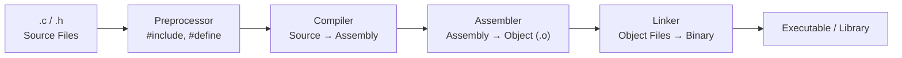
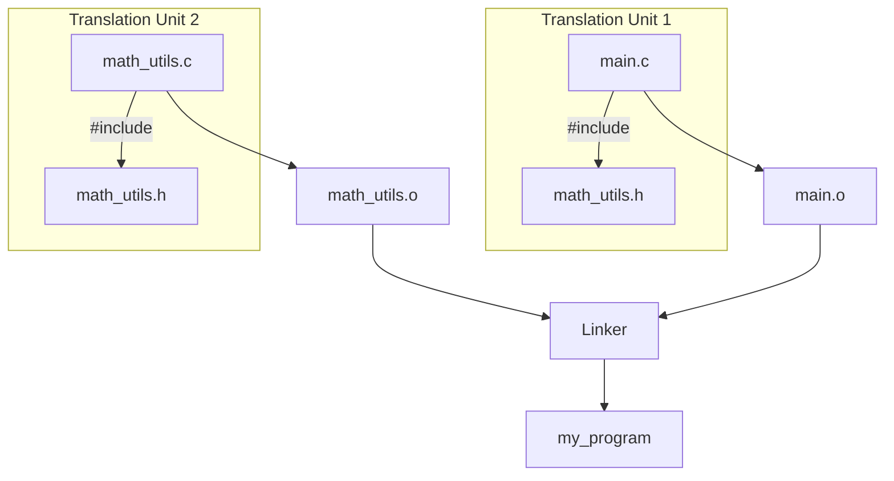
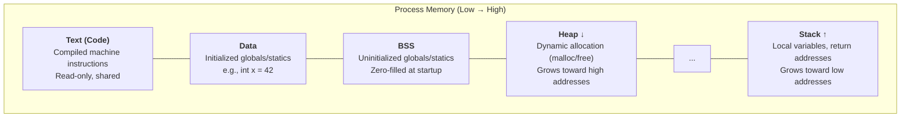

# How C Apps Are Written

Understanding the C build model is foundational to working with JNI, Android NDK, and Kotlin/Native CInterop. This page covers how C code goes from source to running binary.

---

## Compilation Pipeline

C uses an **ahead-of-time (AOT)** compilation model. Source code is transformed through multiple stages before becoming an executable.



### Stage Breakdown

| Stage | Input | Output | Tool | What Happens |
|-------|-------|--------|------|-------------|
| **Preprocessing** | `.c` + `.h` | Expanded `.i` | `cpp` | Macro expansion, `#include` inlining, conditional compilation |
| **Compilation** | `.i` | Assembly `.s` | `cc1` | Parsing, optimization, assembly generation |
| **Assembly** | `.s` | Object `.o` | `as` | Converts mnemonics to machine code |
| **Linking** | `.o` + libs | Executable / `.so` / `.a` | `ld` | Resolves symbols, combines objects, produces final binary |

```bash
# See each stage explicitly
gcc -E main.c -o main.i       # Preprocess only
gcc -S main.c -o main.s       # Compile to assembly
gcc -c main.c -o main.o       # Compile + assemble to object file
gcc main.o -o main             # Link into executable
```

---

## Header Files and Translation Units

C separates **declarations** (`.h` headers) from **definitions** (`.c` source). Each `.c` file is compiled independently as a **translation unit**.



=== "math_utils.h (Declaration)"

    ```c
    #ifndef MATH_UTILS_H
    #define MATH_UTILS_H

    int add(int a, int b);
    int multiply(int a, int b);

    #endif
    ```

=== "math_utils.c (Definition)"

    ```c
    #include "math_utils.h"

    int add(int a, int b) {
        return a + b;
    }

    int multiply(int a, int b) {
        return a * b;
    }
    ```

=== "main.c (Usage)"

    ```c
    #include <stdio.h>
    #include "math_utils.h"

    int main() {
        printf("Sum: %d\n", add(3, 4));
        return 0;
    }
    ```

!!! note "Include Guards"
    The `#ifndef` / `#define` / `#endif` pattern (or `#pragma once`) prevents a header from being included multiple times in the same translation unit, which would cause redefinition errors.

---

## Memory Model

C gives direct control over memory layout. Understanding the memory segments is critical for debugging native code and writing JNI.



### Storage Classes

| Keyword | Scope | Lifetime | Segment |
|---------|-------|----------|---------|
| (default local) | Function | Function call | Stack |
| `static` (local) | Function | Program duration | Data/BSS |
| `static` (global) | File only | Program duration | Data/BSS |
| `extern` | Global (cross-file) | Program duration | Data/BSS |
| `malloc`'d | Depends on pointer | Until `free()` | Heap |

```c
int global_var = 10;           // Data segment
static int file_var = 20;     // Data segment (file scope only)
int uninitialized;             // BSS segment

void example() {
    int local = 5;             // Stack
    static int persistent = 0; // Data segment (survives calls)
    int *heap = malloc(100);   // Heap (pointer on stack, data on heap)
    persistent++;
    free(heap);
}
```

!!! warning "Manual Memory Management"
    C has no garbage collector. Every `malloc` must have a corresponding `free`. Forgetting causes **memory leaks**; double-freeing causes **undefined behavior**. This is the #1 source of native crashes in JNI code.

---

## Libraries: Static vs Shared

Libraries package reusable code. The linking strategy affects binary size, load time, and update behavior.

| Aspect | Static Library (`.a`) | Shared Library (`.so` / `.dylib`) |
|--------|----------------------|-----------------------------------|
| **Linking** | Copied into executable at build time | Loaded at runtime by dynamic linker |
| **Binary size** | Larger (code duplicated) | Smaller (shared across processes) |
| **Updates** | Requires recompilation | Replace `.so` without recompiling |
| **Performance** | Slightly faster (no indirection) | Slight overhead from PLT/GOT |
| **Android NDK** | Used for private native code | Used for shared native libs (`.so` in APK) |

```bash
# Create a static library
gcc -c math_utils.c -o math_utils.o
ar rcs libmath.a math_utils.o

# Create a shared library
gcc -shared -fPIC math_utils.c -o libmath.so

# Link against them
gcc main.c -L. -lmath -o my_program          # static
gcc main.c -L. -lmath -o my_program -Wl,-rpath,.  # shared
```

!!! tip "Android APKs and .so Files"
    Android NDK libraries are always **shared libraries** (`.so`). They're packaged inside the APK under `lib/<abi>/` and loaded at runtime via `System.loadLibrary()`. Each ABI (arm64-v8a, x86_64, etc.) needs its own compiled `.so`.

---

## Build Systems

Real C/C++ projects use build systems to manage compilation across files, platforms, and configurations.

| Build System | Description | Used By |
|-------------|-------------|---------|
| **Make** | Rule-based, uses `Makefile`. The classic Unix build tool | Linux kernel, many OSS projects |
| **CMake** | Meta-build system — generates Makefiles or Ninja files | Android NDK (default), LLVM, Qt |
| **Ninja** | Low-level build executor. Fast, designed for generators | Used by CMake, Meson, Chromium |
| **ndk-build** | Android NDK's Make-based system (`Android.mk`) | Legacy NDK projects |

### CMakeLists.txt (Minimal Example)

```cmake
cmake_minimum_required(VERSION 3.10)
project(MyLib C)

add_library(mylib SHARED
    src/math_utils.c
    src/string_utils.c
)

target_include_directories(mylib PUBLIC include/)
```

This is the same build system used by the Android NDK when building native libraries with CMake (the recommended approach).

---

## Pointers and Function Pointers

Pointers are central to C and essential for understanding JNI references, callbacks, and native memory access.

```c
int value = 42;
int *ptr = &value;     // ptr holds address of value
*ptr = 100;            // dereference: modifies value through ptr

// Array/pointer duality
int arr[] = {1, 2, 3};
int *p = arr;          // arr decays to pointer to first element
printf("%d", *(p + 1)); // prints 2

// Function pointer — used for callbacks (common in NDK)
typedef void (*Callback)(int result);

void async_compute(int input, Callback cb) {
    int result = input * 2;
    cb(result);
}

void on_result(int result) {
    printf("Got: %d\n", result);
}

int main() {
    async_compute(21, on_result);  // prints "Got: 42"
    return 0;
}
```

---

## Structs and Data Layout

Structs define composite types with explicit memory layout — important for passing data across the JNI boundary and understanding native memory.

```c
struct Point {
    float x;    // 4 bytes
    float y;    // 4 bytes
};

struct Packet {
    uint8_t  type;    // 1 byte
    // 3 bytes padding (alignment to 4-byte boundary)
    uint32_t length;  // 4 bytes
    uint8_t  data[];  // flexible array member
};
```

!!! warning "Struct Padding"
    The compiler inserts padding bytes to align struct members to their natural boundaries. This means `sizeof(struct Packet)` may be larger than the sum of its fields. Use `__attribute__((packed))` to disable padding when you need exact binary layout (e.g., network protocols, file formats).

---

## Preprocessor Macros and Conditional Compilation

The preprocessor runs before compilation and is heavily used in NDK code for platform detection and feature toggling.

```c
// Platform detection (common in cross-platform C code)
#if defined(__ANDROID__)
    #include <android/log.h>
    #define LOG(msg) __android_log_print(ANDROID_LOG_DEBUG, "Native", msg)
#elif defined(__APPLE__)
    #include <os/log.h>
    #define LOG(msg) os_log(OS_LOG_DEFAULT, "%s", msg)
#else
    #include <stdio.h>
    #define LOG(msg) printf("%s\n", msg)
#endif

// Feature macros
#ifdef ENABLE_PROFILING
    #define PROFILE_START(name) profile_begin(name)
    #define PROFILE_END(name)   profile_end(name)
#else
    #define PROFILE_START(name)
    #define PROFILE_END(name)
#endif
```

---

## Common Pitfalls

| Pitfall | Description | Consequence |
|---------|-------------|-------------|
| **Buffer overflow** | Writing past array bounds | Crashes, security vulnerabilities |
| **Use after free** | Accessing memory after `free()` | Undefined behavior, data corruption |
| **Dangling pointer** | Pointer to deallocated memory | Silent corruption, intermittent crashes |
| **Memory leak** | `malloc` without `free` | Growing memory usage, OOM kills |
| **Null dereference** | Accessing `*NULL` | Segmentation fault (SIGSEGV) |
| **Integer overflow** | Signed overflow is undefined in C | Compiler may optimize away checks |
| **Uninitialized read** | Reading variable before assignment | Garbage values, nondeterministic behavior |

---

??? question "Why does C separate headers (.h) from source (.c)?"
    Headers provide **declarations** (function signatures, type definitions) so that different translation units can reference each other's symbols. The actual **definitions** (implementations) live in `.c` files, compiled separately. The linker combines them. This enables separate compilation — only modified `.c` files need recompiling, and libraries can distribute headers without source.

??? question "What's the difference between stack and heap allocation?"
    **Stack**: automatic, fast (just a pointer bump), fixed size, scoped to function lifetime. **Heap**: manual (`malloc`/`free`), slower (bookkeeping overhead), dynamically sized, lives until explicitly freed. Use the stack for small, short-lived data; the heap for large or dynamically-sized data that outlives the current scope.

??? question "Why does Android NDK use shared libraries (.so) instead of static?"
    Android apps load native code at runtime via `System.loadLibrary()`, which requires a `.so` (shared object). Static libraries can't be loaded dynamically. Additionally, shared libraries allow the system to share common libraries (like `libc`) across processes, reducing memory usage.

??? question "What is undefined behavior and why does it matter?"
    Undefined behavior (UB) means the C standard places no requirements on what happens — the compiler can assume UB never occurs and optimize accordingly. Common UB: signed integer overflow, null dereference, buffer overflows, use-after-free. UB can cause code to be silently removed by the optimizer, leading to bugs that only appear in release builds.

??? question "How does CMake relate to the Android NDK build process?"
    CMake is the recommended build system for NDK projects. When you build an Android app with native code, Gradle invokes CMake (via `externalNativeBuild`), which generates Ninja build files for each target ABI. Ninja then compiles the C/C++ code into `.so` files that get packaged into the APK under `lib/<abi>/`.

!!! tip "Further Reading"
    - [The C Programming Language (K&R)](https://en.wikipedia.org/wiki/The_C_Programming_Language) — the definitive C reference
    - [CMake Tutorial](https://cmake.org/cmake/help/latest/guide/tutorial/index.html) — official CMake getting started guide
    - [Beej's Guide to C Programming](https://beej.us/guide/bgc/) — free, comprehensive C tutorial
    - [Android NDK CMake Guide](https://developer.android.com/ndk/guides/cmake) — using CMake with the NDK
