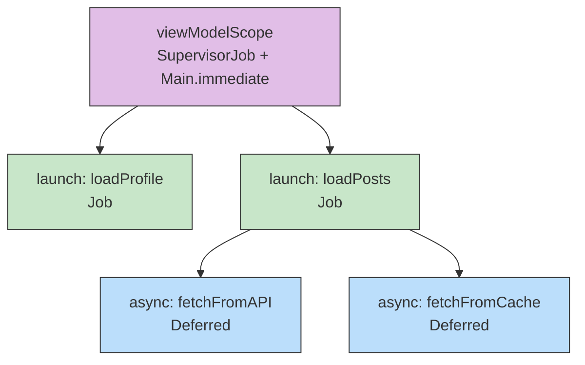
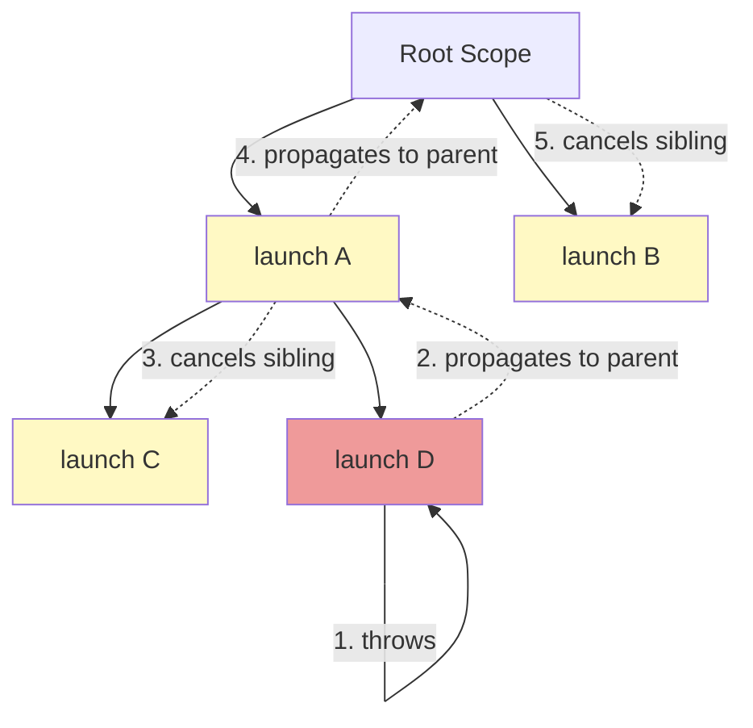

# Kotlin Coroutines

A framework for managing concurrency using lightweight, suspendable computations built on top of the actual threading framework.

!!! tip "The mental model"
    A coroutine is a **suspendable computation**. It's not a thread — it's a piece of work that can pause, let the thread do something else, and resume later. One thread can run thousands of coroutines because suspension is cheap (no thread blocking).

---

## Coroutine Builders

### launch vs async

| Feature | `launch` | `async` |
|---|---|---|
| Returns | `Job` | `Deferred<T>` (extends `Job`) |
| Result | Fire-and-forget, no result | Call `await()` to get the result |
| Exception | Propagates immediately to parent | Held until `await()` is called |
| Use case | Side effects (UI updates, logging) | Parallel computations that return values |

```kotlin
// launch — fire and forget
viewModelScope.launch {
    repository.syncData()
}

// async — parallel decomposition
viewModelScope.launch {
    val profile = async { api.getProfile() }
    val posts = async { api.getPosts() }
    showUI(profile.await(), posts.await()) // both run in parallel
}
```

!!! warning "async pitfall"
    Don't use `async` if you immediately `await()` — that's sequential execution with extra overhead. Use `async` only for parallelism.

---

## withContext

A **suspend function** that switches the coroutine to a different context and **waits** for the block to complete. It does NOT launch a new coroutine — it switches the context of the current one.

```kotlin
suspend fun loadData(): Data {
    return withContext(Dispatchers.IO) {
        // Runs on IO thread pool
        database.query()
    }
    // Back to the original dispatcher
}
```

!!! note "More than thread switching"
    `withContext` also creates a new `CoroutineScope`, providing structured concurrency. If the block throws, the exception propagates correctly. If the parent is cancelled, the `withContext` block is cancelled too.

---

## Dispatchers

=== "Dispatchers.Default"

    CPU-intensive work (sorting, parsing, image processing). Thread pool size = **number of CPU cores** (minimum 2).

    More threads than cores means more context switching, which hurts CPU-bound workloads.

=== "Dispatchers.IO"

    Blocking I/O (network, disk, database). Shares the thread pool with `Default` but can grow beyond the core pool — up to **max(64, number of cores)** threads.

    ```kotlin
    // Create a custom-sized IO pool for a specific subsystem
    val databaseDispatcher = Dispatchers.IO.limitedParallelism(4)
    val networkDispatcher = Dispatchers.IO.limitedParallelism(16)

    // These share the IO pool but limit concurrent operations
    withContext(databaseDispatcher) {
        // At most 4 concurrent database operations
    }
    ```

    !!! tip "limitedParallelism"
        `Dispatchers.IO.limitedParallelism(n)` creates a view of the IO dispatcher that limits concurrency to `n` threads. Useful for rate-limiting access to a resource (e.g., a database connection pool of size 4).

=== "Dispatchers.Main"

    UI operations (Android main thread only).

    - `Dispatchers.Main` — posts to the main thread's message queue.
    - `Dispatchers.Main.immediate` — runs immediately if already on the main thread (avoids unnecessary dispatch). **Preferred in most cases.**

=== "Dispatchers.Unconfined"

    Starts in the caller's thread, but after the first suspension point, resumes in whatever thread the suspension completed on.

    !!! warning
        Almost never appropriate for application code. Useful for testing or very specific library code.

---

## Job Hierarchy and Structured Concurrency

The core principle: **a coroutine's lifetime is bounded by its scope**. Jobs form a parent-child tree, and lifecycle events propagate through this tree.



### Rules of Structured Concurrency

1. **A parent waits** for all children to complete before it completes
2. **A failing child cancels the parent**, which cancels all other children (unless `SupervisorJob`)
3. **Cancelling a parent cancels all children** recursively
4. **Children inherit the parent's context** (dispatcher, Job, CoroutineName, etc.) and can override individual elements

### Scope Builder Functions

These suspend functions create a child scope and wait for all coroutines launched inside to complete:

| Function | Failure behavior | Use case |
|---|---|---|
| `coroutineScope {}` | Any child failure cancels all children + propagates | All children must succeed together |
| `supervisorScope {}` | Child failure doesn't affect siblings | Independent children |
| `withContext(ctx) {}` | Same as `coroutineScope` + switches context | Thread switching with structured concurrency |

```kotlin
suspend fun loadDashboard(): Dashboard = coroutineScope {
    // If either fails, the other is cancelled automatically
    val profile = async { api.getProfile() }
    val stats = async { api.getStats() }
    Dashboard(profile.await(), stats.await())
}

suspend fun loadFeed() = supervisorScope {
    // If recommendations fails, posts still completes
    val posts = async { api.getPosts() }
    val recommendations = async { api.getRecommendations() }
    Feed(posts.await(), recommendations.getOrNull())
}
```

---

## CoroutineScope and CoroutineContext

### CoroutineScope

A scope defines the **lifetime** for coroutines. It holds a `CoroutineContext`.

```kotlin
// Android-provided scopes
viewModelScope   // cancelled when ViewModel is cleared
lifecycleScope   // cancelled when Lifecycle is destroyed

// Both use SupervisorJob + Dispatchers.Main.immediate internally
```

### CoroutineContext

A set of elements that configure coroutine behavior. Contexts are combined with `+`:

```kotlin
val context = Dispatchers.IO + SupervisorJob() + CoroutineName("data-loader")

// Key elements:
// Job             — controls lifecycle, parent-child hierarchy
// Dispatcher      — which thread pool
// CoroutineName   — for debugging
// CoroutineExceptionHandler — uncaught exception handling
```

### coroutineScope vs CoroutineScope

| | `coroutineScope` (lowercase) | `CoroutineScope` (uppercase) |
|---|---|---|
| Type | Suspend function | Interface / factory function |
| Behavior | Creates a child scope, **suspends until children complete** | Creates an independent scope for launching coroutines |
| Use case | Parallel decomposition inside a suspend function | Tying coroutine lifetime to a component |

---

## SupervisorJob and supervisorScope

### SupervisorJob

A Job where child failure does **not** propagate to the parent or siblings. Each child handles its own failures independently.

!!! warning "Common mistake"
    `SupervisorJob` must be part of the **scope**, not a parent of an individual coroutine.

    ```kotlin
    // WRONG — SupervisorJob as parent of launch doesn't help
    scope.launch(SupervisorJob()) {
        launch { /* child A */ }
        launch { /* child B */ }  // still cancelled if A fails!
    }
    // The SupervisorJob() creates a NEW job that breaks structured concurrency

    // RIGHT — SupervisorJob in the scope
    val scope = CoroutineScope(SupervisorJob() + Dispatchers.Main)
    scope.launch { /* child A */ }
    scope.launch { /* child B */ }  // unaffected if A fails
    ```

### supervisorScope

The suspend function equivalent — creates a child scope with supervisor behavior.

```kotlin
suspend fun loadPage() = supervisorScope {
    launch { loadHeader() }       // failure here...
    launch { loadContent() }      // ...doesn't cancel this
    launch { loadRecommendations() }
}
```

---

## Cancellation

### Cooperative Cancellation

Coroutines are cancelled cooperatively. A long-running computation must check for cancellation explicitly.

```kotlin
// Suspend functions like delay(), yield(), withContext() check automatically
suspend fun process(items: List<Item>) {
    for (item in items) {
        // Option 1: Call a suspend function (checks cancellation)
        delay(1)

        // Option 2: Explicitly check
        ensureActive()

        // Option 3: Manual check
        if (!isActive) break

        heavyComputation(item)
    }
}
```

### ensureActive() vs isActive

| | `ensureActive()` | `isActive` |
|---|---|---|
| Behavior | Throws `CancellationException` immediately | Returns `Boolean` |
| Use case | Just stop — let the framework handle it | Custom cleanup before stopping |

### NonCancellable

Use `withContext(NonCancellable)` for cleanup code that **must complete** even during cancellation.

```kotlin
suspend fun close() {
    try {
        networkCall()
    } finally {
        // This block runs during cancellation, but suspend calls would fail
        withContext(NonCancellable) {
            // This suspend call will complete even though we're cancelled
            savePartialProgress()
            database.close()
        }
    }
}
```

!!! warning
    Only use `NonCancellable` in `finally` blocks for critical cleanup. Never use it to "ignore" cancellation in normal code — that breaks structured concurrency.

---

## Error Handling

### launch vs async Exception Behavior

```kotlin
// launch — exception propagates immediately to parent
scope.launch {
    throw RuntimeException("boom") // crashes (propagates to parent)
}

// async — exception is deferred
val deferred = scope.async {
    throw RuntimeException("boom") // stored in Deferred
}
// Exception thrown when you call:
deferred.await() // RuntimeException here
```

### Exception Propagation Flow

Exceptions propagate **upward** through the Job hierarchy:

1. Child throws an exception
2. Child is cancelled
3. **Parent receives the exception** and cancels all other children
4. Parent propagates the exception to **its** parent
5. This continues until the root scope or a `SupervisorJob` boundary



### CoroutineExceptionHandler

A last-resort handler for uncaught exceptions. Important constraints:

- **Only works with `launch`** (not `async` — async delivers exceptions through `await()`)
- **Only works at the root coroutine** or with `supervisorScope`
- Does NOT prevent scope cancellation — it just handles the exception after propagation

```kotlin
val handler = CoroutineExceptionHandler { _, exception ->
    Log.e("Coroutine", "Uncaught: ${exception.message}")
}

// Works — handler at root coroutine
val scope = CoroutineScope(SupervisorJob() + handler)
scope.launch {
    throw RuntimeException("caught by handler")
}

// Does NOT work — handler on a child coroutine
scope.launch {
    launch(handler) {  // handler is IGNORED here
        throw RuntimeException("not caught by handler")
    }
}
```

### Scope Cancellation

!!! warning "Scope is cancelled forever"
    When a `CoroutineScope` (without `SupervisorJob`) has an unhandled exception, the scope is **cancelled permanently**. No new coroutines can be launched on it. This is why `viewModelScope` and `lifecycleScope` use `SupervisorJob` internally.

```kotlin
val scope = CoroutineScope(Job()) // regular Job

scope.launch { throw Exception("fail") }
// scope is now cancelled forever

scope.launch { /* this will not run */ }
```

---

## Exception Handling: coroutineScope vs supervisorScope

| Scope | Child fails | Other children | Exception goes to |
|---|---|---|---|
| `coroutineScope` | Cancelled | **All cancelled** | Rethrown from `coroutineScope` call |
| `supervisorScope` | Cancelled | **Unaffected** | Must be caught inside the child |

```kotlin
// coroutineScope — use try-catch AROUND the scope
try {
    coroutineScope {
        launch { api.call1() }
        launch { api.call2() } // if this fails, call1 is cancelled
    }
} catch (e: Exception) {
    // Caught here
}

// supervisorScope — use try-catch INSIDE each child
supervisorScope {
    launch {
        try { api.call1() } catch (e: Exception) { /* handle */ }
    }
    launch {
        try { api.call2() } catch (e: Exception) { /* handle */ }
    }
}
```

---

## lifecycleScope and viewModelScope

| Scope | Tied to | Internal context |
|---|---|---|
| `lifecycleScope` | `LifecycleOwner` (Activity/Fragment) | `SupervisorJob() + Dispatchers.Main.immediate` |
| `viewModelScope` | `ViewModel` | `SupervisorJob() + Dispatchers.Main.immediate` |

Both use `SupervisorJob` so that one failed coroutine doesn't cancel the entire scope.

```kotlin
class MyViewModel : ViewModel() {
    init {
        viewModelScope.launch {
            // Cancelled automatically when ViewModel is cleared
            repository.observeUpdates().collect { /* ... */ }
        }
    }
}
```

---

## Dispatchers Deep Dive

### IO and Default Share Threads

`Dispatchers.IO` and `Dispatchers.Default` share the same thread pool. The difference is the **parallelism limit**:

- `Default` limits to **CPU core count** threads
- `IO` can expand to **max(64, cores)** threads

When you `withContext(Dispatchers.IO)` from a `Default` coroutine, there's often **no thread switch** — the same thread can be used. The dispatcher just permits more concurrent coroutines.

### Custom Dispatchers

```kotlin
// Fixed thread pool — useful for isolating blocking operations
val databaseDispatcher = Executors.newFixedThreadPool(4).asCoroutineDispatcher()

// Limited view of IO — no new threads, just limits concurrency
val apiDispatcher = Dispatchers.IO.limitedParallelism(10)

// Single thread — useful for thread-confined mutable state
val singleThread = Dispatchers.Default.limitedParallelism(1)

// limitedParallelism on Default vs IO:
// Dispatchers.Default.limitedParallelism(1) — confines to 1 thread from Default pool
// Dispatchers.IO.limitedParallelism(100) — allows up to 100 concurrent (beyond IO's default 64)
```

---

## GlobalScope

!!! warning "Avoid GlobalScope"
    Not bound to any Job or lifecycle. Coroutines launched here live until the process dies or they complete. Risk of **memory leaks** and **wasted work**. Uses `Dispatchers.Default`.

```kotlin
// BAD — leaks if the screen is gone
GlobalScope.launch {
    val data = api.fetchData()
    updateUI(data) // might crash — activity might be dead
}

// GOOD — tied to ViewModel lifecycle
viewModelScope.launch {
    val data = api.fetchData()
    updateUI(data) // safe — cancelled when ViewModel clears
}
```

---

## runBlocking

Blocks the current thread until all coroutines inside complete. Creates a coroutine scope that bridges blocking and suspending worlds.

```kotlin
// Main use case: tests and main() functions
fun main() = runBlocking {
    val result = async { computeValue() }
    println(result.await())
}

// In tests
@Test
fun testSuspendFunction() = runBlocking {
    val result = repository.fetchData()
    assertEquals(expected, result)
}
```

!!! warning "Never use in production Android code"
    `runBlocking` on the main thread causes an ANR. It blocks the thread, defeating the purpose of coroutines. Use `viewModelScope.launch` or `lifecycleScope.launch` instead.

---

## How Suspend Works: Continuation Internals

Every `suspend` function is transformed by the compiler into a function that takes an extra `Continuation` parameter.

### The Continuation Interface

```kotlin
interface Continuation<in T> {
    val context: CoroutineContext
    fun resumeWith(result: Result<T>)
}

// Extension functions for convenience:
fun <T> Continuation<T>.resume(value: T)
fun <T> Continuation<T>.resumeWithException(exception: Throwable)
```

### The State Machine

The compiler converts each `suspend` function into a **state machine**. Each suspension point becomes a `when` branch with a label.

```kotlin
// What you write:
suspend fun loadUser(): User {
    val token = getToken()        // suspension point 1
    val user = fetchUser(token)   // suspension point 2
    return user
}

// What the compiler generates (simplified):
fun loadUser(continuation: Continuation<User>): Any? {
    val sm = continuation as? LoadUserSM ?: LoadUserSM(continuation)

    when (sm.label) {
        0 -> {
            sm.label = 1
            val result = getToken(sm)     // pass state machine as continuation
            if (result == COROUTINE_SUSPENDED) return COROUTINE_SUSPENDED
            sm.token = result
        }
        1 -> {
            sm.token = sm.result          // resumed with token
            sm.label = 2
            val result = fetchUser(sm.token, sm)
            if (result == COROUTINE_SUSPENDED) return COROUTINE_SUSPENDED
            sm.user = result
        }
        2 -> {
            return sm.result              // resumed with user
        }
    }
}
```

!!! note "Key insight"
    The continuation carries the **state label** and all **local variables** across suspension points. No stack frame is kept while suspended — this is why coroutines are lightweight. The state machine is allocated on the heap, not on the thread stack.

---

## suspendCancellableCoroutine

Bridges callback-based APIs with coroutines. Creates a coroutine that suspends until manually resumed.

```kotlin
suspend fun fetchUser(id: String): User = suspendCancellableCoroutine { continuation ->
    val call = api.getUser(id, object : Callback<User> {
        override fun onSuccess(user: User) {
            continuation.resume(user)
        }
        override fun onFailure(e: Exception) {
            continuation.resumeWithException(e)
        }
    })

    // Clean up if the coroutine is cancelled
    continuation.invokeOnCancellation {
        call.cancel()
    }
}
```

!!! tip "suspendCoroutine vs suspendCancellableCoroutine"
    Always prefer `suspendCancellableCoroutine`. It supports `invokeOnCancellation` for cleanup and respects structured concurrency. `suspendCoroutine` doesn't support cancellation.

---

## First Time Coroutine Creation

!!! tip "Startup Performance"
    The first coroutine creation has a noticeable initialization cost (class loading for `Dispatchers`, `CoroutineScope`, etc.), which matters during app startup. For `Application.onCreate`, consider using `ExecutorService` which is pre-loaded by Zygote.

```kotlin
class MyApplication : Application() {
    override fun onCreate() {
        super.onCreate()
        // Fast — ExecutorService is already loaded
        Executors.newSingleThreadExecutor().execute {
            // startup work
        }

        // Slower on first call — coroutine infrastructure needs initialization
        CoroutineScope(Dispatchers.IO).launch {
            // startup work
        }
    }
}
```

---

## Flow Integration

Flows are built on coroutines — they are **cold, asynchronous streams** that use `suspend` under the hood.

```kotlin
// A flow builder is a coroutine that emits values
fun userUpdates(): Flow<User> = flow {
    while (true) {
        emit(api.getLatestUser())  // emit is a suspend function
        delay(5000)
    }
}

// Collecting a flow is a suspend operation
viewModelScope.launch {
    userUpdates()
        .flowOn(Dispatchers.IO)  // upstream runs on IO
        .collect { user ->       // collect suspends in this coroutine
            updateUI(user)
        }
}
```

Every flow operator like `map`, `filter`, `flatMapLatest` uses `suspend` functions internally. See the [Kotlin Flow](flow.md) page for comprehensive coverage.

---

## Summary: Choosing the Right Tool

| Scenario | Use |
|---|---|
| Fire-and-forget work | `launch` |
| Parallel work that returns results | `async` + `await` |
| Switch thread in a suspend function | `withContext` |
| All children must succeed | `coroutineScope` |
| Children are independent | `supervisorScope` |
| One-time value from callback API | `suspendCancellableCoroutine` |
| Stream of values from callback API | `callbackFlow` |
| CPU-heavy work | `Dispatchers.Default` |
| Blocking I/O | `Dispatchers.IO` |
| UI updates | `Dispatchers.Main.immediate` |
| Rate-limit a resource | `Dispatchers.IO.limitedParallelism(n)` |

---

## Interview Q&A

??? question "What is structured concurrency and why does it matter?"
    Structured concurrency means a coroutine's lifetime is bounded by its scope. A parent waits for all children to complete, cancelling a parent cancels all children, and a failing child cancels the parent (unless using `SupervisorJob`). This prevents leaked coroutines, forgotten background work, and makes error propagation predictable.

??? question "What is the difference between `launch` and `async`?"
    `launch` returns a `Job` and is fire-and-forget -- exceptions propagate immediately to the parent. `async` returns a `Deferred<T>` and holds exceptions until `await()` is called. Use `async` only when you need to run parallel computations and collect their results.

??? question "How does coroutine cancellation work?"
    Cancellation is cooperative. A coroutine must check for cancellation by calling a suspend function (like `delay` or `yield`), calling `ensureActive()`, or checking `isActive`. Long-running CPU work that never checks will not be cancelled. Use `withContext(NonCancellable)` only in `finally` blocks for critical cleanup.

??? question "When would you use `SupervisorJob` or `supervisorScope`?"
    Use them when child coroutines are independent and a failure in one should not cancel siblings. For example, loading a feed where a failed recommendations request should not cancel the posts request. Both `viewModelScope` and `lifecycleScope` use `SupervisorJob` internally for this reason.

??? question "How does `suspend` work under the hood?"
    The compiler transforms each suspend function into a state machine. An extra `Continuation` parameter is added, and each suspension point becomes a labeled state. Local variables are saved in the continuation object on the heap, so no thread stack is held while suspended -- this is why coroutines are lightweight.

??? question "Why should you avoid `GlobalScope`?"
    `GlobalScope` is not bound to any lifecycle, so coroutines launched in it live until they complete or the process dies. This risks memory leaks and wasted work (e.g., network calls for a screen that no longer exists). Always use a lifecycle-bound scope like `viewModelScope` or `lifecycleScope`.

!!! tip "Further Reading"
    - [Kotlin Coroutines Guide](https://kotlinlang.org/docs/coroutines-guide.html) -- official coroutines tutorial and reference
    - [Structured Concurrency](https://kotlinlang.org/docs/coroutines-basics.html#structured-concurrency) -- core principles of coroutine lifecycles
    - [Coroutines on Android](https://developer.android.com/kotlin/coroutines) -- Android-specific best practices
    - [Coroutine Exceptions Handling](https://kotlinlang.org/docs/exception-handling.html) -- official guide on exception propagation
    - [KotlinConf 2019: Coroutines! Gotta catch 'em all](https://www.youtube.com/watch?v=w0kfnydnFWI) -- Florina Muntenescu and Manuel Vivo on coroutine pitfalls
