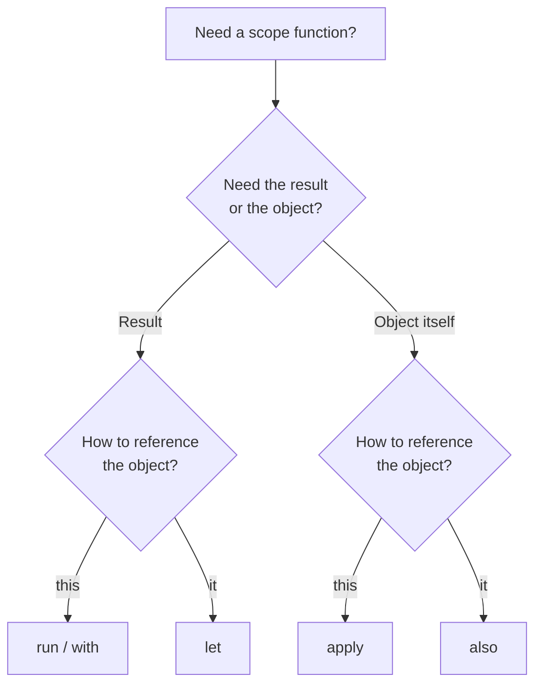

# Kotlin Language Essentials

---

## Sealed Class vs Sealed Interface vs Enum

=== "Sealed Class"

    Restricted hierarchy with a shared constructor. Subclasses can be `data class`, `object`, or regular `class`.

    ```kotlin
    sealed class HttpError(val code: Int, val message: String) {
        class NotFound : HttpError(404, "Not Found")
        class Unauthorized : HttpError(401, "Unauthorized")
        class ServerError(override val message: String) : HttpError(500, message)
    }
    ```

=== "Sealed Interface"

    Use when a constructor is **not required**, or when a class needs to implement **multiple sealed hierarchies**.

    ```kotlin
    sealed interface HttpError {
        val code: Int
        val message: String

        data class NotFound(override val message: String = "Not Found") : HttpError {
            override val code = 404
        }
        data class Unauthorized(override val message: String = "Unauthorized") : HttpError {
            override val code = 401
        }
    }
    ```

=== "Enum Class"

    Fixed set of constants. All entries share the **same structure**. Exhaustive `when` guaranteed.

    ```kotlin
    enum class HttpError(val code: Int, val message: String) {
        NOT_FOUND(404, "Not Found"),
        UNAUTHORIZED(401, "Unauthorized"),
        SERVER_ERROR(500, "Internal Server Error")
    }
    ```

!!! note "Sealed Subclass Location"
    Since Kotlin 1.5, sealed class/interface subclasses can be defined anywhere in the **same package**, not just the same file. They must still be in the same **compilation unit** (module).

---

## if vs let

!!! warning "Thread Safety"
    `if (x != null)` can have a race condition -- another thread may set `x` to null between the check and usage. `x?.let {}` captures the value safely because the lambda receives an immutable copy.

```kotlin
// Race condition possible with mutable var
if (x != null) {
    doSomething(x) // x might be null here if another thread changed it
}

// Thread safe — `it` is a captured snapshot
x?.let {
    doSomething(it)
}
```

!!! tip "When `if` is fine"
    For local `val` variables (which can't be reassigned), `if (x != null)` is perfectly safe and often more readable. The compiler smart-casts correctly.

---

## Class vs KClass

| | `KClass` | `Class` |
|---|---|---|
| Syntax | `MyClass::class` | `MyClass::class.java` |
| API | Kotlin Reflection API (`kotlin.reflect.KClass`) | Java Reflection API (`java.lang.Class`) |
| Use case | Kotlin-idiomatic reflection, serialization | Java interop, Android framework APIs |

```kotlin
inline fun <reified T> getClassName(): String {
    return T::class.simpleName ?: "Unknown"       // KClass
}

inline fun <reified T> getJavaClass(): Class<T> {
    return T::class.java                           // Java Class
}
```

---

## Reflection

Introspect classes, properties, and functions at runtime.

```kotlin
data class User(val name: String, val age: Int)

val kClass = User::class
kClass.memberProperties.forEach { println(it.name) } // name, age
kClass.primaryConstructor?.parameters?.forEach { println(it.name) }
```

!!! warning "Runtime cost"
    `kotlin-reflect` adds ~800KB to APK size. Prefer `KClass` metadata (which is free) over full reflection. Libraries like Moshi and kotlinx.serialization use compile-time code generation to avoid reflection entirely.

---

## String vs StringBuffer vs StringBuilder

| Type | Mutability | Thread-Safe | Use Case |
|---|---|---|---|
| `String` | Immutable | Yes (inherently) | Default choice |
| `StringBuffer` | Mutable | Yes (synchronized) | Multi-threaded string building |
| `StringBuilder` | Mutable | No | Single-threaded string building (preferred) |

```kotlin
// Kotlin's buildString uses StringBuilder internally
val result = buildString {
    append("Hello")
    append(" ")
    append("World")
}
```

---

## HashMap vs ArrayMap vs LinkedHashMap vs SparseArray

=== "HashMap"

    Standard hash table. Uses a hash function for bucket placement. Handles collisions with linked list (or tree at threshold of 8). Default load factor of 0.75, resizes by doubling.

=== "ArrayMap"

    Android-specific (`android.util.ArrayMap`). Uses two arrays: sorted key hashes and interleaved key-value pairs. Binary search for lookup. **More memory-efficient** than HashMap for small collections (< 100 entries). Slower for large collections due to O(log n) search + array shifting on insert.

=== "LinkedHashMap"

    HashMap with a doubly-linked list overlay. Maintains **insertion order** (or access order if configured). Useful for LRU cache implementations.

=== "SparseArray"

    Android-specific. Maps **primitive `int` keys** to objects. Avoids autoboxing of keys (no `Integer` wrapper). Variants: `SparseBooleanArray`, `SparseIntArray`, `SparseLongArray`.

---

## List vs ArrayList

- `listOf()` returns an immutable `List` (backed by `java.util.Arrays.ArrayList`, a fixed-size list).
- `mutableListOf()` returns `MutableList` backed by `java.util.ArrayList`.
- `ArrayList` is always mutable and resizable.
- `emptyList()` returns a singleton empty list (no allocation per call).

---

## == vs ===

| Operator | Compares | Equivalent |
|---|---|---|
| `==` | Structural equality | Calls `equals()` (null-safe) |
| `===` | Referential equality | Same object in memory |

```kotlin
val a = "hello"
val b = "hello"
a == b   // true  (same content)
a === b  // true  (string pool — JVM interns string literals)

val c = String("hello".toCharArray())
a == c   // true
a === c  // false (different object)
```

---

## inline, noinline, crossinline

### inline

Copies the function body and lambda bodies to the call site. Benefits:

- **No lambda object allocation** (no anonymous class created)
- **Enables non-local returns** from lambdas
- **Required for `reified` type parameters**

!!! tip "When to use inline"
    Use `inline` for functions that accept lambda parameters (saves allocation). For functions without lambda parameters, `inline` is only useful if you need **reified type parameters**. The compiler will warn you otherwise.

### noinline

Prevents inlining of a specific lambda parameter. Needed when you want to store the lambda in a property or pass it to a non-inline function.

```kotlin
inline fun execute(action: () -> Unit, noinline callback: () -> Unit) {
    action()          // inlined at call site
    saveCallback(callback)  // can't inline — needs to be an object
}
```

### crossinline

Disallows non-local returns in a lambda that will be invoked in a different execution context (e.g., inside another lambda or a `Runnable`).

```kotlin
inline fun executeTask(crossinline task: () -> Unit) {
    val runnable = Runnable {
        task() // crossinline needed: called inside another lambda
        // `return` not allowed here (would be a non-local return)
    }
    runnable.run()
}
```

### reified

Retains generic type information at runtime. **Only works with `inline` functions** because the compiler substitutes the actual type at each call site.

```kotlin
inline fun <reified T> isType(value: Any): Boolean {
    return value is T  // possible because T is reified
}

inline fun <reified T : Activity> Context.startActivity() {
    startActivity(Intent(this, T::class.java))
}

// Without reified, you'd need: startActivity(SomeActivity::class.java)
```

---

## Scope Functions

| Function | Context Object | Return Value | Use Case |
|---|---|---|---|
| `let` | `it` | Lambda result | Null checks, scoping, transformations |
| `run` | `this` | Lambda result | Object configuration + computing a result |
| `also` | `it` | Context object | Side effects (logging, validation) |
| `apply` | `this` | Context object | Object configuration |
| `with` | `this` | Lambda result | Grouping calls on an object |

### When to Use Which



```kotlin
// let — null-safe transformation
val length = name?.let { it.trim().length }

// run — configure + compute result
val result = service.run {
    port = 8080
    connect()  // returns connection result
}

// apply — configure and return the object
val intent = Intent().apply {
    action = Intent.ACTION_SEND
    putExtra("key", "value")
}

// also — side effects without changing the object
val user = getUser().also { log("Fetched user: ${it.name}") }

// with — group operations on an existing object
with(binding) {
    titleText.text = item.title
    subtitleText.text = item.subtitle
    imageView.load(item.url)
}
```

---

## use {}

Auto-closes `Closeable` / `AutoCloseable` resources after the block completes (including on exceptions). Kotlin equivalent of Java's try-with-resources.

```kotlin
fun readFirstLine(path: String): String {
    BufferedReader(FileReader(path)).use { reader ->
        return reader.readLine()
    }
}

// Multiple resources
FileInputStream("input.txt").use { input ->
    FileOutputStream("output.txt").use { output ->
        input.copyTo(output)
    }
}
```

---

## JvmField, JvmOverloads, JvmStatic

| Annotation | Purpose | Example |
|---|---|---|
| `@JvmStatic` | Generates a real static method (not on `Companion` instance) | Java calls `MyClass.foo()` instead of `MyClass.Companion.foo()` |
| `@JvmField` | Exposes property as a field (no getter/setter) | Java accesses `obj.name` instead of `obj.getName()` |
| `@JvmOverloads` | Generates overloaded methods for default parameters | Java can call function without all parameters |

```kotlin
class Config(@JvmField val name: String) {
    companion object {
        @JvmStatic
        fun create(): Config = Config("default")
    }

    @JvmOverloads
    fun setup(host: String = "localhost", port: Int = 8080) { }
    // Generates: setup(), setup(String), setup(String, int)
}
```

---

## Dynamic Dispatch

Overridden methods are resolved at **runtime** based on the actual object type (not the declared type).

```kotlin
open class Animal {
    open fun speak() = "..."
}
class Dog : Animal() {
    override fun speak() = "Woof"
}

val animal: Animal = Dog()
animal.speak() // "Woof" — resolved at runtime (dynamic dispatch)
```

!!! note "Static dispatch"
    Extension functions use **static dispatch** — resolved at compile time based on the declared type. This is the key difference between member functions and extension functions.

---

## OOP Principles

- **Abstraction**: Define contracts (interfaces, abstract classes) without exposing implementation.
- **Encapsulation**: Control access with visibility modifiers (`private`, `protected`, `internal`, `public`).
- **Inheritance**: Subclass extends a parent class (`open` required in Kotlin).
- **Polymorphism**:
    - **Compile-time**: Method overloading (same name, different parameters)
    - **Runtime**: Method overriding (same signature, different implementation in subclass)

---

## Transient

Excludes a field from serialization (Java serialization and `@Serializable` with `@Transient`).

```kotlin
// Java serialization
class Session : Serializable {
    val token: String = "abc"
    @Transient
    val cachedData: String = "not serialized"
}

// kotlinx.serialization
@Serializable
data class Session(
    val token: String,
    @kotlinx.serialization.Transient
    val cachedData: String = "not serialized"  // default value required
)
```

---

## SAM / Functional Interface

An interface with exactly **one abstract method**. Declared with the `fun` keyword in Kotlin to enable lambda conversion.

```kotlin
fun interface Transformer<T, R> {
    fun transform(input: T): R
}

// Lambda conversion (SAM conversion)
val intToString = Transformer<Int, String> { it.toString() }

// Without `fun` keyword, you'd need:
val intToString = object : Transformer<Int, String> {
    override fun transform(input: Int): String = input.toString()
}
```

!!! note "Java SAM vs Kotlin SAM"
    Kotlin automatically performs SAM conversion for Java interfaces (like `Runnable`, `Callable`). For Kotlin interfaces, you must explicitly declare them with `fun interface`.

---

## Nothing, Unit, Any

| Type | Meaning | Java Equivalent |
|---|---|---|
| `Nothing` | Function **never returns** (throws exception, infinite loop). Subtype of every type. | No equivalent |
| `Unit` | Function returns no meaningful value | `void` |
| `Any` | Root of the non-nullable type hierarchy | `Object` |

```kotlin
// Nothing — the compiler knows code after this is unreachable
fun fail(message: String): Nothing {
    throw IllegalStateException(message)
}

// Nothing is a subtype of every type, so this compiles:
val result: String = input ?: fail("Input was null")

// Unit — can be used as a generic type parameter
fun <T> executeAndReturn(block: () -> T): T = block()
executeAndReturn<Unit> { println("hello") }
```

---

## Abstract vs Interface

| | Abstract Class | Interface |
|---|---|---|
| Constructor | Yes | No |
| State (backing fields) | Yes | No (properties without backing fields only) |
| Inheritance | Single | Multiple |
| Access modifiers | All (`private`, `protected`, etc.) | `public` (default), `private` (Kotlin) |
| When to use | Shared state + behavior among related classes | Define a contract / capability |

!!! note "Kotlin interfaces with default methods"
    Kotlin interfaces can have method bodies (default implementations) and property declarations. Under the hood, default methods are compiled to a `DefaultImpls` companion class (not Java 8 default methods, unless you use `@JvmDefault`).

---

## val vs const val

| | `val` | `const val` |
|---|---|---|
| Evaluation | Runtime | Compile-time |
| Types | Any type | Primitives and `String` only |
| Location | Anywhere | Top-level, `object`, or `companion object` |
| Behavior | Assigned once, getter generated | **Inlined** at usage site (no getter, no field access) |

```kotlin
const val MAX_RETRIES = 3          // inlined: compiled as literal 3 everywhere
val currentTime = System.nanoTime() // computed at runtime
```

---

## lateinit vs lazy

| | `lateinit` | `lazy` |
|---|---|---|
| Keyword | `var` | `val` |
| Types | Non-nullable, non-primitive | Any type |
| Initialization | Manually, before first use | On first access (thread-safe by default) |
| Check | `::property.isInitialized` | N/A (always initialized on access) |
| If not initialized | `UninitializedPropertyAccessException` | N/A |
| Thread safety | No | Yes (`LazyThreadSafetyMode.SYNCHRONIZED` default) |

```kotlin
// lateinit — common for DI injection
lateinit var repository: UserRepository

// lazy — computed once on first access
val heavyObject: ExpensiveClass by lazy {
    ExpensiveClass()
}

// lazy with different thread safety modes
val cached by lazy(LazyThreadSafetyMode.NONE) {
    // No synchronization — use when single-threaded access is guaranteed
    computeValue()
}
```

---

## open

Allows a class or function to be **inherited** or **overridden**. In Kotlin, classes and methods are `final` by default (opposite of Java).

```kotlin
open class Base {
    open fun draw() { /* ... */ }  // can be overridden
    fun fill() { /* ... */ }       // cannot be overridden
}

class Circle : Base() {
    override fun draw() { /* custom drawing */ }
}
```

!!! tip "all-open compiler plugin"
    Frameworks like Spring require open classes. The `all-open` plugin (or `kotlin-spring` plugin) automatically makes annotated classes open at compile time.

---

## Lambda and Higher-Order Functions

```kotlin
// Lambda — anonymous function assigned to a variable
val square: (Int) -> Int = { x -> x * x }

// Higher-order function — accepts a function parameter
fun transform(value: Int, operation: (Int) -> Int): Int {
    return operation(value)
}

transform(5, square) // 25
transform(5) { it * 2 } // 10 — trailing lambda syntax

// Function reference
fun double(x: Int) = x * 2
transform(5, ::double) // 10

// Lambda with receiver — foundation of DSLs
fun buildString(action: StringBuilder.() -> Unit): String {
    return StringBuilder().apply(action).toString()
}
buildString {
    append("Hello")  // `this` is StringBuilder
    append(" World")
}
```

---

## data object

A singleton (`object`) that provides a readable `toString()` and proper `equals()`/`hashCode()`.

```kotlin
sealed interface Response {
    data class Success(val body: String) : Response
    data object Loading : Response      // toString() = "Loading"
    data object Error : Response        // toString() = "Error"
}
// Without `data`: Loading.toString() = "Loading@3a7f1c"
```

---

## object vs companion object

| | `object` | `companion object` |
|---|---|---|
| Scope | Standalone singleton | Tied to a class |
| Java equivalent | Singleton pattern | `static` members |
| Access to outer | N/A | Can access outer class `private` members |
| Naming | Has its own name | Optional name (default: `Companion`) |

```kotlin
// object — standalone singleton
object Database {
    fun connect() { /* ... */ }
}

// companion object — factory pattern
class User private constructor(val name: String) {
    companion object Factory {
        fun create(name: String): User = User(name)
    }
}

val user = User.create("Alice")  // accessed like a static method
```

---

## Value Class (Inline Class)

Wraps a single value without allocation overhead at runtime. The wrapper is erased by the compiler in most cases.

```kotlin
@JvmInline
value class UserId(val id: String)

@JvmInline
value class Email(val value: String) {
    init {
        require(value.contains("@")) { "Invalid email" }
    }
}

fun sendEmail(to: Email, from: UserId) { /* ... */ }

// At runtime, `to` is just a String and `from` is just a String
// But at compile time, you can't accidentally swap them
```

!!! warning "When boxing occurs"
    Value classes get boxed when used as nullable types (`Email?`), generic type arguments, or in collections. The compiler cannot erase them in these cases.

---

## TypeAlias

Creates an alternative name for an existing type. Does **not** create a new type — the compiler treats them as identical.

```kotlin
typealias Predicate<T> = (T) -> Boolean
typealias UserList = List<User>
typealias StringMap = Map<String, String>

// Useful for complex function types
typealias ClickHandler = (View, Int) -> Unit
```

!!! note "TypeAlias vs Value Class"
    `typealias` provides readability but no type safety (a `Predicate<Int>` is interchangeable with `(Int) -> Boolean`). Use `value class` when you need the compiler to enforce type distinctions.

---

## Delegation (`by`)

Kotlin's `by` keyword delegates interface implementation or property access to another object, implementing the delegation pattern with zero boilerplate.

=== "Interface Delegation"

    ```kotlin
    class LoggingList<T>(
        private val inner: MutableList<T> = mutableListOf()
    ) : MutableList<T> by inner {
        override fun add(element: T): Boolean {
            println("Adding $element")
            return inner.add(element)
        }
        // All other MutableList methods delegated to `inner` automatically
    }
    ```

=== "Property Delegation"

    Properties can delegate their getter/setter logic to another object via `by`. The delegate must implement `getValue()` (and `setValue()` for `var`).

    ```kotlin
    class User(map: Map<String, Any?>) {
        val name: String by map   // reads from map["name"]
        val age: Int by map       // reads from map["age"]
    }

    val user = User(mapOf("name" to "Alice", "age" to 30))
    println(user.name) // "Alice"
    ```

### Built-in Property Delegates

```kotlin
// lazy — computed on first access
val heavy by lazy { ExpensiveComputation() }

// observable — callback on every change
var name: String by Delegates.observable("initial") { prop, old, new ->
    println("$old -> $new")
}

// vetoable — callback can reject changes
var age: Int by Delegates.vetoable(0) { _, _, newValue ->
    newValue >= 0  // reject negative values
}

// notNull — like lateinit but for primitive types
var count: Int by Delegates.notNull()

// Storing properties in a map
class Config(properties: Map<String, Any>) {
    val host: String by properties
    val port: Int by properties
}
```

### Custom Delegate

```kotlin
class Trimmed {
    private var value: String = ""
    operator fun getValue(thisRef: Any?, property: KProperty<*>) = value
    operator fun setValue(thisRef: Any?, property: KProperty<*>, newValue: String) {
        value = newValue.trim()
    }
}

var input: String by Trimmed()
input = "  hello  "
println(input) // "hello"
```

---

## Extension Functions

Extension functions are **static functions** under the hood. They don't modify the original class and don't have access to private members.

```kotlin
fun String.isPalindrome(): Boolean = this == this.reversed()

// Compiles to (decompiled Java):
// public static boolean isPalindrome(String $this) { ... }
```

!!! warning "No virtual dispatch"
    Extension functions are resolved at **compile time** based on the declared type, not the runtime type. They cannot be overridden.

    ```kotlin
    open class Shape
    class Circle : Shape()

    fun Shape.name() = "Shape"
    fun Circle.name() = "Circle"

    val shape: Shape = Circle()
    shape.name() // "Shape" — resolved by declared type
    ```

### Extensions on Nullable Types

Extensions can be defined on nullable types, allowing you to call them without null-checking first.

```kotlin
fun String?.orEmpty(): String = this ?: ""
fun Any?.toString(): String = this?.toString() ?: "null"

// Usage
val name: String? = null
name.orEmpty() // "" — no NPE, no ?. needed
```

### Extension Properties

```kotlin
val String.lastChar: Char
    get() = this[length - 1]

"hello".lastChar // 'o'
```

---

## Contracts

Tell the compiler about function behavior it cannot infer on its own, enabling smarter smart-casts and control flow analysis.

!!! warning "Experimental API"
    Contracts are still `@ExperimentalContracts` as of Kotlin 2.0+. The API is stable in practice (used in stdlib) but technically not finalized.

```kotlin
@OptIn(ExperimentalContracts::class)
fun String?.isNotNullOrEmpty(): Boolean {
    contract {
        returns(true) implies (this@isNotNullOrEmpty != null)
    }
    return this != null && isNotEmpty()
}

// After calling this, compiler smart-casts to non-null
if (name.isNotNullOrEmpty()) {
    println(name.length)  // no !! needed
}
```

```kotlin
@OptIn(ExperimentalContracts::class)
inline fun <R> executeOnce(block: () -> R): R {
    contract {
        callsInPlace(block, InvocationKind.EXACTLY_ONCE)
    }
    return block()
}

// Compiler knows `val` will be initialized exactly once
val result: String
executeOnce {
    result = "computed"
}
println(result) // OK — compiler trusts the contract
```

---

## Context Parameters (Kotlin 2.2)

!!! warning "Replacing Context Receivers"
    **Context receivers** (the `context(Foo)` syntax introduced experimentally in 1.6.20) are **deprecated** and being removed. Kotlin 2.2 introduces **context parameters** as the replacement with a cleaner design.

### What changed

Context receivers used a special `context(...)` syntax before the function declaration. Context parameters use a standard parameter-like syntax with the `context` keyword, making them more consistent with the rest of the language.

### Context Parameters Syntax (Kotlin 2.2+)

```kotlin
// Define a function that requires contexts
context(logger: Logger, tx: Transaction)
fun transferMoney(from: Account, to: Account, amount: Double) {
    logger.log("Transferring $amount")
    tx.execute {
        from.withdraw(amount)
        to.deposit(amount)
    }
}

// Caller must have the contexts in scope
context(logger: Logger, tx: Transaction)
fun processPayment() {
    transferMoney(accountA, accountB, 100.0) // contexts passed implicitly
}
```

### Key Differences from Context Receivers

| | Context Receivers (deprecated) | Context Parameters (2.2+) |
|---|---|---|
| Syntax | `context(Logger, Transaction)` | `context(logger: Logger, tx: Transaction)` |
| Named | No — accessed by type only | Yes — named parameters |
| Ambiguity | Multiple contexts of same type = error | Named, so no ambiguity |
| Status | Experimental, deprecated | Stable path forward |

!!! tip "Migration"
    If you used context receivers, migration involves adding parameter names. Enable with `-Xcontext-parameters` compiler flag while the feature stabilizes.

---

## Sequences vs Collections

Sequences evaluate lazily, element by element, while collections create intermediate lists at each step.

```kotlin
// Collection — creates a new list at each step
val result = listOf(1, 2, 3, 4, 5, 6, 7, 8, 9, 10)
    .filter { it % 2 == 0 }   // creates List(2,4,6,8,10)
    .map { it * it }           // creates List(4,16,36,64,100)
    .take(3)                   // creates List(4,16,36)

// Sequence — processes element-by-element, stops early
val result = listOf(1, 2, 3, 4, 5, 6, 7, 8, 9, 10)
    .asSequence()
    .filter { it % 2 == 0 }   // lazy
    .map { it * it }           // lazy
    .take(3)                   // lazy, stops after 3 matches
    .toList()                  // terminal operation triggers execution
```

!!! tip "When to use sequences"
    Use sequences when chaining **multiple operations** on **large collections** (1000+ elements). For small collections or single operations, the overhead of sequence infrastructure outweighs the benefit. Always benchmark if in doubt.

### How sequences work

Sequences use **vertical processing** (each element goes through the entire chain before the next element starts), while collections use **horizontal processing** (each operation runs on the entire collection before the next operation starts).

```
Collection: filter ALL → map ALL → take 3
Sequence:   element1: filter → map → take
            element2: filter → map → take
            element3: filter → map → take → DONE
```

---

## Destructuring Declarations

Destructuring breaks an object into multiple variables using `componentN()` functions.

```kotlin
// Data classes auto-generate componentN() functions
data class User(val name: String, val age: Int, val email: String)

val (name, age, email) = User("Alice", 30, "alice@example.com")

// Skip components with _
val (name, _, email) = user

// Works in lambdas
users.forEach { (name, age) ->
    println("$name is $age years old")
}

// Maps
for ((key, value) in map) {
    println("$key -> $value")
}

// Under the hood, destructuring compiles to:
val name = user.component1()
val age = user.component2()
val email = user.component3()
```

!!! warning "Order matters"
    Destructuring uses **positional matching** (`component1()`, `component2()`, ...), not name matching. If you reorder constructor parameters, all destructuring sites silently break.

---

## Operator Overloading

Define custom behavior for operators by marking functions with `operator`.

```kotlin
data class Vector(val x: Double, val y: Double) {
    operator fun plus(other: Vector) = Vector(x + other.x, y + other.y)
    operator fun minus(other: Vector) = Vector(x - other.x, y - other.y)
    operator fun times(scalar: Double) = Vector(x * scalar, y * scalar)
    operator fun unaryMinus() = Vector(-x, -y)
}

val a = Vector(1.0, 2.0)
val b = Vector(3.0, 4.0)
val c = a + b          // Vector(4.0, 6.0)
val d = a * 2.0        // Vector(2.0, 4.0)
```

### Common Operator Conventions

| Expression | Function |
|---|---|
| `a + b` | `a.plus(b)` |
| `a - b` | `a.minus(b)` |
| `a * b` | `a.times(b)` |
| `a / b` | `a.div(b)` |
| `a % b` | `a.rem(b)` |
| `a..b` | `a.rangeTo(b)` |
| `a in b` | `b.contains(a)` |
| `a[i]` | `a.get(i)` |
| `a[i] = v` | `a.set(i, v)` |
| `a()` | `a.invoke()` |
| `a += b` | `a.plusAssign(b)` |
| `a > b` | `a.compareTo(b) > 0` |

---

## Generics: Variance, Projections, and Constraints

### Declaration-site Variance

```kotlin
// out = covariant (producer) — T only appears in output positions
interface Source<out T> {
    fun next(): T
    // fun set(item: T) — ERROR: T cannot appear in `in` position
}

val strings: Source<String> = /* ... */
val anys: Source<Any> = strings  // OK — Source<String> is subtype of Source<Any>

// in = contravariant (consumer) — T only appears in input positions
interface Sink<in T> {
    fun put(item: T)
    // fun get(): T — ERROR: T cannot appear in `out` position
}

val objects: Sink<Any> = /* ... */
val strings: Sink<String> = objects  // OK — Sink<Any> is subtype of Sink<String>
```

!!! tip "Mnemonic"
    **Producer = `out`**, **Consumer = `in`** (POCI). Think of `List<out T>` as producing T values. Think of `Comparable<in T>` as consuming T values.

### Use-site Variance (Type Projections)

```kotlin
// When you can't change the class declaration
fun copy(from: Array<out Any>, to: Array<Any>) {
    for (i in from.indices) {
        to[i] = from[i]
    }
}

val strings = arrayOf("a", "b")
val any = arrayOf<Any>("", "")
copy(strings, any) // OK — Array<out Any> accepts Array<String>
```

### Star Projection

`*` means "I don't know or care about the type argument."

```kotlin
fun printAll(list: List<*>) {  // List<out Any?>
    list.forEach { println(it) }
}
```

### Type Constraints

```kotlin
// Upper bound
fun <T : Comparable<T>> sort(list: List<T>) { /* ... */ }

// Multiple bounds with `where`
fun <T> process(item: T) where T : Serializable, T : Comparable<T> {
    // T must implement both Serializable and Comparable
}
```

### Type Erasure

Generic type information is erased at runtime on the JVM. Use `reified` with `inline` to retain it.

```kotlin
// This doesn't work
fun <T> isOfType(value: Any): Boolean {
    // return value is T  — ERROR: cannot check erased type
    return false
}

// This works
inline fun <reified T> isOfType(value: Any): Boolean {
    return value is T  // OK — reified retains type info
}
```

---

## Is Kotlin `Int` a Primitive?

It depends on nullability:

- **`Int`** (non-nullable) compiles to JVM primitive `int`
- **`Int?`** (nullable) compiles to JVM wrapper `java.lang.Integer`

Even a nullable `Int?` that is never actually `null` may be optimized to a primitive by the compiler, but it's not guaranteed.

```kotlin
val a: Int = 42         // JVM: int
val b: Int? = 42        // JVM: Integer (boxed)
val list: List<Int>     // JVM: List<Integer> (generics require boxing)
val array: IntArray     // JVM: int[] (primitive array)
val array2: Array<Int>  // JVM: Integer[] (boxed array)
```

!!! tip "Performance"
    Use `IntArray`, `LongArray`, `FloatArray` instead of `Array<Int>`, `Array<Long>`, `Array<Float>` to avoid boxing overhead in performance-critical code.

---

## Kotlin 2.0 Compiler (K2)

K2 is the new compiler frontend, enabled by default since Kotlin 2.0.

### What changed

- **Faster compilation**: Up to 2x faster in many projects
- **Better type inference**: Smarter smart-casts, improved inference for builder patterns
- **Unified architecture**: Single frontend for all Kotlin targets (JVM, Native, JS, Wasm)
- **Foundation for future features**: Context parameters, explicit backing fields, and more

### Smart-cast improvements in K2

```kotlin
// K2 can smart-cast in more situations
class Container(val value: Any)

fun process(container: Container) {
    if (container.value is String) {
        // K2: smart-cast works here (val property, no custom getter)
        println(container.value.length)
        // Old compiler: required explicit cast
    }
}

// Smart-cast across conditions
fun test(x: Any) {
    if (x is String || x is Int) {
        // K2 understands this union — limited but improving
    }
}
```

!!! note "Migration"
    K2 is **not a language change** — your existing code works. But some edge cases around type inference may behave differently. Run your test suite when upgrading. Use `languageVersion = "2.0"` in your Gradle build to opt in.
