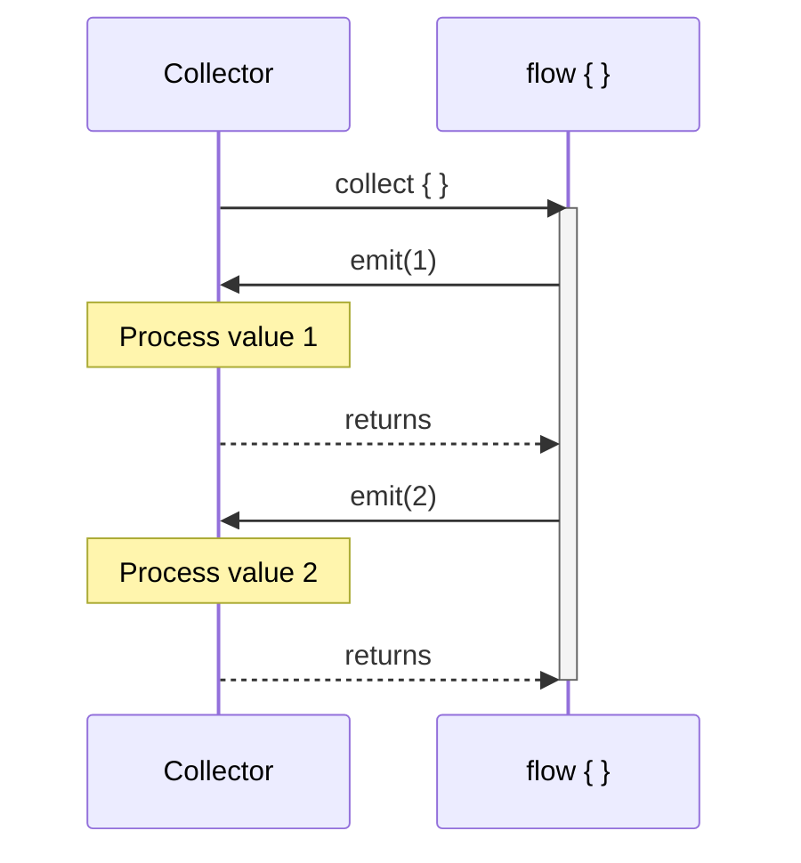
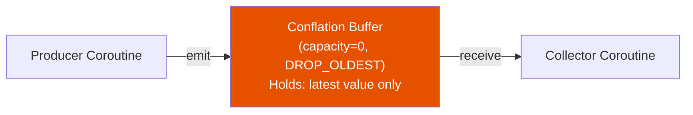
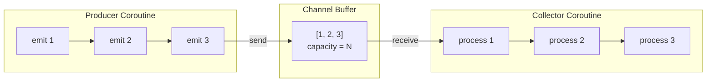
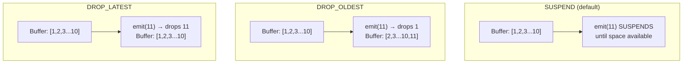
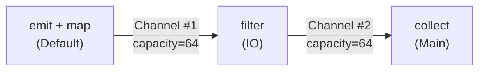
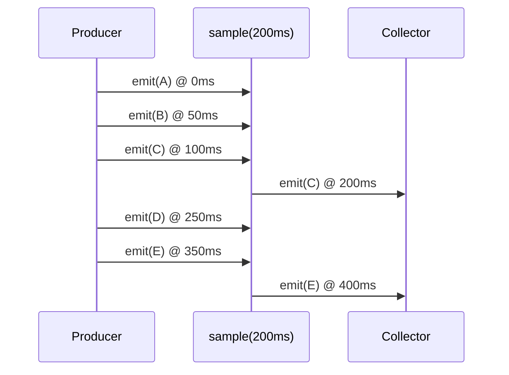

# Flow Deep Dive

Advanced internals of Kotlin Flow — conflation, buffer mechanics, custom operators, and real-world patterns that go beyond the standard API surface.

---

## How Flow Execution Works Internally

A `flow {}` builder creates a `SafeFlow` — a cold stream where the `block` lambda runs **inside the collector's coroutine**. There is no separate producer coroutine by default.



Key insight: `emit()` is a **suspend function** that transfers control to the collector. The producer suspends until the collector finishes processing. This is why a slow collector blocks a fast producer by default.

```kotlin
flow {
    println("Emitting 1 on ${Thread.currentThread().name}")
    emit(1)
    // execution resumes here only after collector processes 1
    println("Emitting 2 on ${Thread.currentThread().name}")
    emit(2)
}.collect { value ->
    println("Collecting $value on ${Thread.currentThread().name}")
    delay(1000)
}
// All prints show the same thread — producer and collector share a coroutine
```

!!! note "Context Preservation"
    Flow enforces **context preservation**: `emit()` must happen in the same `CoroutineContext` as `collect()`. Calling `emit()` from `withContext(Dispatchers.IO)` inside `flow {}` throws `IllegalStateException`. Use `flowOn` or `channelFlow` to change the emission context.

---

## The Conflation Buffer

Conflation is a backpressure strategy where intermediate values are **dropped** so the collector always processes the most recent emission. Understanding how it works internally reveals why it behaves differently from `buffer()` and `collectLatest`.

### How conflate() Works Under the Hood

`conflate()` is syntactic sugar for `buffer(capacity = Channel.CONFLATED)`. Internally, it inserts a **Channel with capacity 0 and `CONFLATED` overflow strategy** between the producer and collector.

```kotlin
// These are equivalent
flow.conflate()
flow.buffer(Channel.CONFLATED)
flow.buffer(0, BufferOverflow.DROP_OLDEST)
```



The buffer decouples producer and collector into **separate coroutines**. When the producer emits faster than the collector processes:

1. The producer emits value `A` → buffer stores `A`
2. Collector picks up `A` and starts processing
3. Producer emits `B` → buffer stores `B` (replaces nothing, buffer was empty)
4. Producer emits `C` → buffer stores `C` (**drops `B`** — `DROP_OLDEST`)
5. Collector finishes `A`, picks up `C` → `B` is gone

```kotlin
flow {
    emit(1); delay(50)
    emit(2); delay(50)   // dropped — collector still processing 1
    emit(3); delay(50)   // dropped — collector still processing 1
    emit(4); delay(50)   // this or 3 survives depending on timing
    emit(5)
}
.conflate()
.collect { value ->
    delay(200)           // slow collector
    println(value)
}
// Typical output: 1, 4, 5 (2 and 3 dropped)
```

### Conflation Slot Mechanics

The conflated channel maintains a single **slot**. The slot transitions through states:

| State | Producer Behavior | Collector Behavior |
|---|---|---|
| **Empty** | `emit()` places value in slot, continues immediately | `receive()` suspends until a value arrives |
| **Full** | `emit()` **overwrites** slot value, continues immediately | `receive()` takes the value, slot becomes empty |

The producer **never suspends** with conflation — it always overwrites and moves on. This is the fundamental difference from a bounded buffer where the producer suspends when full.

### Conflation vs Other Backpressure Strategies

```kotlin
val fastProducer = flow {
    for (i in 1..10) {
        emit(i)
        delay(50)  // produces every 50ms
    }
}

val slowCollector: suspend (Int) -> Unit = { value ->
    delay(200)  // processes every 200ms
    println(value)
}
```

=== "No Buffer (Sequential)"

    Producer suspends on each `emit()` until collector finishes. Total time: ~2000ms.

    ```kotlin
    fastProducer.collect(slowCollector)
    // Output: 1, 2, 3, 4, 5, 6, 7, 8, 9, 10
    // All values processed, but very slow
    ```

=== "buffer()"

    Producer runs ahead, filling the buffer. All values eventually processed.

    ```kotlin
    fastProducer.buffer(64).collect(slowCollector)
    // Output: 1, 2, 3, 4, 5, 6, 7, 8, 9, 10
    // All values processed, faster total time
    ```

=== "conflate()"

    Producer runs ahead, collector skips intermediate values.

    ```kotlin
    fastProducer.conflate().collect(slowCollector)
    // Output: 1, 5, 9, 10 (approximate — timing dependent)
    // Some values dropped, collector always gets latest
    ```

=== "collectLatest"

    Previous collector processing **cancelled** when new value arrives.

    ```kotlin
    fastProducer.collectLatest(slowCollector)
    // Output: 10 (only the last value completes processing)
    // All processing except the last is cancelled
    ```

### When to Choose Conflation

| Scenario | Strategy | Why |
|---|---|---|
| Sensor data (accelerometer, GPS) | `conflate()` | Only the latest reading matters |
| Stock price ticker | `conflate()` | Intermediate prices are stale |
| Search-as-you-type | `collectLatest` | Cancel in-flight search, start new one |
| Log processing | `buffer()` | Every log entry matters |
| Database writes | Sequential (default) | Order and completeness matter |
| UI frame rendering | `conflate()` | Only render the latest state |

---

## Buffer Internals

### How buffer() Creates Concurrency

`buffer()` inserts a `Channel` between producer and collector and launches them in **separate coroutines**. This is the same mechanism `flowOn` uses internally.



```kotlin
// buffer() source is approximately:
public fun <T> Flow<T>.buffer(
    capacity: Int = BUFFERED,
    onBufferOverflow: BufferOverflow = BufferOverflow.SUSPEND
): Flow<T> = channelFlow {
    collect { value -> send(value) }  // producer sends to channel
}.buffer(capacity, onBufferOverflow)   // configures channel params
```

### Buffer Capacity Options

| Capacity | Value | Behavior |
|---|---|---|
| `Channel.RENDEZVOUS` | 0 | No buffer — `send` suspends until `receive` |
| `Channel.BUFFERED` | 64 | Default buffer size (configurable via system property) |
| `Channel.CONFLATED` | -1 | Keep only the latest value |
| `Channel.UNLIMITED` | `Int.MAX_VALUE` | Unbounded — risk of OOM |
| Custom `N` | N | Fixed-size ring buffer |

### Buffer Overflow Strategies

When the buffer is full, three strategies control what happens:

```kotlin
flow.buffer(
    capacity = 10,
    onBufferOverflow = BufferOverflow.DROP_OLDEST  // or SUSPEND, DROP_LATEST
)
```



| Strategy | Producer | Buffer | Use Case |
|---|---|---|---|
| `SUSPEND` | Suspends when full | Preserves all values | Default — lossless |
| `DROP_OLDEST` | Never suspends | Evicts oldest entry | Real-time data (conflation with history) |
| `DROP_LATEST` | Never suspends | Rejects new entry | Rate limiting — keep earliest values |

### flowOn Creates an Implicit Buffer

Every `flowOn` call inserts a `Channel.BUFFERED` (64) channel. Multiple `flowOn` calls stack buffers:

```kotlin
flow {
    emit(compute())           // runs on Default
}
.map { transform(it) }       // runs on Default
.flowOn(Dispatchers.Default)  // ← Channel #1 (64 elements)
.filter { validate(it) }     // runs on IO
.flowOn(Dispatchers.IO)       // ← Channel #2 (64 elements)
.collect { render(it) }      // runs on Main
```



!!! warning "Hidden Buffer Chains"
    Chaining `flowOn` and `buffer` stacks their capacities. A flow with `.buffer(100).flowOn(IO)` has **two** channels — total buffering of 164 elements. Be mindful of memory usage with large objects.

### Fusing Adjacent Buffers

Kotlin Flow **fuses** adjacent buffer operators when possible. If you chain `.buffer(10).buffer(20)`, the result uses the **last** capacity (20), not both:

```kotlin
// Fused — only one channel with capacity 20
flow.buffer(10).buffer(20)

// NOT fused — flowOn creates a context switch boundary
flow.buffer(10).flowOn(Dispatchers.IO).buffer(20)
// Two channels: 10 (IO→current) and 20 (current→collector)
```

---

## Advanced Operators

### scan and runningFold

Accumulate state across emissions. `scan` emits the **initial value** first; `runningFold` is identical.

```kotlin
val clickCount: Flow<Int> = clicks
    .scan(0) { count, _ -> count + 1 }
// Emissions: 0, 1, 2, 3, ... (0 is the initial value)
```

Practical use — building a running list:

```kotlin
val messageHistory: Flow<List<Message>> = incomingMessages
    .scan(emptyList()) { history, newMessage ->
        history + newMessage
    }
```

### sample

Emits the **most recent** value at fixed intervals. Unlike `debounce` (which waits for silence), `sample` emits on a clock.

```kotlin
sensorData
    .sample(100)  // emit the latest value every 100ms
    .collect { updateChart(it) }
```

| Operator | Trigger | Use Case |
|---|---|---|
| `debounce(300)` | 300ms of **silence** after last emission | Search input — wait for user to stop typing |
| `sample(100)` | Every 100ms **regardless** of emission rate | Sensor data — regular UI updates |



### debounce with Custom Timeout

`debounce` accepts a lambda for dynamic timeout based on the value:

```kotlin
searchQuery
    .debounce { query ->
        if (query.length < 3) 500L   // short queries: wait longer
        else 300L                     // longer queries: respond faster
    }
    .flatMapLatest { repository.search(it) }
    .collect { updateResults(it) }
```

### transformWhile

Collect from a flow **until a condition is met**, then cancel:

```kotlin
downloadProgress
    .transformWhile { progress ->
        emit(progress)
        progress < 100  // stop collecting when download completes
    }
    .collect { updateProgressBar(it) }
```

### distinctUntilChangedBy

Skip emissions where a **specific property** hasn't changed:

```kotlin
data class UserState(val name: String, val lastSeen: Long)

userUpdates
    .distinctUntilChangedBy { it.name }  // ignore lastSeen changes
    .collect { updateNameLabel(it.name) }
```

### produceIn

Convert a `Flow` into a `ReceiveChannel` — useful for select expressions:

```kotlin
coroutineScope {
    val userChannel = userFlow.produceIn(this)
    val timeoutChannel = tickerFlow(5000).produceIn(this)

    select {
        userChannel.onReceive { user -> handleUser(user) }
        timeoutChannel.onReceive { handleTimeout() }
    }
}
```

---

## Custom Flow Operators

### Building an Intermediate Operator

Use `transform` — the primitive behind `map`, `filter`, and most operators:

```kotlin
fun <T> Flow<T>.onEvenIndex(): Flow<T> = flow {
    var index = 0
    collect { value ->
        if (index % 2 == 0) emit(value)
        index++
    }
}

flowOf("A", "B", "C", "D", "E")
    .onEvenIndex()
    .collect { print("$it ") }
// Output: A C E
```

### Chunked / Windowed Operator

Batch emissions into fixed-size chunks:

```kotlin
fun <T> Flow<T>.chunked(size: Int): Flow<List<T>> = flow {
    val buffer = mutableListOf<T>()
    collect { value ->
        buffer.add(value)
        if (buffer.size == size) {
            emit(buffer.toList())
            buffer.clear()
        }
    }
    if (buffer.isNotEmpty()) {
        emit(buffer.toList())
    }
}

(1..7).asFlow()
    .chunked(3)
    .collect { println(it) }
// [1, 2, 3]
// [4, 5, 6]
// [7]
```

### Throttle First (Debounce Inverse)

Emit the **first** value in a time window, ignore subsequent ones:

```kotlin
fun <T> Flow<T>.throttleFirst(windowMs: Long): Flow<T> = channelFlow {
    var lastEmissionTime = 0L
    collect { value ->
        val currentTime = System.currentTimeMillis()
        if (currentTime - lastEmissionTime >= windowMs) {
            lastEmissionTime = currentTime
            send(value)
        }
    }
}

buttonClicks
    .throttleFirst(1000)  // ignore rapid clicks for 1 second
    .collect { handleClick() }
```

### Retry with Exponential Backoff

A reusable operator for network requests:

```kotlin
fun <T> Flow<T>.retryWithBackoff(
    maxRetries: Int = 3,
    initialDelayMs: Long = 1000,
    maxDelayMs: Long = 30_000,
    factor: Double = 2.0,
    retryOn: (Throwable) -> Boolean = { it is IOException }
): Flow<T> = retryWhen { cause, attempt ->
    if (attempt >= maxRetries || !retryOn(cause)) false
    else {
        val delayMs = (initialDelayMs * factor.pow(attempt.toInt()))
            .toLong()
            .coerceAtMost(maxDelayMs)
        delay(delayMs)
        true
    }
}

repository.fetchData()
    .retryWithBackoff(maxRetries = 5)
    .catch { emit(CachedData) }
    .collect { render(it) }
```

---

## Practical Patterns

### Pattern 1: Offline-First with Merge

Show cached data immediately, then refresh from the network:

```kotlin
class ArticleRepository(
    private val dao: ArticleDao,
    private val api: ArticleApi
) {
    fun observeArticles(): Flow<List<Article>> = dao.observeAll()
        .onStart {
            // Trigger network refresh as a side effect
            try {
                val fresh = api.getArticles()
                dao.upsertAll(fresh)
            } catch (_: IOException) {
                // Network unavailable — stale cache is fine
            }
        }
}

// ViewModel
val articles: StateFlow<ArticlesUiState> = repository.observeArticles()
    .map { ArticlesUiState.Success(it) as ArticlesUiState }
    .catch { emit(ArticlesUiState.Error(it.message)) }
    .stateIn(viewModelScope, SharingStarted.WhileSubscribed(5_000), ArticlesUiState.Loading)
```

### Pattern 2: Conflated Sensor Pipeline

Process sensor data where only the latest reading matters, but apply transformations:

```kotlin
class SensorViewModel(
    private val sensorManager: SensorRepository
) : ViewModel() {

    val smoothedReading: StateFlow<SensorReading> = sensorManager
        .accelerometerFlow()             // emits at ~100Hz
        .conflate()                      // drop if collector is busy
        .sample(16)                      // ~60fps for UI updates
        .runningFold(SensorReading.ZERO) { prev, raw ->
            // Exponential moving average for smoothing
            SensorReading(
                x = prev.x * 0.8f + raw.x * 0.2f,
                y = prev.y * 0.8f + raw.y * 0.2f,
                z = prev.z * 0.8f + raw.z * 0.2f
            )
        }
        .distinctUntilChanged()
        .stateIn(viewModelScope, SharingStarted.WhileSubscribed(5_000), SensorReading.ZERO)
}
```

### Pattern 3: Pagination with Flow

Emit pages as the user scrolls, accumulating results:

```kotlin
class PaginatedRepository(private val api: Api) {
    fun pagedItems(pageRequests: Flow<Unit>): Flow<List<Item>> {
        var currentPage = 0
        return pageRequests
            .scan(emptyList<Item>()) { accumulated, _ ->
                val newPage = api.getItems(page = currentPage++)
                accumulated + newPage
            }
            .drop(1)  // skip initial empty list emission from scan
    }
}

// ViewModel
private val _loadMore = MutableSharedFlow<Unit>(extraBufferCapacity = 1)

val items: StateFlow<List<Item>> = repository
    .pagedItems(_loadMore)
    .stateIn(viewModelScope, SharingStarted.WhileSubscribed(5_000), emptyList())

fun loadNextPage() { _loadMore.tryEmit(Unit) }
```

### Pattern 4: Multi-Source State Combination

Combine multiple data sources with different update frequencies:

```kotlin
class DashboardViewModel(
    private val userRepo: UserRepository,
    private val orderRepo: OrderRepository,
    private val notificationRepo: NotificationRepository
) : ViewModel() {

    val dashboard: StateFlow<DashboardState> = combine(
        userRepo.observeProfile(),
        orderRepo.observeActiveOrders().conflate(),         // high frequency
        notificationRepo.observeUnreadCount().sample(5000)  // poll every 5s
    ) { profile, orders, unreadCount ->
        DashboardState(
            userName = profile.name,
            activeOrders = orders,
            unreadNotifications = unreadCount
        )
    }
    .distinctUntilChanged()
    .stateIn(viewModelScope, SharingStarted.WhileSubscribed(5_000), DashboardState.EMPTY)
}
```

### Pattern 5: Event Deduplication with Time Window

Deduplicate events that fire in bursts (e.g., connectivity changes):

```kotlin
fun <T> Flow<T>.deduplicateWithin(windowMs: Long): Flow<T> = channelFlow {
    var lastValue: Any? = UNSET
    var lastEmitTime = 0L
    collect { value ->
        val now = System.currentTimeMillis()
        if (value != lastValue || now - lastEmitTime > windowMs) {
            lastValue = value
            lastEmitTime = now
            send(value)
        }
    }
}

private val UNSET = Any()

connectivityFlow()
    .deduplicateWithin(2000)  // ignore duplicate states within 2s
    .collect { state -> handleConnectivity(state) }
```

### Pattern 6: Timeout with Fallback

Emit a fallback if the source doesn't emit within a deadline:

```kotlin
fun <T> Flow<T>.timeoutWithFallback(
    timeoutMs: Long,
    fallback: T
): Flow<T> = channelFlow {
    val timeoutJob = launch {
        delay(timeoutMs)
        send(fallback)
    }
    collect { value ->
        timeoutJob.cancel()
        send(value)
    }
}

repository.fetchProfile()
    .timeoutWithFallback(3000, Profile.CACHED)
    .collect { render(it) }
```

---

## Conflation in SharedFlow and StateFlow

`StateFlow` is inherently conflated — it uses `DROP_OLDEST` with `replay = 1`, and applies `distinctUntilChanged`. Understanding this helps avoid subtle bugs.

### StateFlow Conflation

```kotlin
val state = MutableStateFlow(0)

// Fast updates
launch {
    for (i in 1..1000) {
        state.value = i  // non-suspending, atomic overwrite
    }
}

// Slow collector
state.collect { value ->
    delay(100)
    println(value)
}
// Prints: 0, 1000 (or similar — all intermediate values conflated)
```

### SharedFlow Buffer = Replay + ExtraBufferCapacity

```kotlin
MutableSharedFlow<Int>(
    replay = 1,                    // 1 slot for late subscribers
    extraBufferCapacity = 10,      // 10 additional buffer slots
    onBufferOverflow = DROP_OLDEST // evict oldest when 11 total slots full
)
```

Total buffer = `replay` + `extraBufferCapacity`. When full, the overflow strategy kicks in:

| Config | Total Buffer | Behavior When Full |
|---|---|---|
| `replay=0, extra=0, SUSPEND` | 0 | `emit()` suspends until all collectors receive |
| `replay=1, extra=0, DROP_OLDEST` | 1 | StateFlow behavior — keeps latest |
| `replay=0, extra=64, DROP_OLDEST` | 64 | Event bus — drops old events |
| `replay=5, extra=10, SUSPEND` | 15 | Chat history — suspends producer |

### The subscriptionCount Trap

`SharedFlow.subscriptionCount` lets you react to collector presence, but conflation means you can miss transitions:

```kotlin
val shared = MutableSharedFlow<Event>(extraBufferCapacity = 64)

// This can miss brief subscription count changes
shared.subscriptionCount
    .map { it > 0 }
    .distinctUntilChanged()
    .collect { hasSubscribers ->
        if (hasSubscribers) startProducing()
        else stopProducing()
    }
```

`SharingStarted.WhileSubscribed()` handles this correctly with configurable timeouts — prefer it over manual `subscriptionCount` tracking.

---

## Debugging Flows

### Logging Operator Chain

```kotlin
fun <T> Flow<T>.log(tag: String): Flow<T> = this
    .onStart { println("[$tag] Started") }
    .onEach { println("[$tag] Value: $it") }
    .onCompletion { cause ->
        if (cause == null) println("[$tag] Completed")
        else println("[$tag] Failed: $cause")
    }

repository.observeUsers()
    .log("DB")
    .map { it.filter { u -> u.isActive } }
    .log("FILTER")
    .collect { render(it) }
```

### Detecting Slow Collectors

```kotlin
fun <T> Flow<T>.warnOnSlowCollection(
    thresholdMs: Long = 100,
    tag: String = "Flow"
): Flow<T> = transform { value ->
    val start = System.currentTimeMillis()
    emit(value)
    val elapsed = System.currentTimeMillis() - start
    if (elapsed > thresholdMs) {
        println("⚠️ [$tag] Slow collection: ${elapsed}ms for $value")
    }
}
```

---

??? question "What's the difference between conflate() and buffer(Channel.CONFLATED)?"
    They are identical. `conflate()` is shorthand for `buffer(Channel.CONFLATED)`, which itself is equivalent to `buffer(0, BufferOverflow.DROP_OLDEST)`. All three create a single-slot buffer that overwrites on new emissions.

??? question "Why does my StateFlow skip values even without conflate()?"
    `StateFlow` is **inherently conflated**. It keeps only the latest value and uses `distinctUntilChanged()` internally. If you set `state.value = 1` then immediately `state.value = 2`, a slow collector may only see `2`. This is by design — `StateFlow` represents **current state**, not an event stream. Use `SharedFlow` if you need every emission delivered.

??? question "How many buffers does flowOn create?"
    Each `flowOn` call creates exactly one `Channel.BUFFERED` (capacity 64) channel. If you chain `flowOn(IO).flowOn(Default)`, you get two channels. Adjacent `buffer()` calls fuse into one, but `flowOn` boundaries prevent fusion because they change the coroutine context.

??? question "When should I use sample() vs debounce()?"
    `debounce(ms)` waits for the emission stream to go **quiet** for `ms` milliseconds — ideal for user input where you want to wait for them to stop typing. `sample(ms)` emits the latest value at **regular intervals** regardless of emission rate — ideal for continuous data (sensors, stock prices) where you want predictable UI update frequency.

??? question "Can conflation lose the last emitted value?"
    No. The last emitted value is always delivered. Conflation only drops **intermediate** values — those emitted while the collector is busy processing a previous value. Once the collector is ready, it picks up whatever is in the buffer slot (the most recent emission).

??? question "How do I build a custom operator that respects cancellation?"
    Use `flow { collect { ... emit(...) } }` for simple transforms, or `channelFlow { ... }` when you need concurrent emissions. Both respect structured concurrency — they cancel when the downstream collector cancels. Avoid `GlobalScope` or unstructured coroutines inside operators.

??? question "What happens if I conflate() a flow that's already using buffer()?"
    The operators fuse. `buffer(100).conflate()` becomes a conflated buffer (latest value only). The last operator in the chain wins for overflow strategy. To maintain a buffer with a conflation fallback, use `buffer(capacity = 100, onBufferOverflow = BufferOverflow.DROP_OLDEST)` explicitly.

!!! tip "Further Reading"
    - [Kotlin Flow Internals — Roman Elizarov](https://elizarov.medium.com/kotlin-flows-and-coroutines-256260fb3bdb)
    - [Reactive Streams and Kotlin Flows — KotlinConf](https://kotlinconf.com)
    - [StateFlow Design Document — Kotlin GitHub](https://github.com/Kotlin/kotlinx.coroutines/blob/master/kotlinx-coroutines-core/common/src/flow/StateFlow.kt)
    - [Flow Operators API Reference — kotlinx.coroutines](https://kotlinlang.org/api/kotlinx.coroutines/kotlinx-coroutines-core/kotlinx.coroutines.flow/)
