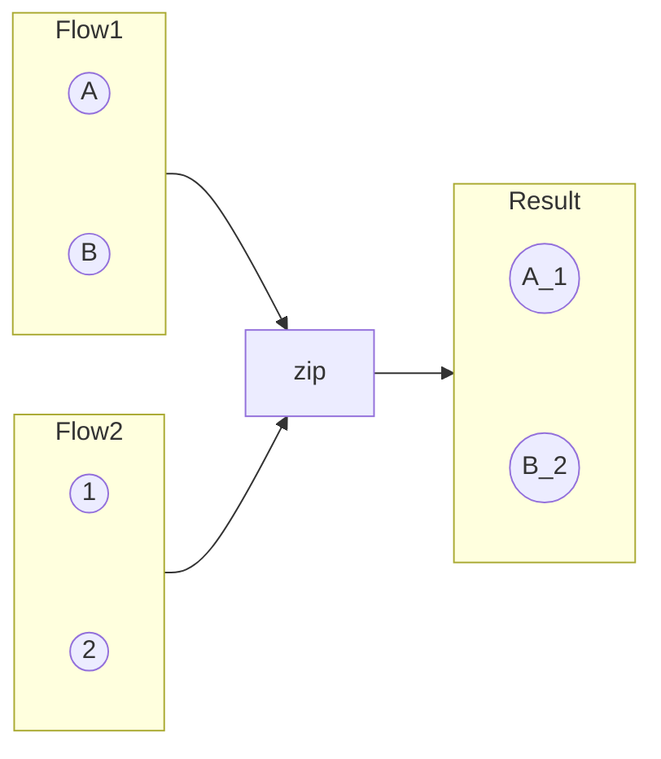
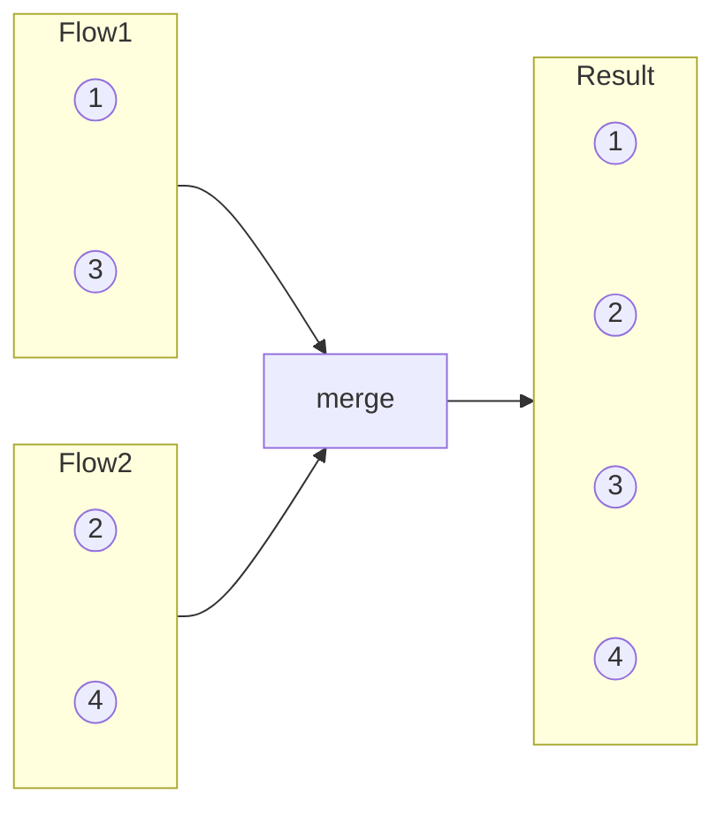
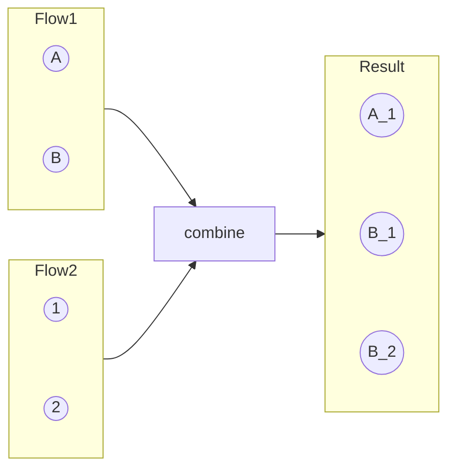

# Kotlin Flow

---

## Flow API Overview

Asynchronous data stream built on coroutines. Three components:

1. **Flow Builder** — creates the stream (`flow {}`, `flowOf()`, `asFlow()`, `channelFlow {}`, `callbackFlow {}`)
2. **Intermediate Operators** — transform the stream (`map`, `filter`, `flatMapLatest`, `flowOn`, etc.)
3. **Terminal Operator** — starts collection and consumes values (`collect`, `toList()`, `first()`, `reduce()`, `launchIn`)

```kotlin
flow {
    emit(1)
    emit(2)
    emit(3)
}
.filter { it > 1 }       // intermediate
.map { it * 10 }         // intermediate
.collect { println(it) }  // terminal — triggers execution
// Output: 20, 30
```

!!! note "Flows are cold"
    Nothing happens until a terminal operator is called. Each collector gets its own independent execution of the flow.

---

## Cold vs Hot Flow

| Feature | Cold Flow | Hot Flow |
|---|---|---|
| Emission | Only when collected | Independent of collectors |
| Mapping | 1:1 (each collector triggers a new execution) | 1:N (multiple collectors share emissions) |
| Data storage | No stored state | Can store latest value |
| Lifecycle | Starts on collect, ends on completion | Exists independently |
| Examples | `flow {}`, `flowOf()` | `StateFlow`, `SharedFlow` |

---

## Flow Builders

### flow {}

The standard builder. Sequential — only one coroutine, cannot call `emit()` from a different context.

```kotlin
fun userStream(): Flow<User> = flow {
    val users = api.getUsers()  // suspend call
    users.forEach { emit(it) }
}
```

### channelFlow {}

Allows **concurrent emissions** from multiple coroutines using a `Channel` under the hood.

```kotlin
fun mergedData(): Flow<Data> = channelFlow {
    // Launch concurrent producers
    launch { api.getLocalData().forEach { send(it) } }
    launch { api.getRemoteData().forEach { send(it) } }
}
```

!!! tip "flow vs channelFlow"
    Use `flow {}` for sequential emission (most cases). Use `channelFlow {}` when you need to emit from multiple coroutines concurrently. `callbackFlow {}` is a specialized `channelFlow` for callback-based APIs.

### callbackFlow {}

Wraps callback-based APIs into a Flow. Uses a `Channel` internally.

```kotlin
fun observeLocationUpdates(): Flow<Location> = callbackFlow {
    val callback = object : LocationCallback() {
        override fun onLocationResult(result: LocationResult) {
            trySend(result.lastLocation)
        }
    }
    locationClient.requestLocationUpdates(request, callback, Looper.getMainLooper())
    awaitClose {
        locationClient.removeLocationUpdates(callback)
    }
}
```

---

## Flow Combination Operators

### Zip

Pairs emissions from two flows **1:1**. Limited to the shorter flow.



```kotlin
val names = flowOf("Alice", "Bob", "Charlie")
val ages = flowOf(30, 25)

names.zip(ages) { name, age -> "$name: $age" }
    .collect { println(it) }
// Alice: 30
// Bob: 25
// (Charlie is dropped — ages flow completed)
```

### Merge

Merges flows into one, collecting values **as they arrive**. Order depends on emission timing.



```kotlin
val localData = flowOf("cached_user").onEach { delay(50) }
val remoteData = flowOf("fresh_user").onEach { delay(200) }

merge(localData, remoteData).collect { println(it) }
// cached_user (50ms)
// fresh_user (200ms)
```

### Combine

Pairs each new emission with the **latest value** from all other flows. Emits whenever **any** flow emits.



```kotlin
val searchQuery = queryFlow()       // user typing
val filterOption = filterFlow()     // user selecting filter

combine(searchQuery, filterOption) { query, filter ->
    SearchParams(query, filter)
}.flatMapLatest { params ->
    repository.search(params)
}.collect { results -> updateUI(results) }
```

!!! tip "When to use which"
    - **zip**: Both flows produce paired data (e.g., question + answer)
    - **merge**: Interleave events from multiple sources (e.g., cache + network)
    - **combine**: React to the latest state from multiple sources (e.g., search + filters)

---

## FlatMap Operators

Transform each emission into a new flow, then flatten.

```kotlin
val source = flow {
    emit("A"); delay(100)
    emit("B"); delay(100)
    emit("C")
}

fun innerFlow(value: String) = flow {
    delay(100); emit("1_$value")
    delay(100); emit("2_$value")
    delay(100); emit("3_$value")
}
```

=== "flatMapConcat"

    **Sequential.** Waits for each inner flow to complete before starting the next.

    ```kotlin
    source.flatMapConcat { innerFlow(it) }.collect { print("$it, ") }
    // 1_A, 2_A, 3_A, 1_B, 2_B, 3_B, 1_C, 2_C, 3_C
    ```

=== "flatMapMerge"

    **Concurrent** (default concurrency = 16). Collects all inner flows concurrently.

    ```kotlin
    source.flatMapMerge { innerFlow(it) }.collect { print("$it, ") }
    // 1_A, 1_B, 1_C, 2_A, 2_B, 2_C, 3_A, 3_B, 3_C
    ```

=== "flatMapLatest"

    **Cancels previous** inner flow when a new emission arrives from the source.

    ```kotlin
    source.flatMapLatest { innerFlow(it) }.collect { print("$it, ") }
    // 1_C, 2_C, 3_C (A and B inner flows were cancelled)
    ```

### transformLatest

Like `flatMapLatest` but gives more control — you can emit multiple values and perform more complex transformations.

```kotlin
searchQuery.transformLatest { query ->
    emit(SearchState.Loading)
    val results = api.search(query)
    emit(SearchState.Success(results))
}.collect { state -> updateUI(state) }
```

---

## Collect vs CollectLatest

```kotlin
flow {
    emit(1); delay(100)
    emit(2); delay(100)
    emit(3)
}

// collect — processes every value sequentially
.collect { value ->
    delay(200) // slow processing
    println(value)
}
// Output: 1, 2, 3 (takes 600ms+ total)

// collectLatest — cancels previous processing when new value arrives
.collectLatest { value ->
    delay(200) // slow processing
    println(value)
}
// Output: 3 (only the last value completes processing)
```

---

## Map vs FlatMap

| | `map` | `flatMapConcat` / `flatMapLatest` / `flatMapMerge` |
|---|---|---|
| Returns | Transformed value | A new `Flow` |
| Use case | Synchronous transformation | Async operation per emission (e.g., network call) |

```kotlin
// map — transform each value
flowOf(1, 2, 3).map { it * 2 } // 2, 4, 6

// flatMapLatest — each value triggers a new async operation
searchQuery.flatMapLatest { query ->
    flow { emit(api.search(query)) }
}
```

---

## Buffering and Backpressure

### Default Behavior (Sequential)

By default, `emit()` **suspends** until the collector processes the current value. The producer and collector run in the same coroutine.

```kotlin
flow {
    emit(1)  // suspends until collector processes 1
    emit(2)  // suspends until collector processes 2
}
.collect { value ->
    delay(1000) // slow processing
    println(value)
}
// Total time: ~2000ms (sequential)
```

### buffer()

Adds a `Channel` between producer and collector, allowing them to run concurrently.

```kotlin
flow {
    emit(1)  // doesn't wait for collector
    emit(2)  // producer runs ahead
    emit(3)
}
.buffer()  // default: unlimited buffer (Channel.BUFFERED = 64)
.collect { value ->
    delay(1000)
    println(value)
}
// Total time: ~1000ms (producer fills buffer while collector processes)
```

```kotlin
// Specify buffer capacity
.buffer(capacity = 10)
.buffer(capacity = Channel.CONFLATED) // keep only latest
.buffer(capacity = Channel.UNLIMITED) // unbounded
```

### conflate()

Like `buffer()` but **drops intermediate values** — the collector always gets the most recent emission.

```kotlin
flow {
    emit(1); delay(100)
    emit(2); delay(100)
    emit(3); delay(100)
}
.conflate()
.collect { value ->
    delay(300) // slow collector
    println(value)
}
// Output: 1, 3 (2 was dropped because collector was busy)
```

!!! tip "buffer vs conflate vs collectLatest"
    - **buffer()**: Process all values, but don't block the producer
    - **conflate()**: Skip intermediate values, collector always gets the latest
    - **collectLatest**: Cancel in-progress processing when a new value arrives

---

## Thread Switching: flowOn vs launchIn

### flowOn

Changes the **upstream** context (everything before `flowOn` in the chain). Does NOT affect downstream.

```kotlin
flow {
    emit(heavyComputation())  // runs on Default
}
.map { transform(it) }        // runs on Default
.flowOn(Dispatchers.Default)   // affects everything above
.collect { updateUI(it) }     // runs on the collector's context (e.g., Main)
```

!!! warning "flowOn changes UPSTREAM only"
    `flowOn` affects operators **above** it in the chain. The collector always runs in the coroutine context where `collect` was called. Multiple `flowOn` calls create multiple channels.

### launchIn

A terminal operator that collects the flow in a given scope. Returns a `Job` for cancellation.

```kotlin
// Instead of:
scope.launch {
    flow.collect { /* ... */ }
}

// You can write:
flow
    .onEach { /* process */ }
    .launchIn(scope)  // returns Job
```

```kotlin
// Useful for launching multiple flow collections
val job1 = userFlow.onEach { updateUser(it) }.launchIn(viewModelScope)
val job2 = settingsFlow.onEach { updateSettings(it) }.launchIn(viewModelScope)

// Cancel a specific collection
job1.cancel()
```

---

## Lifecycle Operators

### onStart

Runs **before** the flow starts emitting. Can emit initial values.

```kotlin
repository.observeUsers()
    .onStart {
        emit(emptyList())  // emit a loading/default state
        // or: emit(cachedUsers)
    }
    .collect { users -> updateUI(users) }
```

### onCompletion

Runs when the flow completes (normally or exceptionally).

```kotlin
flow
    .onCompletion { cause ->
        if (cause == null) println("Completed normally")
        else println("Completed with error: $cause")
    }
    .collect { /* ... */ }
```

### onEmpty

Runs if the flow completes **without emitting any values**.

```kotlin
repository.searchUsers(query)
    .onEmpty {
        emit(emptyList()) // provide a default
    }
    .collect { users ->
        if (users.isEmpty()) showEmptyState()
        else showUsers(users)
    }
```

### onEach

Side-effect operator — runs a block for each emission without modifying the flow.

```kotlin
repository.getUsers()
    .onEach { log("Received ${it.size} users") }
    .collect { /* ... */ }
```

---

## Terminal Operators

Terminal operators **start** the flow collection.

| Operator | Returns | Description |
|---|---|---|
| `collect {}` | `Unit` | Process each value |
| `collectLatest {}` | `Unit` | Cancel previous processing on new value |
| `toList()` | `List<T>` | Collect all values into a list |
| `toSet()` | `Set<T>` | Collect all values into a set |
| `first()` | `T` | First emission (throws if empty) |
| `firstOrNull()` | `T?` | First emission or null |
| `single()` | `T` | Exactly one emission (throws otherwise) |
| `reduce { acc, v -> }` | `T` | Accumulate from first value |
| `fold(initial) { acc, v -> }` | `R` | Accumulate from initial value |
| `launchIn(scope)` | `Job` | Collect in a scope, return Job |
| `stateIn(scope)` | `StateFlow<T>` | Convert to StateFlow |
| `shareIn(scope)` | `SharedFlow<T>` | Convert to SharedFlow |

```kotlin
(1..5).asFlow().reduce { acc, value -> acc + value } // 15
(1..5).asFlow().fold(100) { acc, value -> acc + value } // 115
```

---

## StateFlow vs SharedFlow

Both are **hot** flows that exist independently of collectors.

### StateFlow

Always holds the **current value**. Emits only **distinct** values (skips duplicates via `Any.equals()`).

```kotlin
class UserViewModel : ViewModel() {
    private val _uiState = MutableStateFlow(UiState.Loading)
    val uiState: StateFlow<UiState> = _uiState.asStateFlow()

    fun loadUser() {
        viewModelScope.launch {
            _uiState.value = UiState.Loading
            try {
                val user = repository.getUser()
                _uiState.value = UiState.Success(user)
            } catch (e: Exception) {
                _uiState.value = UiState.Error(e.message)
            }
        }
    }
}
```

!!! warning "equals() matters"
    StateFlow uses `Any.equals()` for `distinctUntilChanged`. If your data class has a property that changes but isn't in the `equals()` (e.g., a `var` outside the constructor), StateFlow won't emit the update. Always use data class constructor properties for state.

### SharedFlow

Configurable replay, no initial value required, emits all values (no distinctUntilChanged).

```kotlin
class EventBus {
    private val _events = MutableSharedFlow<Event>(
        replay = 0,                               // no replay to new collectors
        extraBufferCapacity = 64,                  // buffer for slow collectors
        onBufferOverflow = BufferOverflow.DROP_OLDEST // drop old if buffer full
    )
    val events: SharedFlow<Event> = _events.asSharedFlow()

    suspend fun emit(event: Event) {
        _events.emit(event)
    }
}
```

### SharedFlow Buffer Overflow Strategies

| Strategy | Behavior |
|---|---|
| `BufferOverflow.SUSPEND` | Default. `emit()` suspends when buffer is full |
| `BufferOverflow.DROP_OLDEST` | Drops the oldest value in the buffer |
| `BufferOverflow.DROP_LATEST` | Drops the newest value being emitted |

### Comparison

| Feature | `StateFlow` | `SharedFlow` |
|---|---|---|
| Initial value | Required | Not required |
| `.value` property | Yes | No |
| Replay | Always 1 (latest) | Configurable (0, 1, N) |
| Distinct only | Yes (`equals()`) | No (emits all) |
| Buffer overflow | `DROP_OLDEST` (fixed) | Configurable |
| Use case | UI state | Events, notifications |

??? example "StateFlow is a specialized SharedFlow"

    A `StateFlow` is equivalent to:

    ```kotlin
    MutableSharedFlow(
        replay = 1,
        onBufferOverflow = BufferOverflow.DROP_OLDEST
    ).apply {
        tryEmit(initialValue) // initial value
    }.distinctUntilChanged()  // skip duplicates
    ```

### Converting Cold Flow to Hot Flow

```kotlin
// stateIn — convert to StateFlow
val uiState: StateFlow<UiState> = repository.observeData()
    .map { data -> UiState.Success(data) }
    .stateIn(
        scope = viewModelScope,
        started = SharingStarted.WhileSubscribed(5000), // keep alive 5s after last collector
        initialValue = UiState.Loading
    )

// shareIn — convert to SharedFlow
val events: SharedFlow<Event> = repository.observeEvents()
    .shareIn(
        scope = viewModelScope,
        started = SharingStarted.Lazily, // start on first collector
        replay = 1
    )
```

| SharingStarted | Behavior |
|---|---|
| `Eagerly` | Start immediately, never stop |
| `Lazily` | Start on first collector, never stop |
| `WhileSubscribed(stopTimeout, replayExpiration)` | Start on first collector, stop after last collector leaves + timeout |

!!! note "StateFlow vs LiveData"
    `StateFlow` is similar to `LiveData` but without lifecycle awareness. Use `repeatOnLifecycle` or `collectAsStateWithLifecycle()` to make it lifecycle-aware. StateFlow also requires an initial value and uses `equals()` for distinct filtering.

---

## .emit vs .value

| | `StateFlow.value` | `MutableSharedFlow.emit()` |
|---|---|---|
| Suspension | Non-suspending (synchronous) | Suspending (can wait for buffer space) |
| Thread safety | Atomic read/write | Suspends until delivered |
| Use case | Read/write current state | Emit to collectors |

```kotlin
// StateFlow — use .value for synchronous update
_uiState.value = UiState.Loading

// SharedFlow — use emit() (suspending) or tryEmit() (non-suspending)
_events.emit(Event.Navigate("home"))  // suspends if buffer full
_events.tryEmit(Event.Navigate("home"))  // returns false if buffer full
```

---

## Retry Operators

### retryWhen

Full control over retry logic with cause and attempt number:

```kotlin
repository.fetchData()
    .retryWhen { cause, attempt ->
        if (cause is IOException && attempt < 3) {
            delay(2000L * (attempt + 1)) // exponential backoff
            true  // retry
        } else {
            false // give up
        }
    }
    .collect { /* ... */ }
```

### retry

Simplified retry with a count:

```kotlin
repository.fetchData()
    .retry(retries = 3) { cause ->
        cause is IOException  // only retry on IO errors
    }
    .collect { /* ... */ }
```

---

## Exception Handling

### catch operator

Catches upstream exceptions. Can emit fallback values or rethrow.

```kotlin
repository.getUsers()
    .catch { e ->
        emit(emptyList())  // emit fallback
        // or: throw e     // rethrow
        // or: emitAll(fallbackFlow)  // switch to backup flow
    }
    .collect { users -> updateUI(users) }
```

!!! warning "catch only catches UPSTREAM"
    The `catch` operator only catches exceptions from operators **above** it. Exceptions in `collect {}` are not caught.

    ```kotlin
    flow
        .catch { /* catches errors from flow builder and operators above */ }
        .collect { throw Exception("not caught by catch!") }
    ```

### onCompletion

Called on flow completion (normal or exceptional). Can observe the cause but should NOT handle it — use `catch` for that.

```kotlin
flow
    .onCompletion { cause ->
        if (cause != null) hideProgressBar()
    }
    .catch { e -> showError(e) }
    .collect { /* ... */ }
```

### Error Handling in Zip

Add individual `catch` with `emitAll` to prevent one flow's error from killing the entire zip:

```kotlin
val usersFlow = flow { emit(api.getUsers()) }
    .catch { emitAll(flowOf(emptyList())) }
val postsFlow = flow { emit(api.getPosts()) }
    .catch { emitAll(flowOf(emptyList())) }

usersFlow.zip(postsFlow) { users, posts ->
    CombinedData(users, posts)
}.collect { data -> updateUI(data) }
```

---

## Retrofit/Room with Flow

```kotlin
// Retrofit — suspend functions wrapped in flow
interface ApiService {
    @GET("users")
    suspend fun getUsers(): List<User>
}

fun getUsers(): Flow<List<User>> = flow {
    emit(apiService.getUsers())
}

// Room — returns Flow directly (reactive queries)
@Dao
interface UserDao {
    @Query("SELECT * FROM users")
    fun observeUsers(): Flow<List<User>>  // emits on every DB change

    @Query("SELECT * FROM users WHERE id = :id")
    fun observeUser(id: String): Flow<User?>
}
```

```kotlin
// ViewModel collecting pattern
class UserViewModel(
    private val userDao: UserDao,
    private val api: ApiService
) : ViewModel() {

    val users: StateFlow<List<User>> = userDao.observeUsers()
        .stateIn(viewModelScope, SharingStarted.WhileSubscribed(5000), emptyList())

    fun refresh() {
        viewModelScope.launch {
            val freshUsers = api.getUsers()
            userDao.insertAll(freshUsers)
            // Room Flow will automatically emit the new data
        }
    }
}
```

---

## Collecting Flows Safely in Android

```kotlin
// WRONG — collects even when app is in background (wasted resources, potential crashes)
lifecycleScope.launch {
    viewModel.uiState.collect { updateUI(it) }
}

// RIGHT — stops/restarts collection based on lifecycle
lifecycleScope.launch {
    repeatOnLifecycle(Lifecycle.State.STARTED) {
        viewModel.uiState.collect { updateUI(it) }
    }
}

// Alternative for a single flow — flowWithLifecycle
lifecycleScope.launch {
    viewModel.uiState
        .flowWithLifecycle(lifecycle, Lifecycle.State.STARTED)
        .collect { updateUI(it) }
}

// In Compose — one-liner
@Composable
fun UserScreen(viewModel: UserViewModel) {
    val state by viewModel.uiState.collectAsStateWithLifecycle()
}
```

!!! warning "When this bites you"
    Without `repeatOnLifecycle`, a Flow collecting location updates keeps the GPS active when the app is backgrounded — drains battery and may trigger ANRs. Always use lifecycle-aware collection.

!!! tip "flowWithLifecycle vs repeatOnLifecycle"
    Use `flowWithLifecycle` when collecting a **single flow** (simpler syntax). Use `repeatOnLifecycle` when collecting **multiple flows** (launch multiple coroutines inside the block).

    ```kotlin
    lifecycleScope.launch {
        repeatOnLifecycle(Lifecycle.State.STARTED) {
            launch { viewModel.uiState.collect { /* ... */ } }
            launch { viewModel.events.collect { /* ... */ } }
        }
    }
    ```

---

## Instant Search using Flow

```kotlin
private val searchQuery = MutableStateFlow("")

val searchResults: StateFlow<SearchState> = searchQuery
    .debounce(300)                       // wait 300ms after user stops typing
    .filter { it.isNotBlank() }          // skip empty queries
    .distinctUntilChanged()              // skip if query hasn't changed
    .flatMapLatest { query ->            // cancel previous search, start new
        flow {
            emit(SearchState.Loading)
            emit(SearchState.Success(api.search(query)))
        }.catch { emit(SearchState.Error(it)) }
    }
    .stateIn(viewModelScope, SharingStarted.WhileSubscribed(5000), SearchState.Idle)
```

| Operator | Role |
|---|---|
| `debounce(300)` | Wait 300ms after user stops typing |
| `filter` | Skip blank/empty queries |
| `distinctUntilChanged` | Skip if query hasn't changed |
| `flatMapLatest` | Cancel previous search, start new one |
| `catch` | Handle network errors per-search |

---

## Flow vs Channel: When to Use What

| | Flow | Channel |
|---|---|---|
| Pattern | **Stream** of values | **Queue** of values |
| Temperature | Cold (by default) or Hot (StateFlow/SharedFlow) | Hot |
| Consumers | Multiple (shared via hot flows) | Single (consumed once, fan-out with multiple) |
| Backpressure | Built-in (suspends emit) | Built-in (suspends send) |
| Cancellation | Structured (tied to collector) | Must close explicitly |
| Use case | UI state, data streams, reactive queries | One-shot events, producer-consumer |

!!! tip "Practical guidance"
    Use `StateFlow` for **UI state**. Use `Channel` (wrapped in `receiveAsFlow()`) for **one-time events** like "show snackbar" or "navigate to screen." Using `SharedFlow(replay=0)` for events risks losing events during configuration changes.

```kotlin
class MyViewModel : ViewModel() {
    // State — use StateFlow
    private val _uiState = MutableStateFlow(UiState.Initial)
    val uiState: StateFlow<UiState> = _uiState.asStateFlow()

    // Events — use Channel
    private val _events = Channel<UiEvent>(Channel.BUFFERED)
    val events: Flow<UiEvent> = _events.receiveAsFlow()

    fun onButtonClick() {
        _events.trySend(UiEvent.ShowSnackbar("Saved!"))
    }
}
```

---

## Channels

Hot stream with FIFO ordering. Each value is delivered to exactly one consumer (fan-out pattern).

```kotlin
val channel = Channel<Int>(capacity = Channel.BUFFERED)

// Producer
launch {
    for (i in 1..5) channel.send(i)
    channel.close()
}

// Consumer
launch {
    for (value in channel) {
        println(value) // 1, 2, 3, 4, 5
    }
}
```

### Channel Capacity

| Capacity | Behavior |
|---|---|
| `Channel.RENDEZVOUS` (0) | Default. `send` suspends until `receive` is called |
| `Channel.BUFFERED` (64) | Buffer up to 64 elements |
| `Channel.CONFLATED` | Keep only the latest element |
| `Channel.UNLIMITED` | Unbounded buffer (risk of OOM) |

---

## Interview Q&A

??? question "What is the difference between a cold flow and a hot flow?"
    A cold flow does not produce values until it is collected, and each collector triggers an independent execution. Hot flows (`StateFlow`, `SharedFlow`) emit values regardless of whether anyone is collecting. `StateFlow` always holds the latest value, while `SharedFlow` supports configurable replay and buffering.

??? question "How do `StateFlow` and `SharedFlow` differ, and when would you use each?"
    `StateFlow` requires an initial value, always holds the current value via `.value`, and skips duplicate emissions using `equals()`. `SharedFlow` has no initial value, configurable replay, and emits all values including duplicates. Use `StateFlow` for UI state and `SharedFlow` for one-shot events or notifications.

??? question "What does `flowOn` do and how does it differ from `launchIn`?"
    `flowOn` changes the dispatcher for all upstream operators (everything above it in the chain) but does not affect the collector. `launchIn` is a terminal operator that launches the flow collection in a given scope, returning a `Job`. They serve different purposes: `flowOn` controls where emissions happen, `launchIn` controls where and when collection starts.

??? question "How do you safely collect flows in an Android Activity or Fragment?"
    Use `repeatOnLifecycle` inside `lifecycleScope.launch` to start and stop collection based on the lifecycle state. This prevents wasted resources (like active GPS listeners) when the app is in the background. In Compose, use `collectAsStateWithLifecycle()`.

??? question "Explain the difference between `flatMapLatest`, `flatMapConcat`, and `flatMapMerge`."
    `flatMapConcat` processes inner flows sequentially, waiting for each to complete before starting the next. `flatMapMerge` collects all inner flows concurrently (default concurrency of 16). `flatMapLatest` cancels the previous inner flow whenever a new emission arrives from the source -- ideal for search-as-you-type scenarios.

??? question "What is the `catch` operator's limitation?"
    The `catch` operator only catches exceptions from operators upstream of it in the flow chain. Exceptions thrown inside the `collect` block are not caught by `catch`. To handle collector errors, use a `try-catch` around the `collect` call itself.

!!! tip "Further Reading"
    - [Kotlin Flow Documentation](https://kotlinlang.org/docs/flow.html) -- official guide covering cold flows, operators, and context
    - [StateFlow and SharedFlow](https://kotlinlang.org/docs/stateflow-and-sharedflow.html) -- official reference for hot flows
    - [Collect Flows on Android](https://developer.android.com/kotlin/flow/stateflow-and-sharedflow) -- lifecycle-aware collection patterns
    - [A Safer Way to Collect Flows](https://medium.com/androiddevelopers/a-safer-way-to-collect-flows-from-android-uis-23080b1f8bda) -- Manuel Vivo's guide on repeatOnLifecycle
    - [Things to Know About Flow's shareIn and stateIn](https://medium.com/androiddevelopers/things-to-know-about-flows-sharein-and-statein-operators-20e6ccb2bc74) -- hot flow conversion best practices
