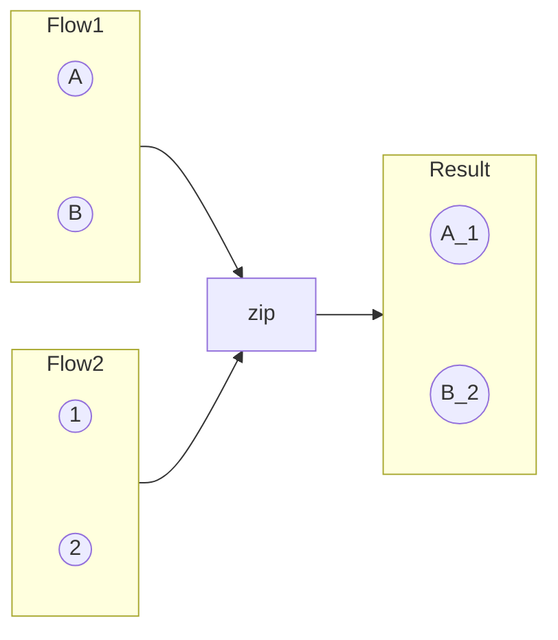
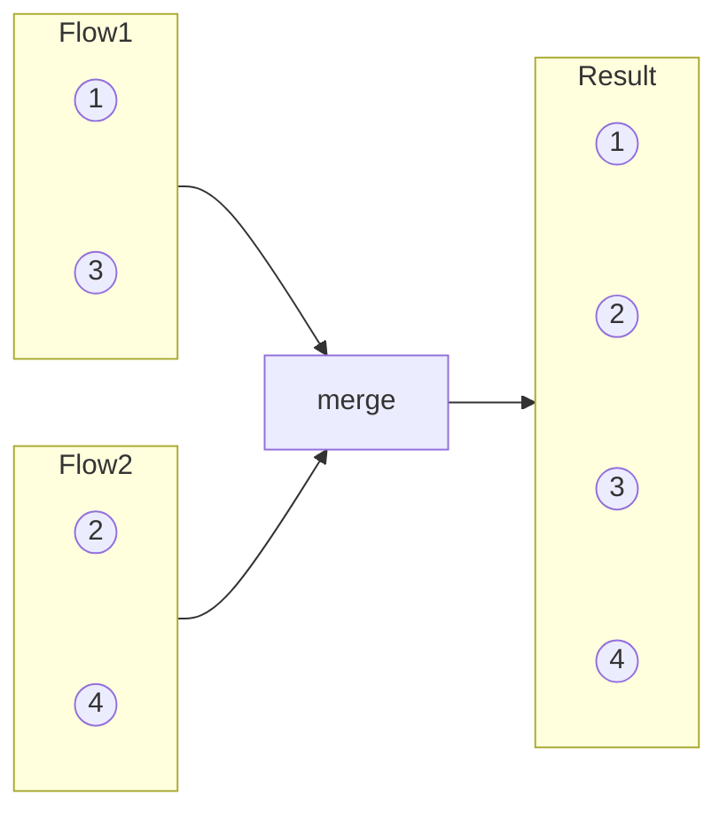
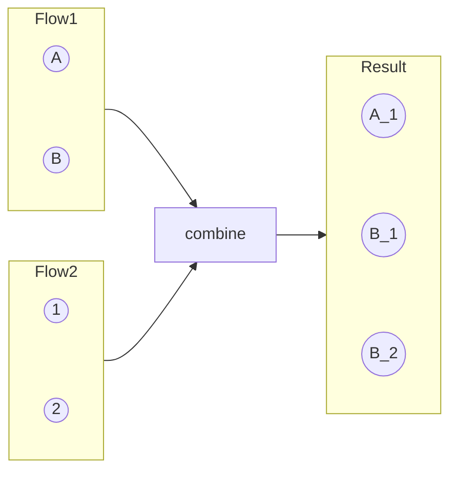

# Kotlin Flow

---

## Flow Combination Operators

### Zip

Runs flows in parallel, emits each pair, limited to the minimum number of emissions.



**Real Android Use Case:**

```kotlin
viewModelScope.launch {
    apiHelper.getUsers()
        .zip(apiHelper.getMoreUsers()) { usersFromApi, moreUsersFromApi ->
            val allUsers = mutableListOf<User>()
            allUsers.addAll(usersFromApi)
            allUsers.addAll(moreUsersFromApi)
            allUsers
        }
        .collect { allUsers ->
            // use allUsers
        }
}
```

### Merge

Merges flows together, works in parallel, collects values as they are emitted.



### Combine

Like zip but pairs each emission with the **last emitted value** of other flows. Doesn't close until all flows have emitted.



---

## FlatMap Operators

```kotlin
flow {
    emit("A")
    emit("B")
    emit("C")
}.flatMapLatest {
    flow {
        delay(100); emit("1_$it")
        delay(100); emit("2_$it")
        delay(100); emit("3_$it")
    }
}.collect { print("$it, ") }
```

=== "FlatMapConcat"

    **Sequential.** Waits for each inner flow to complete before starting the next.

    Output: `1_A, 2_A, 3_A, 1_B, 2_B, 3_B, 1_C, 2_C, 3_C`

=== "FlatMapMerge"

    **Concurrent** (default concurrency 16). Collects all inner flows concurrently.

    Output: `1_A, 1_B, 1_C, 2_A, 2_B, 2_C, 3_A, 3_B, 3_C`

=== "FlatMapLatest"

    **Cancels previous** inner flow on each new emission.

    Output: `1_C, 2_C, 3_C`

---

## Collect vs CollectLatest

- **collect**: Gets all values sequentially.
- **collectLatest**: Cancels the previous collection block when a new value is emitted.

---

## Map vs FlatMap

- **map**: Returns an object after transformation.
- **flatmap**: Returns a flow (can make network calls inside).

---

## Flow API

Asynchronous data stream with three components:

1. **Flow Builder**: `flowOf()`, `asFlow()`, `flow{}`, `channelFlow{}`
2. **Operator**: e.g., `flowOn` for thread switching
3. **Collector**: Terminal operation that starts the flow

---

## Terminal Operators

Terminal operators **start** the flow. The most common is `collect`.

```kotlin
(1..5).asFlow().reduce { a, b -> a + b } // returns 15
```

---

## Cold vs Hot Flow

| Feature | Cold Flow | Hot Flow |
|---|---|---|
| Emission | Emits only when collected | Emits even without collector |
| Mapping | 1:1 (one collector per flow) | 1:N (multiple collectors) |
| Data storage | Cannot store data | Can store data |
| Examples | `flow {}` | `StateFlow`, `SharedFlow` |

---

## StateFlow vs SharedFlow

Both are **hot** flows.

| Feature | `StateFlow` | `SharedFlow` |
|---|---|---|
| Initial value | Required | Not required |
| Creation | `MutableStateFlow(0)` | `MutableSharedFlow<Int>()` |
| Replay | Last known value only | Configurable replay |
| `.value` property | Yes | No |
| Distinct emissions | Yes (emits distinct only) | No (emits all) |

!!! note "StateFlow vs LiveData"
    `StateFlow` is similar to `LiveData` minus lifecycle awareness. Use `repeatOnLifecycle` to make it lifecycle-aware.

??? example "Creating StateFlow from SharedFlow"

    A `StateFlow` is essentially a `SharedFlow` with:

    - `replay(1)`
    - `onBufferOverflow(DROP_OLDEST)`
    - Initial emit
    - `distinctUntilChanged()`

---

## Retry Operators

### retryWhen

Checks the cause and attempt number:

```kotlin
flow {
    emit(apiHelper.getUsers())
}.retryWhen { cause, attempt ->
    if (cause is IOException && attempt < 3) {
        delay(2000)
        true
    } else {
        false
    }
}
```

### retry

Retries N times:

```kotlin
flow {
    emit(apiHelper.getUsers())
}.retry(retries = 3) { cause ->
    if (cause is IOException) {
        delay(2000)
        true
    } else {
        false
    }
}
```

---

## Retrofit/Room with Flow

```kotlin
interface ApiService {
    @GET("users")
    suspend fun getUsers(): List<User>
}

interface ApiHelper {
    fun getUsers(): Flow<List<User>>
}

class ApiHelperImpl(private val apiService: ApiService) : ApiHelper {
    override fun getUsers(): Flow<List<User>> = flow {
        emit(apiService.getUsers())
    }
}
```

**ViewModel collection pattern:**

```kotlin
class UserViewModel(private val apiHelper: ApiHelper) : ViewModel() {
    init {
        viewModelScope.launch {
            apiHelper.getUsers()
                .catch { e -> /* handle error */ }
                .collect { users -> /* update UI state */ }
        }
    }
}
```

---

## Exception Handling

```kotlin
flow {
    emit(apiHelper.getUsers())
}
.onCompletion { /* called when flow completes */ }
.catch { e -> /* handle exception */ }
```

!!! tip "Handling Errors in Zip Flows"
    Add individual `catch` with `emitAll` to each flow:

    ```kotlin
    val flow1 = flow { emit(api.getUsers()) }
        .catch { emitAll(flowOf(emptyList())) }
    val flow2 = flow { emit(api.getMoreUsers()) }
        .catch { emitAll(flowOf(emptyList())) }

    flow1.zip(flow2) { a, b -> a + b }.collect { /* ... */ }
    ```

---

## callbackFlow

```kotlin
fun observeLocationUpdates(): Flow<Location> = callbackFlow {
    val callback = object : LocationCallback() {
        override fun onLocationResult(result: LocationResult) {
            trySend(result.lastLocation)
        }
    }
    locationClient.requestLocationUpdates(request, callback, Looper.getMainLooper())
    awaitClose {
        locationClient.removeLocationUpdates(callback)
    }
}
```

---

## Instant Search using Flow

```kotlin
searchEditText.getQueryTextChangeStateFlow()
    .debounce(300)
    .filter { query -> query.isNotEmpty() }
    .distinctUntilChanged()
    .flatMapLatest { query -> searchApi.search(query) }
    .collect { results -> /* update UI */ }
```

| Operator | Role |
|---|---|
| `debounce(300)` | Wait 300ms after user stops typing |
| `filter` | Skip empty queries |
| `distinctUntilChanged` | Skip if query hasn't changed |
| `flatMapLatest` | Cancel previous search, start new one |

---

## Other

### Channels

Hot stream, FIFO ordering. Processes one value at a time and removes it once consumed.

### .emit vs .value

- **`StateFlow.value`**: Synchronous property to get/set the current value.
- **`MutableSharedFlow.emit`**: Suspending function that emits a value to collectors.
