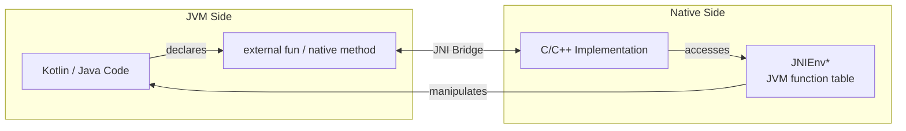

# JNI (Java Native Interface)

JNI is the standard framework for communication between JVM-based languages (Java, Kotlin) and native code (C, C++, assembly). It's the bridge that Android NDK code uses to interact with the app layer.

---

## How JNI Works



1. **Kotlin/Java** declares a function as `external` (Kotlin) or `native` (Java)
2. The JVM looks up the corresponding C function by **naming convention** or **dynamic registration**
3. The C function receives a `JNIEnv*` pointer — the gateway to call back into JVM objects
4. Data is marshalled across the boundary via JNI types

---

## Declaring Native Methods

=== "Kotlin"

    ```kotlin
    class NativeBridge {
        companion object {
            init {
                System.loadLibrary("mylib")  // loads libmylib.so
            }
        }

        external fun encrypt(data: ByteArray, key: String): ByteArray
        external fun getDeviceFingerprint(): String
    }
    ```

=== "Java"

    ```java
    public class NativeBridge {
        static {
            System.loadLibrary("mylib");
        }

        public native byte[] encrypt(byte[] data, String key);
        public native String getDeviceFingerprint();
    }
    ```

---

## JNI Function Naming Convention

The default lookup uses a mangled name derived from the Java package, class, and method:

```
Java_<package>_<class>_<method>
```

```c
// For: package com.example.app, class NativeBridge, method encrypt
JNIEXPORT jbyteArray JNICALL
Java_com_example_app_NativeBridge_encrypt(
    JNIEnv *env,
    jobject thiz,         // 'this' reference (jobject for instance, jclass for static)
    jbyteArray data,
    jstring key
) {
    // implementation
}
```

| Component | Meaning |
|-----------|---------|
| `JNIEXPORT` | Marks function as visible in shared library symbol table |
| `JNICALL` | Calling convention macro (platform-specific) |
| `JNIEnv *env` | Pointer to JNI function table — **always first parameter** |
| `jobject thiz` | The object the method was called on (`jclass` for `static` methods) |
| Remaining params | JNI-typed equivalents of the Java/Kotlin parameters |

!!! tip "Generate Headers Automatically"
    Use `javac -h` or `javah` (legacy) to generate C headers from compiled Java classes. This avoids typos in the mangled names.

---

## Dynamic Registration

Instead of relying on naming conventions, you can register native methods at library load time. This is cleaner for large projects and allows renaming native functions freely.

```c
static JNINativeMethod methods[] = {
    {"encrypt",              "([BLjava/lang/String;)[B", (void *)native_encrypt},
    {"getDeviceFingerprint", "()Ljava/lang/String;",     (void *)native_fingerprint},
};

JNIEXPORT jint JNI_OnLoad(JavaVM *vm, void *reserved) {
    JNIEnv *env;
    if ((*vm)->GetEnv(vm, (void **)&env, JNI_VERSION_1_6) != JNI_OK) {
        return JNI_ERR;
    }

    jclass clazz = (*env)->FindClass(env, "com/example/app/NativeBridge");
    (*env)->RegisterNatives(env, clazz, methods, sizeof(methods) / sizeof(methods[0]));

    return JNI_VERSION_1_6;
}
```

`JNI_OnLoad` is called automatically when `System.loadLibrary()` loads the `.so`.

---

## JNI Type Mapping

### Primitive Types

| Java/Kotlin | JNI Type | C Type | Size |
|------------|----------|--------|------|
| `boolean` | `jboolean` | `unsigned char` | 8-bit |
| `byte` | `jbyte` | `signed char` | 8-bit |
| `char` | `jchar` | `unsigned short` | 16-bit |
| `short` | `jshort` | `short` | 16-bit |
| `int` | `jint` | `int` | 32-bit |
| `long` | `jlong` | `long long` | 64-bit |
| `float` | `jfloat` | `float` | 32-bit |
| `double` | `jdouble` | `double` | 64-bit |

### Reference Types

| Java/Kotlin | JNI Type |
|------------|----------|
| `Object` | `jobject` |
| `String` | `jstring` |
| `Class` | `jclass` |
| `Throwable` | `jthrowable` |
| `int[]` | `jintArray` |
| `byte[]` | `jbyteArray` |
| `Object[]` | `jobjectArray` |

### Type Signatures (Descriptors)

Used in `RegisterNatives`, `GetMethodID`, and `GetFieldID`.

| Type | Signature |
|------|-----------|
| `void` | `V` |
| `boolean` | `Z` |
| `byte` | `B` |
| `int` | `I` |
| `long` | `J` |
| `float` | `F` |
| `double` | `D` |
| `String` | `Ljava/lang/String;` |
| `int[]` | `[I` |
| `byte[][]` | `[[B` |
| Method `int foo(String, byte[])` | `(Ljava/lang/String;[B)I` |

---

## Working with JNI Types

### Strings

```c
JNIEXPORT jstring JNICALL
Java_com_example_NativeBridge_processText(JNIEnv *env, jobject thiz, jstring input) {
    // Java String → C string (Modified UTF-8)
    const char *c_input = (*env)->GetStringUTFChars(env, input, NULL);
    if (c_input == NULL) return NULL;  // OutOfMemoryError thrown

    // Process the string
    char result[256];
    snprintf(result, sizeof(result), "Processed: %s", c_input);

    // Release the native string — MUST do this to avoid memory leak
    (*env)->ReleaseStringUTFChars(env, input, c_input);

    // C string → Java String
    return (*env)->NewStringUTF(env, result);
}
```

### Byte Arrays

```c
JNIEXPORT jbyteArray JNICALL
Java_com_example_NativeBridge_encrypt(JNIEnv *env, jobject thiz,
                                       jbyteArray data, jstring key) {
    jsize len = (*env)->GetArrayLength(env, data);
    jbyte *bytes = (*env)->GetByteArrayElements(env, data, NULL);

    // Work with bytes[0..len-1]
    for (int i = 0; i < len; i++) {
        bytes[i] ^= 0x42;  // trivial XOR "encryption"
    }

    // Create result array
    jbyteArray result = (*env)->NewByteArray(env, len);
    (*env)->SetByteArrayRegion(env, result, 0, len, bytes);

    // Release — mode 0 copies back changes, JNI_ABORT discards
    (*env)->ReleaseByteArrayElements(env, data, bytes, JNI_ABORT);

    return result;
}
```

### Calling Java/Kotlin from C

```c
void call_kotlin_method(JNIEnv *env, jobject callback) {
    // Find the class and method
    jclass clazz = (*env)->GetObjectClass(env, callback);
    jmethodID method = (*env)->GetMethodID(env, clazz, "onResult", "(ILjava/lang/String;)V");

    // Call it
    jstring message = (*env)->NewStringUTF(env, "Success");
    (*env)->CallVoidMethod(env, callback, method, 42, message);

    // Clean up local reference
    (*env)->DeleteLocalRef(env, message);
}
```

---

## JNI References

JNI has three reference types that control object lifetime and GC visibility.

| Reference Type | Created By | Lifetime | GC Behavior |
|---------------|------------|----------|-------------|
| **Local** | Most JNI calls (default) | Until native method returns | Auto-freed on return |
| **Global** | `NewGlobalRef()` | Until `DeleteGlobalRef()` | Prevents GC |
| **Weak Global** | `NewWeakGlobalRef()` | Until deleted or GC'd | Does NOT prevent GC |

```c
// Store a global reference to a Java callback (survives across JNI calls)
static jobject g_callback = NULL;

JNIEXPORT void JNICALL
Java_com_example_NativeBridge_setCallback(JNIEnv *env, jobject thiz, jobject callback) {
    // Delete old global ref if exists
    if (g_callback != NULL) {
        (*env)->DeleteGlobalRef(env, g_callback);
    }
    // Create global ref — prevents GC of callback object
    g_callback = (*env)->NewGlobalRef(env, callback);
}
```

!!! warning "Local Reference Limits"
    The JVM only guarantees 16 local references per native frame by default. In loops creating many JNI objects, call `DeleteLocalRef()` or use `PushLocalFrame()` / `PopLocalFrame()` to avoid hitting the limit.

---

## Error Handling

JNI does **not** use C exceptions. Errors are checked by querying the JNI environment.

```c
JNIEXPORT void JNICALL
Java_com_example_NativeBridge_riskyOperation(JNIEnv *env, jobject thiz) {
    jclass clazz = (*env)->FindClass(env, "com/example/SomeClass");

    // Check if an exception occurred (e.g., ClassNotFoundException)
    if ((*env)->ExceptionCheck(env)) {
        (*env)->ExceptionDescribe(env);  // print to stderr
        (*env)->ExceptionClear(env);     // clear before making more JNI calls
        return;
    }

    // Throw a Java exception from native code
    jclass exception_class = (*env)->FindClass(env, "java/lang/IllegalStateException");
    (*env)->ThrowNew(env, exception_class, "Native operation failed");
    // MUST return immediately after ThrowNew — do not make further JNI calls
}
```

!!! warning "Critical Rule"
    After `ThrowNew`, you **must** return from the native function immediately. Unlike Java exceptions, JNI does not unwind the native stack. Any further JNI calls after a pending exception (except `ExceptionCheck` / `ExceptionClear`) lead to undefined behavior.

---

## Threading

`JNIEnv*` is **thread-local** — each thread needs its own. Threads created in native code must attach to the JVM before making JNI calls.

```c
static JavaVM *g_jvm = NULL;

JNIEXPORT jint JNI_OnLoad(JavaVM *vm, void *reserved) {
    g_jvm = vm;  // cache for later use on other threads
    return JNI_VERSION_1_6;
}

void native_thread_function(void *arg) {
    JNIEnv *env;
    // Attach this native thread to the JVM
    (*g_jvm)->AttachCurrentThread(g_jvm, &env, NULL);

    // Now safe to make JNI calls with this env
    jclass clazz = (*env)->FindClass(env, "com/example/NativeBridge");
    // ...

    // Detach before thread exits — REQUIRED to avoid resource leaks
    (*g_jvm)->DetachCurrentThread(g_jvm);
}
```

| Operation | When to Use |
|-----------|-------------|
| `AttachCurrentThread` | Before any JNI calls on a native-created thread |
| `DetachCurrentThread` | Before the native thread exits |
| `AttachCurrentThreadAsDaemon` | Same as attach but thread won't prevent JVM shutdown |

---

## Performance Considerations

| Technique | Impact | When to Apply |
|-----------|--------|---------------|
| Cache `jclass` / `jmethodID` | **High** | Always — lookups are expensive |
| Use `GetPrimitiveArrayCritical` | **Medium** | Bulk array access in tight loops |
| Minimize JNI boundary crossings | **High** | Batch operations on the native side |
| Use direct `ByteBuffer` | **Medium** | Sharing large buffers without copying |
| Avoid `GetStringUTFChars` in hot paths | **Low** | Use `GetStringRegion` for substrings |

```c
// Cache method IDs at load time — they never change for a given class
static jmethodID g_onResult_mid = NULL;

JNIEXPORT jint JNI_OnLoad(JavaVM *vm, void *reserved) {
    JNIEnv *env;
    (*vm)->GetEnv(vm, (void **)&env, JNI_VERSION_1_6);

    jclass clazz = (*env)->FindClass(env, "com/example/NativeBridge");
    g_onResult_mid = (*env)->GetMethodID(env, clazz, "onResult", "(I)V");

    return JNI_VERSION_1_6;
}
```

!!! tip "Direct ByteBuffer"
    For large data transfers (images, audio buffers), use `NewDirectByteBuffer` to share memory between JVM and native without copying. The JVM accesses the native memory directly through the buffer.

---

## Common Pitfalls

| Pitfall | Symptom | Fix |
|---------|---------|-----|
| Forgetting `ReleaseStringUTFChars` | Memory leak | Always pair Get/Release calls |
| Using `JNIEnv*` across threads | Crash / corruption | Use `AttachCurrentThread` per thread |
| Not checking for exceptions | Silent failures, crashes | Check `ExceptionCheck` after JNI calls that can fail |
| Leaking global references | Growing memory, OOM | `DeleteGlobalRef` when no longer needed |
| Wrong type signature in `GetMethodID` | `NoSuchMethodError` | Use `javap -s` to get exact signatures |
| Accessing stale local reference | Use-after-free | Don't store local refs beyond the native call |

---

??? question "What's the difference between JNI and FFI?"
    **JNI** is JVM-specific — it bridges Java/Kotlin to native code and provides access to JVM objects, GC, and threading. **FFI** (Foreign Function Interface) is a general term for calling functions across language boundaries. Kotlin/Native uses `cinterop` (its FFI) to call C directly without JVM involvement. JNI always involves a JVM; FFI doesn't necessarily.

??? question "Why is JNI considered slow?"
    The overhead comes from: (1) **marshalling** — converting between JVM and native types, (2) **boundary crossing** — the JVM must transition between managed and unmanaged code, (3) **GC interaction** — pinning objects so the GC doesn't move them during native access. Each individual crossing is microseconds, but thousands in a tight loop add up. The fix is to minimize crossings by doing bulk work on the native side.

??? question "When should you use dynamic registration vs naming convention?"
    **Naming convention** is simpler for small projects — no setup code needed. **Dynamic registration** (`RegisterNatives`) is better for larger projects because: function names are shorter and cleaner, refactoring package/class names doesn't require renaming C functions, and you get a build-time error if the method list is wrong (vs. a runtime `UnsatisfiedLinkError`).

??? question "How do you debug JNI crashes?"
    Use `adb logcat` to find the crash signal (SIGSEGV, SIGABRT). Enable `-fno-omit-frame-pointer` in CMake for better stack traces. Use `ndk-stack` to symbolicate native crash dumps. `addr2line` converts addresses to source locations. For memory issues, use AddressSanitizer (ASan) via NDK's built-in support.

??? question "Can Kotlin coroutines be used with JNI?"
    Yes, but with care. A `suspend` function can call an `external` function that does blocking work — wrap it in `withContext(Dispatchers.IO)` to avoid blocking the main thread. For async native callbacks, attach the callback thread to the JVM, obtain a coroutine `Continuation`, and resume it from native code (complex but possible).

!!! tip "Further Reading"
    - [JNI Specification (Oracle)](https://docs.oracle.com/javase/8/docs/technotes/guides/jni/spec/jniTOC.html) — the definitive JNI reference
    - [Android JNI Tips](https://developer.android.com/training/articles/perf-jni) — Android-specific best practices and gotchas
    - [JNI Functions Reference](https://docs.oracle.com/javase/8/docs/technotes/guides/jni/spec/functions.html) — complete function table
