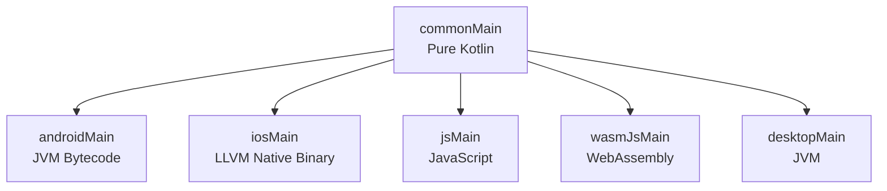
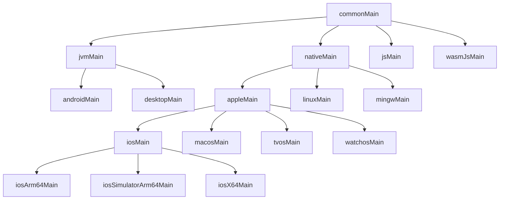
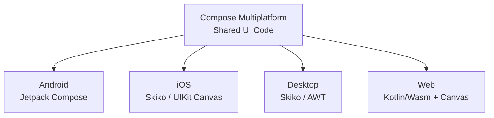
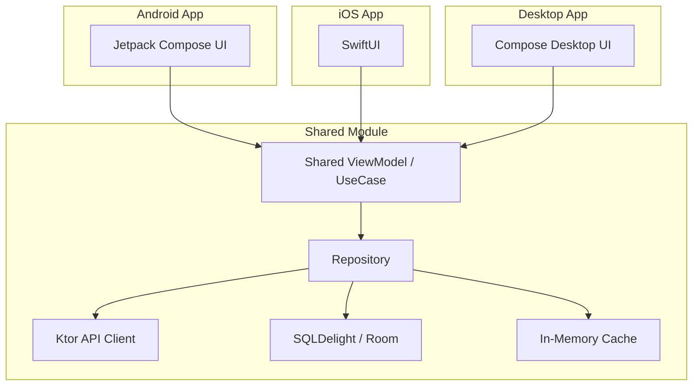

# Kotlin Multiplatform (KMP)

---

## How KMP Works

Share code (business logic, networking, data models) between platforms while keeping platform-specific code where it's needed. KMP compiles shared Kotlin code to the native format of each target.



- **Common code**: Pure Kotlin without platform-specific APIs. Compiled for all targets.
- **Platform code**: Uses platform APIs (Android SDK, iOS Foundation, etc.). Compiled only for that target.
- **Intermediate source sets**: Share code between subsets of platforms (e.g., all Apple targets).

---

## Source Set Hierarchy

KMP uses a hierarchy of source sets that allows sharing code at different levels of specificity.



### Key Intermediate Source Sets

| Source Set | Shared Between | Use Case |
|---|---|---|
| `nativeMain` | All Kotlin/Native targets | Native memory management, C interop |
| `appleMain` | iOS, macOS, tvOS, watchOS | Apple-specific frameworks (Foundation, CoreData) |
| `iosMain` | All iOS architectures | iOS-specific code (UIKit interop) |
| `jvmMain` | Android + Desktop (JVM) | JVM-specific libraries |

```kotlin
// In appleMain — shared across all Apple platforms
actual fun getDeviceId(): String {
    return UIDevice.currentDevice.identifierForVendor?.UUIDString ?: ""
}

// In nativeMain — shared across all native platforms
actual fun getPlatformMemoryInfo(): MemoryInfo {
    // Kotlin/Native memory APIs available here
}
```

---

## KMP Project Structure

### Shared Module

A typical KMP project has a shared module (often called `shared` or `core`) and platform-specific app modules.

```
project/
├── shared/
│   ├── src/
│   │   ├── commonMain/kotlin/      # Shared business logic
│   │   ├── commonTest/kotlin/      # Shared tests
│   │   ├── androidMain/kotlin/     # Android implementations
│   │   ├── iosMain/kotlin/         # iOS implementations
│   │   └── desktopMain/kotlin/     # Desktop implementations
│   └── build.gradle.kts
├── androidApp/                      # Android application
├── iosApp/                          # iOS application (Xcode project)
└── build.gradle.kts
```

### Gradle Configuration

```kotlin
// shared/build.gradle.kts
plugins {
    kotlin("multiplatform")
    id("com.android.library")
}

kotlin {
    // Targets
    androidTarget()
    iosX64()
    iosArm64()
    iosSimulatorArm64()
    jvm("desktop")

    // Source set dependencies
    sourceSets {
        commonMain.dependencies {
            implementation("io.ktor:ktor-client-core:2.3.0")
            implementation("org.jetbrains.kotlinx:kotlinx-coroutines-core:1.8.0")
            implementation("org.jetbrains.kotlinx:kotlinx-serialization-json:1.6.0")
        }
        commonTest.dependencies {
            implementation(kotlin("test"))
        }
        androidMain.dependencies {
            implementation("io.ktor:ktor-client-okhttp:2.3.0")
        }
        iosMain.dependencies {
            implementation("io.ktor:ktor-client-darwin:2.3.0")
        }
    }
}
```

---

## expect / actual

Declare an API in common code (`expect`) and provide platform-specific implementations (`actual`).

=== "Common (commonMain)"

    ```kotlin
    // Declare the contract
    expect fun getPlatformName(): String

    expect class PlatformLogger() {
        fun log(message: String)
    }
    ```

=== "Android (androidMain)"

    ```kotlin
    actual fun getPlatformName(): String = "Android ${Build.VERSION.SDK_INT}"

    actual class PlatformLogger {
        actual fun log(message: String) {
            Log.d("KMP", message)
        }
    }
    ```

=== "iOS (iosMain)"

    ```kotlin
    actual fun getPlatformName(): String = "iOS ${UIDevice.currentDevice.systemVersion}"

    actual class PlatformLogger {
        actual fun log(message: String) {
            NSLog("KMP: $message")
        }
    }
    ```

### Default Implementations (Kotlin 2.0+)

Since Kotlin 2.0, `expect` declarations can have **default implementations** in common code. Platform source sets only need `actual` if they want to override.

```kotlin
// commonMain — default implementation provided
expect fun formatDate(timestamp: Long): String {
    // Default: ISO format
    return Instant.fromEpochMilliseconds(timestamp).toString()
}

// androidMain — override with platform-specific formatting
actual fun formatDate(timestamp: Long): String {
    return SimpleDateFormat("MMM dd, yyyy", Locale.getDefault())
        .format(Date(timestamp))
}

// iosMain — uses the default (no actual needed)
```

!!! tip "Prefer interfaces over expect/actual"
    For most dependency injection scenarios, a common interface with platform-specific implementations (provided via DI) is simpler and more testable than expect/actual. Reserve expect/actual for truly platform-intrinsic things (like `Parcelable`, platform loggers, or UUID generation).

---

## What to Share vs Keep Native

| Share (commonMain) | Keep Native |
|---|---|
| Business logic, validation | UI (Compose / SwiftUI) |
| Data models, DTOs | Platform navigation |
| Networking (Ktor) | Platform-specific APIs (camera, GPS) |
| Local storage (SQLDelight, Room*) | Push notifications |
| Serialization (kotlinx.serialization) | App lifecycle management |
| Analytics, logging | Deep OS integrations |

!!! tip "Start with the data layer"
    Share **models, repositories, and networking** first. This gives the highest ROI with the lowest risk. Move to shared UI (Compose Multiplatform) when the team is comfortable.

---

## Compose Multiplatform

JetBrains' extension of Jetpack Compose to multiple platforms. Write shared UI in Kotlin that compiles for Android, iOS, Desktop, and Web.



### Platform Maturity

| Platform | Status | Rendering |
|---|---|---|
| Android | Stable | Native Jetpack Compose |
| Desktop | Stable | Skiko (Skia for Kotlin) |
| iOS | Beta | Skiko rendering + UIKit interop |
| Web (Wasm) | Alpha | Canvas-based rendering |

### Shared UI Example

```kotlin
// commonMain — shared composable
@Composable
fun UserProfile(user: User, onEdit: () -> Unit) {
    Column(modifier = Modifier.padding(16.dp)) {
        Text(text = user.name, style = MaterialTheme.typography.headlineMedium)
        Text(text = user.email, style = MaterialTheme.typography.bodyMedium)
        Button(onClick = onEdit) {
            Text("Edit Profile")
        }
    }
}

// Platform-specific entry points wire this into native navigation
```

!!! warning "iOS considerations"
    Compose Multiplatform on iOS renders via Skiko (not native UIKit views). This means native iOS accessibility, text selection, and some gestures may behave differently. Use `UIKitView` interop for platform-native components where needed.

---

## CInterop: Accessing Native C Libraries

Kotlin/Native can call C libraries directly through CInterop, enabling access to platform-native APIs not exposed through Kotlin.

```kotlin
// .def file — declares the C library binding
// src/nativeInterop/cinterop/CoreLocation.def
headers = CoreLocation/CoreLocation.h
compilerOpts = -framework CoreLocation
linkerOpts = -framework CoreLocation
```

```kotlin
// build.gradle.kts
kotlin {
    iosArm64 {
        compilations.getByName("main") {
            cinterops {
                val CoreLocation by creating
            }
        }
    }
}
```

```kotlin
// Usage in iosMain
import cocoapods.CoreLocation.*

class IOSLocationProvider : LocationProvider {
    private val locationManager = CLLocationManager()

    override fun getLastKnownLocation(): Location? {
        val clLocation = locationManager.location ?: return null
        return Location(clLocation.coordinate.latitude, clLocation.coordinate.longitude)
    }
}
```

!!! note
    Most Apple frameworks are already available in Kotlin/Native without manual CInterop setup. CInterop is mainly needed for third-party C libraries or specific native headers.

---

## iOS Interop

Kotlin/Native compiles to an **Objective-C framework** that Swift consumes. This brings inherent limitations.

### Key Gotchas

| Kotlin Concept | Swift Sees | Issue |
|---|---|---|
| `suspend fun` | Completion handler callback | Verbose, no async/await |
| Sealed class | Multiple classes (no Swift enum) | Exhaustive `switch` not enforced |
| Generics | Limited (Objective-C generics) | Type info partially erased |
| Default parameters | Not available | Must pass all parameters |
| Extension functions | Global functions with first param | Not discoverable |
| Coroutine `Flow` | Not accessible | Need wrapper |

### SKIE (Swift Kotlin Interface Enhancer)

[SKIE](https://skie.touchlab.co/) by Touchlab generates **Swift-friendly APIs** from Kotlin code.

```kotlin
// Kotlin
sealed class NetworkResult {
    data class Success(val data: String) : NetworkResult()
    data class Error(val message: String) : NetworkResult()
    data object Loading : NetworkResult()
}

suspend fun fetchUser(id: String): User { /* ... */ }
fun observeUsers(): Flow<List<User>> { /* ... */ }
```

```swift
// Swift with SKIE — idiomatic Swift
let result = try await fetchUser(id: "123")  // async/await, not callbacks

switch onEnum(of: result) {  // exhaustive switch
case .success(let data):
    print(data)
case .error(let message):
    print(message)
case .loading:
    showSpinner()
}

// Flow becomes AsyncSequence
for await users in observeUsers() {
    updateUI(users)
}
```

### KMP-NativeCoroutines

Alternative to SKIE for exposing suspend functions and Flows to Swift.

```kotlin
// Annotate in shared code
@NativeCoroutines
suspend fun getUser(id: String): User { /* ... */ }

@NativeCoroutines
fun observeUsers(): Flow<List<User>> { /* ... */ }
```

```swift
// Swift
let user = try await asyncFunction(for: shared.getUser(id: "123"))

let stream = asyncSequence(for: shared.observeUsers())
for try await users in stream {
    updateUI(users)
}
```

!!! tip "SKIE vs KMP-NativeCoroutines"
    SKIE is more comprehensive (handles sealed classes, enums, default params, flows, and suspend functions). KMP-NativeCoroutines focuses specifically on coroutine/flow interop. SKIE is the newer, more actively developed option.

---

## Testing in KMP

Write tests in `commonTest` that run on all targets. Add platform-specific tests where needed.

```kotlin
// commonTest — runs on Android, iOS, Desktop, etc.
class UserRepositoryTest {
    @Test
    fun fetchUser_returnsUser() = runTest {
        val repo = UserRepository(FakeApi())
        val user = repo.getUser("123")
        assertEquals("Alice", user.name)
    }

    @Test
    fun fetchUser_notFound_throwsException() = runTest {
        val repo = UserRepository(FakeApi(shouldFail = true))
        assertFailsWith<UserNotFoundException> {
            repo.getUser("unknown")
        }
    }
}

// androidTest — Android-specific tests
class AndroidStorageTest {
    @Test
    fun sharedPreferences_storesValue() {
        val context = ApplicationProvider.getApplicationContext<Context>()
        val storage = AndroidStorage(context)
        storage.save("key", "value")
        assertEquals("value", storage.get("key"))
    }
}
```

### Testing Libraries for KMP

| Library | Purpose |
|---|---|
| `kotlin-test` | Assertions, test annotations (built-in, multiplatform) |
| `kotlinx-coroutines-test` | `runTest`, `TestDispatcher`, virtual time |
| `turbine` | Testing Flow emissions |
| `MockK` | Mocking (JVM only, not multiplatform yet) |
| `Mokkery` | Multiplatform mocking library |

---

## KMP Libraries Ecosystem

| Category | Library | Notes |
|---|---|---|
| **Networking** | **Ktor** | HTTP client, multiplatform. Platform engines (OkHttp, Darwin, JS) |
| **Serialization** | **kotlinx.serialization** | JSON, Protobuf, CBOR. Compile-time, no reflection |
| **Database** | **SQLDelight** | Type-safe SQL, generates Kotlin from .sq files |
| **Database** | **Room** | KMP support since Room 2.7.0-alpha |
| **DI** | **Koin** | Lightweight, KMP-friendly. No code generation |
| **DI** | **kotlin-inject** | Compile-time DI, KMP support |
| **Date/Time** | **kotlinx-datetime** | Multiplatform date/time API |
| **Settings** | **multiplatform-settings** | SharedPreferences / NSUserDefaults |
| **Coroutines** | **kotlinx.coroutines** | Built-in multiplatform support |
| **Logging** | **Kermit** | By Touchlab. Multiplatform logger with platform formatters |
| **Logging** | **Napier** | Lightweight multiplatform logger |
| **Data Loading** | **Store5** | Reactive data loading with caching layers |
| **Image Loading** | **Coil 3** | KMP image loading (Compose Multiplatform) |
| **Navigation** | **Voyager** | Multiplatform navigation for Compose |
| **Navigation** | **Decompose** | Lifecycle-aware component-based navigation |
| **Paging** | **Paging Multiplatform** | KMP version of AndroidX Paging |

---

## Kotlin/Wasm

The newest compilation target. Compiles Kotlin to **WebAssembly** for browser and server-side execution.

```kotlin
// wasmJsMain
fun main() {
    // Runs in the browser via WebAssembly
    document.getElementById("root")?.innerHTML = "Hello from Kotlin/Wasm!"
}
```

### Compose for Web (via Wasm)

Combined with Compose Multiplatform, Kotlin/Wasm enables **Compose UI in the browser**.

```kotlin
// Shared composable runs on Web via Wasm
@Composable
fun App() {
    MaterialTheme {
        var count by remember { mutableStateOf(0) }
        Button(onClick = { count++ }) {
            Text("Clicked $count times")
        }
    }
}

// wasmJsMain entry point
fun main() {
    CanvasBasedWindow("My App") {
        App()
    }
}
```

!!! warning "Maturity"
    Kotlin/Wasm is in **Alpha**. The binary size is larger than equivalent JS output but execution is faster. Browser support requires WebAssembly GC (available in Chrome 119+, Firefox 120+). Not yet suitable for production.

---

## IDE Support

| IDE | KMP Support |
|---|---|
| **Android Studio** | Full support via KMP plugin. Handles shared module, expect/actual navigation, and run configurations |
| **Fleet** | JetBrains' IDE with first-class KMP support. Multi-language editing, Swift interop navigation |
| **Xcode** | Required for iOS builds and signing. Use alongside Android Studio / Fleet |

!!! tip "Android Studio setup"
    Install the "Kotlin Multiplatform" plugin from JetBrains. Use the KMP project wizard (File > New > Kotlin Multiplatform Project) for scaffolding. The plugin provides expect/actual gutter icons and cross-platform navigation.

---

## Common Architecture Pattern

A typical KMP project separates shared logic from platform UI:



```kotlin
// commonMain — shared repository
class UserRepository(
    private val api: UserApi,
    private val db: UserDatabase
) {
    fun observeUsers(): Flow<List<User>> = db.observeUsers()

    suspend fun refresh() {
        val users = api.fetchUsers()
        db.insertAll(users)
    }
}

// commonMain — shared use case / presenter
class UserListPresenter(private val repository: UserRepository) {
    val users: Flow<List<User>> = repository.observeUsers()

    suspend fun refresh() = repository.refresh()
}
```

!!! warning "Memory model"
    Kotlin/Native's new memory manager (default since 1.7.20) eliminates the old freeze/thread-confinement issues. Mutable shared state works across threads, but you still need proper synchronization (Mutex, AtomicReference, etc.) just like on JVM.

---

## Interview Q&A

??? question "What is the `expect`/`actual` mechanism in KMP?"
    `expect` declares an API contract in common code without providing an implementation. Each platform source set provides an `actual` implementation. The compiler ensures every `expect` declaration has a matching `actual` on each target. Since Kotlin 2.0, `expect` declarations can include default implementations that platforms can optionally override.

??? question "What code should you share in KMP and what should stay native?"
    Share business logic, data models, networking (Ktor), local storage (SQLDelight/Room), serialization, and validation in `commonMain`. Keep UI, platform navigation, OS-specific APIs (camera, push notifications), and deep system integrations native. Start with the data layer for highest ROI.

??? question "How does Kotlin/Native interact with Swift and Objective-C?"
    Kotlin/Native compiles shared code into an Objective-C framework, which Swift consumes. This introduces limitations: suspend functions become completion-handler callbacks, sealed classes lose exhaustive switch support, and default parameters are not available. Libraries like SKIE and KMP-NativeCoroutines generate Swift-friendly wrappers to address these gaps.

??? question "What is the KMP source set hierarchy and why does it matter?"
    Source sets form a tree from `commonMain` down to platform-specific sets. Intermediate source sets like `appleMain`, `nativeMain`, or `jvmMain` let you share code between subsets of platforms without duplicating it. For example, `appleMain` shares code across iOS, macOS, tvOS, and watchOS.

??? question "What is the difference between Compose Multiplatform and KMP?"
    KMP is the Kotlin compiler infrastructure for sharing non-UI code across platforms. Compose Multiplatform is JetBrains' framework built on top of KMP that extends Jetpack Compose UI to iOS, Desktop, and Web. You can use KMP without Compose Multiplatform by keeping UI native on each platform.

!!! tip "Further Reading"
    - [Kotlin Multiplatform Overview](https://kotlinlang.org/docs/multiplatform.html) -- official KMP documentation and getting started guide
    - [Get Started with KMP](https://www.jetbrains.com/help/kotlin-multiplatform-dev/multiplatform-getting-started.html) -- JetBrains step-by-step tutorial
    - [Compose Multiplatform](https://www.jetbrains.com/lp/compose-multiplatform/) -- official page for shared UI across platforms
    - [SKIE by Touchlab](https://skie.touchlab.co/) -- Swift-friendly API generation for KMP
    - [KMP Library Search](https://klibs.io/) -- discover multiplatform-compatible Kotlin libraries
