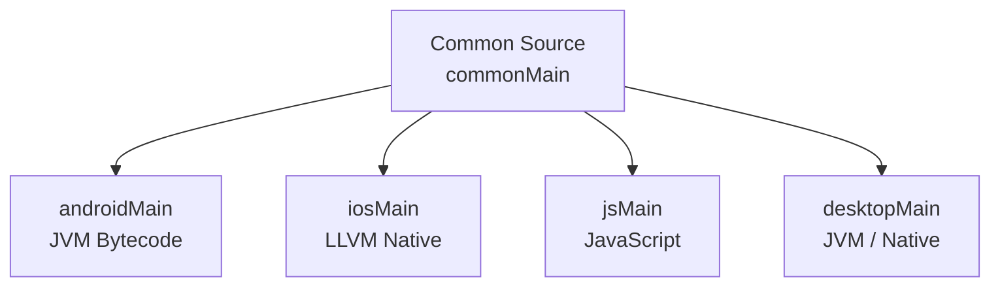

# Kotlin Multiplatform (KMP)

---

## How KMP Works

Share code (business logic, networking, data models) between platforms (Android, iOS, Web, Desktop) while keeping the **UI native**.

- **Common Source**: Pure Kotlin without platform-specific APIs.
- **Platform Specific Source**: Compiles to native binaries -- JVM bytecode for Android, LLVM native binary for iOS.



---

## expect vs actual

### expect (Common)

Declare a function, class, or property in `commonMain` **without implementation** (like an interface contract).

### actual (Platform)

Implement in every platform source set (`androidMain`, `iosMain`, etc.).

=== "Common (commonMain)"

    ```kotlin
    expect fun getPlatformName(): String
    ```

=== "Android (androidMain)"

    ```kotlin
    actual fun getPlatformName(): String = "Android"
    ```

=== "iOS (iosMain)"

    ```kotlin
    actual fun getPlatformName(): String = "iOS"
    ```
