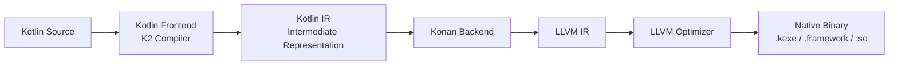
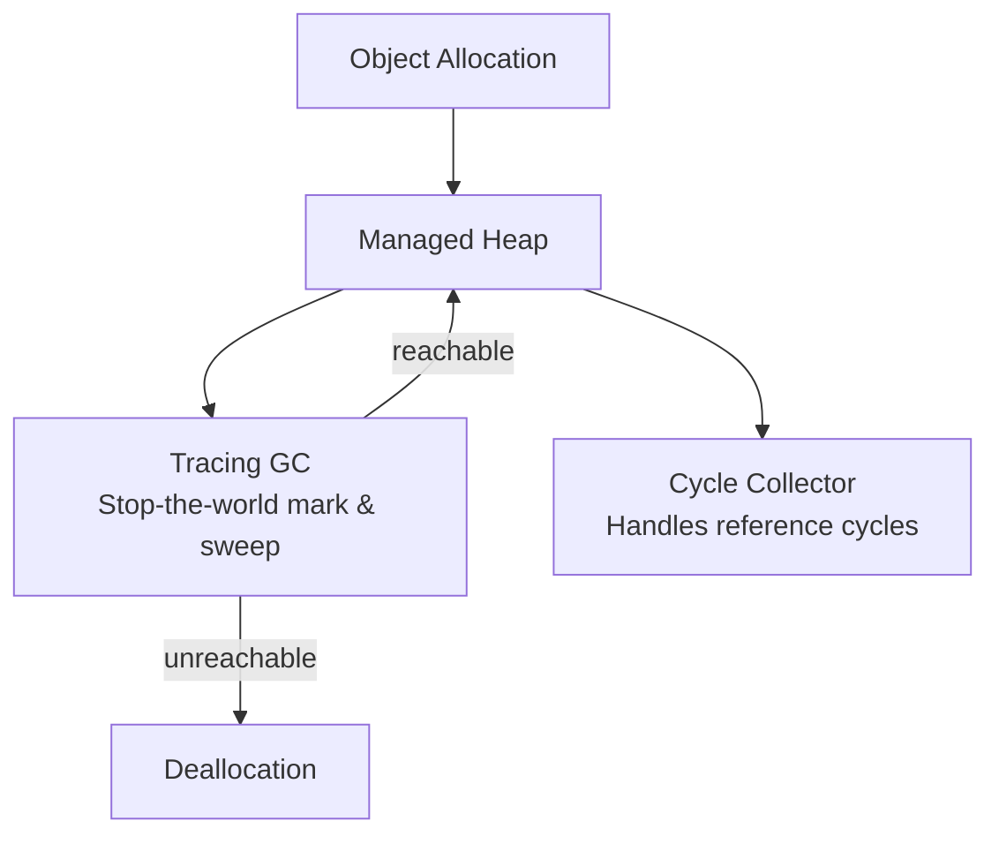
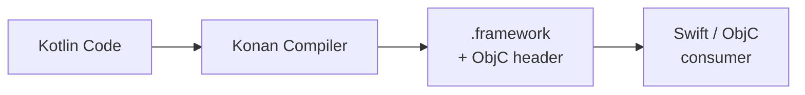
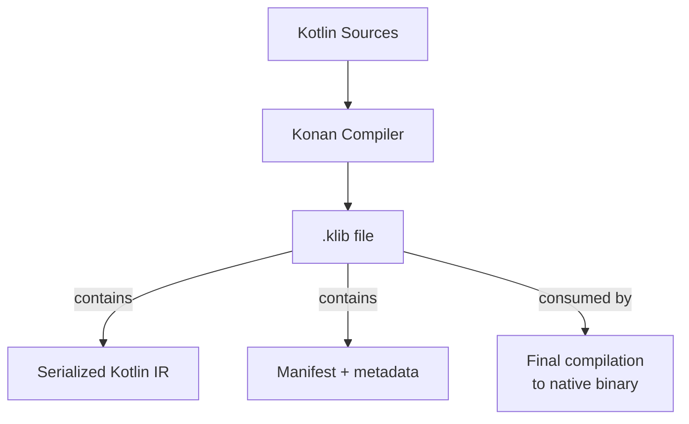

# Konan — Kotlin/Native Compiler

Konan is the LLVM-based compiler backend that compiles Kotlin to native machine code without a JVM. It powers Kotlin/Native targets (iOS, macOS, Linux, Windows, embedded) and is a core piece of the Kotlin Multiplatform toolchain.

---

## Architecture Overview



Konan sits between the Kotlin compiler frontend (which produces Kotlin IR) and the LLVM toolchain (which produces machine code). It handles Kotlin-specific lowerings, memory management injection, and platform ABI compliance.

### Compilation Stages

| Stage | What Happens |
|---|---|
| **Frontend (K2)** | Parses Kotlin, resolves types, produces Kotlin IR |
| **IR Lowering** | Desugars Kotlin constructs (coroutines, default params, inline classes) into simpler IR |
| **Konan-specific lowering** | Injects GC barriers, reference counting ops, Objective-C bridge code |
| **LLVM IR generation** | Translates lowered Kotlin IR to LLVM IR |
| **LLVM optimization** | Standard LLVM passes (inlining, dead code elimination, vectorization) |
| **Code generation** | LLVM emits platform-specific machine code |
| **Linking** | Links with platform libraries, runtime, and GC to produce final binary |

---

## Supported Targets

Konan compiles to a wide range of native targets via LLVM.

| Target Preset | Architecture | OS | Use Case |
|---|---|---|---|
| `iosArm64` | ARM64 | iOS | Physical iPhones/iPads |
| `iosSimulatorArm64` | ARM64 | iOS Simulator | Apple Silicon Macs |
| `iosX64` | x86_64 | iOS Simulator | Intel Macs |
| `macosArm64` | ARM64 | macOS | Apple Silicon native apps |
| `macosX64` | x86_64 | macOS | Intel Mac apps |
| `linuxX64` | x86_64 | Linux | Server-side, CLI tools |
| `linuxArm64` | ARM64 | Linux | Raspberry Pi, ARM servers |
| `mingwX64` | x86_64 | Windows | Windows native (via MinGW) |
| `tvosArm64` | ARM64 | tvOS | Apple TV apps |
| `watchosArm64` | ARM64 | watchOS | Apple Watch apps |
| `androidNativeArm64` | ARM64 | Android | Android native (no JVM) |

```kotlin
// build.gradle.kts — declaring native targets
kotlin {
    iosArm64()
    iosSimulatorArm64()
    macosArm64()
    linuxX64()

    // Configure per-target
    linuxX64 {
        binaries {
            executable { entryPoint = "main" }
        }
    }
}
```

---

## Binary Types

Konan can produce different output binary types depending on the use case.

| Binary Type | Extension | Use Case |
|---|---|---|
| **Executable** | `.kexe` (Linux/Windows) | Standalone CLI programs |
| **Framework** | `.framework` | iOS/macOS libraries consumed by Swift/ObjC |
| **Dynamic library** | `.so` / `.dylib` / `.dll` | Shared library loaded at runtime |
| **Static library** | `.a` | Linked into another native project at compile time |
| **Test** | — | Test binary for `kotest` / `kotlin.test` |

```kotlin
kotlin {
    macosArm64 {
        binaries {
            executable { entryPoint = "main" }
            framework {
                baseName = "SharedKit"
                isStatic = true // static framework (no dylib)
            }
            sharedLib { baseName = "mylib" }
            staticLib { baseName = "mylib" }
        }
    }
}
```

!!! tip "Static vs Dynamic Frameworks for iOS"
    Static frameworks (`isStatic = true`) embed directly into the app binary — no dynamic loading overhead and simpler distribution. Dynamic frameworks allow code sharing between app and extensions but add launch-time cost. Default is **static** since Kotlin 1.9.20.

---

## Memory Management

Kotlin/Native uses a tracing garbage collector (GC) with automatic memory management. The modern memory manager (default since Kotlin 1.7.20) replaced the old freeze-based model.

### Modern Memory Manager



| Feature | Behavior |
|---|---|
| **Threading model** | Objects freely shared between threads (no freezing) |
| **GC algorithm** | Stop-the-world mark-and-sweep with concurrent sweep |
| **Cycle detection** | Built-in cycle collector handles circular references |
| **GC trigger** | Allocation threshold or explicit `GC.collect()` |
| **Finalizers** | Supported but run on a separate finalizer thread |

### GC Tuning

```kotlin
// Programmatic GC control
import kotlin.native.runtime.GC

fun tuneGC() {
    GC.autotune = true            // let runtime decide thresholds
    GC.threshold = 100_000        // trigger GC after N allocations
    GC.thresholdAllocations = 0   // trigger based on allocation count
    GC.collect()                  // force immediate collection
}
```

```
# Gradle properties for GC tuning
kotlin.native.binary.gc=cms
kotlin.native.binary.gcSchedulerType=adaptive
```

!!! warning "Performance Implications"
    The stop-the-world GC can cause brief pauses. For latency-sensitive code (animations, audio), minimize allocations in hot paths. The GC is improving with each Kotlin release — 2.0+ introduced concurrent marking for shorter pauses.

---

## C Interop

Konan includes a C interop tool (`cinterop`) that generates Kotlin bindings from C headers. This is how Kotlin/Native accesses platform APIs.

### How cinterop Works


### .def File Format

```
# libcurl.def
headers = curl/curl.h
compilerOpts = -I/usr/include
linkerOpts = -L/usr/lib -lcurl
excludedFunctions = curl_mprintf curl_mfprintf
```

| Field | Purpose |
|---|---|
| `headers` | C headers to generate bindings from |
| `compilerOpts` | Flags passed to the C compiler (include paths) |
| `linkerOpts` | Flags passed to the linker (library paths, -l flags) |
| `excludedFunctions` | Functions to skip (variadic or unsupported signatures) |
| `staticLibraries` | Static `.a` files to bundle |
| `libraryPaths` | Directories to search for libraries |

### Type Mapping

| C Type | Kotlin Type |
|---|---|
| `int`, `int32_t` | `Int` |
| `long long`, `int64_t` | `Long` |
| `float` | `Float` |
| `double` | `Double` |
| `char*` | `CPointer<ByteVar>` (use `.toKString()`) |
| `void*` | `COpaquePointer` |
| `struct` | `CValue<T>` (by-value) or `CPointer<T>` (by-reference) |
| `enum` | Kotlin `enum class` or integer constants |
| Function pointer | `CPointer<CFunction<...>>` |

```kotlin
import kotlinx.cinterop.*
import libcurl.*

fun fetchUrl(url: String) {
    val curl = curl_easy_init() ?: return
    try {
        curl_easy_setopt(curl, CURLOPT_URL, url)
        curl_easy_setopt(curl, CURLOPT_FOLLOWLOCATION, 1L)
        val res = curl_easy_perform(curl)
        if (res != CURLE_OK) {
            println("Error: ${curl_easy_strerror(res)?.toKString()}")
        }
    } finally {
        curl_easy_cleanup(curl)
    }
}
```

!!! note "Apple Frameworks"
    Apple system frameworks (Foundation, UIKit, CoreLocation, etc.) are pre-generated and bundled with the Kotlin/Native distribution. You don't need `.def` files for them — just `import platform.Foundation.*`.

---

## Objective-C / Swift Interop

On Apple platforms, Konan generates Objective-C headers from Kotlin code, enabling Swift consumption.

### Export Flow



### Kotlin-to-ObjC Mapping

| Kotlin | Objective-C / Swift |
|---|---|
| `class` | `@interface` / Swift class |
| `interface` | `@protocol` / Swift protocol |
| `object` | Singleton class with `.shared` |
| `companion object` | Class-level `.companion` property |
| `suspend fun` | Completion handler (callback-based) |
| `sealed class` | Multiple classes (no sealed semantics) |
| `enum class` | `KotlinEnum` subclass (not Swift `enum`) |
| `String` | `NSString` (bridged) |
| `List<T>` | `NSArray` (bridged) |
| `Map<K,V>` | `NSDictionary` (bridged) |
| Exceptions | `NSError` (with `@Throws` annotation) |

```kotlin
// Kotlin — exported to ObjC/Swift
class UserRepository {
    @Throws(IOException::class)
    suspend fun getUser(id: String): User { /* ... */ }
}

// Swift sees:
// func getUser(id: String) async throws -> User
// (with SKIE) or completion handler (without)
```

### Controlling Exports

```kotlin
// build.gradle.kts
framework {
    baseName = "SharedKit"
    export(project(":core"))    // re-export symbols from :core
    transitiveExport = false    // only export explicitly listed modules
}
```

```kotlin
// Hide from ObjC export
@HiddenFromObjC
internal class InternalHelper { /* ... */ }

// Customize ObjC name
@ObjCName("SKUser")
class User(val name: String)
```

---

## Kotlin/Native Runtime

The Konan runtime is bundled into every native binary and provides core services.

| Component | Responsibility |
|---|---|
| **Memory manager** | GC, allocation, finalization |
| **Coroutine runtime** | Dispatcher, continuation management |
| **ObjC bridge** | Reference counting bridge, autorelease pool integration |
| **Exception handling** | Kotlin exception → native unwinding |
| **Standard library** | `kotlin.*`, `kotlinx.*` native implementations |
| **Worker API** (legacy) | Thread-based concurrency (deprecated in favor of coroutines) |

### Runtime Size

The Kotlin/Native runtime adds overhead to binary size:

| Component | Approximate Size |
|---|---|
| Runtime + stdlib | ~3–5 MB |
| LLVM-generated code | Varies by app |
| After stripping symbols | ~1.5–3 MB reduction |

```kotlin
// build.gradle.kts — binary size optimizations
kotlin {
    targets.withType<KotlinNativeTarget> {
        binaries.all {
            freeCompilerArgs += listOf(
                "-opt",            // enable optimizations
                "-Xallocator=std"  // standard allocator (smaller binary)
            )
        }
    }
}
```

---

## klib — Kotlin/Native Library Format

Konan uses `.klib` as its library distribution format (analogous to `.jar` for JVM).



| Aspect | `.klib` | `.jar` |
|---|---|---|
| **Contains** | Serialized Kotlin IR | JVM bytecode (.class) |
| **When compiled** | To native code at final link time | To machine code by JVM JIT |
| **Platform** | Target-specific or common | JVM (any platform) |
| **Distribution** | Maven Central (like JVM libs) | Maven Central |

!!! note "klib vs compiled binary"
    A `.klib` contains IR, not machine code. The final compilation to native happens when building the consuming project. This enables whole-program optimization — Konan can inline across library boundaries at link time.

---

## Compilation Performance

Kotlin/Native compilation is slower than JVM compilation due to the LLVM backend. Key strategies to improve build times:

| Strategy | How |
|---|---|
| **Gradle build cache** | `org.gradle.caching=true` — caches native compilation outputs |
| **Debug mode** | `-Xbinary=debugMode` — less optimization, faster builds |
| **Incremental compilation** | Enabled by default since Kotlin 1.9.20 |
| **Compiler caches** | Pre-compiled platform libraries (enabled by default) |
| **Parallel compilation** | `kotlin.native.cacheKind=static` |

```properties
# gradle.properties — speed up native builds
kotlin.incremental.native=true
kotlin.native.cacheKind.iosArm64=static
kotlin.native.cacheKind.iosSimulatorArm64=static
org.gradle.parallel=true
org.gradle.caching=true
```

### Debug vs Release

| Mode | Optimization | Build Speed | Binary Size | Runtime Speed |
|---|---|---|---|---|
| **Debug** | None (`-opt-in=none`) | Fast | Large | Slower |
| **Release** | Full (`-opt`) | Slow (LLVM passes) | Smaller | Fast |

```kotlin
kotlin {
    iosArm64 {
        binaries {
            framework {
                // Release optimizations
                if (buildType == NativeBuildType.RELEASE) {
                    freeCompilerArgs += "-Xallocator=custom"
                    linkerOpts += "-dead_strip"
                }
            }
        }
    }
}
```

---

## Debugging Kotlin/Native

### LLDB Support

Konan produces DWARF debug info, making LLDB (Xcode's debugger) the primary debugging tool.

```bash
# Run with debugger
lldb ./build/bin/native/debugExecutable/myapp.kexe

# Set breakpoint on Kotlin function
(lldb) b kfun:com.example.main#

# Step through
(lldb) n
(lldb) s
```

### Xcode Debugging

For iOS frameworks, Xcode can step into Kotlin code if the framework is built with debug info:

```kotlin
framework {
    isStatic = true
    embedBitcode(BitcodeEmbeddingMode.DISABLE) // faster debug builds
}
```

### Crash Reports

Kotlin/Native crash reports include demangled Kotlin symbols. Use `konan-lldb.py` (bundled with the Kotlin distribution) for enhanced LLDB pretty-printing of Kotlin objects.

---

## Konan vs Other Kotlin Backends

| Aspect | Konan (Native) | JVM | JS | Wasm |
|---|---|---|---|---|
| **Output** | Machine code | JVM bytecode | JavaScript | WebAssembly |
| **Runtime** | Bundled GC + stdlib | JVM (HotSpot/ART) | JS engine | Wasm runtime |
| **Startup** | Instant (AOT compiled) | Slow (class loading + JIT warmup) | Depends on JS engine | Near-instant |
| **Peak perf** | Good (LLVM optimized) | Excellent (JIT adaptive optimization) | Good (V8/JSC) | Good |
| **Binary size** | 3–10 MB base | N/A (needs JVM) | Varies | Large (alpha) |
| **Interop** | C, ObjC, Swift | Java, JNI | JavaScript | JS (via Wasm imports) |
| **GC** | Mark-and-sweep | Generational (G1/ZGC) | Engine-managed | Engine-managed |
| **Debugging** | LLDB | JVM debugger (JDWP) | Browser DevTools | Browser DevTools |

---

??? question "Interview Questions"

    **Q: What is Konan and how does it relate to Kotlin/Native?**
    Konan is the compiler backend that powers Kotlin/Native. It takes Kotlin IR from the K2 frontend, performs Kotlin-specific lowerings (coroutines, inline classes, GC barriers), translates to LLVM IR, and uses the LLVM toolchain to produce native machine code for the target platform.

    **Q: How does Kotlin/Native memory management work?**
    The modern memory manager (default since 1.7.20) uses a tracing garbage collector with stop-the-world mark-and-sweep. Objects can be freely shared between threads without freezing. A cycle collector handles circular references. The GC is tunable via allocation thresholds and supports concurrent sweep.

    **Q: What is a `.klib` and how does it differ from a `.jar`?**
    A `.klib` contains serialized Kotlin IR (not machine code), while a `.jar` contains JVM bytecode. The IR in a `.klib` is compiled to native code at final link time in the consuming project, enabling whole-program optimization and cross-library inlining.

    **Q: Why is Kotlin/Native compilation slower than JVM compilation?**
    Konan must run the full LLVM optimization pipeline (inlining, dead code elimination, vectorization, register allocation) at compile time, whereas the JVM defers optimization to JIT compilation at runtime. Mitigations include compiler caches, incremental compilation, and using debug mode during development.

    **Q: How does Kotlin/Native interoperate with Swift?**
    Konan generates an Objective-C framework with headers. Swift consumes this via ObjC interop. Kotlin classes become ObjC `@interface`s, interfaces become `@protocol`s, and `suspend` functions become completion-handler callbacks. Tools like SKIE improve the ergonomics by generating Swift-native async/await wrappers and exhaustive sealed class enums.

    **Q: What binary types can Konan produce?**
    Executables (`.kexe`), frameworks (`.framework` for Apple platforms), dynamic libraries (`.so`/`.dylib`/`.dll`), and static libraries (`.a`). The choice depends on the deployment target — frameworks for iOS consumption, executables for CLI tools, shared/static libs for embedding.

    **Q: What is cinterop and when would you use it?**
    `cinterop` is Konan's tool for generating Kotlin bindings from C headers. You define a `.def` file pointing to headers with compiler/linker options, and it produces a `.klib` with type-safe Kotlin wrappers. Use it when accessing third-party C libraries or platform APIs not already bundled with the Kotlin/Native distribution.

---

!!! tip "Further Reading"
    - [Kotlin/Native documentation](https://kotlinlang.org/docs/native-overview.html)
    - [Kotlin/Native memory manager](https://kotlinlang.org/docs/native-memory-manager.html)
    - [C interop reference](https://kotlinlang.org/docs/native-c-interop.html)
    - [Kotlin/Native compiler options](https://kotlinlang.org/docs/compiler-reference.html#kotlin-native-compiler-options)
    - [Konan source code (GitHub)](https://github.com/JetBrains/kotlin/tree/master/kotlin-native)
