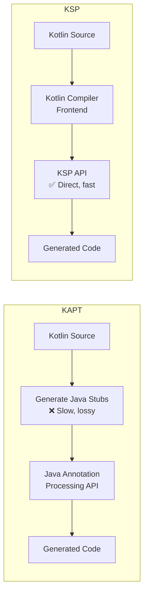
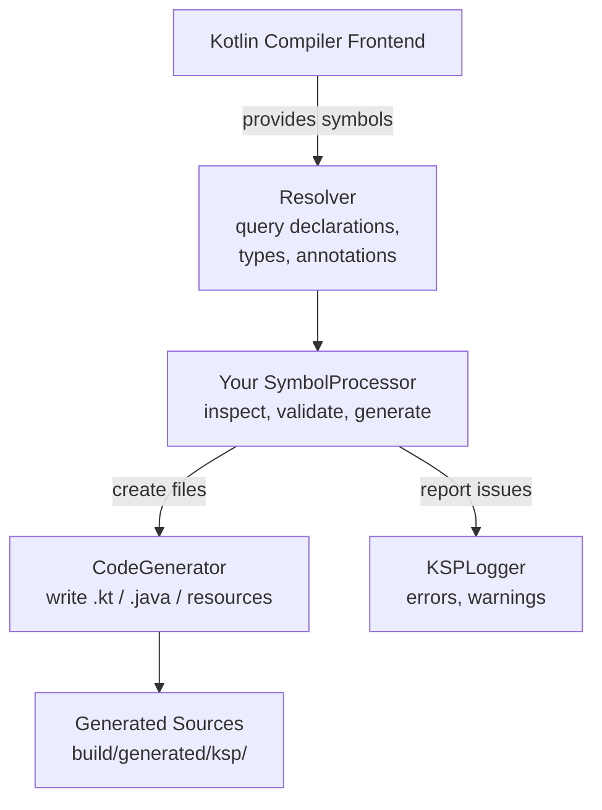
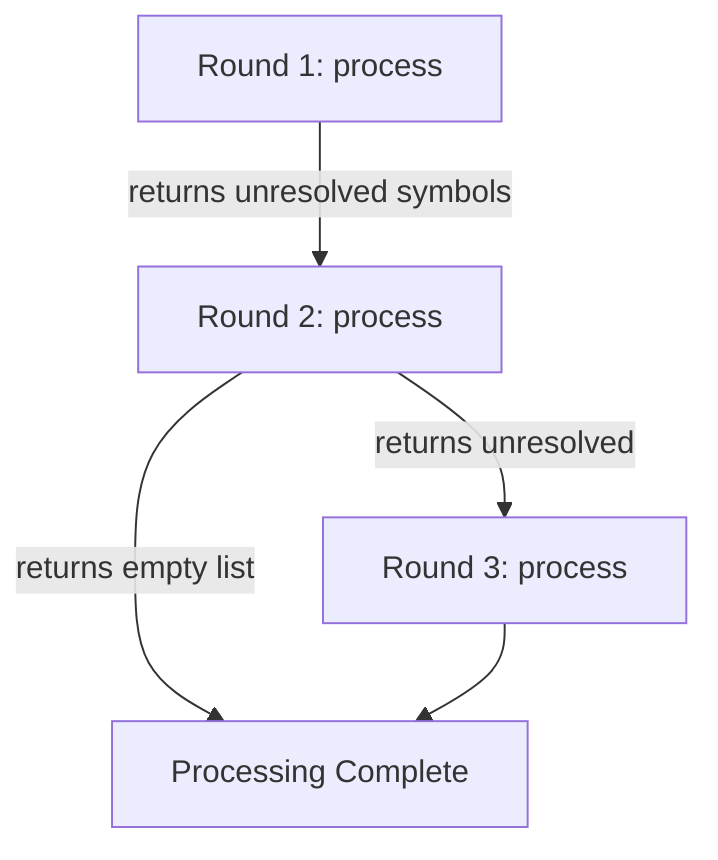

# KSP (Kotlin Symbol Processing)

KSP is Kotlin's modern replacement for KAPT (Kotlin Annotation Processing Tool). It provides a Kotlin-native API for building annotation processors and code generators, with significantly better build performance.

---

## KSP vs KAPT

KAPT works by generating Java stubs from Kotlin code, then running Java's `javax.annotation.processing` API on those stubs. This is slow and lossy — Kotlin-specific features (inline classes, sealed types, default parameters) are not fully visible.



| Aspect | KAPT | KSP |
|--------|------|-----|
| **Build speed** | Slow (stub generation + javac) | **~2x faster** (no stubs) |
| **API** | Java `javax.annotation.processing` | Kotlin-native `KSP` API |
| **Kotlin features** | Limited (through Java stubs) | Full access (sealed, inline, etc.) |
| **Incremental** | Partial | Yes (fine-grained) |
| **Multiplatform** | JVM only | KMP support |
| **Java interop** | Full (it IS Java annotation processing) | Can process Java + Kotlin |
| **Maturity** | Stable, widely supported | Stable (1.0+), growing adoption |

!!! tip "Migration Priority"
    If your project uses KAPT, migrating to KSP is one of the highest-impact build speed improvements. Libraries like Room, Moshi, Hilt/Dagger, and Compose Destinations already support KSP.

---

## Architecture



### Core Concepts

| Concept | Description |
|---------|-------------|
| **Symbol** | A program element: class, function, property, parameter |
| **KSNode** | Base type for all AST nodes |
| **KSDeclaration** | A named symbol (class, function, property) |
| **KSAnnotation** | Annotation instance with arguments |
| **Resolver** | Entry point to query all symbols in the compilation |
| **SymbolProcessor** | Your processor — receives symbols, generates code |
| **CodeGenerator** | API to create output files |

### Symbol Hierarchy

```
KSNode
├── KSDeclaration
│   ├── KSClassDeclaration      (class, interface, enum, object)
│   ├── KSFunctionDeclaration   (functions, constructors)
│   ├── KSPropertyDeclaration   (properties)
│   └── KSTypeAlias
├── KSAnnotation
├── KSType
├── KSTypeReference
├── KSValueParameter
└── KSFile
```

---

## Writing a KSP Processor

### Step 1: Define Your Annotation

```kotlin
// In a shared module (no KSP dependency needed)
@Target(AnnotationTarget.CLASS)
@Retention(AnnotationRetention.SOURCE)
annotation class AutoBuilder
```

### Step 2: Implement SymbolProcessor

```kotlin
class AutoBuilderProcessor(
    private val codeGenerator: CodeGenerator,
    private val logger: KSPLogger
) : SymbolProcessor {

    override fun process(resolver: Resolver): List<KSAnnotated> {
        val symbols = resolver.getSymbolsWithAnnotation(
            AutoBuilder::class.qualifiedName!!
        )
        
        val unprocessed = mutableListOf<KSAnnotated>()
        
        symbols.forEach { symbol ->
            if (symbol !is KSClassDeclaration) {
                logger.error("@AutoBuilder can only be applied to classes", symbol)
                return@forEach
            }
            
            if (!symbol.validate()) {
                unprocessed.add(symbol)
                return@forEach
            }
            
            generateBuilder(symbol)
        }
        
        return unprocessed  // will be re-processed in next round
    }

    private fun generateBuilder(classDecl: KSClassDeclaration) {
        val packageName = classDecl.packageName.asString()
        val className = classDecl.simpleName.asString()
        val builderName = "${className}Builder"
        
        val properties = classDecl.getAllProperties().toList()
        
        val file = codeGenerator.createNewFile(
            dependencies = Dependencies(aggregating = false, classDecl.containingFile!!),
            packageName = packageName,
            fileName = builderName
        )
        
        file.writer().use { writer ->
            writer.write("package $packageName\n\n")
            writer.write("class $builderName {\n")
            
            properties.forEach { prop ->
                val name = prop.simpleName.asString()
                val type = prop.type.resolve().declaration.qualifiedName?.asString() ?: "Any"
                writer.write("    private var $name: $type? = null\n")
                writer.write("    fun $name(value: $type) = apply { this.$name = value }\n")
            }
            
            writer.write("\n    fun build() = $className(\n")
            properties.forEachIndexed { i, prop ->
                val name = prop.simpleName.asString()
                val comma = if (i < properties.size - 1) "," else ""
                writer.write("        $name = $name!!$comma\n")
            }
            writer.write("    )\n")
            writer.write("}\n")
        }
    }
}
```

### Step 3: Implement SymbolProcessorProvider

```kotlin
class AutoBuilderProcessorProvider : SymbolProcessorProvider {
    override fun create(environment: SymbolProcessorEnvironment): SymbolProcessor {
        return AutoBuilderProcessor(
            codeGenerator = environment.codeGenerator,
            logger = environment.logger
        )
    }
}
```

### Step 4: Register via SPI

Create `src/main/resources/META-INF/services/com.google.devtools.ksp.processing.SymbolProcessorProvider`:

```
com.example.processor.AutoBuilderProcessorProvider
```

---

## Gradle Integration

### Project Structure

```
project/
├── annotations/          ← annotation definitions (pure Kotlin, no KSP)
│   └── build.gradle.kts
├── processor/            ← KSP processor implementation
│   └── build.gradle.kts
└── app/                  ← consumer
    └── build.gradle.kts
```

### Processor Module

```kotlin
// processor/build.gradle.kts
plugins {
    kotlin("jvm")
}

dependencies {
    implementation(project(":annotations"))
    implementation("com.google.devtools.ksp:symbol-processing-api:1.9.22-1.0.17")
}
```

### Consumer Module

```kotlin
// app/build.gradle.kts
plugins {
    id("com.google.devtools.ksp") version "1.9.22-1.0.17"
}

dependencies {
    implementation(project(":annotations"))
    ksp(project(":processor"))
}
```

!!! warning "Version Alignment"
    The KSP version must match your Kotlin version. KSP versions follow the pattern `{kotlin-version}-{ksp-version}` (e.g., `1.9.22-1.0.17` for Kotlin 1.9.22). Mismatched versions cause cryptic build failures.

### Passing Options to Processor

```kotlin
// build.gradle.kts
ksp {
    arg("option_name", "option_value")
}

// Access in processor
class MyProcessor(environment: SymbolProcessorEnvironment) : SymbolProcessor {
    val optionValue = environment.options["option_name"]
}
```

---

## Multi-Round Processing

KSP supports multiple processing rounds. If your processor returns unresolved symbols, KSP re-invokes `process()` with those symbols after other processors have run.



```kotlin
override fun process(resolver: Resolver): List<KSAnnotated> {
    val symbols = resolver.getSymbolsWithAnnotation("com.example.MyAnnotation")
    
    val deferred = symbols.filter { !it.validate() }.toList()
    
    symbols.filter { it.validate() }.forEach { generateCode(it) }
    
    return deferred  // empty list = done
}
```

---

## Incremental Processing

KSP tracks which input files affect which output files through `Dependencies`.

```kotlin
// Non-aggregating: output depends on a single input file
codeGenerator.createNewFile(
    Dependencies(aggregating = false, sourceFile),
    packageName, fileName
)

// Aggregating: output depends on all inputs (e.g., a registry of all annotated classes)
codeGenerator.createNewFile(
    Dependencies(aggregating = true, *allSourceFiles.toTypedArray()),
    packageName, fileName
)
```

| Mode | Rebuild Trigger | Use Case |
|------|----------------|----------|
| **Non-aggregating** | Only when the specific input file changes | One-to-one mapping (entity → DAO impl) |
| **Aggregating** | When any input file changes | Registry, module manifest, route table |

!!! tip "Prefer Non-Aggregating"
    Aggregating processors must re-run when any relevant file changes, reducing the incremental build benefit. Design your processors to be non-aggregating when possible.

---

## Libraries Using KSP

| Library | Annotation | What It Generates |
|---------|-----------|-------------------|
| **Room** | `@Entity`, `@Dao`, `@Database` | DAO implementations, schema SQL |
| **Moshi** | `@JsonClass` | JSON adapters |
| **Hilt/Dagger** | `@Inject`, `@Module` | Dependency injection graph |
| **Compose Destinations** | `@Destination` | Navigation boilerplate |
| **Koin Annotations** | `@Module`, `@Single` | DI module definitions |
| **Ktorfit** | `@GET`, `@POST` | HTTP client implementations |

---

## Migrating from KAPT to KSP

```kotlin
// Before (KAPT)
plugins {
    kotlin("kapt")
}
dependencies {
    kapt("androidx.room:room-compiler:2.6.1")
    kapt("com.google.dagger:hilt-compiler:2.50")
}

// After (KSP)
plugins {
    id("com.google.devtools.ksp")
}
dependencies {
    ksp("androidx.room:room-compiler:2.6.1")
    ksp("com.google.dagger:hilt-compiler:2.50")
}
```

!!! warning "Not All Libraries Support KSP Yet"
    Check the library's documentation. Some (like older Dagger versions) still require KAPT. You can run KAPT and KSP side-by-side during migration, but this reduces the build speed benefit.

---

??? question "Interview Questions"

    **Q: Why is KSP faster than KAPT?**

    KAPT generates Java stubs from Kotlin source (full compilation pass), then runs Java annotation processors on those stubs (another compilation pass). KSP hooks directly into the Kotlin compiler frontend, reading symbols without stub generation. This eliminates an entire compilation pass, resulting in ~2x faster annotation processing.

    **Q: What's the difference between aggregating and non-aggregating processors?**

    A non-aggregating processor's output depends on individual input files — if file A changes, only the output generated from A needs to rebuild. An aggregating processor's output depends on all inputs — any change triggers a full reprocess. Non-aggregating enables better incremental builds.

    **Q: How does KSP handle multi-round processing?**

    If `process()` returns a non-empty list of `KSAnnotated` symbols, KSP invokes `process()` again in a new round with those symbols. This handles cases where a symbol depends on code that hasn't been generated yet. Processing completes when all processors return empty lists.

    **Q: Can KSP access method bodies or expression-level details?**

    No. KSP operates at the declaration level (classes, functions, properties, annotations). It cannot see method bodies, expressions, or control flow. For expression-level analysis, you need a Kotlin compiler plugin (much more complex).

!!! tip "Further Reading"
    - [KSP Official Documentation](https://kotlinlang.org/docs/ksp-overview.html)
    - [KSP Quickstart Guide](https://kotlinlang.org/docs/ksp-quickstart.html)
    - [Migrating from KAPT to KSP](https://developer.android.com/build/migrate-to-ksp)
