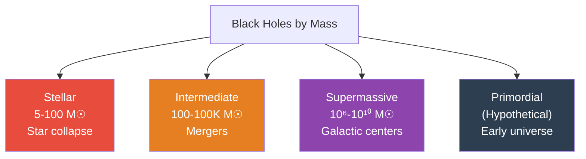
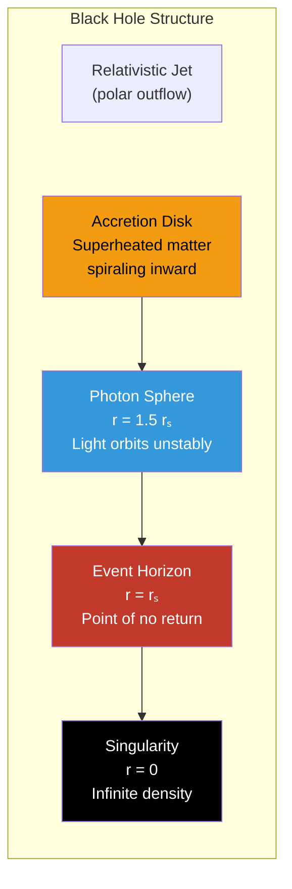
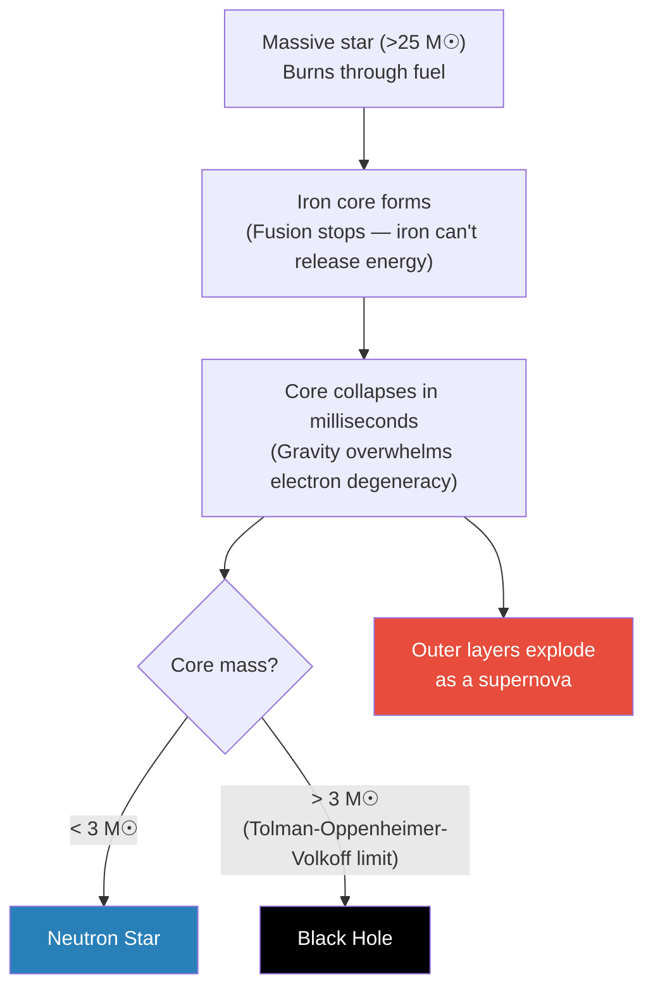

# Black Holes

A black hole is a region of spacetime where gravity is so extreme that **nothing — not even light — can escape** once it crosses the event horizon. Predicted by Einstein's general relativity (1915) and first imaged by the Event Horizon Telescope (2019).

---

## Quick Facts

| Property | Details |
|----------|---------|
| **Formed from** | Massive star collapse, direct collapse, or mergers |
| **Key boundary** | Event horizon — the point of no return |
| **Singularity** | Infinitely dense point (or ring) at the center — where physics breaks down |
| **Information paradox** | Quantum mechanics says information can't be destroyed; GR says it disappears at the singularity |
| **First image** | M87* — captured by the Event Horizon Telescope, released April 2019 |
| **First detection** | Cygnus X-1 — identified as a black hole candidate in the 1970s |

---

## Types of Black Holes

| Type | Mass | Size (Schwarzschild Radius) | Formation |
|------|------|---------------------------|-----------|
| **Stellar** | 5–100 M☉ | ~15–300 km | Core collapse of massive stars |
| **Intermediate** | 100–100,000 M☉ | ~300 km–AU scale | Mergers or runaway collisions in star clusters |
| **Supermassive** | 10⁶–10¹⁰ M☉ | AU to solar-system scale | Found at galactic centers; formation debated |
| **Primordial** (hypothetical) | Any (even tiny) | Subatomic to large | Density fluctuations in the early universe |

---

## Anatomy of a Black Hole

| Component | Description |
|-----------|-------------|
| **Singularity** | Infinitely dense point where all the mass is concentrated; spacetime curvature becomes infinite |
| **Event horizon** | The boundary at the Schwarzschild radius — once crossed, escape velocity exceeds the speed of light |
| **Photon sphere** | At 1.5× the Schwarzschild radius; photons can orbit the black hole (unstably) |
| **Ergosphere** | Region around a spinning black hole where spacetime is dragged along; objects here *must* rotate with the black hole |
| **Accretion disk** | Superheated matter spiraling inward; friction heats it to millions of degrees, emitting X-rays |
| **Relativistic jets** | Narrow beams of plasma launched from the poles at near light speed; powered by magnetic fields in the accretion disk |

### The Schwarzschild Radius

The radius of the event horizon for a non-rotating black hole:

$$r_s = \frac{2GM}{c^2}$$

| Object | If compressed to a black hole | Schwarzschild Radius |
|--------|------------------------------|---------------------|
| Earth | 5.97 × 10²⁴ kg | ~8.9 mm |
| Sun | 1.99 × 10³⁰ kg | ~3 km |
| Sagittarius A* | ~4 million M☉ | ~12 million km |
| M87* | ~6.5 billion M☉ | ~19 billion km |

---

## How Stellar Black Holes Form

1. A massive star (>25 solar masses) exhausts its nuclear fuel
2. Fusion stops at iron — fusing iron *absorbs* energy rather than releasing it
3. The core collapses under gravity within milliseconds
4. If the remnant core exceeds ~3 solar masses (TOV limit), no known force can stop the collapse
5. The core collapses to a singularity, and an event horizon forms
6. The outer layers rebound off the core and explode as a **supernova**

---

## Key Physics

### Gravitational Time Dilation

Near a black hole, time passes slower relative to a distant observer. At the event horizon, time effectively **stops** from an outside perspective.

| Location | Time Effect |
|----------|------------|
| Far from black hole | Normal time flow |
| Near event horizon | Clocks tick increasingly slower |
| At event horizon | Time stops (from outside observer's view) |
| Inside event horizon | Spatial and time dimensions swap — moving forward in time means moving toward the singularity |

### Spaghettification

In a stellar black hole, the difference in gravitational pull between your head and feet (the **tidal force**) stretches you into a thin strand as you approach. For supermassive black holes, the event horizon is so large that tidal forces at the crossing point are gentle — you'd cross without immediate discomfort.

### Hawking Radiation

Stephen Hawking (1974) predicted that black holes aren't truly black — they emit faint thermal radiation due to quantum effects near the event horizon.

| Aspect | Details |
|--------|---------|
| **Mechanism** | Virtual particle-antiparticle pairs form near the event horizon; one falls in, the other escapes as real radiation |
| **Temperature** | Inversely proportional to mass — smaller black holes are hotter |
| **Evaporation** | Over immense timescales, black holes lose mass and eventually evaporate completely |
| **Timescale** | A stellar black hole would take ~10⁶⁷ years to evaporate — far longer than the age of the universe (13.8 × 10⁹ years) |
| **Information paradox** | If a black hole evaporates, what happens to the information that fell in? Still unresolved |

!!! warning "The information paradox"
    Quantum mechanics demands that information is conserved — you can always (in principle) reconstruct the past from the present. But if matter falls into a black hole and the black hole eventually evaporates into featureless thermal radiation, the information appears lost. Resolving this paradox likely requires a theory of quantum gravity.

---

## Detecting Black Holes

Black holes don't emit light, so they're detected indirectly:

| Method | How It Works | Example |
|--------|-------------|---------|
| **X-ray binaries** | Matter from a companion star falls onto the black hole, heating to millions of degrees and emitting X-rays | Cygnus X-1 |
| **Gravitational lensing** | Black hole's gravity bends light from background objects, creating arcs or rings | Einstein crosses and rings |
| **Stellar orbits** | Stars near a massive invisible object orbit at high speeds | S2 star orbiting Sgr A* |
| **Gravitational waves** | Merging black holes produce ripples in spacetime detected by LIGO/Virgo | GW150914 (first detection, 2015) |
| **Direct imaging** | Event Horizon Telescope resolves the "shadow" of the black hole against its glowing accretion disk | M87* (2019), Sgr A* (2022) |

---

## Famous Black Holes

| Black Hole | Type | Mass | Significance |
|-----------|------|------|-------------|
| **Sagittarius A*** | Supermassive | ~4 million M☉ | Center of our Milky Way; imaged by EHT (2022) |
| **M87*** | Supermassive | ~6.5 billion M☉ | First black hole ever imaged (2019); powerful jet |
| **Cygnus X-1** | Stellar | ~21 M☉ | First widely accepted black hole (1970s); X-ray binary |
| **GW150914** | Stellar merger | 36 + 29 → 62 M☉ | First gravitational wave detection (2015) |
| **TON 618** | Supermassive | ~66 billion M☉ | One of the most massive known black holes |
| **Phoenix A** | Ultramassive | ~100 billion M☉ | Largest known black hole (as of 2024) |

---

## Rotating Black Holes — Kerr Solution

Most real black holes spin (they inherit angular momentum from their parent star). The **Kerr metric** describes them:

| Feature | Non-Rotating (Schwarzschild) | Rotating (Kerr) |
|---------|---------------------------|-----------------|
| **Singularity** | Point | Ring |
| **Event horizons** | One | Two (inner + outer) |
| **Ergosphere** | None | Yes — region where spacetime is dragged |
| **Frame dragging** | None | Spacetime itself rotates around the black hole |
| **Energy extraction** | Not possible | Penrose process — extract rotational energy |

!!! note "The Penrose process"
    In the ergosphere of a spinning black hole, it's theoretically possible to extract energy. An object entering the ergosphere can split — one piece falls into the black hole (reducing its spin), while the other escapes with *more* energy than the original object had. This could extract up to 29% of a black hole's mass-energy.

---

??? question "Interview Questions"

    **Q: What is an event horizon?**
    The boundary around a black hole beyond which the escape velocity exceeds the speed of light. It's not a physical surface — it's a mathematical boundary in spacetime. Once crossed, all paths (even light's) lead inward toward the singularity. For a non-rotating black hole, it's a sphere with radius rₛ = 2GM/c².

    **Q: How do we know black holes exist if we can't see them?**
    Multiple lines of evidence: (1) X-ray emissions from superheated accretion disks in binary systems (Cygnus X-1), (2) stars orbiting invisible massive objects (S2 around Sgr A*), (3) gravitational waves from merging black holes (LIGO, 2015), (4) direct imaging of the "shadow" by the Event Horizon Telescope (M87*, 2019). Each method independently confirms their existence.

    **Q: What is Hawking radiation and why is it important?**
    Thermal radiation emitted by black holes due to quantum effects near the event horizon. Virtual particle pairs form; one falls in while the other escapes. It implies black holes have a temperature, entropy, and will eventually evaporate. Its importance: it bridges quantum mechanics and general relativity and creates the information paradox — one of physics' biggest unsolved problems.

    **Q: What happens at the singularity?**
    According to general relativity, matter is compressed to infinite density and spacetime curvature becomes infinite — the math "breaks." This is widely believed to signal the theory's breakdown rather than physical reality. A complete theory of quantum gravity (unifying GR and quantum mechanics) is expected to resolve what actually happens at the center.

    **Q: What is the difference between a stellar and supermassive black hole?**
    Stellar black holes form from the collapse of massive stars (5–100 M☉, radius ~km scale). Supermassive black holes sit at the centers of galaxies (10⁶–10¹⁰ M☉, radius ~AU to solar-system scale). Their formation is less understood — possibly from direct collapse of gas clouds, rapid mergers in the early universe, or growth from seed black holes.

    **Q: Could you survive crossing the event horizon of a supermassive black hole?**
    Briefly, yes. For a supermassive black hole, the event horizon is so large that tidal forces there are weak — you'd cross without being torn apart. For a stellar black hole, tidal forces would spaghettify you well before reaching the horizon. In either case, once inside, reaching the singularity is inevitable.

!!! tip "Further Reading"
    - [Event Horizon Telescope](https://eventhorizontelescope.org/) — first direct images of black holes
    - [LIGO Scientific Collaboration](https://www.ligo.org/) — gravitational wave detection
    - [Kip Thorne, *The Science of Interstellar*](https://www.kipt.caltech.edu/) — accessible deep dive into black hole physics
    - [Hawking, *A Brief History of Time*](https://en.wikipedia.org/wiki/A_Brief_History_of_Time) — foundational popular science on black holes and cosmology
