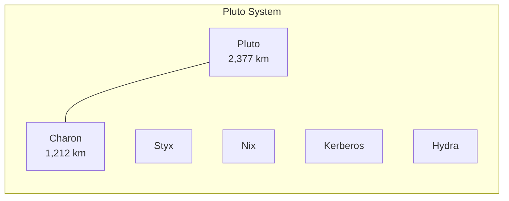
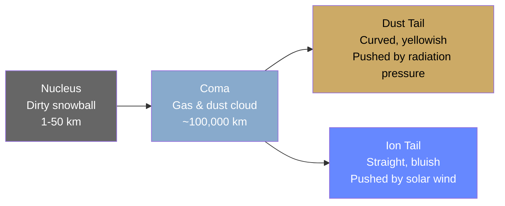

# Dwarf Planets & Small Bodies

Beyond the eight major planets, the solar system teems with smaller objects — dwarf planets, asteroids, comets, and icy bodies that hold clues to the solar system's formation. These are the leftovers: material that never coalesced into a full planet.

---

## Dwarf Planets

A dwarf planet orbits the Sun, has enough mass for gravity to pull it into a roughly spherical shape, but **has not cleared its orbital neighborhood** of other debris — the key distinction from a full planet.

| Dwarf Planet | Location | Diameter | Notable Feature |
|-------------|----------|----------|-----------------|
| **Pluto** | Kuiper Belt | 2,377 km | Nitrogen ice glaciers, thin atmosphere, 5 moons |
| **Eris** | Scattered disk | 2,326 km | Most massive known dwarf planet; triggered Pluto's reclassification |
| **Haumea** | Kuiper Belt | ~1,632 km | Elongated shape, rapid rotation (3.9 hr), has rings |
| **Makemake** | Kuiper Belt | ~1,430 km | Extremely cold (~−243°C), reddish surface |
| **Ceres** | Asteroid Belt | 939 km | Largest object in the asteroid belt; has bright salt deposits |

### Pluto

| Feature | Details |
|---------|---------|
| **Surface** | Nitrogen, methane, and carbon monoxide ices; Sputnik Planitia is a 1,000 km heart-shaped nitrogen ice plain |
| **Atmosphere** | Thin nitrogen atmosphere that expands and collapses with Pluto's eccentric orbit |
| **Charon** | Half Pluto's size — they orbit a common center of mass (barycenter) outside Pluto; essentially a double dwarf planet |
| **Orbit** | 248-year period; eccentric and inclined 17° to the ecliptic; sometimes closer to the Sun than Neptune |
| **Reclassification** | Reclassified from planet to dwarf planet by the IAU in 2006 after the discovery of similar-sized Kuiper Belt objects |

!!! note "Why Pluto was reclassified"
    The discovery of Eris (slightly more massive than Pluto) forced astronomers to either call Eris a planet too — potentially adding dozens more — or redefine "planet." The IAU chose the latter, adding the requirement that a planet must have "cleared the neighborhood around its orbit." Pluto shares the Kuiper Belt with thousands of similar objects.

---

## The Asteroid Belt

A region between Mars (~2.1 AU) and Jupiter (~3.3 AU) containing millions of rocky and metallic bodies.

| Fact | Details |
|------|---------|
| **Total mass** | ~4% of the Moon's mass — surprisingly sparse |
| **Largest object** | Ceres (939 km) — promoted to dwarf planet |
| **Composition** | C-type (carbonaceous, ~75%), S-type (silicaceous, ~17%), M-type (metallic, ~8%) |
| **Spacing** | Average distance between asteroids is ~1 million km — not the dense field of sci-fi |
| **Origin** | Material that never formed a planet due to Jupiter's gravitational influence |

### Asteroid Types

| Type | Composition | Location | Example |
|------|-------------|----------|---------|
| **C-type** | Carbon-rich, dark | Outer belt | Hygiea |
| **S-type** | Silicate (rocky) | Inner belt | Eros |
| **M-type** | Iron-nickel metal | Middle belt | Psyche |

!!! note "Kirkwood gaps"
    The asteroid belt has distinct gaps at specific distances corresponding to orbital resonances with Jupiter (e.g., 3:1, 5:2, 2:1). Asteroids at these distances get periodically nudged by Jupiter's gravity until they're ejected from that orbit, leaving a gap.

---

## Comets

Icy bodies that develop a visible **coma** (gas cloud) and **tail** when they approach the Sun and ices sublimate.

### Anatomy of a Comet

| Component | Description |
|-----------|-------------|
| **Nucleus** | Solid body of ice (H₂O, CO₂, CO), dust, and rock — typically 1–50 km |
| **Coma** | Cloud of gas and dust released as ices sublimate near the Sun |
| **Dust tail** | Curved tail of dust particles pushed by solar radiation pressure |
| **Ion tail** | Straight tail of ionized gas pushed directly away from the Sun by solar wind |

### Comet Origins

| Source | Period | Examples |
|--------|--------|----------|
| **Kuiper Belt** (30–50 AU) | Short-period (<200 years) | Halley's Comet (76 yr), Comet Encke (3.3 yr) |
| **Oort Cloud** (~2,000–100,000 AU) | Long-period (>200 years) | Comet Hale-Bopp (~2,500 yr), Comet NEOWISE |

---

## The Kuiper Belt

A donut-shaped region of icy bodies extending from Neptune's orbit (~30 AU) to roughly 50 AU.

| Fact | Details |
|------|---------|
| **Predicted by** | Gerard Kuiper (1951), later confirmed (1992) |
| **Estimated objects** | Hundreds of thousands of bodies >100 km; trillions of smaller ones |
| **Notable members** | Pluto, Eris, Makemake, Haumea, Quaoar |
| **Composition** | Water ice, methane, ammonia — "frozen leftovers" from solar system formation |
| **Relationship to Neptune** | Many KBOs are in orbital resonance with Neptune (e.g., plutinos in 3:2 resonance) |

---

## The Oort Cloud

A theoretical **spherical shell** of icy bodies at the outermost edge of the Sun's gravitational influence.

| Fact | Details |
|------|---------|
| **Distance** | ~2,000 to ~100,000 AU (nearly halfway to the nearest star) |
| **Estimated objects** | ~2 trillion bodies |
| **Evidence** | Inferred from the orbits of long-period comets arriving from random directions |
| **Never directly observed** | Too distant and too faint for current telescopes |
| **Origin** | Icy planetesimals ejected outward by the giant planets during early solar system evolution |

---

## Near-Earth Objects (NEOs)

Asteroids and comets whose orbits bring them close to Earth (within 1.3 AU of the Sun).

| Classification | Orbit Characteristics |
|---------------|----------------------|
| **Atira** | Orbit entirely inside Earth's |
| **Aten** | Semi-major axis < 1 AU, crosses Earth's orbit |
| **Apollo** | Semi-major axis > 1 AU, crosses Earth's orbit |
| **Amor** | Approaches but doesn't cross Earth's orbit |

!!! warning "Planetary defense"
    NASA's Planetary Defense Coordination Office tracks ~34,000 known NEOs. The DART mission (2022) successfully demonstrated asteroid deflection by impacting Dimorphos, changing its orbital period by 33 minutes — proving kinetic impact as a viable defense strategy.

---

??? question "Interview Questions"

    **Q: What is the difference between an asteroid and a comet?**
    Composition and behavior. Asteroids are rocky/metallic bodies primarily found in the inner solar system (asteroid belt). Comets are icy bodies from the Kuiper Belt or Oort Cloud that develop a coma and tails when heated by the Sun. Some objects blur this line — "active asteroids" in the belt can show comet-like behavior.

    **Q: Why was Pluto reclassified as a dwarf planet?**
    The 2006 IAU definition requires a planet to: (1) orbit the Sun, (2) have enough mass for hydrostatic equilibrium (round shape), and (3) have cleared its orbital neighborhood. Pluto meets the first two but shares the Kuiper Belt with thousands of similar objects, failing the third criterion.

    **Q: What is the Oort Cloud and how do we know it exists?**
    A hypothesized spherical shell of icy bodies at 2,000–100,000 AU. It has never been directly observed. Its existence is inferred from long-period comets that arrive from random directions and highly elliptical orbits — they must originate from a spherically distributed source, not the disk-shaped Kuiper Belt.

    **Q: How do Kirkwood gaps form in the asteroid belt?**
    Through orbital resonance with Jupiter. At distances where an asteroid's orbital period is a simple fraction of Jupiter's (e.g., 3:1 means the asteroid orbits 3× for every 1 Jupiter orbit), it receives periodic gravitational kicks at the same orbital position. Over millions of years, these perturbations accumulate and eject the asteroid from that orbit.

    **Q: What did the DART mission demonstrate?**
    That humanity can deflect an asteroid using kinetic impact. In September 2022, the DART spacecraft deliberately crashed into Dimorphos (a 160m moonlet of asteroid Didymos) at 6.1 km/s, shortening its orbital period by 33 minutes (from 11 hr 55 min to 11 hr 23 min) — far exceeding the minimum threshold for success.

!!! tip "Further Reading"
    - [NASA New Horizons (Pluto)](https://www.nasa.gov/mission_pages/newhorizons/main/index.html) — the mission that revealed Pluto
    - [NASA DART Mission](https://dart.jhuapl.edu/) — planetary defense demonstration
    - [Minor Planet Center](https://www.minorplanetcenter.net/) — official catalog of asteroid and comet orbits
