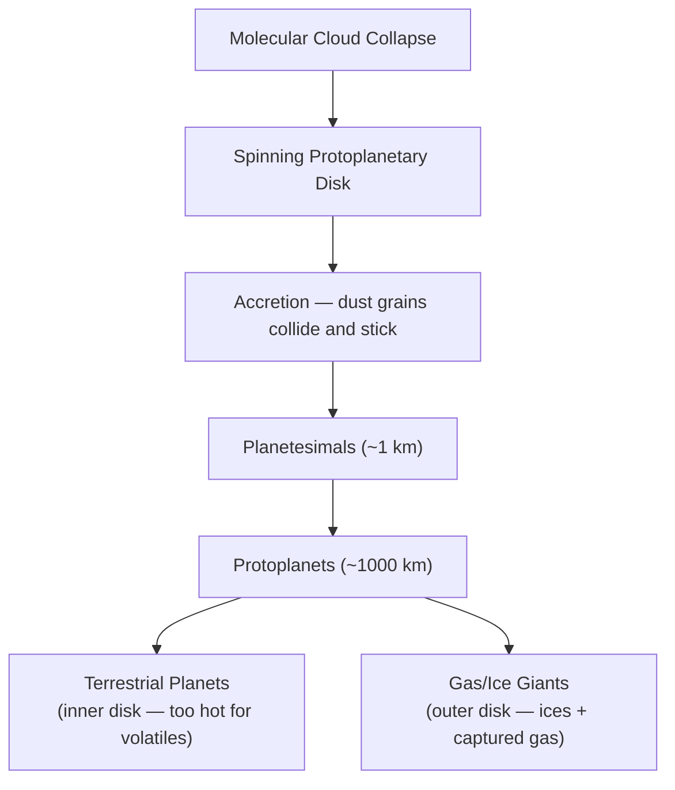

# Solar System

Our solar system formed ~4.6 billion years ago from a collapsing cloud of gas and dust. It contains one star, eight planets, dwarf planets, moons, asteroids, comets, and vast amounts of dust and gas — all bound by the Sun's gravity.

---

## Structure Overview

| Zone | Contents |
|------|----------|
| **Inner solar system** | Mercury, Venus, Earth, Mars — small, rocky, dense |
| **Asteroid belt** | Millions of rocky bodies between Mars and Jupiter |
| **Outer solar system** | Jupiter, Saturn, Uranus, Neptune — large, gaseous/icy |
| **Kuiper Belt** | Icy bodies beyond Neptune (includes Pluto) |
| **Oort Cloud** | Hypothesized spherical shell of comets at the solar system's edge |

---

## Planets at a Glance

| Planet | Type | Distance from Sun (AU) | Diameter (km) | Moons | Notable Feature |
|--------|------|----------------------|----------------|-------|-----------------|
| Mercury | Rocky | 0.39 | 4,879 | 0 | Extreme temperature swings |
| Venus | Rocky | 0.72 | 12,104 | 0 | Runaway greenhouse effect |
| Earth | Rocky | 1.00 | 12,756 | 1 | Liquid water, life |
| Mars | Rocky | 1.52 | 6,792 | 2 | Olympus Mons, iron oxide surface |
| Jupiter | Gas giant | 5.20 | 142,984 | 95 | Great Red Spot, strongest magnetic field |
| Saturn | Gas giant | 9.58 | 120,536 | 146 | Prominent ring system |
| Uranus | Ice giant | 19.22 | 51,118 | 28 | Rotates on its side (98° axial tilt) |
| Neptune | Ice giant | 30.05 | 49,528 | 16 | Fastest winds in the solar system |

!!! note "1 AU (Astronomical Unit)"
    1 AU = ~149.6 million km — the average distance from Earth to the Sun. Used as the standard unit for measuring solar system distances.

---

## Topic Breakdown

| Topic | What It Covers |
|-------|---------------|
| [The Sun](the-sun.md) | Structure, nuclear fusion, solar phenomena, and the Sun's lifecycle |
| [Inner Planets](inner-planets.md) | Mercury, Venus, Earth, and Mars — the four terrestrial worlds |
| [Outer Planets](outer-planets.md) | Jupiter, Saturn, Uranus, and Neptune — gas and ice giants |
| [Dwarf Planets & Small Bodies](dwarf-planets-and-small-bodies.md) | Pluto, the asteroid belt, comets, and the Kuiper Belt |

---

## Formation — The Nebular Hypothesis

1. A cloud of hydrogen, helium, and dust collapsed under gravity
2. Conservation of angular momentum flattened it into a rotating disk
3. The center heated up and ignited — becoming the Sun
4. In the disk, particles collided and accreted into larger bodies
5. Inner disk was too hot for ices — only rock and metal survived → rocky planets
6. Outer disk retained ices — massive cores captured hydrogen and helium → giant planets

!!! tip "Further Reading"
    - [NASA Solar System Exploration](https://solarsystem.nasa.gov/) — interactive exploration of every body in the solar system
    - [The Planetary Society](https://www.planetary.org/) — space science education and advocacy
