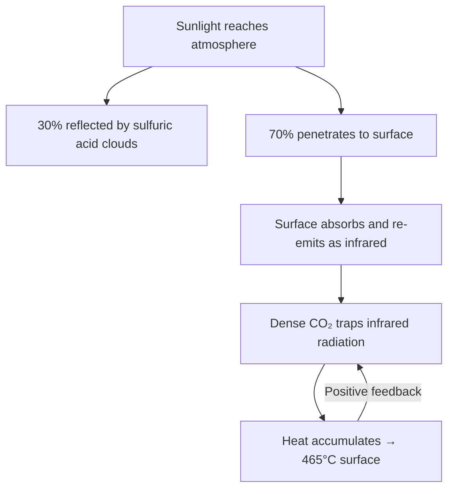
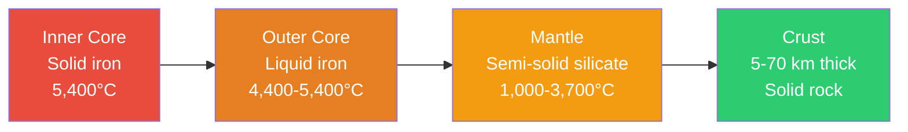
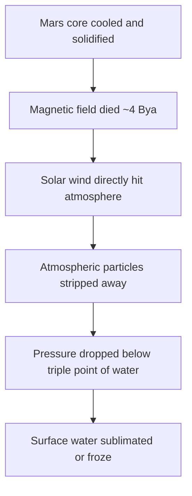

# Inner Planets

The four **terrestrial planets** — Mercury, Venus, Earth, and Mars — occupy the inner solar system. They share common traits: rocky composition, solid surfaces, relatively small size, and few or no moons. Their proximity to the Sun meant that volatile ices were driven off during formation, leaving behind rock and metal.

---

## Comparison

| Property | Mercury | Venus | Earth | Mars |
|----------|---------|-------|-------|------|
| **Distance from Sun** | 0.39 AU | 0.72 AU | 1.00 AU | 1.52 AU |
| **Diameter** | 4,879 km | 12,104 km | 12,756 km | 6,792 km |
| **Mass (Earth = 1)** | 0.055 | 0.815 | 1.000 | 0.107 |
| **Gravity (m/s²)** | 3.7 | 8.87 | 9.81 | 3.72 |
| **Day length** | 59 Earth days | 243 Earth days | 24 hours | 24.6 hours |
| **Year length** | 88 Earth days | 225 Earth days | 365.25 days | 687 Earth days |
| **Atmosphere** | None (trace) | Dense CO₂ | N₂ + O₂ | Thin CO₂ |
| **Surface temp** | −180 to 430°C | ~465°C | −89 to 57°C | −140 to 20°C |
| **Moons** | 0 | 0 | 1 | 2 |
| **Magnetic field** | Weak (global) | None | Strong (global) | None (remnant) |

---

## Mercury

The smallest planet and closest to the Sun. Despite its proximity, it's not the hottest — that title goes to Venus.

### Key Features

| Feature | Details |
|---------|---------|
| **Surface** | Heavily cratered (resembles the Moon); Caloris Basin is 1,550 km wide |
| **Temperature extremes** | −180°C (night) to 430°C (day) — no atmosphere to retain heat |
| **Iron core** | Enormous relative to its size (~75% of its radius) — gives it a weak magnetic field |
| **Orbit** | Highly eccentric (0.206); closest approach to Sun: 46M km, farthest: 70M km |
| **Spin-orbit resonance** | Rotates 3× for every 2 orbits (3:2 resonance) |
| **No atmosphere** | Only a thin exosphere of sodium, helium, and oxygen sputtered from the surface |

!!! note "Einstein's proof"
    Mercury's orbital precession couldn't be explained by Newtonian mechanics alone. Einstein's general relativity correctly predicted the extra 43 arcseconds/century of precession — one of the theory's earliest confirmations.

---

## Venus

Earth's "twin" in size — but a hellish world with a runaway greenhouse effect.

### Key Features

| Feature | Details |
|---------|---------|
| **Atmosphere** | 96.5% CO₂, surface pressure 92× Earth's (equivalent to 900m underwater) |
| **Temperature** | ~465°C everywhere — hotter than Mercury, day or night |
| **Rotation** | Retrograde (clockwise) and extremely slow — a Venus day > a Venus year |
| **Surface** | Volcanic plains, shield volcanoes, possibly active volcanism today |
| **Clouds** | Thick sulfuric acid clouds reflecting 70% of sunlight (high albedo) |
| **Greenhouse effect** | Dense CO₂ traps heat — a cautionary tale for runaway warming |

### Why Venus Is So Hot

!!! warning "Runaway greenhouse"
    Venus likely had liquid water early in its history. As the Sun brightened, oceans evaporated → water vapor (a greenhouse gas) trapped more heat → more evaporation → all water lost. CO₂ from volcanic outgassing accumulated without an ocean to absorb it.

---

## Earth

The only known planet with liquid water on its surface, an oxygen-rich atmosphere, and life.

### What Makes Earth Habitable

| Factor | Role |
|--------|------|
| **Goldilocks zone** | 1 AU from the Sun — right distance for liquid water |
| **Magnetic field** | Deflects solar wind, protects atmosphere from being stripped |
| **Plate tectonics** | Recycles carbon, regulates climate over geological timescales |
| **Large moon** | Stabilizes axial tilt (23.5°), giving predictable seasons |
| **Atmosphere** | 78% N₂, 21% O₂ — greenhouse effect keeps surface ~33°C warmer than bare rock |

### Earth's Internal Structure

| Layer | Thickness | Composition |
|-------|-----------|-------------|
| **Crust** | 5–70 km | Silicates; oceanic (basalt) vs continental (granite) |
| **Mantle** | ~2,900 km | Semi-solid silicate rock; convection drives plate tectonics |
| **Outer core** | ~2,200 km | Liquid iron-nickel; convection generates the magnetic field |
| **Inner core** | ~1,220 km radius | Solid iron-nickel; grows ~1 mm/year as outer core solidifies |

---

## Mars

The "Red Planet" — iron oxide (rust) gives it its color. The most explored planet after Earth, and the primary target for future human colonization.

### Key Features

| Feature | Details |
|---------|---------|
| **Olympus Mons** | Largest volcano in the solar system — 21.9 km high, 600 km wide |
| **Valles Marineris** | Canyon system stretching 4,000 km — 10× longer than the Grand Canyon |
| **Polar ice caps** | Water ice + dry ice (CO₂); grow and shrink with seasons |
| **Atmosphere** | 95% CO₂, extremely thin (~0.6% of Earth's pressure) |
| **Water evidence** | Ancient river valleys, lake beds, subsurface ice confirmed |
| **Moons** | Phobos and Deimos — likely captured asteroids |

### Why Mars Lost Its Atmosphere

Mars' small size meant its interior cooled faster than Earth's, shutting down the dynamo that powered its magnetic field. Without magnetic protection, the solar wind eroded the atmosphere over billions of years.

!!! note "Mars exploration"
    As of 2025, Mars has been visited by 50+ missions. Active surface missions include NASA's Perseverance rover and Ingenuity helicopter (first powered flight on another planet). China's Zhurong rover operated in Utopia Planitia.

---

??? question "Interview Questions"

    **Q: Why is Venus hotter than Mercury despite being farther from the Sun?**
    Venus has a dense CO₂ atmosphere (92× Earth's pressure) that creates an extreme greenhouse effect, trapping heat uniformly across the planet. Mercury has virtually no atmosphere, so heat escapes freely on the night side. Venus' surface is ~465°C everywhere; Mercury ranges from −180°C to 430°C.

    **Q: What makes Earth habitable compared to its neighbors?**
    Five key factors: (1) distance from the Sun allowing liquid water, (2) a strong magnetic field protecting the atmosphere, (3) plate tectonics recycling carbon and regulating climate, (4) a large Moon stabilizing axial tilt for stable seasons, and (5) an atmosphere with the right greenhouse balance.

    **Q: Why does Mars appear red?**
    Iron oxide (rust) in the surface soil and dust. Mars' surface is rich in iron minerals that oxidized over billions of years. Fine iron oxide dust is also suspended in the atmosphere, giving the sky a butterscotch tint.

    **Q: What evidence suggests Mars once had liquid water?**
    Ancient river channels, delta deposits (Jezero Crater), lake bed sediments, hydrated minerals (clays, sulfates), polar ice caps, and subsurface ice detected by radar. The Curiosity and Perseverance rovers have found direct geochemical evidence of past aqueous environments.

    **Q: What is Mercury's 3:2 spin-orbit resonance?**
    Mercury rotates exactly 3 times on its axis for every 2 orbits around the Sun. This means a solar day on Mercury (sunrise to sunrise) lasts 176 Earth days — two full Mercury years. This resonance was likely caused by tidal forces from the Sun slowing Mercury's rotation.

!!! tip "Further Reading"
    - [NASA Mars Exploration Program](https://mars.nasa.gov/) — missions, discoveries, and plans for human exploration
    - [ESA Venus Express Results](https://www.esa.int/Science_Exploration/Space_Science/Venus_Express) — European mission findings on Venus' atmosphere
    - [MESSENGER Mission (Mercury)](https://messenger.jhuapl.edu/) — comprehensive Mercury science from orbit
