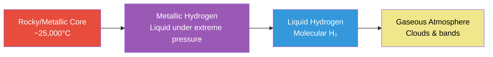
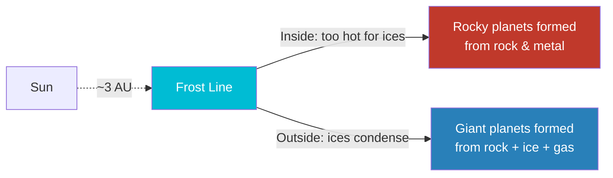

# Outer Planets

The four **giant planets** — Jupiter, Saturn, Uranus, and Neptune — dominate the outer solar system. They formed beyond the **frost line** (~3 AU), where temperatures were low enough for ices (water, ammonia, methane) to condense. This gave their cores extra material to grow massive and capture thick envelopes of hydrogen and helium.

They split into two categories:

| Type | Planets | Composition |
|------|---------|-------------|
| **Gas giants** | Jupiter, Saturn | Mostly hydrogen and helium; no solid surface |
| **Ice giants** | Uranus, Neptune | Hydrogen/helium atmosphere over a mantle of water, ammonia, and methane ices |

---

## Comparison

| Property | Jupiter | Saturn | Uranus | Neptune |
|----------|---------|--------|--------|---------|
| **Distance from Sun** | 5.20 AU | 9.58 AU | 19.22 AU | 30.05 AU |
| **Diameter** | 142,984 km | 120,536 km | 51,118 km | 49,528 km |
| **Mass (Earth = 1)** | 317.8 | 95.2 | 14.5 | 17.1 |
| **Day length** | 9.9 hours | 10.7 hours | 17.2 hours | 16.1 hours |
| **Year length** | 11.9 years | 29.4 years | 84.0 years | 164.8 years |
| **Known moons** | 95 | 146 | 28 | 16 |
| **Ring system** | Faint | Prominent | Faint, vertical | Faint |
| **Mean temp (cloud tops)** | −110°C | −140°C | −195°C | −200°C |

---

## Jupiter

The **largest planet** — more massive than all other planets combined. A failed star that never accumulated enough mass to ignite nuclear fusion.

### Key Features

| Feature | Details |
|---------|---------|
| **Great Red Spot** | A storm larger than Earth, raging for 350+ years; winds up to 680 km/h |
| **Composition** | ~90% hydrogen, ~10% helium — similar to the Sun |
| **Magnetic field** | Strongest in the solar system — 20,000× Earth's; creates intense radiation belts |
| **Interior** | No solid surface; hydrogen compresses into metallic liquid hydrogen at depth |
| **Galilean moons** | Io, Europa, Ganymede, Callisto — each a world unto itself |
| **Rotation** | Fastest-spinning planet (9.9-hour day); creates visible equatorial bulge |

### Internal Structure

!!! note "Metallic hydrogen"
    At ~2 million atmospheres of pressure, hydrogen molecules are crushed so tightly that electrons roam freely — behaving like a liquid metal. This layer generates Jupiter's immense magnetic field through convection-driven dynamo action.

### The Galilean Moons

| Moon | Diameter | Key Feature |
|------|----------|-------------|
| **Io** | 3,643 km | Most volcanically active body in the solar system; tidal heating from Jupiter |
| **Europa** | 3,122 km | Subsurface ocean beneath an ice shell; top candidate for extraterrestrial life |
| **Ganymede** | 5,268 km | Largest moon in the solar system; bigger than Mercury; has its own magnetic field |
| **Callisto** | 4,821 km | Most heavily cratered body known; ancient, geologically dead surface |

---

## Saturn

The **ringed planet** — famous for its spectacular ring system visible from small telescopes.

### Key Features

| Feature | Details |
|---------|---------|
| **Rings** | Mostly water ice particles (cm to m sized); span 280,000 km but only ~10 m thick |
| **Density** | 0.687 g/cm³ — less dense than water; Saturn would float in a large enough bathtub |
| **Hexagonal storm** | A persistent hexagonal weather pattern at the north pole — each side ~14,000 km |
| **Winds** | Equatorial winds reach 1,800 km/h |
| **Composition** | Similar to Jupiter — H₂/He atmosphere, no solid surface |
| **Ring age** | Possibly young (~100 million years) — may be temporary on cosmic timescales |

### Saturn's Ring System

| Ring | Distance from Saturn | Characteristics |
|------|---------------------|-----------------|
| **D Ring** | 66,900–74,510 km | Faintest, innermost |
| **C Ring** | 74,658–92,000 km | Transparent, "crepe ring" |
| **B Ring** | 92,000–117,580 km | Brightest and densest |
| **Cassini Division** | 117,580–122,170 km | Gap caused by Mimas orbital resonance |
| **A Ring** | 122,170–136,775 km | Contains Encke and Keeler gaps |
| **F Ring** | 140,180 km | Narrow, braided; shepherded by Prometheus and Pandora |

### Notable Moons

| Moon | Feature |
|------|---------|
| **Titan** | Second-largest moon in solar system; thick nitrogen atmosphere; liquid methane lakes — the only other body with stable surface liquids |
| **Enceladus** | Geysers of water ice erupting from a subsurface ocean through "tiger stripe" fractures; another candidate for life |

---

## Uranus

The **sideways planet** — it rotates on its side with an axial tilt of 98°, likely from a massive ancient collision.

### Key Features

| Feature | Details |
|---------|---------|
| **Axial tilt** | 98° — essentially rolls around the Sun on its side |
| **Color** | Pale blue-green from methane in the upper atmosphere absorbing red light |
| **Interior** | "Icy" mantle of water, methane, and ammonia above a rocky core |
| **Temperature** | Coldest planetary atmosphere: −224°C (colder than Neptune despite being closer to Sun) |
| **Rings** | 13 narrow, dark rings — discovered in 1977 during a stellar occultation |
| **Seasons** | Each pole gets ~42 years of continuous sunlight, then ~42 years of darkness |

!!! note "The coldest planet"
    Uranus radiates almost no internal heat (unlike Jupiter, Saturn, and Neptune). This may be because the collision that tipped it over also caused it to release its primordial heat, or because internal stratification prevents heat convection.

---

## Neptune

The **windiest planet** — extreme atmospheric dynamics despite receiving minimal solar energy.

### Key Features

| Feature | Details |
|---------|---------|
| **Winds** | Fastest in the solar system — up to 2,100 km/h (supersonic) |
| **Color** | Deep blue from methane; more vivid than Uranus |
| **Internal heat** | Radiates 2.6× more energy than it receives from the Sun |
| **Great Dark Spot** | Large storm system observed by Voyager 2 (1989) — since disappeared |
| **Triton** | Largest moon; orbits retrograde — likely a captured Kuiper Belt object |
| **Discovery** | First planet found by mathematical prediction (1846) — its gravity was perturbing Uranus' orbit |

### Triton

| Property | Details |
|----------|---------|
| **Diameter** | 2,707 km |
| **Surface temp** | −235°C (one of the coldest surfaces in the solar system) |
| **Geysers** | Nitrogen geysers erupt 8 km high |
| **Orbit** | Retrograde — spiraling inward; will eventually be torn apart by Neptune's gravity into a ring system |
| **Surface** | Nitrogen and methane ice; "cantaloupe terrain" unlike anything else in the solar system |

---

## The Frost Line

The frost line (snow line) at ~3 AU marks where water ice could condense in the protoplanetary disk. Beyond it, solid ices added to the available building material — allowing cores to grow massive enough (~10 Earth masses) to gravitationally capture hydrogen and helium gas.

---

??? question "Interview Questions"

    **Q: What is the difference between gas giants and ice giants?**
    Gas giants (Jupiter, Saturn) are dominated by hydrogen and helium with relatively small cores. Ice giants (Uranus, Neptune) have thick mantles of water, ammonia, and methane ices with smaller hydrogen/helium envelopes. Ice giants are ~15× Earth's mass vs ~100–300× for gas giants.

    **Q: Why does Europa excite astrobiologists?**
    Europa has a global subsurface ocean of liquid water beneath an ice shell, maintained by tidal heating from Jupiter's gravity. It likely has a rocky ocean floor with hydrothermal vents — similar to environments where life thrives on Earth. It has water, energy, and potentially the right chemistry.

    **Q: Why is Saturn's density less than water?**
    Saturn is mostly hydrogen and helium — the lightest elements. While its core is dense, the vast envelope of gas brings the average density to 0.687 g/cm³ (water is 1.0 g/cm³). It's essentially a giant ball of compressed gas with no solid surface.

    **Q: Why is Uranus tipped on its side?**
    The leading hypothesis is that an Earth-sized (or larger) protoplanet collided with Uranus during the solar system's formation, knocking it to a 98° axial tilt. This also explains its unusually cold interior — the collision may have caused it to release much of its primordial heat.

    **Q: How was Neptune discovered?**
    By mathematics. Astronomers noticed Uranus wasn't following its predicted orbit — something unseen was gravitationally perturbing it. In 1846, Urbain Le Verrier and John Couch Adams independently calculated where the perturbing body should be. Johann Galle pointed a telescope at Le Verrier's predicted position and found Neptune within 1° of the calculation.

!!! tip "Further Reading"
    - [NASA Juno Mission](https://www.nasa.gov/mission_pages/juno/main/index.html) — Jupiter science and discoveries
    - [Cassini-Huygens Legacy](https://solarsystem.nasa.gov/missions/cassini/overview/) — 13 years of Saturn exploration
    - [Europa Clipper Mission](https://europa.nasa.gov/) — upcoming mission to investigate Europa's habitability
