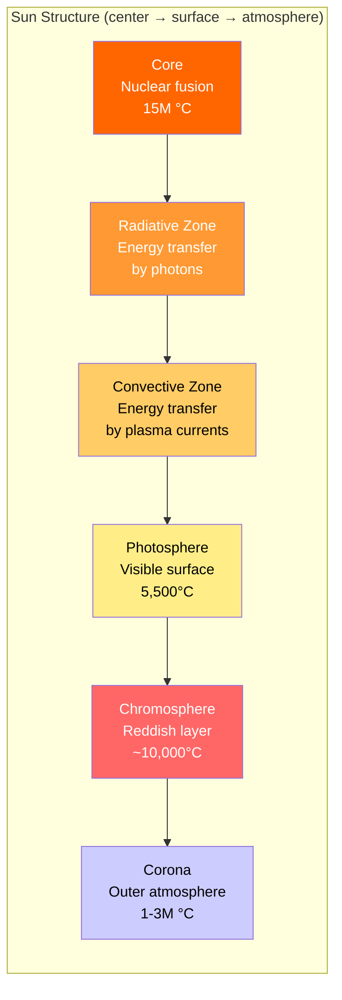
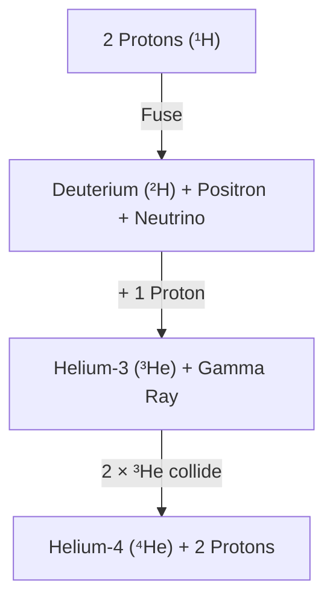
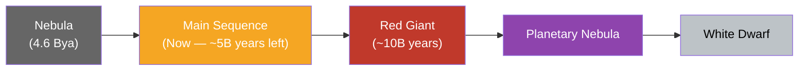

# The Sun

The Sun is a **G-type main-sequence star** (G2V) that contains 99.86% of the solar system's total mass. It drives weather, ocean currents, seasons, and climate on Earth — and its gravity holds the entire solar system together.

---

## Quick Facts

| Property | Value |
|----------|-------|
| **Age** | ~4.6 billion years |
| **Mass** | 1.989 × 10³⁰ kg (333,000× Earth) |
| **Diameter** | 1.39 million km (109× Earth) |
| **Surface temperature** | ~5,500°C |
| **Core temperature** | ~15 million°C |
| **Composition** | ~73% hydrogen, ~25% helium, ~2% heavier elements |
| **Spectral class** | G2V |
| **Distance from Earth** | ~149.6 million km (1 AU) |
| **Light travel time to Earth** | ~8 minutes 20 seconds |

---

## Internal Structure

| Layer | Depth | Key Characteristics |
|-------|-------|-------------------|
| **Core** | 0–0.25 R☉ | Nuclear fusion converts H → He; produces 3.8 × 10²⁶ W |
| **Radiative zone** | 0.25–0.7 R☉ | Photons bounce between particles — a photon takes ~170,000 years to cross |
| **Convective zone** | 0.7–1.0 R☉ | Hot plasma rises, cools, sinks — creates granulation on the surface |
| **Photosphere** | Surface (~500 km thick) | The "visible surface"; sunspots appear here |
| **Chromosphere** | ~2,000 km above surface | Visible during eclipses as a reddish ring |
| **Corona** | Extends millions of km | Paradoxically hotter than the surface; source of solar wind |

!!! warning "The coronal heating problem"
    The corona is ~300× hotter than the photosphere — violating the expectation that temperature drops with distance from the energy source. Leading theories involve magnetic reconnection and wave dissipation, but this remains one of solar physics' biggest open questions.

---

## Nuclear Fusion — The Proton-Proton Chain

The Sun generates energy by fusing hydrogen into helium in its core.

| Step | Reaction | Product |
|------|----------|---------|
| 1 | ¹H + ¹H → ²H + e⁺ + νₑ | Deuterium, positron, neutrino |
| 2 | ²H + ¹H → ³He + γ | Helium-3, gamma ray |
| 3 | ³He + ³He → ⁴He + 2¹H | Helium-4, two protons released |

**Net result**: 4 protons → 1 helium-4 + energy (26.7 MeV)

The "lost" mass (0.7% of the input) converts to energy via **E = mc²**. The Sun fuses ~600 million tons of hydrogen per second.

---

## Solar Phenomena

| Phenomenon | Description | Timescale |
|-----------|-------------|-----------|
| **Sunspots** | Dark, cooler regions on the photosphere caused by concentrated magnetic fields | Days to weeks |
| **Solar flares** | Sudden bursts of electromagnetic radiation from magnetic reconnection | Minutes to hours |
| **Coronal mass ejections (CMEs)** | Massive expulsions of magnetized plasma into space | Hours to days to reach Earth |
| **Solar wind** | Continuous stream of charged particles flowing outward | Constant |
| **Prominences** | Arcs of plasma suspended above the surface by magnetic fields | Days to months |

### The Solar Cycle

The Sun's magnetic activity follows an ~11-year cycle:

- At **solar minimum**: few sunspots, low flare/CME activity
- At **solar maximum**: many sunspots, frequent flares and CMEs
- The magnetic poles **flip** every cycle — a full magnetic cycle is ~22 years

!!! note "Space weather impact"
    Strong solar storms can disrupt GPS signals, damage satellites, overload power grids (the 1989 Quebec blackout was caused by a geomagnetic storm), and create auroras visible at low latitudes.

---

## Lifecycle of the Sun

| Stage | Duration | What Happens |
|-------|----------|-------------|
| **Main sequence** | ~10 billion years (current) | Stable H → He fusion in the core |
| **Red giant** | ~1 billion years | Core contracts, outer layers expand past Mars' orbit |
| **Helium flash** | Brief | Core reaches 100M°C, He → C fusion ignites |
| **Planetary nebula** | ~10,000 years | Outer layers expelled, forming a glowing shell |
| **White dwarf** | Trillions of years | Dense remnant (~Earth-sized) slowly cooling |

!!! note "The Sun is too small to go supernova"
    Only stars with >8 solar masses end as supernovae. The Sun will shed its outer layers gently and leave behind a white dwarf — no explosion, no neutron star, no black hole.

---

??? question "Interview Questions"

    **Q: What type of star is the Sun?**
    A G2V main-sequence star — "G2" indicates its surface temperature (~5,500°C), and "V" (Roman numeral 5) means it's on the main sequence (fusing hydrogen in its core). It's a yellow dwarf, though it actually appears white from space.

    **Q: How does the Sun produce energy?**
    Through the proton-proton chain — a series of nuclear fusion reactions in the core that convert hydrogen into helium. The mass difference (0.7%) is released as energy per E = mc². The Sun converts ~4 million tons of mass to energy every second.

    **Q: Why is the corona hotter than the surface?**
    This is the coronal heating problem — still not fully solved. The photosphere is ~5,500°C while the corona exceeds 1 million°C. Leading explanations involve magnetic reconnection (nanoflares) and Alfvén wave dissipation transferring energy from the magnetic field into the plasma.

    **Q: What will happen to Earth when the Sun becomes a red giant?**
    In ~5 billion years, the Sun will expand to ~200× its current size. Mercury and Venus will be engulfed. Earth's fate is uncertain — it may be engulfed or pushed outward by the Sun's mass loss, but either way its oceans will have boiled away long before.

    **Q: What is the solar wind?**
    A continuous flow of charged particles (mainly protons and electrons) streaming outward from the corona at 300–800 km/s. It creates the heliosphere — a bubble that shields the solar system from interstellar radiation. Earth's magnetic field deflects the solar wind, creating the magnetosphere.

!!! tip "Further Reading"
    - [NASA Sun Science](https://science.nasa.gov/sun/) — latest solar missions and discoveries
    - [Solar Dynamics Observatory](https://sdo.gsfc.nasa.gov/) — real-time images of the Sun
    - [NOAA Space Weather Prediction Center](https://www.swpc.noaa.gov/) — solar storm forecasts and alerts
