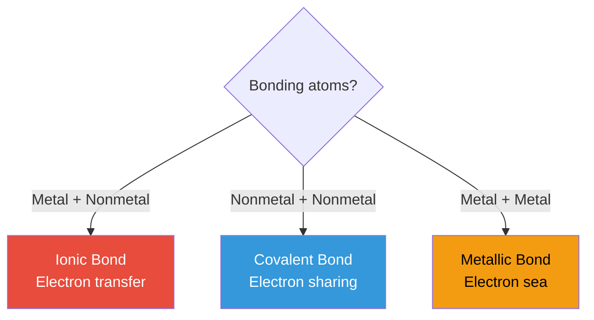
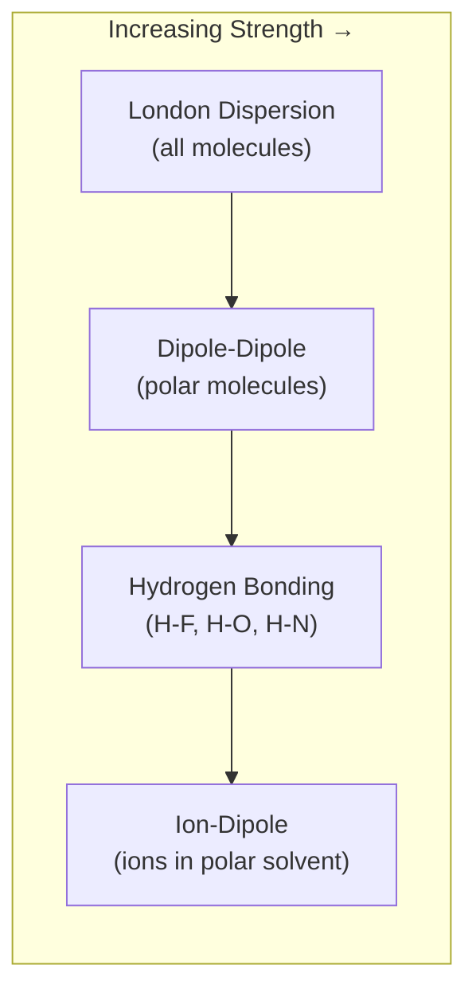

# Chemical Bonding

Atoms bond to achieve a **more stable electron configuration** — typically a full valence shell (octet rule). The type of bond depends on how atoms share or transfer electrons.

---

## Bond Types Overview

| Bond Type | Formed Between | Mechanism | Example |
|-----------|---------------|-----------|---------|
| **Ionic** | Metal + nonmetal | Electron transfer | NaCl (Na⁺ + Cl⁻) |
| **Covalent** | Nonmetal + nonmetal | Electron sharing | H₂O, CO₂ |
| **Metallic** | Metal + metal | Sea of delocalized electrons | Fe, Cu, alloys |

---

## Ionic Bonds

Formed when one atom **transfers** electrons to another, creating oppositely charged ions that attract electrostatically.

| Property | Details |
|----------|---------|
| **Formation** | Metal loses electrons → cation; nonmetal gains electrons → anion |
| **ΔEN** | >1.7 (guideline) |
| **Structure** | Crystal lattice — ions pack in regular 3D arrays |
| **Properties** | High melting/boiling points, brittle, conduct electricity when dissolved/molten |
| **Solubility** | Often soluble in polar solvents (water) — "like dissolves like" |

### Lattice Energy

The energy released when gaseous ions form a crystal lattice. Higher lattice energy = stronger ionic compound.

| Factor | Effect on Lattice Energy |
|--------|------------------------|
| **Smaller ions** | Higher (charges closer together) |
| **Higher charges** | Higher (stronger electrostatic force) |

| Compound | Lattice Energy (kJ/mol) | Why |
|----------|------------------------|-----|
| NaF | 923 | Small ions |
| NaCl | 786 | Cl⁻ larger than F⁻ |
| MgO | 3,850 | +2/−2 charges, small ions |

---

## Covalent Bonds

Formed when atoms **share** electron pairs. The shared electrons are attracted to both nuclei simultaneously.

### Polarity

| Type | ΔEN | Electron Distribution | Example |
|------|-----|----------------------|---------|
| **Nonpolar covalent** | < 0.5 | Equal sharing | H₂, Cl₂, O₂ |
| **Polar covalent** | 0.5–1.7 | Unequal sharing — partial charges (δ⁺/δ⁻) | H₂O, HCl, NH₃ |

### Bond Properties

| Property | Single Bond | Double Bond | Triple Bond |
|----------|-------------|-------------|-------------|
| **Shared pairs** | 1 | 2 | 3 |
| **Bond length** | Longest | Medium | Shortest |
| **Bond energy** | Weakest | Medium | Strongest |
| **Example** | C−C (154 pm, 346 kJ) | C=C (134 pm, 614 kJ) | C≡C (120 pm, 839 kJ) |

### Lewis Structures

Steps to draw Lewis dot structures:

1. Count total valence electrons (adjust for charge)
2. Draw single bonds between all atoms
3. Complete octets on outer atoms (start with most electronegative)
4. Place remaining electrons on the central atom
5. If central atom lacks an octet, form double/triple bonds

!!! warning "Exceptions to the octet rule"
    - **Incomplete octet**: BF₃ (B has 6 e⁻), BeH₂ (Be has 4 e⁻)
    - **Expanded octet**: PCl₅ (10 e⁻), SF₆ (12 e⁻) — possible for Period 3+ elements using d-orbitals
    - **Odd electron**: NO (11 valence e⁻) — free radical

---

## VSEPR Theory — Molecular Geometry

**Valence Shell Electron Pair Repulsion** — electron groups around a central atom arrange themselves to minimize repulsion, determining molecular shape.

| Electron Groups | Bonding Pairs | Lone Pairs | Geometry | Shape Name | Example | Bond Angle |
|----------------|---------------|------------|----------|------------|---------|------------|
| 2 | 2 | 0 | Linear | Linear | CO₂ | 180° |
| 3 | 3 | 0 | Trigonal planar | Trigonal planar | BF₃ | 120° |
| 3 | 2 | 1 | Trigonal planar | Bent | SO₂ | ~119° |
| 4 | 4 | 0 | Tetrahedral | Tetrahedral | CH₄ | 109.5° |
| 4 | 3 | 1 | Tetrahedral | Trigonal pyramidal | NH₃ | ~107° |
| 4 | 2 | 2 | Tetrahedral | Bent | H₂O | ~104.5° |
| 5 | 5 | 0 | Trigonal bipyramidal | Trigonal bipyramidal | PCl₅ | 90°, 120° |
| 6 | 6 | 0 | Octahedral | Octahedral | SF₆ | 90° |

!!! note "Lone pairs compress bond angles"
    Lone pairs occupy more space than bonding pairs — they push bonding pairs closer together. That's why H₂O's angle (104.5°) is less than the ideal tetrahedral angle (109.5°), and NH₃ (107°) falls between them.

---

## Hybridization

Atomic orbitals mix to form **hybrid orbitals** with specific geometries for bonding.

| Hybridization | Orbitals Mixed | Geometry | Bond Angle | Example |
|--------------|---------------|----------|------------|---------|
| **sp** | 1s + 1p | Linear | 180° | BeCl₂, C₂H₂ |
| **sp²** | 1s + 2p | Trigonal planar | 120° | BF₃, C₂H₄ |
| **sp³** | 1s + 3p | Tetrahedral | 109.5° | CH₄, H₂O |
| **sp³d** | 1s + 3p + 1d | Trigonal bipyramidal | 90°, 120° | PCl₅ |
| **sp³d²** | 1s + 3p + 2d | Octahedral | 90° | SF₆ |

Quick rule: **hybridization = number of electron groups around the central atom** (count bonds and lone pairs).

---

## Metallic Bonds

Metal atoms release their valence electrons into a shared **"electron sea"** — delocalized electrons free to move throughout the metal lattice.

| Property | Explanation |
|----------|-------------|
| **Electrical conductivity** | Delocalized electrons flow freely under voltage |
| **Thermal conductivity** | Free electrons transfer kinetic energy rapidly |
| **Malleability/ductility** | Layers of atoms can slide without breaking bonds (electron sea adjusts) |
| **Luster** | Free electrons absorb and re-emit light at all visible wavelengths |
| **High melting points** | Strong attraction between cations and electron sea (varies with charge and size) |

---

## Intermolecular Forces

Forces **between** molecules (not within them). Much weaker than intramolecular bonds but determine physical properties.

| Force | Strength | Occurs Between | Example |
|-------|----------|---------------|---------|
| **London dispersion (LDF)** | Weakest | All molecules — temporary dipoles from electron fluctuations | He, CH₄, I₂ |
| **Dipole-dipole** | Moderate | Polar molecules — permanent partial charges align | HCl, acetone |
| **Hydrogen bonding** | Strong (for IMF) | H bonded to F, O, or N — very strong dipole | H₂O, NH₃, DNA |
| **Ion-dipole** | Strongest IMF | Ion + polar molecule | Na⁺ in water |

### Hydrogen Bonding and Water

Hydrogen bonds give water its unusual properties:

| Property | Cause |
|----------|-------|
| **High boiling point** (100°C) | Strong H-bonds require more energy to break |
| **Ice floats** | H-bonds in ice form an open lattice → lower density than liquid |
| **High surface tension** | H-bonds pull surface molecules inward |
| **Universal solvent** | Polar H-bonds dissolve ionic and polar substances |
| **High specific heat** | Energy absorbed by breaking H-bonds before temperature rises |

---

??? question "Interview Questions"

    **Q: What's the difference between ionic and covalent bonds?**
    Ionic bonds involve electron transfer between a metal and nonmetal, creating ions held by electrostatic attraction in a crystal lattice. Covalent bonds involve electron sharing between nonmetals. The distinction is a spectrum — bonds with ΔEN > 1.7 are mostly ionic, < 0.5 mostly covalent, and between 0.5–1.7 are polar covalent.

    **Q: Why does water have a bent shape instead of linear?**
    Oxygen in H₂O has 4 electron groups (2 bonding pairs + 2 lone pairs). VSEPR predicts a tetrahedral electron geometry, but the molecular shape (based on atom positions only) is bent. The two lone pairs push the H-O-H angle from 109.5° down to 104.5°.

    **Q: What is hybridization and why does it matter?**
    Hybridization is the mixing of atomic orbitals to form new hybrid orbitals with optimal geometry for bonding. It explains observed molecular shapes — carbon's four equivalent bonds in CH₄ (sp³ hybridization) can't be explained by its ground-state 2s² 2p² configuration, since s and p orbitals have different energies and shapes.

    **Q: Why do ionic compounds conduct electricity in solution but not as solids?**
    In a solid crystal lattice, ions are locked in fixed positions and can't move. When dissolved in water, the lattice breaks apart and ions become free to move, carrying electric charge through the solution. Similarly, molten ionic compounds conduct because ions can flow.

    **Q: Why is the boiling point of water (100°C) so much higher than H₂S (−60°C)?**
    Both are bent molecules with similar molecular weights. However, water forms strong hydrogen bonds (O is highly electronegative and small), while H₂S has only weak London dispersion and dipole-dipole forces (S is less electronegative and larger, so its H-bonds are negligible). The extra energy needed to break water's H-bonds explains the 160°C difference.

!!! tip "Further Reading"
    - [Khan Academy — Chemical Bonds](https://www.khanacademy.org/science/chemistry/chemical-bonds) — visual explanations of bonding
    - [Organic Chemistry Tutor — VSEPR](https://www.youtube.com/c/TheOrganicChemistryTutor) — molecular geometry video tutorials
