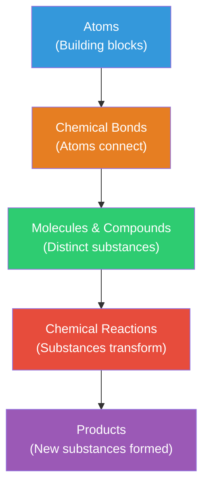

# Chemistry

Chemistry studies **matter** — its composition, structure, properties, and the changes it undergoes during reactions. It bridges physics (atomic behavior) and biology (molecular machinery of life), making it central to understanding the natural world.

---

## Core Topics

| Topic | What It Covers |
|-------|---------------|
| [Atomic Structure](atomic-structure.md) | Subatomic particles, electron configuration, atomic models, and quantum numbers |
| [Periodic Table](periodic-table.md) | Organization, periodic trends, element groups, and predicting chemical behavior |
| [Chemical Bonding](chemical-bonding.md) | Ionic, covalent, and metallic bonds; molecular geometry; intermolecular forces |
| [Reactions & Equations](reactions-and-equations.md) | Reaction types, balancing equations, stoichiometry, and thermodynamics basics |
| [States of Matter](states-of-matter.md) | Solids, liquids, gases, phase changes, and the gas laws |

---

## The Big Picture

!!! tip "Further Reading"
    - [Khan Academy — Chemistry](https://www.khanacademy.org/science/chemistry) — free comprehensive course
    - [LibreTexts Chemistry](https://chem.libretexts.org/) — open-access chemistry textbook
