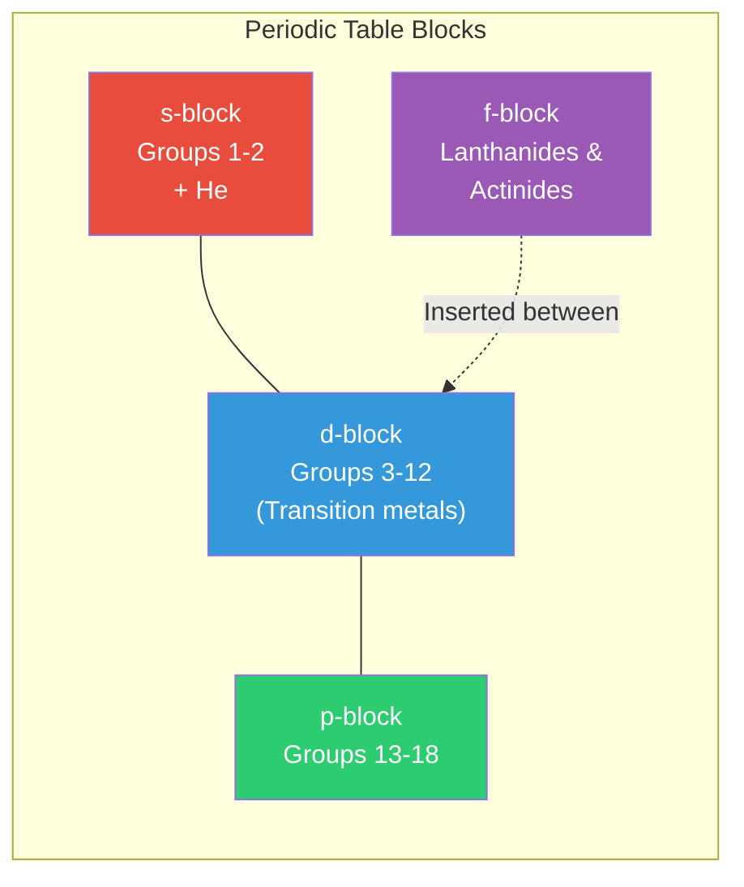
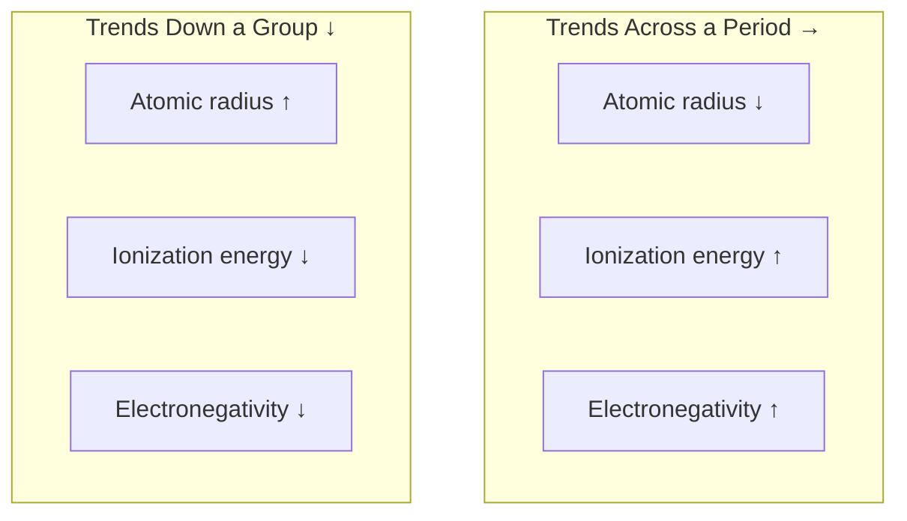

# Periodic Table

The periodic table organizes all known elements by **increasing atomic number**, arranged so that elements with similar chemical properties fall into the same **column (group)**. This structure emerges from the periodic repetition of electron configurations.

---

## Structure

| Term | Definition |
|------|-----------|
| **Period** (row) | Horizontal row; corresponds to the highest principal energy level (n) being filled |
| **Group** (column) | Vertical column; elements share the same number of valence electrons |
| **Block** | Region defined by the type of orbital being filled (s, p, d, f) |

---

## Key Groups

| Group | Name | Valence e⁻ | Properties | Examples |
|-------|------|-----------|------------|----------|
| **1** | Alkali metals | 1 | Soft, highly reactive, form +1 ions, react violently with water | Li, Na, K |
| **2** | Alkaline earth metals | 2 | Reactive (less than Group 1), form +2 ions | Mg, Ca, Ba |
| **17** | Halogens | 7 | Very reactive nonmetals, form −1 ions, diatomic molecules | F, Cl, Br, I |
| **18** | Noble gases | 8 (2 for He) | Inert, full valence shell, very low reactivity | He, Ne, Ar, Kr |
| **3–12** | Transition metals | Variable | Multiple oxidation states, colored compounds, catalytic | Fe, Cu, Zn, Au |

---

## Element Categories

| Category | Location | Characteristics |
|----------|----------|-----------------|
| **Metals** | Left and center (~80% of elements) | Shiny, conductive, malleable, tend to lose electrons |
| **Nonmetals** | Upper right | Dull, insulating, brittle (solids), tend to gain electrons |
| **Metalloids** | Staircase border (B, Si, Ge, As, Sb, Te) | Properties between metals and nonmetals; semiconductors |

---

## Periodic Trends

Properties that vary predictably across periods and down groups:

| Trend | Across a Period (→) | Down a Group (↓) | Why |
|-------|---------------------|-------------------|-----|
| **Atomic radius** | Decreases | Increases | → more protons pull electrons tighter; ↓ new shells added |
| **Ionization energy** | Increases | Decreases | → electrons held more tightly; ↓ outer electrons farther from nucleus |
| **Electronegativity** | Increases | Decreases | → stronger pull on bonding electrons; ↓ weaker pull due to distance + shielding |
| **Electron affinity** | Generally increases (more negative) | Generally decreases | → greater tendency to gain electrons; ↓ less tendency |
| **Metallic character** | Decreases | Increases | → less tendency to lose electrons; ↓ easier to lose outer electrons |

### Effective Nuclear Charge (Z_eff)

The net positive charge experienced by valence electrons after accounting for **shielding** by inner electrons.

$$Z_{eff} = Z - S$$

Where Z = atomic number and S = shielding constant (inner electrons).

- Across a period: Z increases but shielding stays ~constant → Z_eff increases → smaller atoms, higher IE
- Down a group: new shells added → more shielding → valence electrons feel less pull

---

## Ionization Energy

The energy required to remove an electron from a gaseous atom.

| Successive IE | Trend | Reason |
|--------------|-------|--------|
| IE₁ < IE₂ < IE₃... | Each removal gets harder | Fewer electrons to share the same nuclear charge |
| **Large jump** | Indicates crossing into a new (inner) shell | Removing a core electron requires much more energy |

=== "Example: Sodium (Na)"

    | IE | Value (kJ/mol) | Electron removed from |
    |----|---------------|----------------------|
    | IE₁ | 496 | 3s¹ (valence) |
    | IE₂ | 4,562 | 2p⁶ (core) — **huge jump** |

    The massive jump between IE₁ and IE₂ confirms Na has 1 valence electron.

=== "Example: Aluminum (Al)"

    | IE | Value (kJ/mol) | Electron removed from |
    |----|---------------|----------------------|
    | IE₁ | 577 | 3p¹ |
    | IE₂ | 1,817 | 3s² |
    | IE₃ | 2,745 | 3s¹ |
    | IE₄ | 11,578 | 2p⁶ (core) — **huge jump** |

    The jump after IE₃ confirms Al has 3 valence electrons.

---

## Electronegativity

A measure of an atom's ability to attract shared electrons in a chemical bond.

| Scale | Range | Most Electronegative |
|-------|-------|---------------------|
| **Pauling scale** | 0.7 (Cs) to 4.0 (F) | Fluorine (4.0) |

| Element | Electronegativity | Notes |
|---------|-------------------|-------|
| F | 4.0 | Most electronegative element |
| O | 3.5 | Second most; drives much of organic chemistry |
| N | 3.0 | Moderately high |
| C | 2.5 | Intermediate — can bond with almost everything |
| Na | 0.9 | Very low — readily gives up electrons |

!!! note "Electronegativity and bond type"
    The electronegativity difference (ΔEN) between two bonded atoms predicts bond type: ΔEN < 0.5 = nonpolar covalent, 0.5–1.7 = polar covalent, >1.7 = ionic. These are guidelines, not hard cutoffs.

---

## Special Series

### Transition Metals (d-block)

| Property | Details |
|----------|---------|
| **Multiple oxidation states** | Iron: +2, +3; Manganese: +2, +3, +4, +7 |
| **Colored compounds** | Due to d-d electron transitions absorbing specific wavelengths |
| **Catalytic activity** | Variable oxidation states allow them to facilitate reactions (Fe in Haber process, Pt in catalytic converters) |
| **Complex formation** | d-orbitals accept lone pairs from ligands → coordination compounds |

### Lanthanides and Actinides (f-block)

| Series | Elements | Key Feature |
|--------|----------|-------------|
| **Lanthanides** | La (57) → Lu (71) | Very similar chemistry (filling 4f); used in magnets, lasers, phosphors |
| **Actinides** | Ac (89) → Lr (103) | All radioactive; U and Pu used in nuclear energy/weapons |

---

??? question "Interview Questions"

    **Q: Why do elements in the same group have similar chemical properties?**
    Same number of valence electrons. Chemical behavior is driven by valence electron count and arrangement. Group 1 elements all have one s¹ valence electron — they all form +1 ions and react with water to produce hydrogen gas and a hydroxide.

    **Q: Why does atomic radius decrease across a period?**
    Each step adds a proton to the nucleus and an electron to the *same* shell. The added electron doesn't effectively shield the others, so the effective nuclear charge (Z_eff) increases, pulling all electrons closer. Going from Na to Cl, Z goes from 11 to 17, but shielding barely changes.

    **Q: Why is the second ionization energy of sodium so much larger than the first?**
    Na's first electron is removed from the 3s orbital (valence, loosely held). The second must be removed from the 2p orbital (core, much closer to the nucleus, strongly held). Crossing from valence to core shell always produces a dramatic jump in ionization energy.

    **Q: Why are noble gases unreactive?**
    They have completely filled valence shells (ns²np⁶, except He: 1s²). There is no energetic incentive to gain, lose, or share electrons. Their ionization energies are the highest in each period, and their electron affinities are near zero or positive.

    **Q: What makes transition metals good catalysts?**
    Their partially filled d-orbitals allow multiple stable oxidation states, enabling them to donate and accept electrons during reactions. They can also form temporary bonds with reactant molecules (adsorption), bringing them together in favorable orientations. Variable oxidation states let them participate in single-electron-transfer mechanisms.

!!! tip "Further Reading"
    - [IUPAC Periodic Table](https://iupac.org/what-we-do/periodic-table-of-elements/) — official, up-to-date periodic table
    - [Ptable](https://ptable.com/) — interactive periodic table with properties, orbitals, and isotopes
