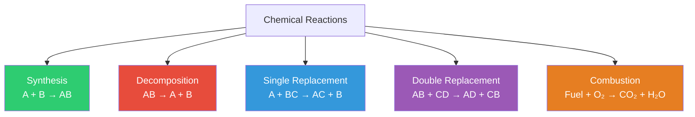
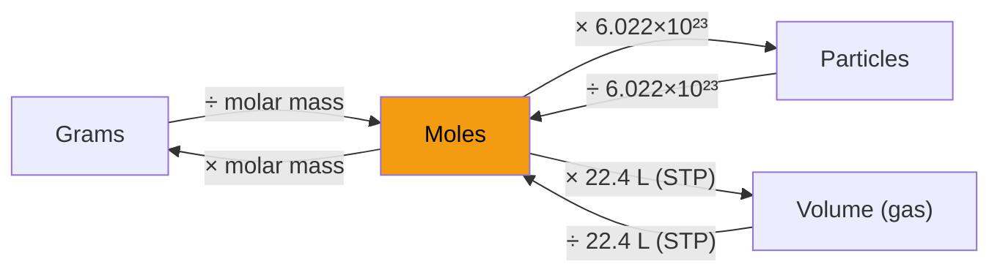
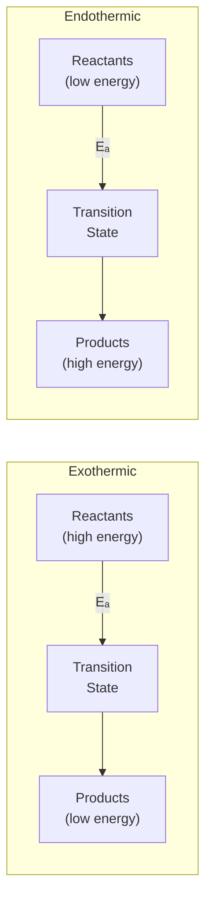

# Reactions & Equations

A chemical reaction transforms **reactants** into **products** by breaking and forming chemical bonds. The atoms are rearranged — never created or destroyed (conservation of mass).

---

## Balancing Chemical Equations

Every equation must have equal numbers of each atom on both sides.

=== "Example: Combustion of Methane"

    **Unbalanced:** CH₄ + O₂ → CO₂ + H₂O

    | Atom | Left | Right |
    |------|------|-------|
    | C | 1 | 1 |
    | H | 4 | 2 |
    | O | 2 | 3 |

    **Balanced:** CH₄ + **2**O₂ → CO₂ + **2**H₂O

    | Atom | Left | Right |
    |------|------|-------|
    | C | 1 | 1 |
    | H | 4 | 4 |
    | O | 4 | 4 |

=== "Example: Iron Rust"

    **Unbalanced:** Fe + O₂ → Fe₂O₃

    **Balanced:** **4**Fe + **3**O₂ → **2**Fe₂O₃

    | Atom | Left | Right |
    |------|------|-------|
    | Fe | 4 | 4 |
    | O | 6 | 6 |

### Balancing Strategy

1. Balance elements that appear in only one reactant and one product first
2. Balance polyatomic ions as a unit if they appear unchanged on both sides
3. Balance H and O last (they usually appear in multiple compounds)
4. Use fractional coefficients if needed, then multiply everything to get whole numbers

---

## Types of Chemical Reactions

| Type | Pattern | Example |
|------|---------|---------|
| **Synthesis** | A + B → AB | 2Na + Cl₂ → 2NaCl |
| **Decomposition** | AB → A + B | 2H₂O₂ → 2H₂O + O₂ |
| **Single replacement** | A + BC → AC + B | Zn + CuSO₄ → ZnSO₄ + Cu |
| **Double replacement** | AB + CD → AD + CB | AgNO₃ + NaCl → AgCl↓ + NaNO₃ |
| **Combustion** | Fuel + O₂ → CO₂ + H₂O | C₃H₈ + 5O₂ → 3CO₂ + 4H₂O |

### Identifying Reaction Types

| Observation | Likely Type |
|-------------|-------------|
| Two substances combine into one | Synthesis |
| One substance breaks into two or more | Decomposition |
| An element replaces another in a compound | Single replacement |
| Ions in two compounds switch partners | Double replacement |
| Something burns in oxygen → CO₂ + H₂O | Combustion |

---

## Stoichiometry

Using balanced equations to calculate quantities of reactants and products.

### The Mole Concept

| Concept | Definition |
|---------|-----------|
| **Mole** | 6.022 × 10²³ particles (Avogadro's number) |
| **Molar mass** | Mass of 1 mole in grams = atomic/molecular weight in amu |
| **At STP** | 1 mole of any gas = 22.4 L |

### Conversion Map

### Stoichiometry Steps

1. **Balance** the equation
2. Convert given quantity to **moles**
3. Use the **mole ratio** from the balanced equation
4. Convert to the desired unit

=== "Example"

    **How many grams of CO₂ are produced by burning 44 g of C₃H₈?**

    C₃H₈ + 5O₂ → **3**CO₂ + 4H₂O

    | Step | Calculation |
    |------|-------------|
    | Moles of C₃H₈ | 44 g ÷ 44 g/mol = 1 mol |
    | Mole ratio | 1 mol C₃H₈ → 3 mol CO₂ |
    | Moles of CO₂ | 1 × 3 = 3 mol |
    | Grams of CO₂ | 3 mol × 44 g/mol = **132 g** |

### Limiting Reagent

The reactant that runs out first — it determines the maximum product yield.

| Term | Definition |
|------|-----------|
| **Limiting reagent** | Fully consumed; limits the amount of product |
| **Excess reagent** | Some remains after the reaction |
| **Theoretical yield** | Maximum product possible from the limiting reagent |
| **Actual yield** | What you actually obtain (always ≤ theoretical) |
| **Percent yield** | (Actual ÷ Theoretical) × 100% |

---

## Oxidation-Reduction (Redox) Reactions

Reactions involving **electron transfer**. One species is oxidized (loses electrons), another is reduced (gains electrons).

| Term | Definition | Mnemonic |
|------|-----------|----------|
| **Oxidation** | Loss of electrons | OIL (Oxidation Is Loss) |
| **Reduction** | Gain of electrons | RIG (Reduction Is Gain) |
| **Oxidizing agent** | Gets reduced (accepts electrons) | |
| **Reducing agent** | Gets oxidized (donates electrons) | |

### Oxidation States Rules

| Rule | Example |
|------|---------|
| Free elements = 0 | Fe, O₂, S₈ |
| Monoatomic ions = charge | Na⁺ = +1, Cl⁻ = −1 |
| O = −2 (usually) | In H₂O, MgO |
| H = +1 (usually) | In HCl, H₂O |
| Sum = 0 (compound) or charge (ion) | In H₂SO₄: 2(+1) + x + 4(−2) = 0 → S = +6 |

=== "Example: Rust Formation"

    4Fe + 3O₂ → 2Fe₂O₃

    | Species | Change | Role |
    |---------|--------|------|
    | Fe | 0 → +3 (loses 3e⁻) | Oxidized — reducing agent |
    | O | 0 → −2 (gains 2e⁻) | Reduced — oxidizing agent |

---

## Reaction Energy — Thermochemistry Basics

| Term | Definition |
|------|-----------|
| **Exothermic** | Releases energy (ΔH < 0); products are more stable than reactants |
| **Endothermic** | Absorbs energy (ΔH > 0); products are less stable than reactants |
| **Activation energy (Eₐ)** | Minimum energy needed to start a reaction |
| **Catalyst** | Lowers Eₐ without being consumed; speeds up the reaction |

| Reaction Type | ΔH | Feel | Example |
|--------------|-----|------|---------|
| Exothermic | Negative | Releases heat | Combustion (burning fuel), neutralization |
| Endothermic | Positive | Absorbs heat | Photosynthesis, melting ice, dissolving NH₄NO₃ |

---

## Reaction Rates

| Factor | Effect | Why |
|--------|--------|-----|
| **Temperature ↑** | Rate ↑ | More particles have energy ≥ Eₐ |
| **Concentration ↑** | Rate ↑ | More frequent collisions |
| **Surface area ↑** | Rate ↑ | More contact area for reactions |
| **Catalyst** | Rate ↑ | Provides alternative pathway with lower Eₐ |

---

## Acids and Bases — Quick Reference

| Property | Acid | Base |
|----------|------|------|
| **Arrhenius** | Produces H⁺ in water | Produces OH⁻ in water |
| **Brønsted-Lowry** | Proton (H⁺) donor | Proton (H⁺) acceptor |
| **pH** | < 7 | > 7 |
| **Taste** | Sour | Bitter |
| **Examples** | HCl, H₂SO₄, CH₃COOH | NaOH, NH₃, Ca(OH)₂ |

**Neutralization**: Acid + Base → Salt + Water

HCl + NaOH → NaCl + H₂O

| pH Scale | Value | Example |
|----------|-------|---------|
| Strongly acidic | 0–3 | Battery acid (0), stomach acid (1.5) |
| Weakly acidic | 3–6 | Vinegar (2.5), coffee (5) |
| Neutral | 7 | Pure water |
| Weakly basic | 8–11 | Baking soda (8.3), soap (10) |
| Strongly basic | 12–14 | Bleach (12.5), drain cleaner (14) |

---

??? question "Interview Questions"

    **Q: What is the law of conservation of mass?**
    In a chemical reaction, the total mass of reactants equals the total mass of products. Atoms are rearranged, not created or destroyed. This is why we balance chemical equations — every atom on the left must appear on the right.

    **Q: How do you determine the limiting reagent?**
    Convert each reactant to moles, then divide by its coefficient in the balanced equation. The reactant with the smallest ratio is the limiting reagent — it will be fully consumed first, determining the maximum amount of product.

    **Q: What's the difference between exothermic and endothermic reactions?**
    Exothermic reactions release energy to the surroundings (ΔH < 0) — products have less energy than reactants. Endothermic reactions absorb energy (ΔH > 0) — products have more energy. Both require activation energy to start, but exothermic reactions have a net release.

    **Q: What is a redox reaction? Give an example.**
    A reaction involving electron transfer — one species is oxidized (loses electrons) and another is reduced (gains electrons). Example: 2Mg + O₂ → 2MgO. Mg is oxidized (0 → +2), O is reduced (0 → −2). Photosynthesis, respiration, corrosion, and batteries are all redox processes.

    **Q: What is pH and what does it measure?**
    pH = −log[H⁺]. It measures hydrogen ion concentration on a logarithmic scale from 0–14. Each unit represents a 10× change in H⁺ concentration. pH 7 is neutral; below 7 is acidic (more H⁺); above 7 is basic (more OH⁻).

!!! tip "Further Reading"
    - [Khan Academy — Stoichiometry](https://www.khanacademy.org/science/chemistry/chemical-reactions-stoichiome) — step-by-step problem solving
    - [ChemGuide](https://www.chemguide.co.uk/) — detailed explanations of reaction mechanisms
