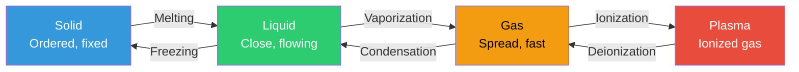
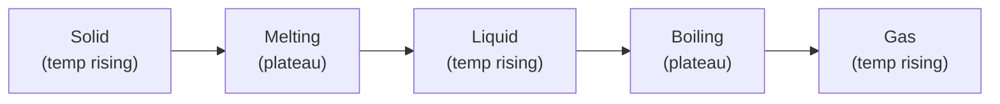
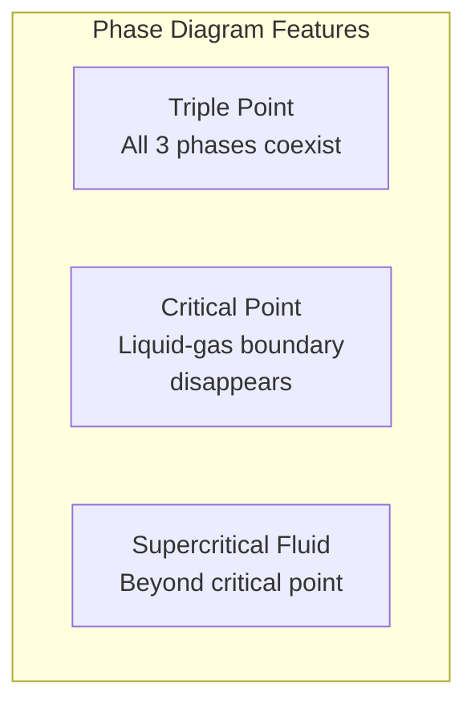

# States of Matter

Matter exists in distinct **phases** — solid, liquid, gas, and plasma — defined by the arrangement and energy of particles. The state depends on the balance between **kinetic energy** (motion) and **intermolecular forces** (attraction).

---

## The Four States

| Property | Solid | Liquid | Gas | Plasma |
|----------|-------|--------|-----|--------|
| **Shape** | Fixed | Takes container shape | Fills container | Fills container |
| **Volume** | Fixed | Fixed | Expands to fill | Expands to fill |
| **Particle arrangement** | Ordered lattice | Close but disordered | Far apart, random | Ionized, far apart |
| **Particle motion** | Vibrate in place | Slide past each other | Move freely, fast | Move freely + carry charge |
| **Compressibility** | Nearly zero | Very low | High | High |
| **Density** | High | High | Low | Very low |
| **Example** | Ice, iron, diamond | Water, mercury, ethanol | Steam, oxygen, CO₂ | Lightning, Sun, neon signs |

---

## Phase Changes

| Transition | Direction | Energy | Example |
|-----------|-----------|--------|---------|
| **Melting** | Solid → Liquid | Absorb (endothermic) | Ice → water at 0°C |
| **Freezing** | Liquid → Solid | Release (exothermic) | Water → ice at 0°C |
| **Vaporization** | Liquid → Gas | Absorb (endothermic) | Water → steam at 100°C |
| **Condensation** | Gas → Liquid | Release (exothermic) | Steam → water droplets |
| **Sublimation** | Solid → Gas | Absorb (endothermic) | Dry ice (CO₂) → gas |
| **Deposition** | Gas → Solid | Release (exothermic) | Frost forming on surfaces |

!!! note "Temperature stays constant during phase changes"
    While a substance is melting or boiling, added heat goes entirely into breaking intermolecular bonds — the temperature does not rise until the phase change is complete. This is why ice water stays at 0°C until all the ice melts.

### Heating Curve

A plot of temperature vs. heat added, showing phase transitions as **flat plateaus**:

| Segment | What Happens | Energy Term |
|---------|-------------|-------------|
| Solid heating | Temperature rises | q = m × c_solid × ΔT |
| Melting plateau | Phase change at constant temp | q = m × ΔH_fus |
| Liquid heating | Temperature rises | q = m × c_liquid × ΔT |
| Boiling plateau | Phase change at constant temp | q = m × ΔH_vap |
| Gas heating | Temperature rises | q = m × c_gas × ΔT |

### Key Values for Water

| Property | Value |
|----------|-------|
| Melting point | 0°C (273.15 K) |
| Boiling point | 100°C (373.15 K) at 1 atm |
| Heat of fusion (ΔH_fus) | 334 J/g |
| Heat of vaporization (ΔH_vap) | 2,260 J/g |
| Specific heat (liquid) | 4.184 J/(g·°C) |

---

## Gas Laws

Gases behave predictably under changing temperature, pressure, and volume. These relationships are described by the gas laws.

| Law | Relationship | Equation | Held Constant |
|-----|-------------|----------|---------------|
| **Boyle's** | P ∝ 1/V | P₁V₁ = P₂V₂ | T, n |
| **Charles's** | V ∝ T | V₁/T₁ = V₂/T₂ | P, n |
| **Gay-Lussac's** | P ∝ T | P₁/T₁ = P₂/T₂ | V, n |
| **Avogadro's** | V ∝ n | V₁/n₁ = V₂/n₂ | P, T |
| **Combined** | PV/T = constant | P₁V₁/T₁ = P₂V₂/T₂ | n |
| **Ideal gas** | All combined | **PV = nRT** | — |

!!! warning "Temperature must be in Kelvin"
    All gas law calculations require absolute temperature: T(K) = T(°C) + 273.15. Using Celsius will give wrong answers because gas laws depend on proportionality to absolute zero.

### Ideal Gas Law

$$PV = nRT$$

| Variable | Meaning | Common Units |
|----------|---------|-------------|
| P | Pressure | atm, kPa, Pa |
| V | Volume | L |
| n | Moles of gas | mol |
| R | Gas constant | 0.0821 L·atm/(mol·K) or 8.314 J/(mol·K) |
| T | Temperature | K (Kelvin) |

### STP (Standard Temperature and Pressure)

| Condition | Value |
|-----------|-------|
| Temperature | 0°C (273.15 K) |
| Pressure | 1 atm (101.325 kPa) |
| Molar volume | 22.4 L/mol |

=== "Example: Ideal Gas Law"

    **What volume does 2 mol of O₂ occupy at 25°C and 1 atm?**

    PV = nRT

    V = nRT/P = (2 mol × 0.0821 L·atm/(mol·K) × 298 K) / 1 atm

    V = **48.9 L**

### Real vs Ideal Gases

| Condition | Ideal Gas Behavior | Real Gas Deviations |
|-----------|-------------------|-------------------|
| High temperature | Good approximation | Molecules move fast; intermolecular forces negligible |
| Low pressure | Good approximation | Molecules far apart; volume negligible |
| Low temperature | Breaks down | Intermolecular forces significant; condensation possible |
| High pressure | Breaks down | Molecular volume matters; can't be compressed infinitely |

The **Van der Waals equation** corrects for real gas behavior:

$$(P + \frac{an^2}{V^2})(V - nb) = nRT$$

Where _a_ corrects for intermolecular forces and _b_ corrects for molecular volume.

---

## Phase Diagrams

A graph showing which phase exists at each combination of temperature and pressure.

| Feature | Definition |
|---------|-----------|
| **Triple point** | The unique T and P where solid, liquid, and gas coexist in equilibrium |
| **Critical point** | Beyond this T and P, the liquid-gas distinction vanishes → supercritical fluid |
| **Normal melting point** | Melting temperature at 1 atm |
| **Normal boiling point** | Boiling temperature at 1 atm |

| Substance | Triple Point | Critical Point |
|-----------|-------------|----------------|
| Water | 0.01°C, 0.006 atm | 374°C, 218 atm |
| CO₂ | −56.6°C, 5.11 atm | 31°C, 73 atm |

!!! note "Water's unusual phase diagram"
    Water's solid-liquid boundary slopes **left** (negative slope), meaning ice can melt under pressure. This is because ice is less dense than liquid water — increased pressure favors the denser phase. Most substances have a positive slope (solid is denser than liquid).

---

## Kinetic Molecular Theory

The model explaining gas behavior at the particle level:

| Postulate | Meaning |
|-----------|---------|
| Gas particles are in constant, random motion | They travel in straight lines until they collide |
| Collisions are perfectly elastic | No kinetic energy is lost in collisions |
| Volume of particles is negligible | Compared to the space between them |
| No intermolecular forces | Particles don't attract or repel each other |
| Average kinetic energy ∝ temperature | KE_avg = (3/2)kT where k is Boltzmann's constant |

| Consequence | Explanation |
|-------------|-------------|
| **Diffusion** | Particles spread from high to low concentration through random motion |
| **Effusion** | Gas escapes through a tiny hole; lighter gases effuse faster (Graham's law) |
| **Pressure** | Particles collide with container walls; more collisions or harder hits = higher pressure |

---

??? question "Interview Questions"

    **Q: Why does temperature stay constant during a phase change?**
    Added heat is used entirely to overcome intermolecular forces (breaking bonds between molecules) rather than increasing kinetic energy. The energy goes into the phase transition (ΔH_fus or ΔH_vap). Only after the phase change is complete does the temperature resume rising.

    **Q: Explain Boyle's Law with a real-world example.**
    At constant temperature, pressure and volume are inversely proportional (P₁V₁ = P₂V₂). Example: a syringe — pushing the plunger in decreases volume, which increases pressure. Scuba divers experience this: as they descend (higher water pressure), the air in their lungs compresses to a smaller volume.

    **Q: What is the difference between evaporation and boiling?**
    Both are vaporization, but evaporation occurs at the surface at any temperature (fast-moving molecules escape), while boiling occurs throughout the liquid at the boiling point (vapor pressure equals atmospheric pressure). Evaporation is slow and surface-only; boiling is rapid and bulk.

    **Q: When does the ideal gas law break down?**
    At high pressures (molecular volume becomes significant) and low temperatures (intermolecular forces cause deviations). Real gases deviate most when they're close to condensing — near the critical point. The Van der Waals equation corrects for these with terms for molecular volume (b) and intermolecular attraction (a).

    **Q: Why does ice float?**
    Water expands when it freezes — hydrogen bonds form an open crystalline lattice in ice that's less dense (0.917 g/cm³) than liquid water (1.0 g/cm³). This is unusual; most solids are denser than their liquids. It's critical for life — ice insulates lakes and oceans from above rather than freezing solid from the bottom.

!!! tip "Further Reading"
    - [Khan Academy — States of Matter](https://www.khanacademy.org/science/chemistry/states-of-matter-and-intermolecular-forces) — visual explanations of phase changes
    - [PhET Simulations — Gas Properties](https://phet.colorado.edu/en/simulation/gas-properties) — interactive gas law simulation
