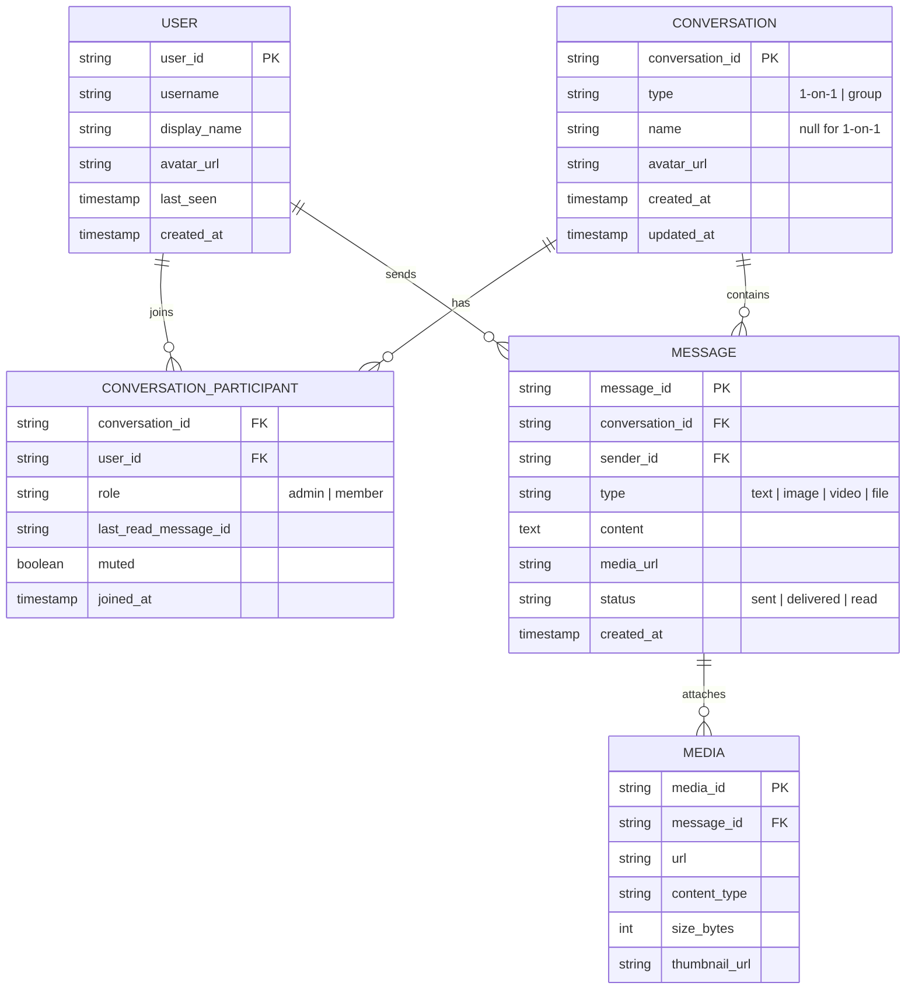
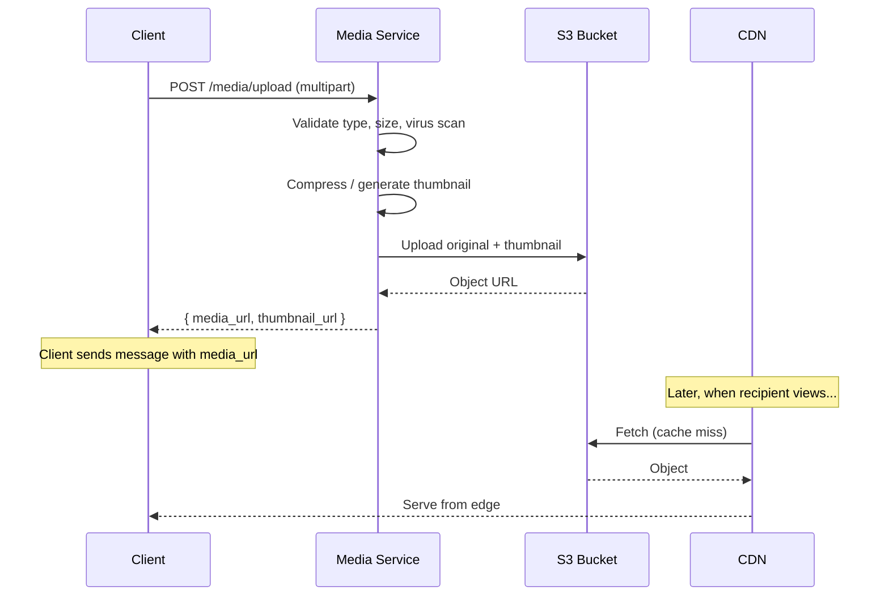

# Data Model & Storage

Choosing the right data model and storage engines is critical — chat apps are **write-heavy** with **time-series access patterns** and must support both real-time queries and historical scroll-back.

---

## Data Model

### Entity Relationship



---

## Database Selection

### Polyglot Persistence

No single database handles all chat workloads well. Use the right tool for each access pattern.

| Data | Store | Rationale |
|------|-------|-----------|
| **Messages** | Cassandra / ScyllaDB | Write-heavy, time-ordered, horizontal scaling, tunable consistency |
| **Users & Groups** | PostgreSQL | Relational data, complex queries (search, joins), strong consistency |
| **Sessions & Presence** | Redis | Sub-ms reads, TTL-based expiry, pub/sub for presence events |
| **Media Files** | S3 / GCS | Cheap, durable blob storage; serve via CDN |
| **Search Index** | Elasticsearch | Full-text message search with ranking and filters |

### Why Cassandra for Messages?

| Requirement | How Cassandra Delivers |
|-------------|----------------------|
| Write-heavy (700K msg/sec peak) | Log-structured merge trees; writes are append-only |
| Time-series access pattern | Clustering key on `message_id` (time-sortable) gives ordered reads for free |
| Horizontal scaling | Add nodes to increase throughput linearly; no single master bottleneck |
| High availability | Tunable replication (RF=3) with quorum reads/writes |
| Conversation-scoped queries | Partition key on `conversation_id` keeps all messages for a chat on the same partition |

---

## Schema Design: Messages (Cassandra)

```sql
CREATE TABLE messages (
    conversation_id TEXT,
    message_id      TIMEUUID,
    sender_id       TEXT,
    type            TEXT,
    content         TEXT,
    media_url       TEXT,
    status          TEXT,
    created_at      TIMESTAMP,
    PRIMARY KEY (conversation_id, message_id)
) WITH CLUSTERING ORDER BY (message_id DESC);
```

| Key | Role |
|-----|------|
| **Partition key**: `conversation_id` | All messages for a conversation live on the same partition → fast range scans |
| **Clustering key**: `message_id` (DESC) | Messages are stored sorted by time; `DESC` makes "fetch latest N" efficient |

### Query Patterns

```sql
-- Fetch latest 50 messages in a conversation
SELECT * FROM messages
WHERE conversation_id = 'conv_42'
ORDER BY message_id DESC
LIMIT 50;

-- Cursor-based pagination (older messages)
SELECT * FROM messages
WHERE conversation_id = 'conv_42'
  AND message_id < 01903e9a-...  -- cursor from previous page
ORDER BY message_id DESC
LIMIT 50;
```

!!! warning "Partition Size Limits"
    A single Cassandra partition should stay under ~100 MB. For extremely active conversations (millions of messages), implement **time-bucketing**: change the partition key to `(conversation_id, year_month)` so messages are spread across monthly partitions.

### Time-Bucketed Schema

```sql
CREATE TABLE messages_bucketed (
    conversation_id TEXT,
    bucket          TEXT,       -- e.g., "2025-01"
    message_id      TIMEUUID,
    sender_id       TEXT,
    content         TEXT,
    PRIMARY KEY ((conversation_id, bucket), message_id)
) WITH CLUSTERING ORDER BY (message_id DESC);
```

---

## Schema Design: Users & Groups (PostgreSQL)

```sql
CREATE TABLE users (
    user_id      VARCHAR(36) PRIMARY KEY,
    username     VARCHAR(50) UNIQUE NOT NULL,
    display_name VARCHAR(100),
    avatar_url   TEXT,
    last_seen    TIMESTAMPTZ,
    created_at   TIMESTAMPTZ DEFAULT NOW()
);

CREATE TABLE conversations (
    conversation_id VARCHAR(36) PRIMARY KEY,
    type            VARCHAR(10) NOT NULL,  -- '1on1' or 'group'
    name            VARCHAR(100),
    avatar_url      TEXT,
    created_at      TIMESTAMPTZ DEFAULT NOW()
);

CREATE TABLE conversation_participants (
    conversation_id    VARCHAR(36) REFERENCES conversations(conversation_id),
    user_id            VARCHAR(36) REFERENCES users(user_id),
    role               VARCHAR(10) DEFAULT 'member',
    last_read_message  VARCHAR(36),
    muted              BOOLEAN DEFAULT FALSE,
    joined_at          TIMESTAMPTZ DEFAULT NOW(),
    PRIMARY KEY (conversation_id, user_id)
);

CREATE INDEX idx_participants_user ON conversation_participants(user_id);
```

The index on `user_id` supports the common query: "get all conversations for a user."

---

## Message ID Generation

| Scheme | Format | Pros | Cons |
|--------|--------|------|------|
| **UUID v4** | Random 128-bit | Simple, no coordination | Not time-sortable; poor cache locality |
| **Snowflake** | 64-bit: timestamp + machine + sequence | Time-sortable, compact, fast | Requires machine ID assignment |
| **ULID** | 128-bit: 48-bit timestamp + 80-bit random | Time-sortable, lexicographic, no coordination | Slightly larger than Snowflake |
| **KSUID** | 160-bit: 32-bit timestamp + 128-bit random | Time-sortable, globally unique | Largest; coarser timestamp (1s vs 1ms) |

### Snowflake ID Structure

```
┌──────────────────────────────────────────────────────────────────┐
│  0  │    41 bits timestamp (ms)    │ 10 bits │  12 bits sequence │
│sign │      (~69 years range)       │ machine │   (4096/ms/node)  │
└──────────────────────────────────────────────────────────────────┘
```

!!! tip "Recommendation"
    Use **Snowflake-style IDs** for messages. They're compact (64-bit, fits in a `BIGINT`), time-sortable (eliminates `ORDER BY timestamp`), and generate ~4M unique IDs per second per node.

---

## Caching Strategy

### What to Cache

| Data | Cache Key | TTL | Rationale |
|------|-----------|-----|-----------|
| Recent messages | `conv:{id}:recent` | 5 min | Hot conversations are read frequently; avoid hitting Cassandra |
| User sessions | `session:{token}` | 15 min | Auth check on every WebSocket frame |
| Presence | `presence:{user_id}` | 60s | Heartbeat-refreshed; auto-expires to offline |
| Conversation list | `user:{id}:convos` | 2 min | The most common query — "show my chats" |
| Group member list | `conv:{id}:members` | 10 min | Fan-out needs fast member lookups |

### Cache Invalidation

=== "Write-Through"

    ```
    Client sends message
      → Write to Cassandra
      → Update Redis cache
      → Return ACK

    Pros: Cache always consistent
    Cons: Higher write latency
    ```

=== "Write-Behind (Async)"

    ```
    Client sends message
      → Write to Redis cache
      → Return ACK
      → Async worker writes to Cassandra

    Pros: Lowest write latency
    Cons: Risk of data loss if Redis fails before flush
    ```

=== "Cache-Aside"

    ```
    Read: Check cache → miss → read DB → populate cache
    Write: Write DB → invalidate cache

    Pros: Simple, safe
    Cons: First read after write always misses cache
    ```

For chat, **write-through** is the safest default. Message durability is non-negotiable — you can't lose messages even if Redis crashes.

---

## Media Storage

### Upload Flow



### Media Storage Design

| Concern | Approach |
|---------|----------|
| **Storage** | S3 with lifecycle rules: move to Glacier after 1 year |
| **Delivery** | CloudFront / CDN with regional edge caches |
| **Thumbnails** | Pre-generate on upload (150px, 300px); store alongside original |
| **Size limits** | Images: 16 MB, Videos: 100 MB, Files: 100 MB |
| **Formats** | Convert to WebP (images) and H.264 (video) for size + compatibility |
| **Access control** | Pre-signed URLs with 24h expiry; only conversation members can access |

---

## Data Retention & Compliance

| Policy | Implementation |
|--------|---------------|
| **Message retention** | Default: forever. Enterprise: configurable per-org (e.g., 90 days) |
| **Soft delete** | Mark as deleted; don't remove from storage immediately |
| **GDPR right to erasure** | Async job replaces content with "[deleted]"; preserves conversation structure |
| **Backup** | Daily incremental backups of Cassandra (snapshots) and PostgreSQL (pg_dump) |
| **Encryption at rest** | AES-256 for S3; Cassandra transparent data encryption |

---

??? question "Interview Questions"

    **Q: Why not use PostgreSQL for messages too?**
    PostgreSQL is excellent for relational data but struggles at 700K writes/sec with horizontal scaling. Cassandra's append-only writes, tunable consistency, and linear horizontal scaling make it purpose-built for this workload. The trade-off is no JOINs and limited query flexibility — which is fine since message access patterns are simple (fetch by conversation, ordered by time).

    **Q: How do you handle the "conversation list" query efficiently?**
    Maintain a denormalized `user_conversations` table (or Redis sorted set) keyed by `user_id`, sorted by `last_message_timestamp`. When a new message arrives, update this entry. This avoids an expensive JOIN + ORDER BY across conversations and participants tables.

    **Q: What happens when a conversation has millions of messages?**
    Use time-bucketed partitions in Cassandra (e.g., monthly buckets). The client uses cursor-based pagination to scroll back. For search across history, offload to Elasticsearch — don't scan Cassandra sequentially.

    **Q: How do you handle deleted messages?**
    Soft-delete: set `content = "[deleted]"` and `deleted_at = NOW()`. The message record stays (preserving conversation flow and IDs) but content is removed. For GDPR erasure, an async job scrubs the original content and media from S3.

    **Q: Why use pre-signed URLs for media instead of serving directly?**
    Pre-signed URLs provide time-limited access without requiring a proxy server. The client fetches directly from CDN/S3, reducing load on your backend. The signature ensures only authorized users can access the media, and expiry prevents link sharing.
