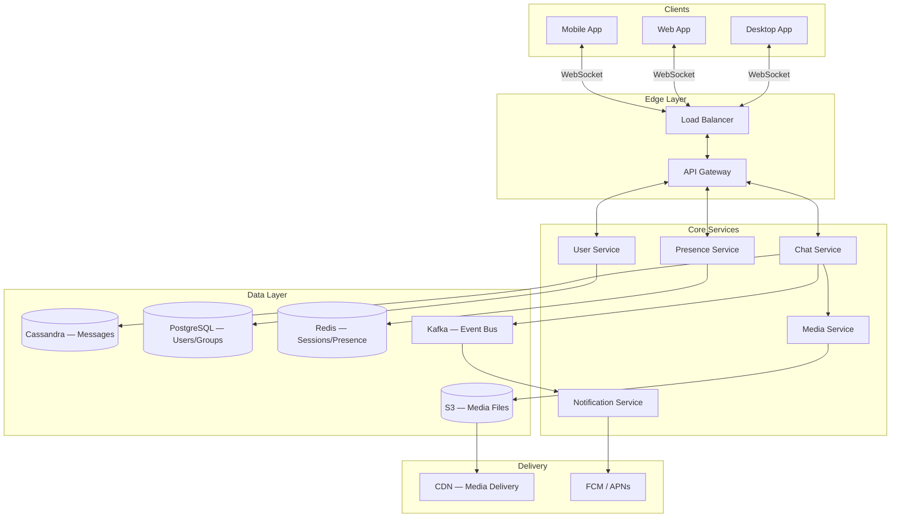
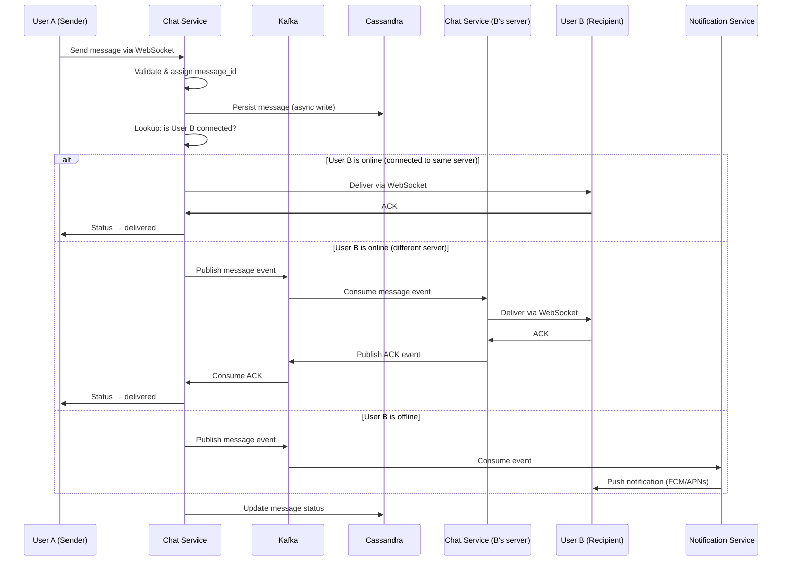
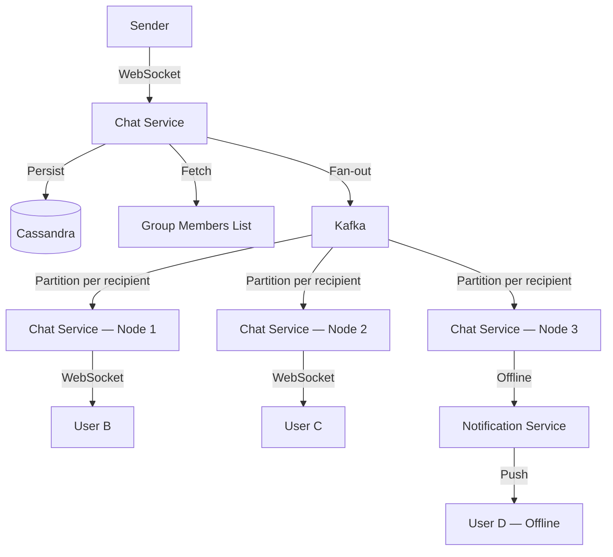
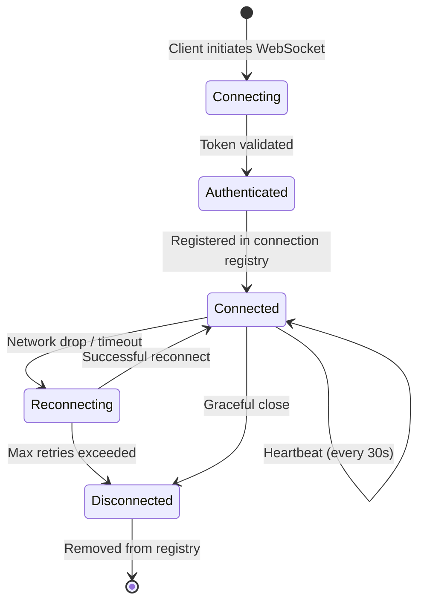

# High-Level Architecture

Once requirements are clear, sketch the big picture. The goal is to show how major components interact before diving into any single one.

---

## Architecture Diagram

---

## Component Responsibilities

### Edge Layer

| Component | Role |
|-----------|------|
| **Load Balancer** | Distributes WebSocket connections across Chat Service instances; uses consistent hashing or sticky sessions so a user's connection stays on one server |
| **API Gateway** | Rate limiting, authentication, request routing; terminates TLS; routes REST calls to appropriate services |

### Core Services

| Service | Responsibility | Scaling Notes |
|---------|---------------|---------------|
| **Chat Service** | Manages WebSocket connections, routes messages between users, persists messages | Stateful (holds connections) — scale horizontally with a connection registry |
| **Presence Service** | Tracks online/offline status, last-seen timestamps | Backed by Redis; heartbeat-based with TTL expiration |
| **Notification Service** | Sends push notifications to offline users via FCM/APNs | Consumes events from Kafka; stateless, easy to scale |
| **Media Service** | Handles upload, compression, thumbnail generation, virus scanning | CPU-intensive; scales independently from chat traffic |
| **User Service** | User profiles, contacts, group membership, authentication | Standard CRUD; backed by PostgreSQL |

### Data Layer

| Store | Used For | Why This Store |
|-------|----------|----------------|
| **Cassandra** | Message storage | Write-optimized, time-series friendly, horizontal scaling, tunable consistency |
| **PostgreSQL** | Users, groups, contacts | Relational data with strong consistency, complex queries |
| **Redis** | Sessions, presence, recent conversations | Sub-millisecond reads, TTL support for ephemeral data |
| **Kafka** | Event streaming | Decouples services; ordered, durable, replayable event log |
| **S3 + CDN** | Media files | Cheap blob storage + global edge caching for fast delivery |

---

## Message Flow: 1-on-1

---

## Message Flow: Group Chat

Group messaging introduces **fan-out** — one message must reach N recipients.

### Fan-Out Strategies

| Strategy | How It Works | Best For |
|----------|-------------|----------|
| **Write-time fan-out (push)** | When a message is sent, write a copy to each recipient's inbox | Small groups (< 100 members); simpler reads |
| **Read-time fan-out (pull)** | Store message once; each recipient queries the conversation on read | Large groups / channels; saves write amplification |
| **Hybrid** | Push for small groups, pull for large channels | Production systems (WhatsApp, Slack) |

!!! note "The Fan-Out Threshold"
    A common pattern: use write-time fan-out for groups ≤ 100 members and read-time fan-out for larger channels. This balances write cost against read latency.

---

## Connection Management

### The Connection Registry Problem

With millions of users spread across hundreds of Chat Service instances, you need to know **which server holds User B's WebSocket connection**.

| Approach | How It Works | Trade-offs |
|----------|-------------|------------|
| **Redis registry** | Each Chat Service registers `user_id → server_id` in Redis on connect | Simple; adds a Redis lookup per message route |
| **Consistent hashing** | Hash `user_id` to determine which server handles their connection | Predictable routing; rebalancing on scale events |
| **Service mesh / pub-sub** | Each server subscribes to a channel for its connected users | Decoupled; Kafka/Redis Pub-Sub handles routing |

### Connection Lifecycle

---

## Authentication & Security

| Concern | Approach |
|---------|----------|
| **WebSocket auth** | Authenticate via token during the handshake (`Sec-WebSocket-Protocol` header or query param); reject unauthenticated upgrades |
| **Token refresh** | Short-lived JWTs (15 min) + refresh tokens; WebSocket connections re-auth on token expiry |
| **Rate limiting** | Per-user message rate limit (e.g., 100 msg/min); per-IP connection limit at the gateway |
| **E2E encryption** | Optional: Signal Protocol — keys exchanged out-of-band; server sees only ciphertext |
| **Transport security** | TLS for all connections; certificate pinning on mobile clients |

---

??? question "Interview Questions"

    **Q: Why separate Chat Service from Notification Service?**
    Separation of concerns and independent scaling. Chat Service is latency-sensitive and connection-bound; Notification Service is throughput-oriented and interacts with external providers (FCM/APNs) that have their own rate limits and failure modes. Coupling them would let a push notification backlog degrade real-time message delivery.

    **Q: Why Kafka instead of a simple message queue like RabbitMQ?**
    Kafka provides ordered, durable, partitioned event logs. Messages can be replayed (useful for new consumers or failure recovery). Kafka's partition model maps well to per-conversation ordering. RabbitMQ is fine for task queues but lacks Kafka's ordering guarantees and replay capability at scale.

    **Q: How do you handle the "thundering herd" problem when a server crashes?**
    If a Chat Service instance dies, all its connected users will reconnect simultaneously. Mitigations: (1) clients use exponential backoff with jitter, (2) the load balancer distributes reconnections across healthy instances, (3) the connection registry has a TTL so stale entries are cleaned up.

    **Q: Why not use a single monolithic service?**
    At 500M DAU, a monolith can't scale individual concerns independently. Presence needs Redis and lightweight compute; media processing needs CPU/GPU; notifications interact with external APIs. Microservices let each component scale, deploy, and fail independently.
