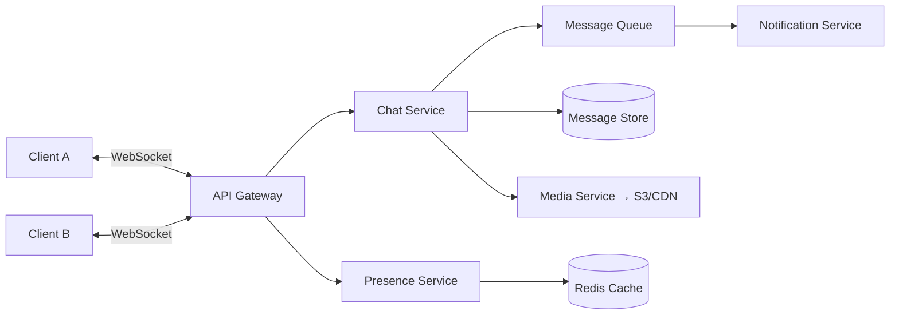

# Chat Application — System Design

Designing a real-time chat application (think WhatsApp, Slack, or Telegram) is one of the most common system design interview questions. It tests your understanding of real-time communication, data modeling at scale, and distributed systems fundamentals.

---

## Interview Roadmap

Follow these steps in order — each maps to a phase the interviewer expects:

| Step | Topic | What You'll Cover |
|------|-------|-------------------|
| 1 | **[Requirements & Estimation](requirements-estimation.md)** | Clarify scope, define functional/non-functional requirements, estimate scale |
| 2 | **[High-Level Architecture](high-level-architecture.md)** | Core services, API design, component interactions |
| 3 | **[Real-Time Messaging](real-time-messaging.md)** | WebSocket management, message delivery, ordering, group fan-out |
| 4 | **[Data Model & Storage](data-model-storage.md)** | Schema design, database selection, media storage, caching |
| 5 | **[Scalability & Reliability](scalability-reliability.md)** | Horizontal scaling, sharding, fault tolerance, monitoring |

---

## System Overview

---

## Key Design Decisions at a Glance

| Decision | Choice | Why |
|----------|--------|-----|
| Real-time protocol | WebSocket | Full-duplex, low latency, widely supported |
| Message store | Cassandra / ScyllaDB | Write-heavy, time-series access pattern, horizontal scaling |
| User/group metadata | PostgreSQL / MySQL | Relational data with strong consistency needs |
| Cache layer | Redis | Session management, presence, recent conversations |
| Message queue | Kafka | Ordered, durable, high-throughput event streaming |
| Media storage | S3 + CDN | Cost-effective blob storage with global edge delivery |

!!! tip "Further Reading"
    - [Designing a Chat System — System Design Interview (Alex Xu)](https://bytebytego.com/)
    - [How Discord Stores Billions of Messages](https://discord.com/blog/how-discord-stores-billions-of-messages)
    - [WhatsApp Architecture — High Scalability](http://highscalability.com/)
    - Also see: **[Mobile Chat Architecture](../../mobile/chat-app/index.md)** for client-side design
