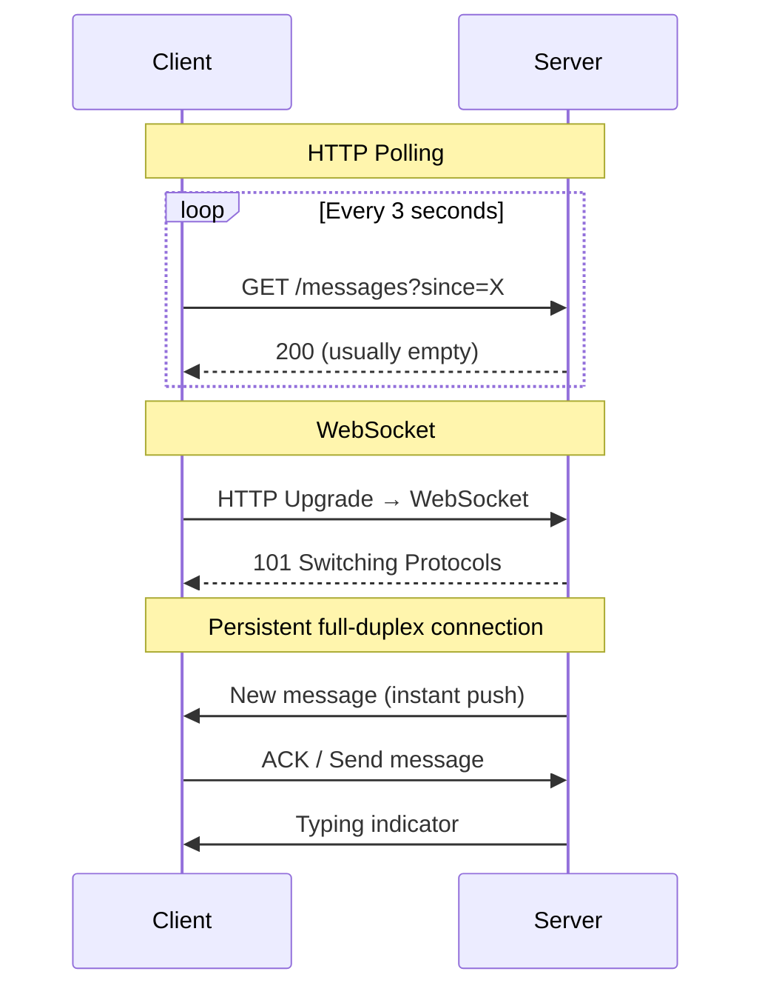
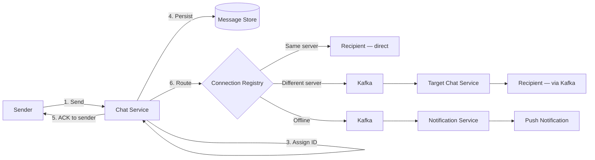
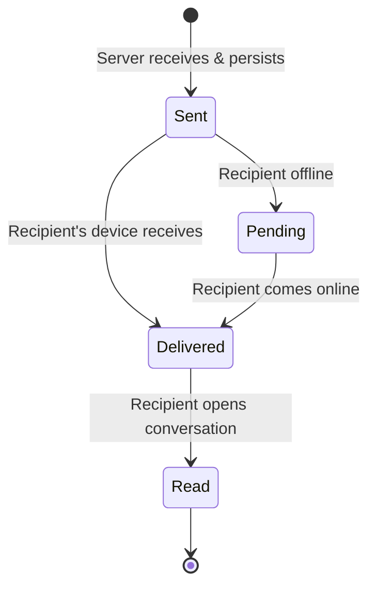
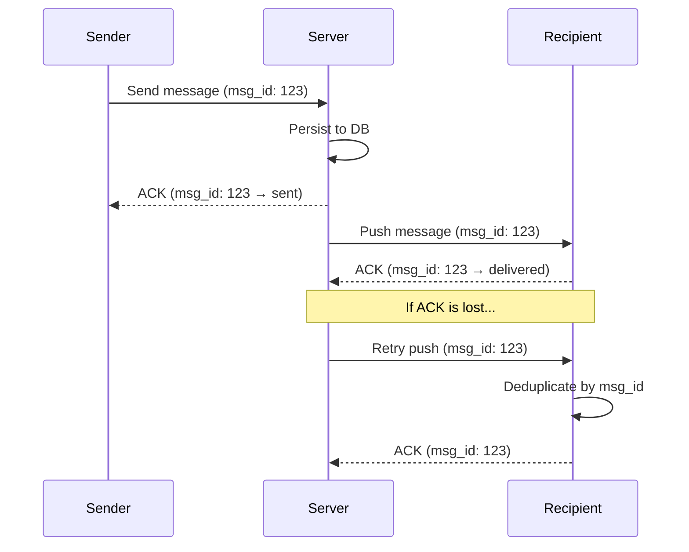
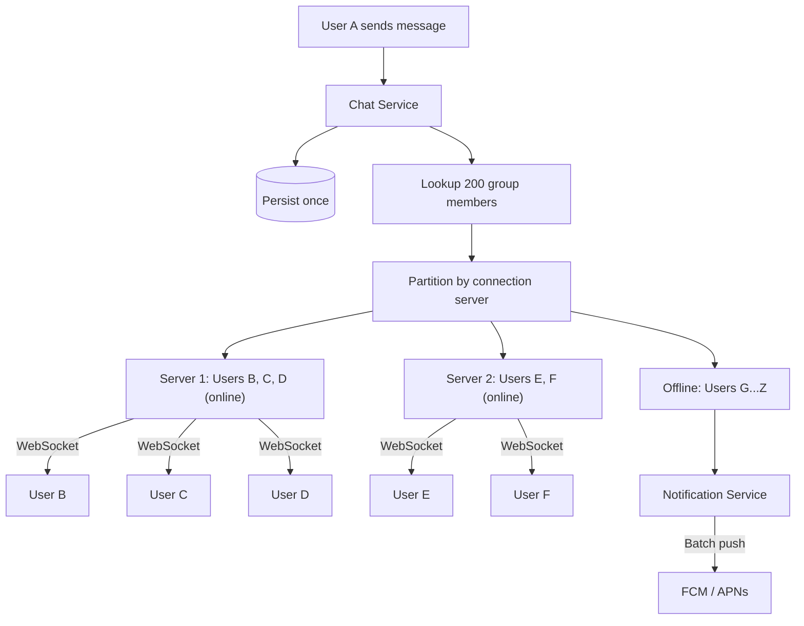
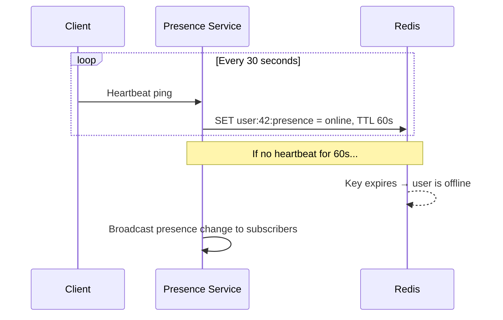

# Real-Time Messaging

The heart of any chat system. This deep-dive covers protocol selection, message delivery guarantees, ordering, and the mechanics of getting a message from sender to recipient in real time.

---

## Protocol Comparison

| Protocol | Mechanism | Latency | Server Load | Use Case |
|----------|-----------|---------|-------------|----------|
| **HTTP Polling** | Client polls server at fixed intervals | High (interval-bound) | Very high (wasted requests) | Legacy systems only |
| **Long Polling** | Client opens request; server holds until data is available | Medium (~100ms) | High (one connection per pending request) | Fallback when WebSocket isn't available |
| **Server-Sent Events (SSE)** | Server pushes over a persistent HTTP connection | Low | Moderate | One-way updates (notifications, feeds) |
| **WebSocket** | Full-duplex over a single TCP connection | Very low (~10ms) | Low per connection | Real-time bidirectional messaging |

### Why WebSocket Wins



WebSocket eliminates the overhead of repeated HTTP handshakes and headers. At 50M concurrent connections, this saves terabytes of bandwidth per day compared to polling.

!!! warning "WebSocket Limitations"
    WebSocket connections are **stateful** — each connection is pinned to a specific server. This complicates horizontal scaling (you need a connection registry) and makes rolling deployments harder (connections must be drained gracefully).

---

## Message Delivery Pipeline

### End-to-End Flow



### Delivery States

Each message transitions through a well-defined state machine:



| State | Triggered By | Stored Where |
|-------|-------------|--------------|
| **Sent** | Server persists message and ACKs sender | Message table (`status` column) |
| **Delivered** | Recipient's client sends ACK | Updated in message table |
| **Read** | Recipient sends read receipt with `last_read_message_id` | Conversation-participant table |

---

## Delivery Guarantees

### At-Least-Once Delivery

The standard guarantee for chat systems. Every message is delivered at least once; duplicates are possible but handled by the client.



### Deduplication Strategy

| Layer | Mechanism |
|-------|-----------|
| **Client-side** | Maintain a set of received `message_id`s; ignore duplicates before rendering |
| **Server-side** | Idempotent writes using `message_id` as primary key; duplicate inserts are no-ops |

!!! note "Why Not Exactly-Once?"
    True exactly-once delivery in a distributed system requires two-phase commit or similar coordination, which adds unacceptable latency for real-time chat. At-least-once with client-side deduplication is the industry standard (WhatsApp, Signal, Telegram all use this approach).

---

## Message Ordering

### The Ordering Problem

In a distributed system with multiple Chat Service instances, messages from different senders can arrive at the server in a different order than they were sent.

| Ordering Level | Guarantee | How |
|----------------|-----------|-----|
| **Per-conversation** | Messages in a single conversation are strictly ordered | Server assigns monotonically increasing IDs per conversation |
| **Per-sender** | A user's messages appear in send order | Single WebSocket connection ensures FIFO from one sender |
| **Global** | All messages across all conversations are ordered | **Not guaranteed** — not needed for chat |

### Server-Side Ordering

```
Conversation: conv_42

User A sends: "Hello"     → server assigns msg_id: 1001 (timestamp: T1)
User B sends: "Hey!"      → server assigns msg_id: 1002 (timestamp: T2)
User A sends: "How are you?" → server assigns msg_id: 1003 (timestamp: T3)

Client displays: sorted by msg_id → correct order
```

The server is the **single source of truth** for ordering. Even if User B's message was sent before User A's in wall-clock time, the server-assigned ID determines display order.

### Handling Out-of-Order Delivery

Messages may arrive at the recipient out of order due to network conditions or multi-server routing.

```
Received: msg_1003, msg_1001, msg_1002
Display:  msg_1001, msg_1002, msg_1003 (sorted by ID)
```

The client maintains a **local buffer** and sorts by `message_id` before rendering. A short delay (50–100ms) can batch arriving messages for smoother display.

---

## Group Messaging Deep Dive

### Fan-Out Mechanics

When User A sends a message to a group of 200 members:



### Optimizing Group Delivery

| Optimization | Description |
|-------------|-------------|
| **Batch by server** | Group recipients by their Chat Service instance; send one Kafka message per server, not per user |
| **Lazy delivery for large groups** | For groups > 500 members, don't push to all — notify online users, let others pull on open |
| **Selective push** | Only send push notifications to users who have the conversation unmuted |
| **Read receipt aggregation** | Don't fan-out individual read receipts in large groups — aggregate ("seen by 42 members") |

---

## Presence System

### Heartbeat-Based Presence



| Design Choice | Value | Rationale |
|---------------|-------|-----------|
| Heartbeat interval | 30s | Balances battery life vs. detection speed |
| TTL | 60s (2× heartbeat) | Tolerates one missed heartbeat without false offline |
| Presence fan-out | Only to users who have the contact visible | Avoids broadcasting to millions of users |

### Presence at Scale

For large contact lists, eager fan-out of presence updates is expensive. Optimizations:

- **Pull on open**: Fetch presence only when a conversation is opened
- **Subscribe on view**: Only subscribe to presence updates for contacts currently visible on screen
- **Batch updates**: Aggregate presence changes and send in periodic batches (every 5s)

---

## Typing Indicators

Typing indicators are ephemeral signals — they don't need persistence or delivery guarantees.

| Property | Value |
|----------|-------|
| Transport | WebSocket (same connection as messages) |
| Persistence | None — fire and forget |
| Throttle | Client sends at most 1 typing event per 3 seconds |
| Timeout | "Typing" state auto-clears after 5 seconds of no signal |
| Group behavior | Show up to 3 names: "Alice, Bob are typing…" / "3 people are typing…" |

---

??? question "Interview Questions"

    **Q: What happens if a WebSocket connection drops mid-message?**
    The client should implement automatic reconnection with exponential backoff. On reconnect, the client sends its `last_received_message_id` to the server, which replays any messages the client missed. Since messages are persisted server-side before delivery, no data is lost.

    **Q: How do you handle message delivery to a user on multiple devices?**
    Each device maintains its own WebSocket connection. The connection registry maps `user_id → [device_1_server, device_2_server, ...]`. When a message arrives, it's fanned out to all of the user's active connections. Each device independently tracks its own `last_read_message_id`.

    **Q: Why not use XMPP or MQTT instead of WebSocket?**
    XMPP is a full chat protocol with built-in presence and routing, but it's XML-based (verbose), harder to customize, and adds protocol complexity. MQTT is designed for IoT pub/sub, not chat. WebSocket gives you a raw transport layer with full control over the message format and routing logic. Most modern chat systems (WhatsApp, Discord, Slack) use custom protocols over WebSocket.

    **Q: How do you prevent message storms in large groups?**
    Rate limiting per user per group (e.g., 30 messages/min), lazy delivery for large channels (don't push to all — let clients pull), read receipt aggregation instead of per-user fan-out, and notification batching/debouncing.

!!! tip "Further Reading"
    - [RFC 6455 — The WebSocket Protocol](https://datatracker.ietf.org/doc/html/rfc6455)
    - [How Slack Built Shared Channels](https://slack.engineering/)
    - [Scaling WebSocket in Go — Centrifugo](https://centrifugal.dev/)
