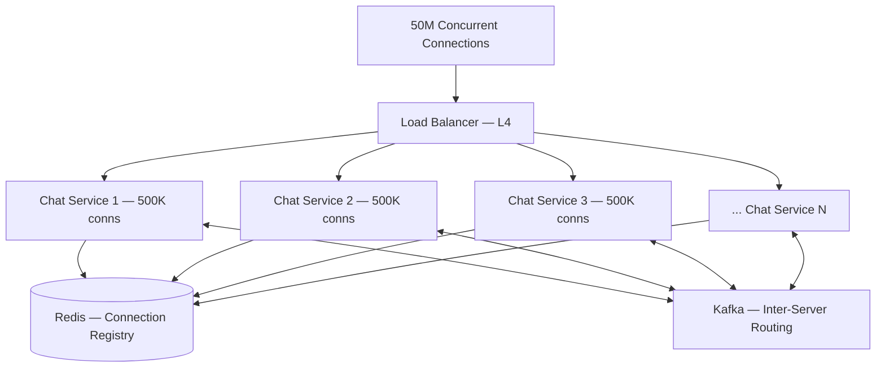
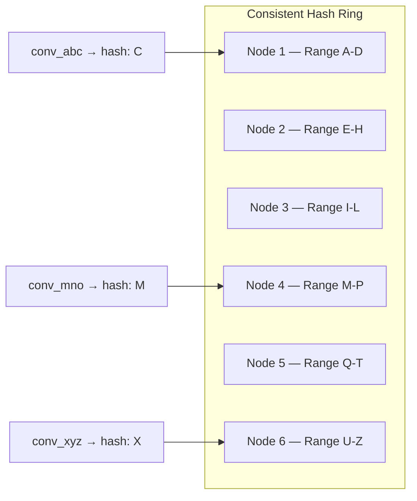
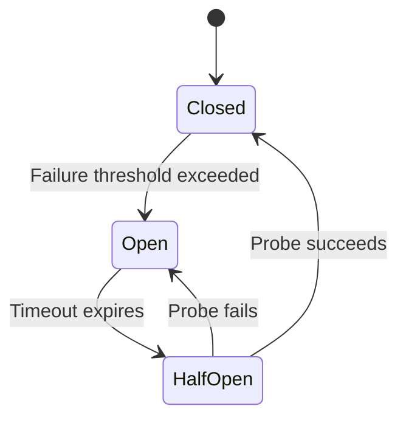
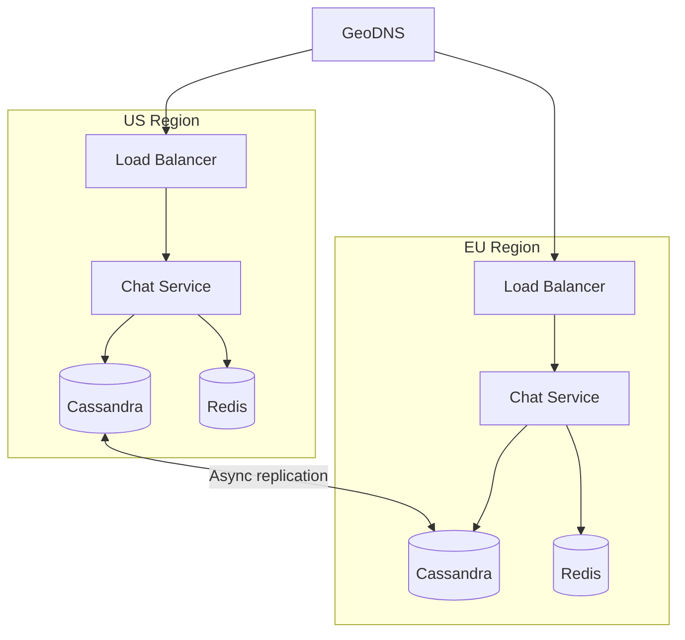

# Scalability & Reliability

The final phase of the interview: demonstrate that your design handles growth, failure, and real-world operational challenges. This is where senior candidates differentiate themselves.

---

## Scaling the WebSocket Layer

The Chat Service is the hardest component to scale because WebSocket connections are **stateful** — each connection is pinned to a specific server.

### Horizontal Scaling Strategy



| Parameter | Typical Value |
|-----------|--------------|
| Connections per server | 500K – 1M (depends on memory; ~10 KB per connection) |
| Servers needed for 50M connections | 50–100 instances |
| Memory per server | ~10 GB for connections + buffers |
| Connection registry | Redis cluster with `user_id → server_id` mapping |

### Connection Draining

During deployments or scaling events, connections must be **drained gracefully**:

```
1. Mark server as "draining" — stop accepting new connections
2. Send reconnect signal to connected clients (with target server hint)
3. Wait for clients to disconnect (timeout: 30s)
4. Terminate remaining connections
5. Shut down server
```

---

## Database Sharding

### Cassandra (Messages)

Cassandra handles sharding natively via its **consistent hash ring**. The partition key (`conversation_id`) determines which nodes own the data.



| Scaling Action | Steps |
|----------------|-------|
| **Add capacity** | Add nodes to the ring; Cassandra automatically rebalances token ranges |
| **Handle hot partitions** | Very active conversations (celebrity group chats) → monitor partition size; use time-bucketing if needed |
| **Cross-DC replication** | Configure `NetworkTopologyStrategy` with RF=3 per datacenter |

### PostgreSQL (Users, Groups)

PostgreSQL doesn't shard natively. Options at scale:

| Strategy | How It Works | Complexity |
|----------|-------------|------------|
| **Read replicas** | Primary for writes, replicas for reads | Low |
| **Vertical scaling** | Bigger machine (works up to ~1TB) | Low |
| **Application-level sharding** | Shard by `user_id % N` across multiple PostgreSQL clusters | High |
| **Citus / Vitess** | Distributed PostgreSQL / MySQL layer | Medium |

!!! note "Do You Actually Need to Shard PostgreSQL?"
    User and conversation metadata is much smaller than message data. 500M users × 1 KB each = ~500 GB — a single PostgreSQL instance with read replicas can handle this. Don't over-engineer.

---

## Kafka Partitioning

Kafka is the backbone for inter-service communication. Partition strategy matters for ordering and throughput.

| Topic | Partition Key | Why |
|-------|--------------|-----|
| `messages` | `conversation_id` | All messages for a conversation go to the same partition → preserves ordering |
| `notifications` | `recipient_user_id` | Ensures per-user notification ordering |
| `presence` | `user_id` | Presence events for a user are processed in order |

### Sizing

```
Messages/sec (peak): 700K
Partitions per topic: 200-500 (aim for ~2K msg/sec per partition)
Consumer groups: 1 per service (Chat, Notification, Analytics)
Retention: 7 days (messages are already persisted in Cassandra)
```

---

## Rate Limiting

Protect the system from abuse and thundering herds.

| Limit | Value | Scope | Algorithm |
|-------|-------|-------|-----------|
| Messages per user | 100/min | Per user | Token bucket |
| API requests | 1000/min | Per user | Sliding window |
| WebSocket connections | 5 | Per user (devices) | Counter |
| Media uploads | 50/hour | Per user | Token bucket |
| Group creation | 10/day | Per user | Fixed window |

### Token Bucket in Redis

```python
def is_allowed(user_id: str, limit: int, window_sec: int) -> bool:
    key = f"rate:{user_id}"
    current = redis.incr(key)
    if current == 1:
        redis.expire(key, window_sec)
    return current <= limit
```

---

## Fault Tolerance

### What Happens When Things Break?

| Failure | Impact | Mitigation |
|---------|--------|------------|
| **Chat Service instance dies** | Users on that instance lose connection | Clients auto-reconnect (exponential backoff + jitter); LB routes to healthy instances |
| **Kafka broker down** | Message routing delayed | Kafka replication (RF=3); in-sync replicas take over; messages buffered on Chat Service |
| **Cassandra node down** | Reads/writes continue | RF=3 with quorum consistency; surviving replicas serve requests; hinted handoff for missed writes |
| **Redis down** | Presence stale, session lookups fail | Redis Sentinel/Cluster for HA; degrade gracefully (show "unknown" presence, re-auth) |
| **PostgreSQL primary down** | User/group writes fail | Promote read replica to primary (automated failover with Patroni/RDS) |
| **S3 outage** | Media unavailable | S3 has 99.999999999% durability; CDN serves cached content; show placeholder for new uploads |
| **Entire datacenter down** | Regional outage | Active-active multi-region deployment; DNS failover to healthy region |

### Circuit Breaker Pattern



Apply circuit breakers between services to prevent cascading failures. Example: if the Notification Service is down, the Chat Service should not queue up and eventually OOM — it should fail fast and retry later.

---

## Multi-Region Deployment

### Active-Active Architecture



| Concern | Approach |
|---------|----------|
| **Routing** | GeoDNS routes users to nearest region |
| **Cross-region messaging** | If User A (US) messages User B (EU), the message is persisted locally and async-replicated; User B's Chat Service in EU delivers via WebSocket |
| **Conflict resolution** | Last-write-wins with server timestamps; conflicts are rare for append-only message data |
| **Consistency** | Eventual consistency across regions; strong consistency within a region (LOCAL_QUORUM) |

---

## Monitoring & Alerting

### Key Metrics

| Metric | Target | Alert Threshold |
|--------|--------|-----------------|
| Message delivery latency (p99) | < 200ms | > 500ms |
| WebSocket connection count | Balanced across servers | > 20% imbalance |
| Message queue lag (Kafka) | < 1000 messages | > 10,000 messages |
| Cassandra write latency (p99) | < 10ms | > 50ms |
| Error rate (5xx) | < 0.1% | > 1% |
| Undelivered messages (> 30s) | < 0.01% | > 0.1% |

### Observability Stack

| Layer | Tool |
|-------|------|
| Metrics | Prometheus + Grafana |
| Logging | ELK Stack (Elasticsearch, Logstash, Kibana) |
| Tracing | Jaeger / OpenTelemetry |
| Alerting | PagerDuty / Opsgenie |

---

## Cost Optimization

| Resource | Strategy |
|----------|----------|
| **Compute** | Right-size Chat Service instances for connection density; use spot instances for Notification Service (stateless) |
| **Storage** | Cassandra TTL for old messages (if retention policy allows); S3 lifecycle to Glacier for media > 1 year |
| **Bandwidth** | CDN for media reduces egress; compress messages with gzip/zstd over WebSocket |
| **Kafka** | Tiered storage: hot data on SSD, cold data on S3-backed storage |

---

??? question "Interview Questions"

    **Q: How would you handle a celebrity user with millions of followers posting in a public channel?**
    This is the "hot partition" problem. Solutions: (1) Don't fan-out writes — store the message once and let followers pull on read. (2) Use a tiered delivery: push to online users with open connections, batch-notify others. (3) Cache the message at the edge (CDN-like pattern for chat). (4) Rate-limit the channel if needed.

    **Q: How do you ensure zero message loss during a server crash?**
    Messages are persisted to Cassandra **before** the sender receives an ACK. If the server crashes after persistence but before delivery, the message is safe in the database. When the recipient reconnects, they sync from their `last_received_message_id` and get all missed messages. Kafka's durability (replicated log) provides an additional safety net for in-flight routing events.

    **Q: How would you migrate from a monolith to this microservice architecture?**
    Strangler fig pattern: (1) Put an API gateway in front of the monolith. (2) Extract one service at a time (start with Media Service — least coupled). (3) Use Kafka as the integration bus between old and new. (4) Migrate data in stages. (5) Keep the monolith running until all traffic is routed to new services.

    **Q: How do you test this system at scale?**
    (1) Load testing with tools like k6 or Gatling simulating millions of WebSocket connections. (2) Chaos engineering (Chaos Monkey, Litmus) to validate fault tolerance. (3) Shadow traffic: replay production traffic against a staging environment. (4) Canary deployments: route 1% of traffic to new versions before full rollout.

    **Q: What's the single biggest bottleneck in this design?**
    The WebSocket layer. It's stateful, memory-intensive, and the hardest to scale horizontally. Every optimization in connection management, routing efficiency, and graceful degradation directly impacts the system's ability to handle peak load. The data layer (Cassandra, Kafka) scales more predictably by adding nodes.

!!! tip "Further Reading"
    - [Designing Data-Intensive Applications — Martin Kleppmann](https://dataintensive.net/)
    - [The System Design Primer — GitHub](https://github.com/donnemartin/system-design-primer)
    - [How WhatsApp Scaled to 1 Billion Users](https://www.wired.com/2015/09/whatsapp-serves-900-million-users-50-engineers/)
