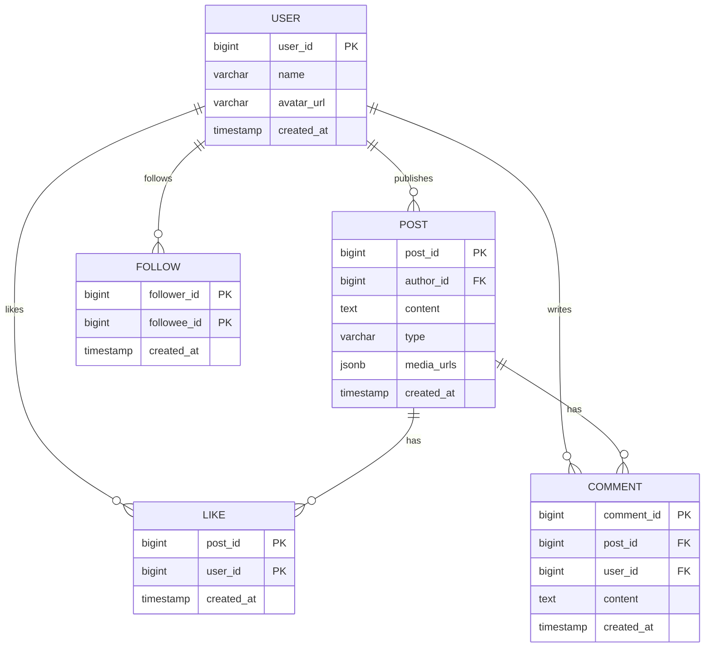
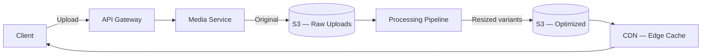

# Data Model & Storage

The data layer must handle high write throughput (post creation + fan-out), massive read throughput (feed serving), and efficient storage of media at petabyte scale. Different data stores serve different access patterns.

---

## Data Model Overview



---

## Database Selection

| Data | Store | Why |
|------|-------|-----|
| **Users, Posts, Comments, Likes** | PostgreSQL | Relational integrity, ACID, rich query support |
| **Feed cache** | Redis (sorted sets) | Sub-ms reads, score-based ordering, TTL |
| **Social graph** | Redis (sets) or Neo4j | Fast follower/following lookups, set operations |
| **Media files** | S3 | Cheap blob storage, 11 nines durability |
| **Post events** | Kafka | Durable, ordered event stream for fan-out |
| **Analytics / search** | Elasticsearch | Full-text search, trending content queries |

---

## PostgreSQL Schema

### Posts Table

```sql
CREATE TABLE posts (
    post_id     BIGINT PRIMARY KEY,  -- Snowflake / ULID
    author_id   BIGINT NOT NULL REFERENCES users(user_id),
    content     TEXT,
    type        VARCHAR(20) DEFAULT 'text',  -- text, image, video
    media_urls  JSONB DEFAULT '[]',
    like_count  INTEGER DEFAULT 0,
    comment_count INTEGER DEFAULT 0,
    created_at  TIMESTAMPTZ NOT NULL DEFAULT NOW()
);

CREATE INDEX idx_posts_author_time ON posts (author_id, created_at DESC);
CREATE INDEX idx_posts_created ON posts (created_at DESC);
```

### Follow Table (Social Graph)

```sql
CREATE TABLE follows (
    follower_id  BIGINT NOT NULL REFERENCES users(user_id),
    followee_id  BIGINT NOT NULL REFERENCES users(user_id),
    created_at   TIMESTAMPTZ NOT NULL DEFAULT NOW(),
    PRIMARY KEY (follower_id, followee_id)
);

CREATE INDEX idx_follows_followee ON follows (followee_id);
```

| Query Pattern | Index Used | Performance |
|--------------|-----------|-------------|
| "Who does user X follow?" | PK `(follower_id, followee_id)` | Index scan |
| "Who follows user X?" (for fan-out) | `idx_follows_followee` | Index scan |
| "User X's recent posts" | `idx_posts_author_time` | Index scan, limit N |

### Engagement Tables

```sql
CREATE TABLE likes (
    post_id    BIGINT NOT NULL REFERENCES posts(post_id),
    user_id    BIGINT NOT NULL REFERENCES users(user_id),
    created_at TIMESTAMPTZ NOT NULL DEFAULT NOW(),
    PRIMARY KEY (post_id, user_id)
);

CREATE TABLE comments (
    comment_id BIGINT PRIMARY KEY,
    post_id    BIGINT NOT NULL REFERENCES posts(post_id),
    user_id    BIGINT NOT NULL REFERENCES users(user_id),
    content    TEXT NOT NULL,
    created_at TIMESTAMPTZ NOT NULL DEFAULT NOW()
);

CREATE INDEX idx_comments_post ON comments (post_id, created_at DESC);
```

!!! note "Denormalized Counters"
    `like_count` and `comment_count` on the `posts` table are denormalized counters updated via triggers or application logic. This avoids `COUNT(*)` queries on the likes/comments tables for every feed render. Accept slight staleness (update async) for read performance.

---

## Redis Data Structures

### Feed Cache (Sorted Sets)

Each user's feed is a Redis sorted set where the score is the ranking score (or timestamp for chronological feeds).

```
Key:    feed:{user_id}
Type:   Sorted Set
Member: post_id
Score:  ranking_score or timestamp

ZADD    feed:user_42 1700000000 post_abc    -- Add post to feed
ZREVRANGE feed:user_42 0 19                 -- Get top 20 posts
ZREMRANGEBYRANK feed:user_42 0 -1001        -- Trim to last 1000
ZCARD   feed:user_42                        -- Feed size
```

### Social Graph (Sets)

```
Key:    followers:{user_id}    -- Users who follow this user
Type:   Set
Members: follower_ids

Key:    following:{user_id}    -- Users this user follows
Type:   Set
Members: followee_ids

SMEMBERS followers:user_42     -- All followers (for fan-out)
SCARD    followers:user_42     -- Follower count
SISMEMBER followers:user_42 user_99  -- Does user_99 follow user_42?
```

### Cache Sizing

| Data | Key Pattern | Size Per Entry | Total Memory |
|------|------------|---------------|--------------|
| Feed cache | `feed:{user_id}` | 1000 posts × ~16 bytes = 16 KB | 500M users × 16 KB = **8 TB** |
| Followers | `followers:{user_id}` | 200 avg × 8 bytes = 1.6 KB | 500M × 1.6 KB = **800 GB** |
| Following | `following:{user_id}` | 200 avg × 8 bytes = 1.6 KB | 500M × 1.6 KB = **800 GB** |

!!! warning "Not All Users Need Cached Feeds"
    8 TB of feed cache assumes every user has a cached feed. In practice, only active users (e.g., logged in within 7 days) need cached feeds. If 20% of users are active, that's ~1.6 TB — feasible for a Redis cluster.

---

## Media Storage Architecture



### Image Processing Pipeline

| Step | Action | Output |
|------|--------|--------|
| 1. Upload | Client uploads original image | Raw image in S3 |
| 2. Validation | Check file type, size limits, virus scan | Accept / reject |
| 3. Resize | Generate multiple sizes (thumbnail, feed, full) | 150×150, 600×600, 1080×1080 |
| 4. Format conversion | Convert to WebP (smaller) with JPEG fallback | WebP + JPEG variants |
| 5. CDN distribution | Invalidate old cache; new URLs via CDN | Globally accessible URLs |

### Storage Tiers

| Tier | Age | Storage Class | Cost/GB/month |
|------|-----|--------------|---------------|
| Hot | 0–30 days | S3 Standard | $0.023 |
| Warm | 30–180 days | S3 Infrequent Access | $0.0125 |
| Cold | 180+ days | S3 Glacier | $0.004 |

---

## Engagement Count Storage

High-traffic posts can receive thousands of likes per second. Counter updates must be efficient without locking.

### Approach: Redis Counter + Async DB Sync

```mermaid
flowchart LR
    LIKE[Like Request] --> REDIS[Redis INCR post:likes:{post_id}]
    REDIS --> RESP[Return Updated Count]
    REDIS --> KAFKA[Kafka — Batch Sync]
    KAFKA --> WORKER[Counter Sync Worker]
    WORKER --> DB[PostgreSQL — UPDATE posts SET like_count]
```

| Component | Role |
|-----------|------|
| **Redis INCR** | Atomic increment; handles burst writes |
| **Kafka** | Batches counter updates; fires every N seconds or N increments |
| **DB sync** | Periodic flush from Redis to PostgreSQL for durability |

This pattern handles viral posts (100K likes/sec) without hammering PostgreSQL with per-like UPDATEs.

---

## Data Consistency

| Scenario | Consistency Model | Why |
|----------|------------------|-----|
| Post creation | Strong (synchronous DB write) | Author must see their post immediately |
| Feed cache update | Eventual (~seconds delay) | Followers seeing a post a few seconds late is fine |
| Like/comment counts | Eventual (~5–30s delay) | Approximate counts are acceptable |
| Social graph | Strong for writes, eventual for reads | Follow action must be durable; fan-out can use slightly stale list |
| Media availability | Eventual (~seconds for processing) | Show placeholder until processed variants are ready |

---

??? question "Interview Questions"

    **Q: Why PostgreSQL instead of Cassandra for posts?**
    Posts have relational properties — they reference users, have comments, likes, and need consistent writes. The write rate (~11.5K/sec) is well within PostgreSQL's capability with proper indexing and connection pooling. Cassandra's strength (massive write throughput, time-series data) is better suited if you were storing billions of feed entries — but we use Redis for that.

    **Q: Why not store the full feed in PostgreSQL?**
    A user's feed is an ephemeral view — it changes constantly as new posts are published and old ones age out. Storing materialized feeds in a relational database would be write-heavy (every post triggers N row inserts) and wasteful (most feed entries are read once or never). Redis sorted sets are purpose-built for this access pattern: score-based ordering, trim operations, and sub-ms reads.

    **Q: How do you handle the "like count" race condition?**
    Two users liking simultaneously could cause a lost update with naive `UPDATE SET count = count + 1`. Solutions: (1) Use Redis `INCR` for the hot counter (atomic, no races). (2) Use `INSERT INTO likes` with a unique constraint (idempotent, countable). (3) Periodically reconcile Redis count with `SELECT COUNT(*)` from the likes table.

    **Q: How do you shard PostgreSQL for posts?**
    Shard by `author_id` range or hash. This ensures a user's posts live on the same shard (efficient profile page queries). The trade-off: feed assembly requires cross-shard reads (posts from multiple authors). Mitigate by caching post metadata aggressively — feed reads hit Redis first, not the posts table.

    **Q: What happens if Redis goes down?**
    Feed reads fall back to the pull model: query the social graph for followed users, fetch their recent posts from PostgreSQL, rank, and serve. This is slower (~200ms → ~1s) but functional. Redis is a cache layer, not the source of truth — PostgreSQL is. Use Redis Cluster with replicas for HA to minimize this scenario.
