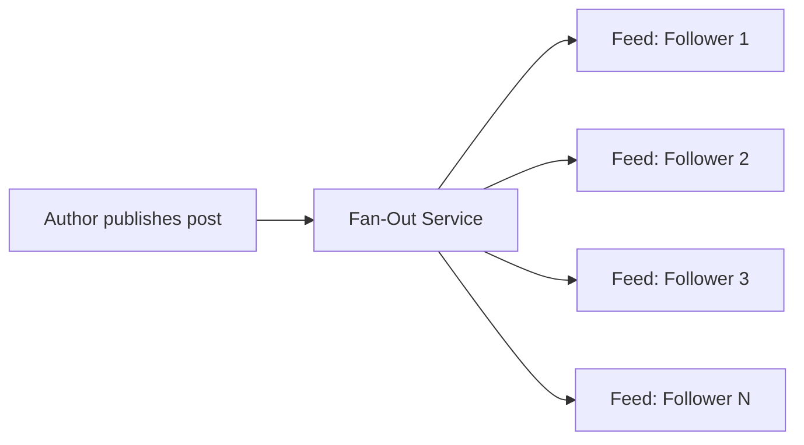
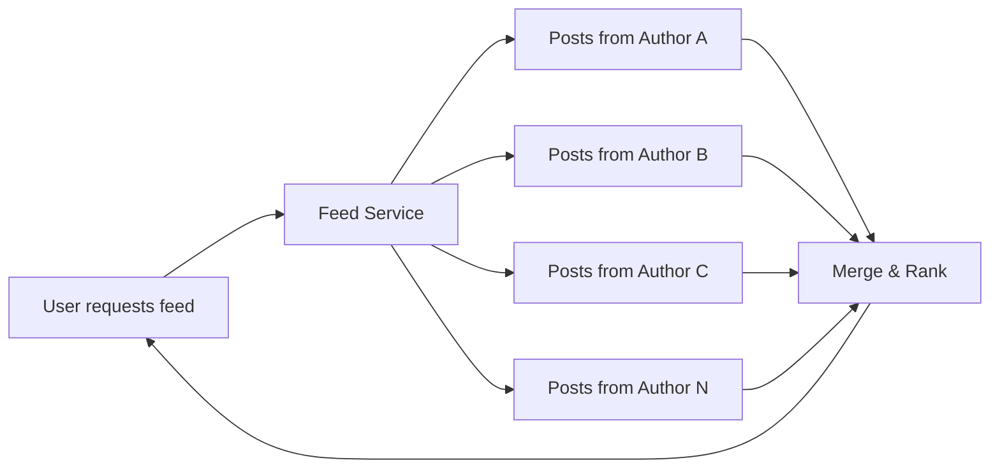
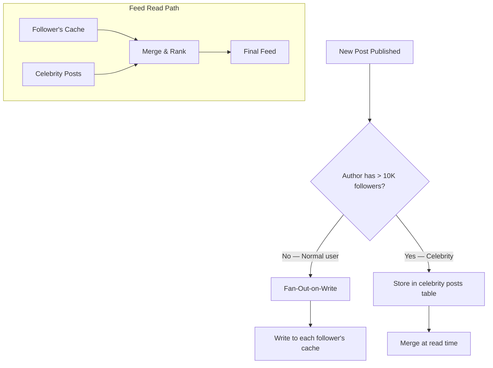
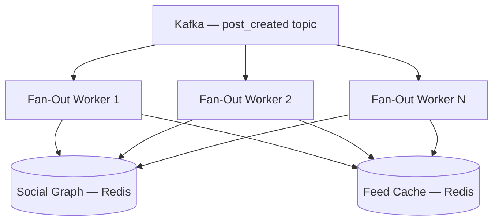
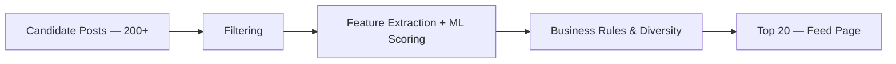
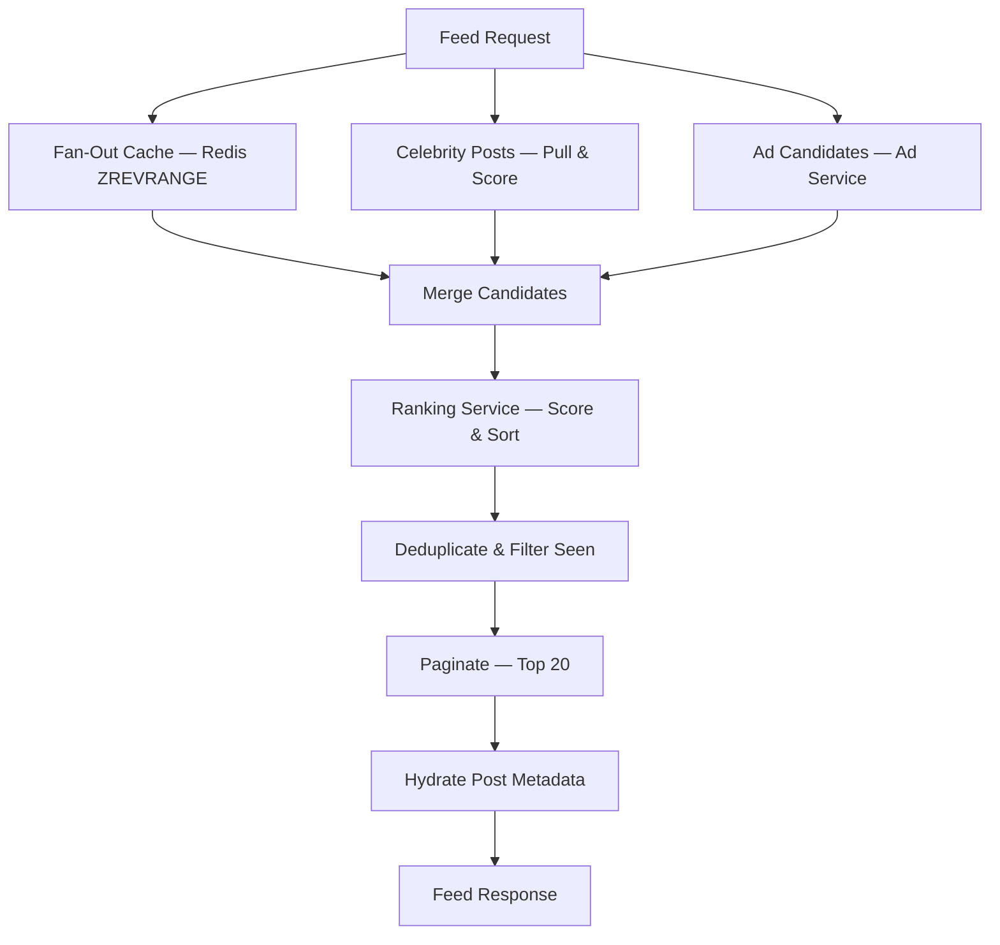

# Feed Generation & Ranking

The heart of a news feed system: how posts get from an author to followers' screens, and in what order. This is where the biggest design trade-offs live.

---

## Fan-Out Strategies

When a user publishes a post, it must eventually appear in every follower's feed. The strategy for how and when this happens is the most impactful decision in the design.

### Fan-Out-on-Write (Push Model)

When a post is published, immediately write it to every follower's feed cache.



| Pros | Cons |
|------|------|
| Fast feed reads — pre-computed, just read from cache | Write amplification — 1 post becomes N writes |
| Simple read path — no on-the-fly aggregation | Wasted work for inactive users who never check their feed |
| Consistent latency for readers | Celebrity problem — user with 10M followers = 10M writes per post |

### Fan-Out-on-Read (Pull Model)

When a user requests their feed, query posts from all users they follow in real-time.



| Pros | Cons |
|------|------|
| No write amplification | Slow reads — must query N sources and merge |
| No wasted work — only computed when requested | High read latency, especially for users following many accounts |
| Works well for users with huge follower counts | Hard to do complex ranking on the fly |

### Hybrid Fan-Out (Production Choice)

Combine both strategies based on the author's follower count.



| User Type | Strategy | Why |
|-----------|----------|-----|
| **Normal user** (< 10K followers) | Fan-out-on-write | Low write cost; fast reads |
| **Celebrity** (≥ 10K followers) | Fan-out-on-read | Avoids millions of writes per post |
| **Close friends** of celebrities | Eager push | Always push to mutual followers for real-time feel |

!!! note "The Celebrity Threshold"
    The exact threshold (e.g., 10K, 50K, 100K followers) is tunable. Twitter reportedly uses ~10K. The key insight is that a tiny percentage of users (< 1%) cause the vast majority of fan-out load. Treating them differently gives you 99% of the push model's benefits with none of the write explosion.

---

## Fan-Out Service Design

### Architecture



### Fan-Out Pipeline

```
1. Consume PostCreated event from Kafka (partitioned by author_id)
2. Check author's follower count
   - If < threshold → push path
   - If ≥ threshold → mark as celebrity post (skip push)
3. Fetch follower list from Social Graph Service (paginated)
4. For each follower batch:
   a. ZADD feed:{follower_id} <score> <post_id> (Redis pipeline)
   b. ZREMRANGEBYRANK feed:{follower_id} 0 -(MAX_FEED_SIZE+1) (trim old posts)
5. Emit FanOutCompleted event
```

### Performance Considerations

| Concern | Approach |
|---------|----------|
| **Throughput** | Redis pipelining — batch 100+ ZADD commands per round trip |
| **Parallelism** | Kafka partitions by `author_id`; multiple consumer instances |
| **Backpressure** | If Redis is slow, Kafka consumer lag grows naturally; monitor and scale workers |
| **Follower list size** | Paginate follower fetches (1000 per batch) to avoid memory spikes |
| **Feed size cap** | Keep only last 500–1000 posts per user's feed cache; older posts fall back to DB |

---

## Ranking System

Modern feeds rank posts by relevance rather than pure chronological order. The ranking system scores each candidate post for a given user.

### Ranking Pipeline



| Stage | Purpose | Examples |
|-------|---------|---------|
| **Candidate generation** | Gather posts from cache + celebrity posts | 200–500 candidates per request |
| **Filtering** | Remove ineligible posts | Already seen, blocked users, policy violations |
| **ML scoring** | Predict engagement probability | P(like), P(comment), P(share), P(long_dwell) |
| **Business rules** | Apply non-ML constraints | Diversity (no 5 posts from same author), freshness boost, ad slot insertion |

### Ranking Signals

| Signal Category | Examples | Weight |
|----------------|---------|--------|
| **Engagement prediction** | P(like), P(comment), P(share), P(click) | High |
| **Author affinity** | How often the user interacts with this author | High |
| **Recency** | Time since post was created (decay function) | Medium |
| **Content type** | Image vs. text vs. video (user preference) | Medium |
| **Social proof** | Total likes, comments, shares | Low-Medium |
| **Post quality** | Completeness, media quality, originality | Low |

### Scoring Formula (Simplified)

```
score = w1 × P(engagement) +
        w2 × author_affinity +
        w3 × recency_decay(age) +
        w4 × content_type_boost +
        w5 × social_proof_log(likes + comments)

recency_decay(age) = 1 / (1 + age_hours / half_life)
```

!!! tip "Interview Tip"
    You don't need to design a full ML pipeline in the interview. Mention that production systems use a two-stage model (lightweight candidate scoring → heavier re-ranking), and list the signal categories. The interviewer wants to see that you understand the ranking problem, not that you can design a recommendation engine.

---

## Feed Assembly

### How the Read Path Merges Sources



### Feed Freshness

| Strategy | How It Works | When to Use |
|----------|-------------|-------------|
| **Pull-to-refresh** | Client requests latest feed; invalidates cursor | User-initiated refresh |
| **Push update** | Server pushes "new posts available" via WebSocket/SSE | Real-time updates while app is open |
| **Background refresh** | Periodic cache refresh for active users | Keep cache warm for frequent users |
| **Stale-while-revalidate** | Serve cached feed, update cache async | Minimize latency on cache miss |

---

## Handling Edge Cases

### New User (Cold Start)

No fan-out cache exists yet. Options:

1. **Onboarding fan-out**: When user follows accounts during signup, trigger immediate cache population
2. **Trending/popular fallback**: Show trending or editorially curated content until enough follows exist
3. **Background warm-up**: Asynchronously build the cache from followed accounts' recent posts

### User Unfollows Someone

Remove that author's posts from the follower's feed cache. Two approaches:

| Approach | Pros | Cons |
|----------|------|------|
| **Lazy removal** | No immediate work; posts naturally age out | Unfollowed author's posts still visible briefly |
| **Active removal** | Clean UX; posts disappear immediately | Requires scanning cache to find and remove posts by author |

### Viral Post (Thundering Herd)

A post going viral can cause a read stampede on its metadata.

```
Mitigation:
1. Cache hot post metadata at the CDN/edge layer
2. Request coalescing — if 1000 requests hit for the same post_id,
   only 1 DB query fires; others wait for the result
3. Pre-warm cache when engagement velocity exceeds a threshold
```

---

??? question "Interview Questions"

    **Q: Why not just use chronological feed ordering?**
    Chronological feeds suffer from information overload — a user following 500 accounts can't read everything. Ranked feeds surface content the user is most likely to engage with, increasing time-on-platform and satisfaction. However, some platforms (like X/Twitter) offer a chronological toggle as a user choice.

    **Q: How do you handle the celebrity fan-out problem specifically?**
    Don't fan-out writes for celebrity posts. Instead, store them separately and merge at read time. When a user's feed is requested, the Feed Service pulls from their pre-computed cache (normal users' posts) AND queries recent posts from celebrities they follow, then merges and ranks. The read-time merge adds ~10-50ms but avoids millions of writes per celebrity post.

    **Q: What happens if the Fan-Out Service falls behind?**
    Kafka acts as a buffer. If fan-out workers can't keep up, consumer lag increases but no data is lost. Mitigation: (1) auto-scale workers based on consumer lag metrics, (2) prioritize active users' feeds over inactive ones, (3) switch to pull-based feed for extremely backed-up users. Monitor Kafka consumer group lag as a key operational metric.

    **Q: How do you prevent the feed from becoming stale?**
    Multiple layers: (1) Fan-out keeps caches updated in near-real-time for push-model posts. (2) Pull-to-refresh fetches the latest celebrity posts and merges them. (3) Feed cache entries have TTLs (e.g., 24 hours) forcing a rebuild from the database. (4) Active users get background cache refreshes.

    **Q: How would you A/B test different ranking algorithms?**
    Hash `user_id` to deterministically assign users to experiment buckets. Each bucket uses a different ranking model or weight configuration. Measure engagement metrics (likes, comments, time-on-feed, session duration) per bucket. Use the Ranking Service to dynamically select the scoring function based on the user's experiment assignment.
