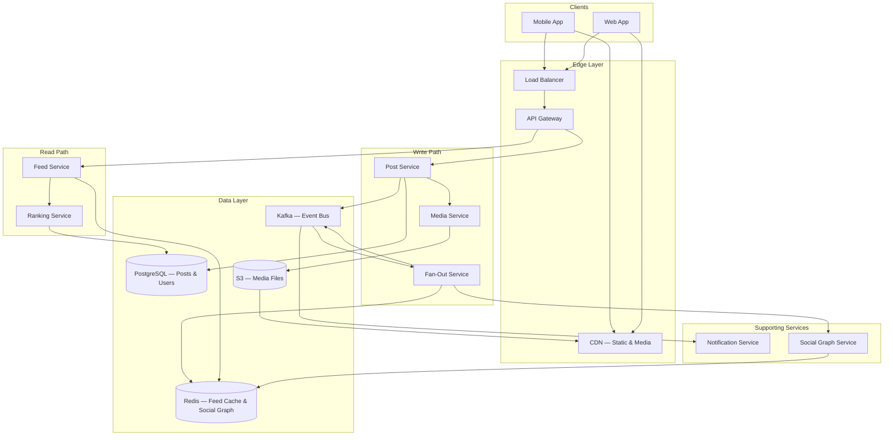
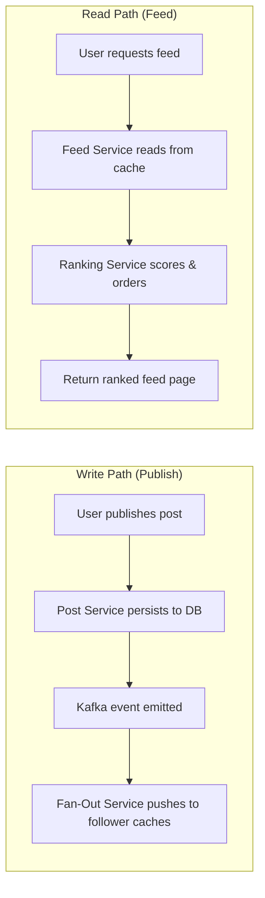
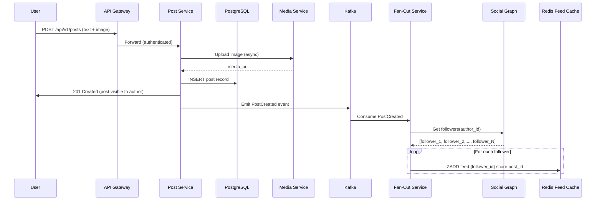
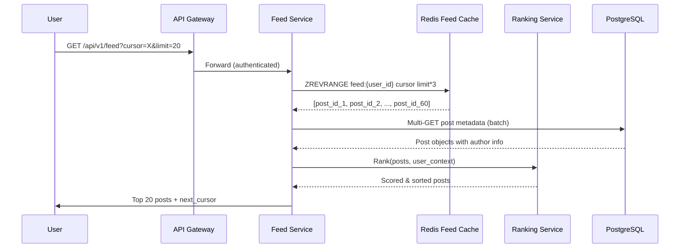

# High-Level Architecture

Once requirements are clear, sketch the big picture. The goal is to show how major components interact before diving into any single one.

---

## Architecture Diagram

---

## Write Path vs. Read Path

The core architectural insight: **separate the write path (publishing) from the read path (feed serving)**. They have different latency requirements, scaling profiles, and failure modes.

| Aspect | Write Path | Read Path |
|--------|-----------|-----------|
| **Latency target** | < 500ms (author sees post); fan-out is async | < 200ms (feed page load) |
| **Throughput** | ~11.5K posts/sec | ~58K feed reads/sec |
| **Bottleneck** | Fan-out write amplification | Cache hit rate |
| **Scaling strategy** | More Kafka partitions + fan-out workers | More Redis replicas + CDN |
| **Failure tolerance** | Can queue and retry | Must serve stale cache on failure |

---

## Component Responsibilities

### Edge Layer

| Component | Role |
|-----------|------|
| **CDN** | Serves static assets (JS, CSS) and media files (images, video); reduces origin load by 80%+ |
| **Load Balancer** | Distributes requests across API Gateway instances; L7 routing for path-based service routing |
| **API Gateway** | Authentication, rate limiting, request routing; terminates TLS |

### Write Path Services

| Service | Responsibility | Scaling Notes |
|---------|---------------|---------------|
| **Post Service** | Validates and persists posts; triggers media processing; emits post-created events to Kafka | Stateless; scale horizontally |
| **Media Service** | Handles upload, image resizing, video transcoding, thumbnail generation | CPU-intensive; scales independently with job queues |
| **Fan-Out Service** | Reads follower lists, writes post references to each follower's feed cache | Highest throughput demand; partitioned by author_id in Kafka |

### Read Path Services

| Service | Responsibility | Scaling Notes |
|---------|---------------|---------------|
| **Feed Service** | Assembles feed from cache; hydrates post metadata; applies pagination | Read-heavy; horizontally scalable with Redis read replicas |
| **Ranking Service** | Scores and reorders candidate posts using ML models | Latency-sensitive; uses pre-computed features + lightweight inference |

### Supporting Services

| Service | Responsibility | Scaling Notes |
|---------|---------------|---------------|
| **Social Graph Service** | Manages follow/unfollow; provides follower lists for fan-out | Backed by Redis or graph DB; read-heavy |
| **Notification Service** | Sends push/email notifications for new posts from close friends | Consumes Kafka events; stateless |

### Data Layer

| Store | Used For | Why This Store |
|-------|----------|----------------|
| **PostgreSQL** | Posts, users, likes, comments | Strong consistency for writes, rich queries, ACID guarantees |
| **Redis** | Feed cache (sorted sets), social graph, session data | Sub-ms reads, sorted set operations for ranked feeds, TTL support |
| **Kafka** | Event streaming between services | Decouples write/read paths; ordered, durable, replayable |
| **S3 + CDN** | Media files (images, video) | Cheap blob storage + global edge caching |

---

## Publish Flow: End-to-End

---

## Feed Read Flow: End-to-End

!!! note "Over-Fetching for Ranking"
    The Feed Service fetches 3× the requested page size from cache, then lets the Ranking Service filter and reorder. This ensures enough candidates survive filtering (e.g., removing already-seen posts, blocked users) to fill the page.

---

## Authentication & Security

| Concern | Approach |
|---------|----------|
| **API auth** | OAuth 2.0 / JWT; short-lived access tokens (15 min) + refresh tokens |
| **Rate limiting** | Per-user publish rate (e.g., 50 posts/hour); per-user feed reads (e.g., 300/min) |
| **Content validation** | Server-side input sanitization; media virus scanning; NSFW detection |
| **Privacy** | Respect block lists and privacy settings in feed assembly; never leak private posts |
| **Transport security** | TLS everywhere; certificate pinning on mobile |

---

??? question "Interview Questions"

    **Q: Why separate the write path from the read path?**
    They have fundamentally different characteristics. Writes are infrequent but trigger massive fan-out (1 post → 200 cache writes). Reads are frequent but cheap (1 cache lookup). Separating them lets you scale, optimize, and handle failures independently. This is a form of CQRS (Command Query Responsibility Segregation).

    **Q: Why use Kafka between Post Service and Fan-Out Service instead of direct calls?**
    Decoupling. The Post Service shouldn't block on fan-out completing — that could take seconds for users with millions of followers. Kafka absorbs the burst, provides durability (if Fan-Out Service is down, events are retained), and allows multiple consumers (notifications, analytics) from the same event stream.

    **Q: Why Redis sorted sets for feed cache instead of a simple list?**
    Sorted sets (`ZADD`, `ZREVRANGE`) let you store post references with scores (ranking scores or timestamps). This enables efficient pagination, score-based ordering, and deduplication — all in O(log N) operations. A plain list would require full scans for ranked feeds.

    **Q: What happens if the Redis feed cache is cold (new user or cache eviction)?**
    Fall back to the read path: query the social graph for who the user follows, fetch recent posts from those authors from the database, rank them, and populate the cache. This is the "pull" model and is always available as a fallback. Cache warm-up can also run as a background job.
