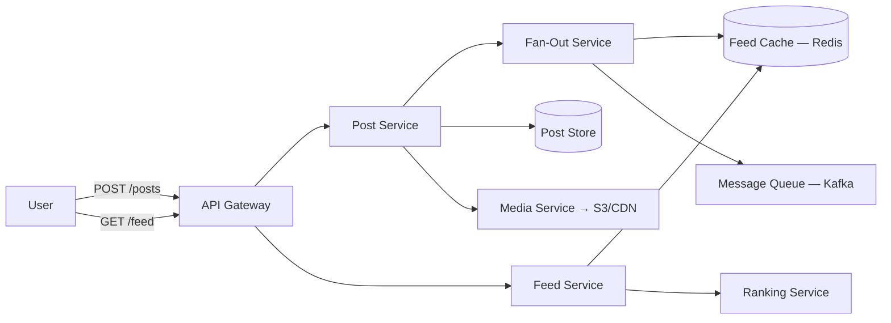

# News Feed — System Design

Designing a news feed system (think Facebook's News Feed, Twitter/X timeline, or Instagram's home feed) is a classic system design interview problem. It tests your understanding of fan-out strategies, ranking algorithms, caching at scale, and the trade-offs between read-heavy and write-heavy architectures.

---

## Interview Roadmap

Follow these steps in order — each maps to a phase the interviewer expects:

| Step | Topic | What You'll Cover |
|------|-------|-------------------|
| 1 | **[Requirements & Estimation](requirements-estimation.md)** | Clarify scope, define functional/non-functional requirements, estimate scale |
| 2 | **[High-Level Architecture](high-level-architecture.md)** | Core services, API design, component interactions |
| 3 | **[Feed Generation & Ranking](feed-generation-ranking.md)** | Fan-out strategies, ranking signals, feed assembly pipeline |
| 4 | **[Data Model & Storage](data-model-storage.md)** | Schema design, database selection, caching layer |
| 5 | **[Scalability & Reliability](scalability-reliability.md)** | Horizontal scaling, sharding, fault tolerance, monitoring |

---

## System Overview

---

## Key Design Decisions at a Glance

| Decision | Choice | Why |
|----------|--------|-----|
| Fan-out model | Hybrid (push + pull) | Push for normal users, pull for celebrity/high-follower accounts |
| Post store | PostgreSQL / MySQL | Relational data, strong consistency for writes |
| Feed cache | Redis sorted sets | Pre-computed feeds with score-based ranking, sub-ms reads |
| Message queue | Kafka | Ordered, durable fan-out event streaming |
| Ranking | ML-based scoring | Relevance > recency for engagement optimization |
| Media storage | S3 + CDN | Cost-effective blob storage with global edge delivery |
| Social graph | Graph DB or adjacency list in Redis | Fast follower/following lookups for fan-out |

!!! tip "Further Reading"
    - [Designing a News Feed System — System Design Interview (Alex Xu)](https://bytebytego.com/)
    - [How Facebook's News Feed Works](https://engineering.fb.com/)
    - [Twitter's Timeline Architecture](https://blog.twitter.com/engineering)
    - [Instagram's Explore Feed Ranking](https://engineering.fb.com/2023/08/09/ml-applications/explore-instagram-ranking/)
