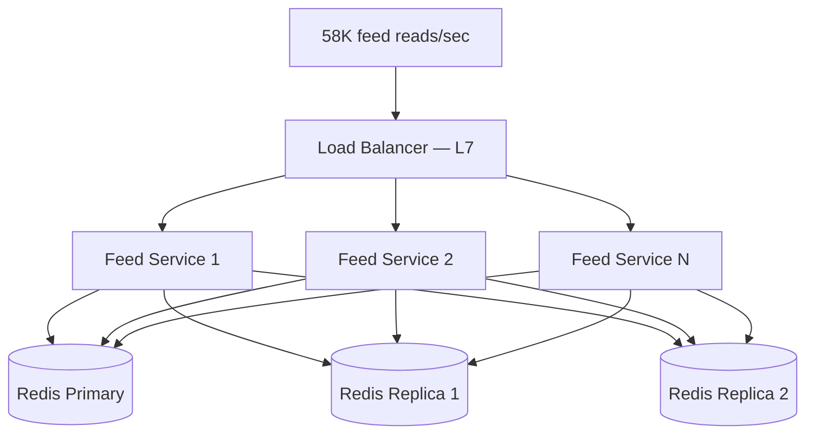
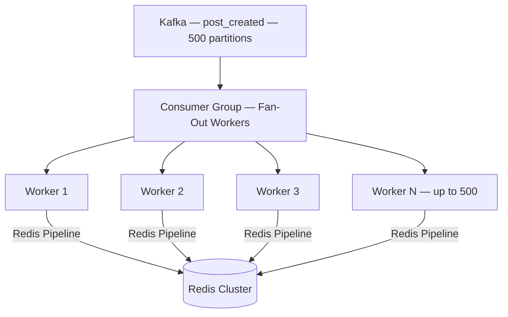
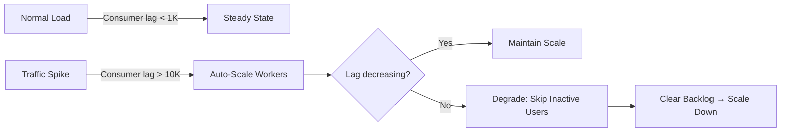
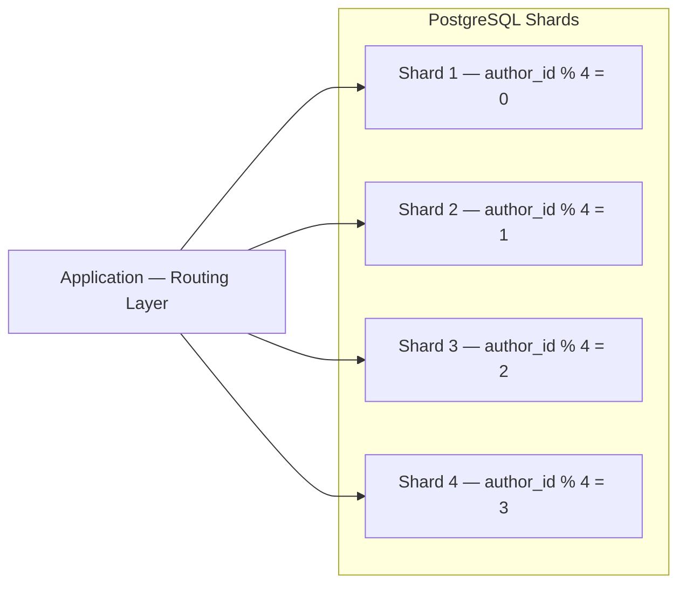
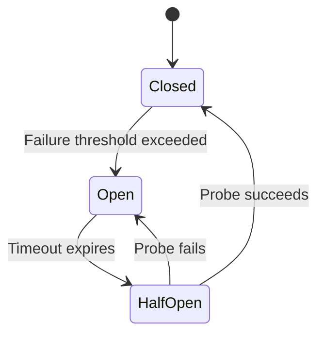
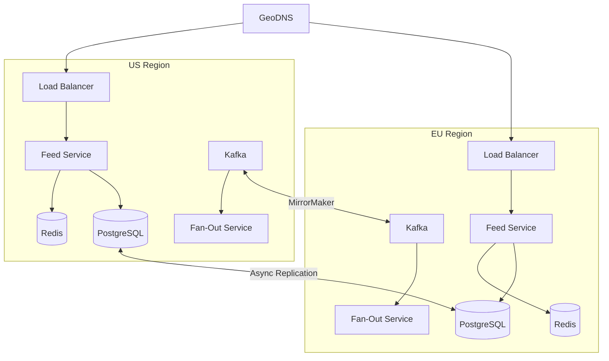

# Scalability & Reliability

The final phase of the interview: demonstrate that your design handles growth, failure, and real-world operational challenges. This is where senior candidates differentiate themselves.

---

## Scaling the Read Path

The read path (feed serving) handles ~58K requests/sec. Since feeds are pre-computed in Redis, the primary scaling lever is the cache layer.

### Feed Service Scaling



| Parameter | Typical Value |
|-----------|--------------|
| Feed Service instances | 20–50 (stateless, scale on CPU/network) |
| Redis cluster nodes | 50–100 (sharded by user_id hash slot) |
| Redis read replicas | 2–3 per primary (read-heavy workload) |
| Cache hit rate target | > 95% |
| P99 feed latency | < 200ms |

### Cache Strategy

| Scenario | Strategy |
|----------|----------|
| **Active user** | Feed cache is warm; direct ZREVRANGE read |
| **Returning user (cache cold)** | Rebuild from DB on first request; cache for subsequent reads |
| **Inactive user (> 30 days)** | Evict feed cache (TTL); rebuild on next login |
| **Cache miss under load** | Request coalescing — deduplicate concurrent rebuilds for same user |

---

## Scaling the Write Path

The write path is dominated by fan-out: 2.3M cache writes/sec at peak. The Fan-Out Service is the bottleneck.

### Fan-Out Worker Scaling



| Parameter | Typical Value |
|-----------|--------------|
| Kafka partitions for `post_created` | 500 |
| Fan-out worker instances | 100–500 (scales up to partition count) |
| Redis writes per worker | ~5K–10K ZADD/sec (pipelined) |
| End-to-end fan-out latency | 1–30 seconds (depending on follower count) |

### Backpressure Handling



| Lag Threshold | Action |
|--------------|--------|
| < 1,000 | Normal operation |
| 1,000 – 10,000 | Alert; begin scaling workers |
| 10,000 – 100,000 | Aggressive scaling; prioritize active users |
| > 100,000 | Emergency: skip fan-out for users inactive > 7 days |

---

## Database Scaling

### PostgreSQL (Posts, Users)

| Strategy | When to Use | Complexity |
|----------|------------|------------|
| **Read replicas** | Read throughput > single node capacity | Low |
| **Connection pooling (PgBouncer)** | Connection count > server limit | Low |
| **Partitioning (by time)** | Posts table > 1TB; queries are time-bounded | Medium |
| **Sharding (by author_id)** | > 10TB; single instance can't handle writes | High |

### Sharding by Author ID



| Concern | Approach |
|---------|----------|
| **Routing** | Application-level or proxy (Vitess/Citus) based on `author_id % N` |
| **Profile page queries** | All of a user's posts on one shard — efficient |
| **Feed assembly** | Cross-shard reads required — mitigate with cache |
| **Rebalancing** | Consistent hashing or virtual shards for smoother scaling |

!!! note "Do You Actually Need to Shard?"
    1B posts/day × 1 KB = 1 TB/day of post data. After 1 year, that's ~365 TB. You'll likely need sharding or partitioning. But start with time-based table partitioning (e.g., monthly) — it's simpler and works until write throughput exceeds a single primary.

### Redis Cluster Scaling

Redis Cluster automatically shards data across nodes using 16,384 hash slots.

| Operation | Approach |
|-----------|----------|
| **Add capacity** | Add nodes; Redis migrates hash slots automatically |
| **Hot keys** | Celebrity feed caches — replicate hot keys across read replicas |
| **Memory pressure** | Evict feeds for inactive users (LRU or TTL-based) |
| **Cross-slot operations** | Avoid — each user's feed is a single key, naturally slot-local |

---

## Kafka Partitioning

| Topic | Partition Key | Partitions | Why |
|-------|--------------|-----------|-----|
| `post_created` | `author_id` | 500 | Fan-out workers process one author's posts in order |
| `feed_updates` | `user_id` | 200 | Feed invalidation events ordered per user |
| `engagement` | `post_id` | 100 | Like/comment events grouped by post |
| `notifications` | `recipient_id` | 100 | Per-user notification ordering |

### Sizing

```
Fan-out events/sec (peak): 2.3M
Partitions for post_created: 500
Throughput per partition: ~4.6K events/sec
Consumer groups: Fan-Out, Notification, Analytics, Search
Retention: 3 days (posts are persisted in PostgreSQL)
```

---

## Rate Limiting

| Limit | Value | Scope | Algorithm |
|-------|-------|-------|-----------|
| Post creation | 50/hour | Per user | Token bucket |
| Feed reads | 300/min | Per user | Sliding window |
| Likes | 500/hour | Per user | Token bucket |
| Comments | 100/hour | Per user | Token bucket |
| Follow/unfollow | 200/day | Per user | Fixed window |
| Media uploads | 30/hour | Per user | Token bucket |
| API requests (global) | 1000/min | Per user | Sliding window |

---

## Fault Tolerance

### What Happens When Things Break?

| Failure | Impact | Mitigation |
|---------|--------|------------|
| **Feed Service instance down** | Reduced read capacity | Stateless; LB routes to healthy instances; auto-scale |
| **Redis node down** | Partial cache miss for some users | Redis Cluster promotes replica; affected feeds rebuilt on next read |
| **Redis cluster down** | All feeds served from DB (slow) | Fall back to pull model; serve stale feeds from CDN/edge cache |
| **Kafka broker down** | Fan-out delayed | RF=3; in-sync replicas take over; events buffered at producers |
| **Fan-Out Service down** | New posts don't appear in feeds | Kafka retains events; workers catch up on restart; reads fall back to pull |
| **PostgreSQL primary down** | Post writes fail | Automated failover (Patroni/RDS); promote replica; brief write outage |
| **S3 outage** | Media unavailable | CDN serves cached content; show text-only feed; S3 has 11 nines durability |
| **Ranking Service down** | Feed served without ML ranking | Fall back to chronological ordering from cache scores; degrade gracefully |

### Circuit Breaker Pattern



Apply circuit breakers between all service boundaries. Critical example: if the Ranking Service is down, the Feed Service should serve unranked results immediately rather than queuing up and timing out.

---

## Multi-Region Deployment

### Active-Active Architecture



| Concern | Approach |
|---------|----------|
| **Routing** | GeoDNS routes users to nearest region |
| **Cross-region follows** | User A (US) follows User B (EU) — follow stored in both regions; fan-out runs locally |
| **Post replication** | Posts replicated async across regions; fan-out runs independently per region |
| **Conflict resolution** | Last-write-wins with server timestamps; rare for append-only post data |

---

## Monitoring & Alerting

### Key Metrics

| Metric | Target | Alert Threshold |
|--------|--------|-----------------|
| Feed latency (p99) | < 200ms | > 500ms |
| Cache hit rate | > 95% | < 90% |
| Fan-out consumer lag | < 1,000 | > 10,000 |
| Post publish latency (p99) | < 500ms | > 1s |
| Error rate (5xx) | < 0.1% | > 1% |
| Redis memory usage | < 80% capacity | > 90% |
| PostgreSQL replication lag | < 1s | > 5s |

### Observability Stack

| Layer | Tool |
|-------|------|
| Metrics | Prometheus + Grafana |
| Logging | ELK Stack (Elasticsearch, Logstash, Kibana) |
| Tracing | Jaeger / OpenTelemetry |
| Alerting | PagerDuty / Opsgenie |

---

## Cost Optimization

| Resource | Strategy |
|----------|----------|
| **Compute** | Right-size Feed Service for network I/O; spot instances for Fan-Out workers (stateless, retryable) |
| **Redis** | Evict inactive users' feeds (TTL); compress post references; use Redis on Flash for warm data |
| **Storage** | S3 lifecycle policies (Standard → IA → Glacier); PostgreSQL table partitioning with cold partition archival |
| **Bandwidth** | CDN for all media; gzip API responses; client-side image size negotiation (request thumbnail vs. full) |
| **Kafka** | Tiered storage; aggressive topic retention (3 days); compact engagement topics |

---

??? question "Interview Questions"

    **Q: What's the single biggest bottleneck in this design?**
    The fan-out write path. At 2.3M Redis writes/sec during peak, the Fan-Out Service + Redis cluster is the most stressed component. The read path is straightforward (cache lookup). The key operational challenge is keeping fan-out latency low during traffic spikes while not over-provisioning during off-peak hours.

    **Q: How would you handle a user with 100M followers posting?**
    Never fan-out for this user — their posts are pulled at read time. When a follower requests their feed, the Feed Service queries the celebrity's recent posts separately and merges them with the pre-computed cache. For the celebrity's most active followers (mutual follows, frequent interactions), you might still push to their caches for a real-time feel.

    **Q: How do you ensure no data loss during a regional failover?**
    PostgreSQL async replication means the secondary region may be seconds behind. During failover, recently published posts might be temporarily unavailable. Mitigation: (1) semi-synchronous replication for critical writes (at least one remote replica ACKs), (2) Kafka MirrorMaker replicates events cross-region, (3) clients retry failed publishes. Accept that perfect zero-loss requires synchronous cross-region writes, which adds unacceptable latency.

    **Q: How would you migrate from a chronological feed to a ranked feed?**
    (1) Build the Ranking Service as a sidecar — it takes candidate posts and returns them reordered. (2) Shadow mode: run ranking on real traffic but discard results; compare metrics. (3) A/B test: 5% of users get ranked feed, 95% get chronological. Measure engagement delta. (4) Gradual rollout with a kill switch to revert. (5) Keep chronological as a user-selectable option.

    **Q: How do you test this system at scale?**
    (1) Load testing with k6 or Gatling simulating millions of feed reads and post publishes. (2) Chaos engineering (Chaos Monkey, Litmus) to validate fault tolerance. (3) Shadow traffic: replay production read patterns against staging. (4) Canary deployments: route 1% of traffic to new versions. (5) Synthetic monitoring: continuous feed-read probes from every region measuring latency and correctness.

!!! tip "Further Reading"
    - [Designing Data-Intensive Applications — Martin Kleppmann](https://dataintensive.net/)
    - [The System Design Primer — GitHub](https://github.com/donnemartin/system-design-primer)
    - [How Facebook Serves Timeline at Scale](https://engineering.fb.com/)
    - [Twitter's Real-Time Related Tweets Delivery](https://blog.twitter.com/engineering)
