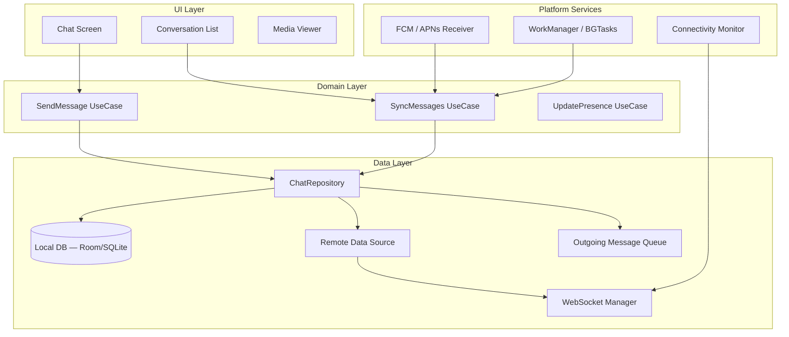

# Mobile Chat Architecture — System Design

Mobile system design interviews focus on **client-side** concerns: how the app is structured, how it handles unreliable networks, how it syncs data, and how it respects platform constraints (battery, memory, background execution limits).

This guide complements the [backend chat system design](../../generic/chat-app/index.md) — read that first for the server-side architecture.

---

## Interview Roadmap

| Step | Topic | What You'll Cover |
|------|-------|-------------------|
| 1 | **[Mobile Architecture](mobile-architecture.md)** | Client layers, WebSocket management, state management, UI rendering |
| 2 | **[Offline Support & Sync](offline-sync.md)** | Local database, sync protocol, conflict resolution, optimistic UI |
| 3 | **[Push Notifications & Background](push-notifications.md)** | FCM/APNs integration, silent notifications, badge management, battery optimization |

---

## Mobile vs. Backend: What Changes?

| Concern | Backend Focus | Mobile Focus |
|---------|--------------|--------------|
| **Networking** | Load balancers, service mesh | Unreliable connections, protocol switching (WiFi ↔ cellular) |
| **Storage** | Cassandra, S3, Redis | SQLite/Room, file system, limited disk space |
| **State** | Stateless services, Kafka | In-memory state, ViewModel lifecycle, process death |
| **Scaling** | Horizontal pod scaling | Single device, bounded memory/CPU |
| **Reliability** | Redundancy, replication | Offline-first, retry queues, graceful degradation |
| **Background work** | Always-on services | OS-restricted background execution (Doze, App Standby) |

---

## High-Level Mobile Architecture

---

## Key Design Principles for Mobile Chat

| Principle | What It Means |
|-----------|--------------|
| **Offline-first** | The local database is the source of truth for the UI. Network is a sync mechanism, not a dependency. |
| **Optimistic updates** | Show the user's sent message immediately (from local DB), then sync with server in the background. |
| **Graceful degradation** | If WebSocket is down, queue messages locally. If push fails, pull on app open. Never show an error for temporary network issues. |
| **Battery awareness** | Batch network operations. Use heartbeat intervals that balance responsiveness with power draw. Respect Doze mode. |
| **Process death resilience** | All critical state is in the local DB, not in-memory. The app can be killed and restored without data loss. |

!!! tip "Further Reading"
    - [Building Offline-First Apps — Google I/O](https://developer.android.com/topic/architecture/data-layer/offline-first)
    - [Signal Android — Open Source Reference](https://github.com/signalapp/Signal-Android)
    - [Designing for Unreliable Networks — iOS Human Interface Guidelines](https://developer.apple.com/design/human-interface-guidelines/)
