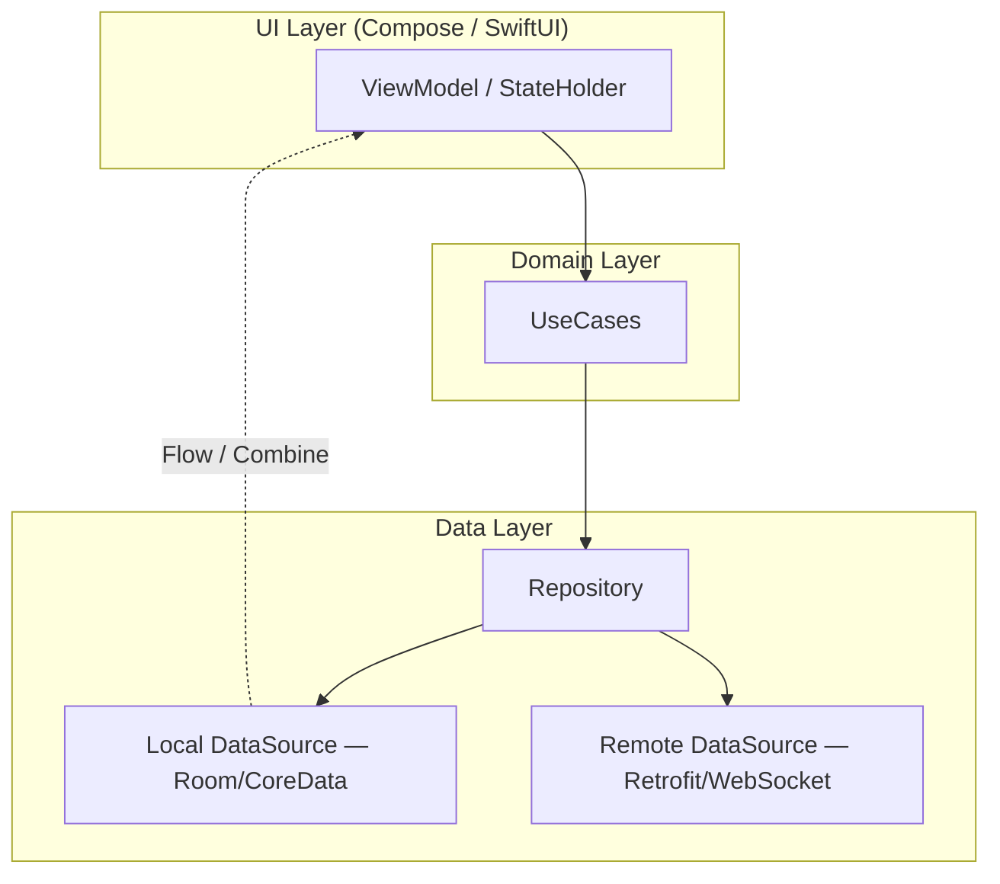
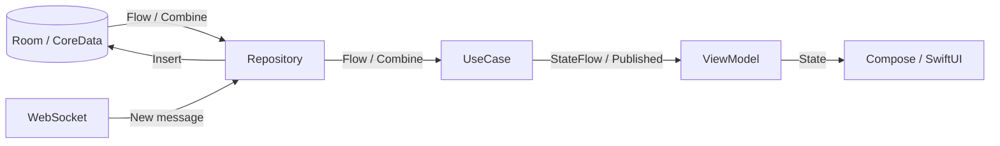
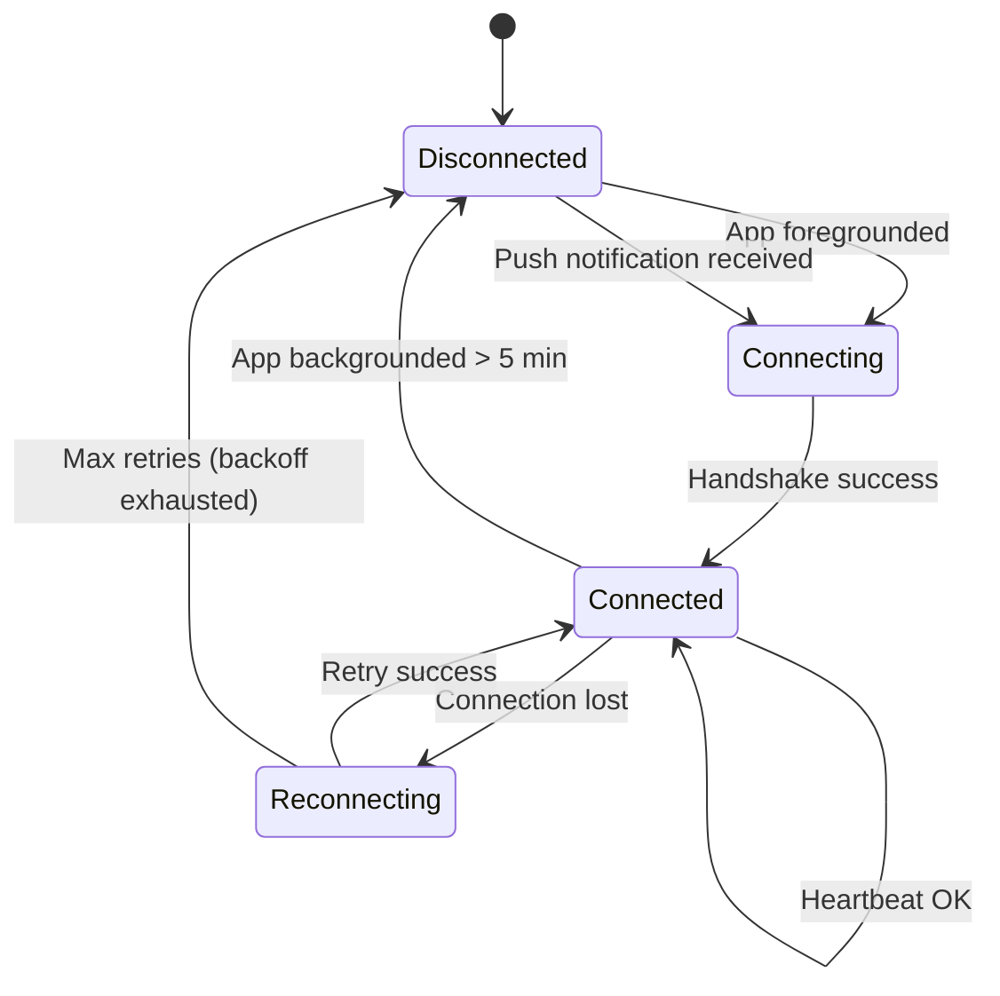
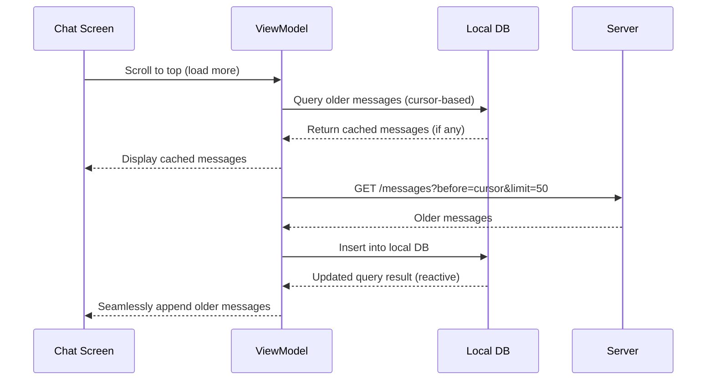
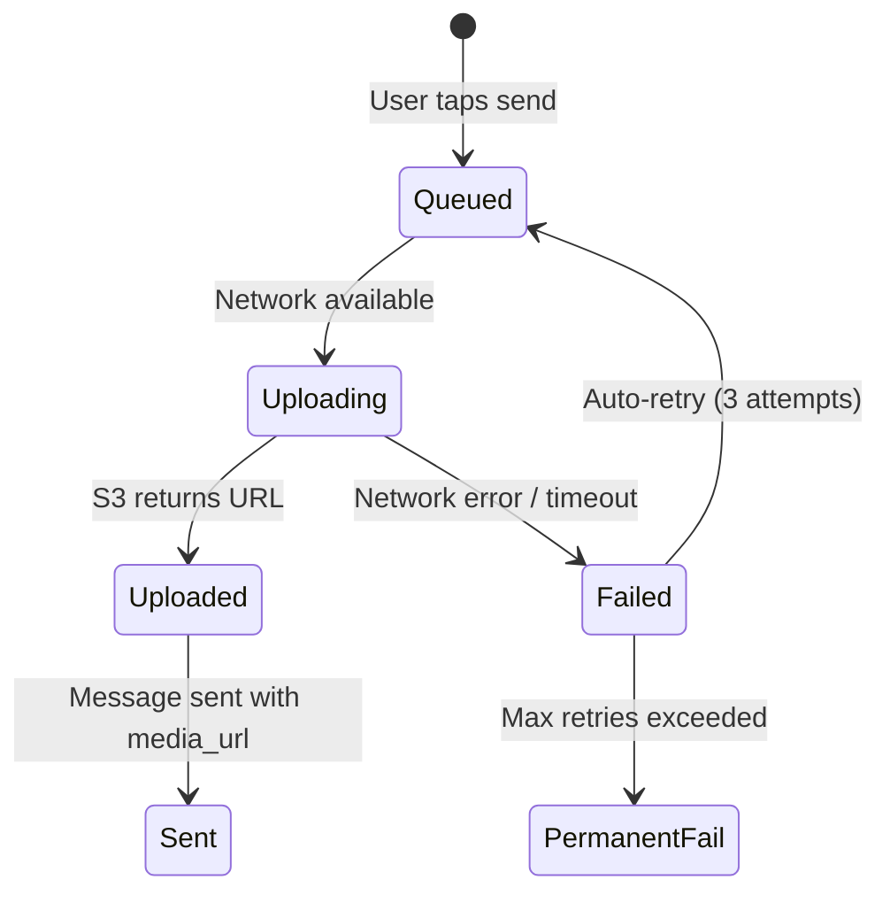

# Mobile Architecture

How to structure a chat app on the client side — layers, state management, WebSocket lifecycle, and UI rendering strategies.

---

## Architecture Layers



| Layer | Responsibility | Key Classes |
|-------|---------------|-------------|
| **UI** | Render state, capture user input | `ChatScreen`, `ConversationListScreen`, `ChatViewModel` |
| **Domain** | Business logic, orchestration | `SendMessageUseCase`, `SyncMessagesUseCase`, `MarkAsReadUseCase` |
| **Data** | Data access, caching, network | `ChatRepository`, `MessageDao`, `WebSocketManager`, `ChatApiService` |

### Dependency Rule

Dependencies flow **inward**: UI → Domain → Data. The Domain layer has no Android/iOS framework dependencies — pure Kotlin/Swift.

---

## State Management

### Chat Screen State

=== "Android (Kotlin)"

    ```kotlin
    data class ChatScreenState(
        val messages: List<MessageUiModel> = emptyList(),
        val inputText: String = "",
        val isConnected: Boolean = true,
        val isLoading: Boolean = false,
        val typingUsers: List<String> = emptyList(),
        val error: UiError? = null
    )

    class ChatViewModel(
        private val sendMessage: SendMessageUseCase,
        private val observeMessages: ObserveMessagesUseCase,
        private val savedStateHandle: SavedStateHandle
    ) : ViewModel() {

        private val conversationId: String =
            savedStateHandle["conversationId"]!!

        val state: StateFlow<ChatScreenState> =
            observeMessages(conversationId)
                .map { messages ->
                    ChatScreenState(
                        messages = messages.map { it.toUiModel() }
                    )
                }
                .stateIn(viewModelScope, SharingStarted.WhileSubscribed(5000), ChatScreenState())

        fun onSendClicked() {
            viewModelScope.launch {
                sendMessage(conversationId, state.value.inputText)
            }
        }
    }
    ```

=== "iOS (Swift)"

    ```swift
    @Observable
    class ChatViewModel {
        var messages: [MessageUIModel] = []
        var inputText: String = ""
        var isConnected: Bool = true
        var typingUsers: [String] = []

        private let sendMessage: SendMessageUseCase
        private let observeMessages: ObserveMessagesUseCase
        private let conversationId: String

        func onSendTapped() {
            Task {
                await sendMessage.execute(
                    conversationId: conversationId,
                    text: inputText
                )
                inputText = ""
            }
        }
    }
    ```

### Reactive Data Flow



The UI **never reads directly from the network**. All data flows through the local database:

1. WebSocket receives a new message
2. Repository inserts it into local DB
3. Room/CoreData emits an updated list via reactive query
4. ViewModel transforms and exposes it
5. UI recomposes/re-renders

This is the **single source of truth** pattern — the local DB is always authoritative.

---

## WebSocket Management

### Lifecycle-Aware Connection

The WebSocket connection must respect the app lifecycle:

| App State | WebSocket Behavior |
|-----------|-------------------|
| **Foreground** | Connected, full heartbeat |
| **Background (recent)** | Connected with reduced heartbeat (60s instead of 30s) |
| **Background (> 5 min)** | Disconnect, rely on push notifications |
| **Killed / Force-stopped** | No connection; sync on next app open |



### Reconnection Strategy

```
Attempt 1: wait 1s
Attempt 2: wait 2s
Attempt 3: wait 4s
Attempt 4: wait 8s
Attempt 5: wait 16s + random jitter (0-5s)
...
Max backoff: 60s
```

=== "Android (Kotlin)"

    ```kotlin
    class WebSocketManager(
        private val lifecycle: Lifecycle,
        private val connectivityMonitor: ConnectivityMonitor
    ) {
        private var retryCount = 0

        fun connect() {
            okHttpClient.newWebSocket(request, object : WebSocketListener() {
                override fun onOpen(ws: WebSocket, response: Response) {
                    retryCount = 0
                }

                override fun onFailure(ws: WebSocket, t: Throwable, response: Response?) {
                    scheduleReconnect()
                }
            })
        }

        private fun scheduleReconnect() {
            val delay = min(60_000L, (1000L shl retryCount)) +
                Random.nextLong(0, 5000)
            retryCount++
            handler.postDelayed(::connect, delay)
        }
    }
    ```

=== "iOS (Swift)"

    ```swift
    class WebSocketManager {
        private var retryCount = 0
        private var task: URLSessionWebSocketTask?

        func connect() {
            task = URLSession.shared.webSocketTask(with: url)
            task?.resume()
            receiveMessage()
        }

        private func scheduleReconnect() {
            let delay = min(60.0, pow(2.0, Double(retryCount)))
                + Double.random(in: 0...5)
            retryCount += 1
            DispatchQueue.main.asyncAfter(deadline: .now() + delay) {
                self.connect()
            }
        }
    }
    ```

### Network Transition Handling

When the device switches between WiFi and cellular, the TCP connection breaks.

| Event | Action |
|-------|--------|
| WiFi → Cellular | Detect via `ConnectivityManager` / `NWPathMonitor`; reconnect WebSocket on new network |
| Cellular → WiFi | Same — reconnect on new network |
| Airplane mode ON | WebSocket closes; queue outgoing messages locally |
| Airplane mode OFF | Reconnect; flush message queue; sync missed messages |

---

## Message Rendering

### Efficient List Rendering

Chat screens display potentially thousands of messages. Efficient rendering is critical.

| Platform | Component | Key Optimization |
|----------|-----------|-----------------|
| **Android** | `LazyColumn` (Compose) or `RecyclerView` | DiffUtil / `key` parameter for minimal recomposition; `reverseLayout = true` |
| **iOS** | `List` / `UICollectionView` with diffable data source | Compositional layout; prefetching for smooth scroll |

### Message Grouping

```
┌─────────────────────────────────┐
│         March 15, 2025          │  ← Date separator
├─────────────────────────────────┤
│ Alice                 10:30 AM  │
│ ┌─────────────────────────┐    │  ← Grouped: same sender,
│ │ Hey, are you free?      │    │    < 2 min apart
│ ├─────────────────────────┤    │
│ │ Want to grab coffee?    │    │
│ └─────────────────────────┘    │
│                                 │
│                     You 10:32  │
│    ┌─────────────────────────┐ │
│    │ Sure! Where?         ✓✓ │ │  ← Read receipts
│    └─────────────────────────┘ │
└─────────────────────────────────┘
```

Group consecutive messages from the same sender within a time window (e.g., 2 minutes). Show avatar and name only on the first message in a group.

### Pagination



Load from local DB first (instant), then backfill from server if needed. This eliminates loading spinners for recently viewed conversations.

---

## Image & Media Handling

| Concern | Approach |
|---------|----------|
| **Image loading** | Coil (Android) / Kingfisher (iOS); memory + disk cache |
| **Thumbnails** | Display server-generated thumbnail immediately; load full-res on tap |
| **Upload progress** | Show progress bar in the message bubble; persist upload state to survive process death |
| **Compression** | Compress images client-side before upload (max 1600px, 80% quality) |
| **Video** | Upload in background (WorkManager / BGTaskScheduler); show thumbnail + duration |

### Upload State Machine



---

??? question "Interview Questions"

    **Q: Why use the local database as the single source of truth instead of the network?**
    The network is unreliable on mobile — connections drop, latency varies, and the app can be killed at any time. By writing all data to the local DB first and observing it reactively, the UI always has data to display. The network is just a sync mechanism. This is the offline-first pattern and it eliminates loading states for cached data.

    **Q: How do you handle process death in the middle of sending a message?**
    The outgoing message is written to the local DB with status `pending` before any network call. A persistent worker (WorkManager on Android, BGTaskScheduler on iOS) picks up pending messages and sends them. Even if the process is killed, the worker reschedules on next app launch.

    **Q: How do you avoid excessive recomposition in a chat list?**
    Use stable keys (message IDs) in `LazyColumn`/`RecyclerView` so the framework only recomposes changed items. Use `derivedStateOf` or `distinctUntilChanged` to prevent upstream state changes from triggering unnecessary recompositions. For typing indicators and timestamps, update via dedicated state flows rather than recomposing the entire list.

    **Q: How do you manage WebSocket across configuration changes (rotation)?**
    The WebSocket connection lives in a singleton or application-scoped component (Hilt `@Singleton`, Koin `single`), not in the ViewModel or Activity. Configuration changes destroy and recreate Activities/ViewModels, but the singleton persists. The ViewModel observes connection state reactively.

    **Q: What's the tradeoff between WebSocket and HTTP for mobile?**
    WebSocket gives real-time delivery but holds a persistent connection (battery drain, memory). HTTP with push notifications is more battery-friendly but adds latency (seconds vs. milliseconds). The hybrid approach is best: WebSocket when foregrounded, push notifications when backgrounded.

!!! tip "Further Reading"
    - [Guide to App Architecture — Android Developers](https://developer.android.com/topic/architecture)
    - [Offline-First Architecture — Android Developers](https://developer.android.com/topic/architecture/data-layer/offline-first)
    - [URLSessionWebSocketTask — Apple Developer](https://developer.apple.com/documentation/foundation/urlsessionwebsockettask)
