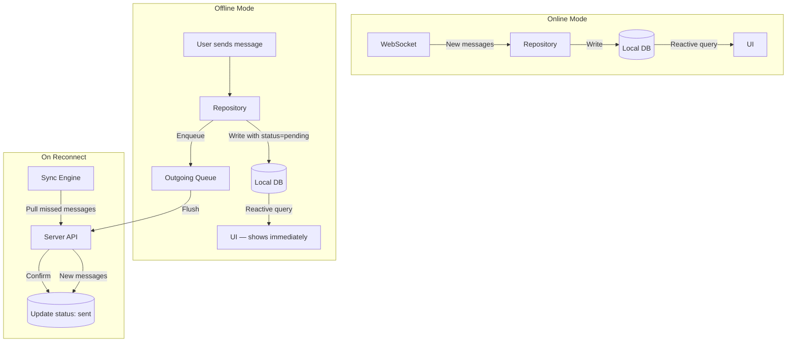
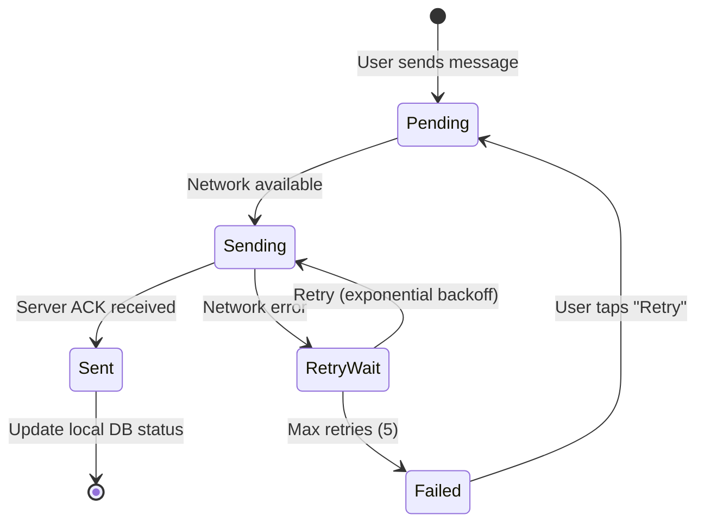
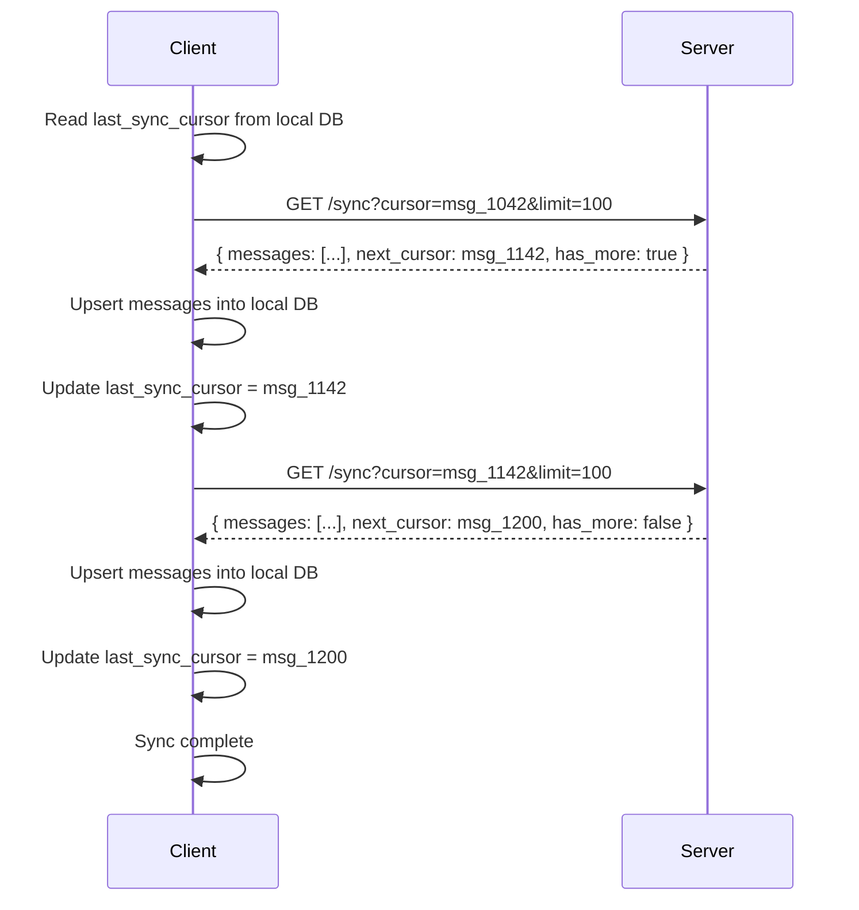
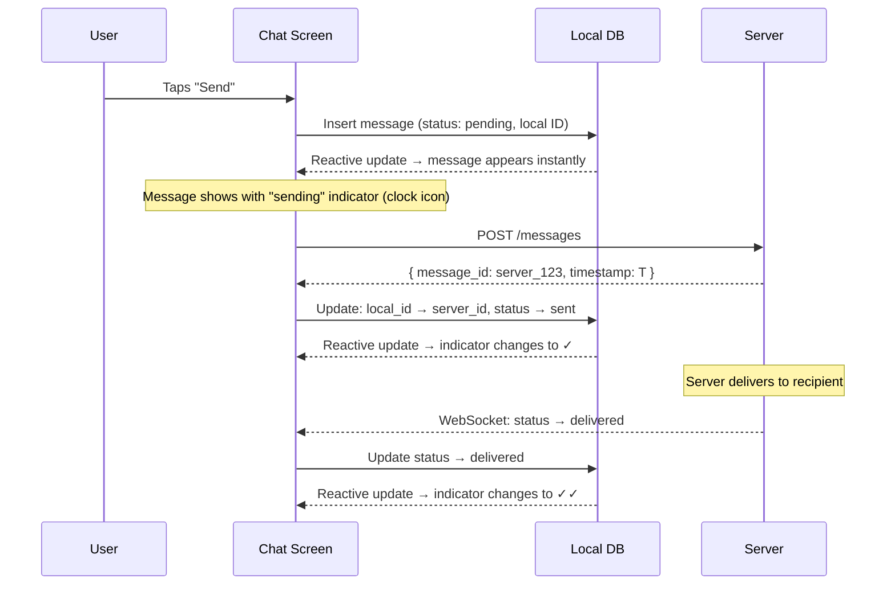

# Offline Support & Sync

The defining challenge of mobile chat: the app must work seamlessly when the network is unavailable, slow, or intermittent — and reconcile local state with the server when connectivity returns.

---

## Offline-First Architecture



### Core Principle

> **The local database is the UI's only data source.** The network is a background sync mechanism.

| Component | Role |
|-----------|------|
| **Local DB** | Source of truth for all displayed data |
| **Outgoing Queue** | Persisted queue of messages waiting to be sent |
| **Sync Engine** | Pulls missed messages from server on reconnect |
| **Conflict Resolver** | Handles discrepancies between local and server state |

---

## Local Database Schema

=== "Android (Room)"

    ```kotlin
    @Entity(tableName = "messages")
    data class MessageEntity(
        @PrimaryKey val messageId: String,
        val conversationId: String,
        val senderId: String,
        val content: String,
        val mediaUrl: String?,
        val type: String,
        val status: String,   // pending, sent, delivered, read, failed
        val localTimestamp: Long,
        val serverTimestamp: Long?,
        val syncState: String  // synced, pending_send, pending_delete
    )

    @Dao
    interface MessageDao {
        @Query("""
            SELECT * FROM messages
            WHERE conversationId = :convId
            ORDER BY COALESCE(serverTimestamp, localTimestamp) DESC
            LIMIT :limit
        """)
        fun observeMessages(convId: String, limit: Int): Flow<List<MessageEntity>>

        @Query("SELECT * FROM messages WHERE syncState = 'pending_send'")
        fun getPendingMessages(): List<MessageEntity>

        @Upsert
        suspend fun upsertMessages(messages: List<MessageEntity>)
    }
    ```

=== "iOS (Core Data)"

    ```swift
    @objc(MessageEntity)
    class MessageEntity: NSManagedObject {
        @NSManaged var messageId: String
        @NSManaged var conversationId: String
        @NSManaged var senderId: String
        @NSManaged var content: String
        @NSManaged var mediaUrl: String?
        @NSManaged var status: String
        @NSManaged var localTimestamp: Date
        @NSManaged var serverTimestamp: Date?
        @NSManaged var syncState: String
    }
    ```

### Why `COALESCE(serverTimestamp, localTimestamp)`?

Pending messages don't have a server timestamp yet. Using `localTimestamp` as fallback ensures they appear in the correct position in the chat. Once the server confirms, `serverTimestamp` takes over for canonical ordering.

---

## Outgoing Message Queue

Messages sent while offline (or during network hiccups) are queued locally and flushed when connectivity returns.

### Queue Lifecycle



### Implementation

=== "Android (WorkManager)"

    ```kotlin
    class SendMessageWorker(
        context: Context,
        params: WorkerParameters,
        private val chatApi: ChatApi,
        private val messageDao: MessageDao
    ) : CoroutineWorker(context, params) {

        override suspend fun doWork(): Result {
            val messageId = inputData.getString("message_id")
                ?: return Result.failure()

            val message = messageDao.getById(messageId)
                ?: return Result.failure()

            return try {
                chatApi.sendMessage(message.toRequest())
                messageDao.updateStatus(messageId, "sent")
                Result.success()
            } catch (e: IOException) {
                if (runAttemptCount < 5) Result.retry()
                else {
                    messageDao.updateStatus(messageId, "failed")
                    Result.failure()
                }
            }
        }
    }

    // Enqueue with constraints
    val request = OneTimeWorkRequestBuilder<SendMessageWorker>()
        .setInputData(workDataOf("message_id" to messageId))
        .setConstraints(
            Constraints.Builder()
                .setRequiredNetworkType(NetworkType.CONNECTED)
                .build()
        )
        .setBackoffCriteria(BackoffPolicy.EXPONENTIAL, 10, TimeUnit.SECONDS)
        .build()

    WorkManager.getInstance(context).enqueue(request)
    ```

=== "iOS (BGTaskScheduler)"

    ```swift
    func queueMessage(_ message: Message) {
        // 1. Save to local DB with pending status
        messageStore.save(message, status: .pending)

        // 2. Try immediate send
        Task {
            do {
                try await chatApi.send(message)
                messageStore.updateStatus(message.id, to: .sent)
            } catch {
                // 3. Schedule background retry
                scheduleBackgroundSync()
            }
        }
    }

    func scheduleBackgroundSync() {
        let request = BGProcessingTaskRequest(
            identifier: "com.app.message-sync"
        )
        request.requiresNetworkConnectivity = true
        try? BGTaskScheduler.shared.submit(request)
    }
    ```

---

## Sync Protocol

When the app comes online (foreground, reconnect, or push-triggered), it must pull messages it missed.

### Cursor-Based Sync



| Parameter | Value | Rationale |
|-----------|-------|-----------|
| **Cursor** | Last received `message_id` | Time-sortable IDs make cursor-based pagination natural |
| **Page size** | 100 messages | Balances request count vs. payload size |
| **Scope** | Per-conversation or global | Per-conversation for targeted sync; global for initial catch-up |
| **Storage** | `last_sync_cursor` persisted in SharedPreferences / UserDefaults | Survives process death and app restarts |

### Initial Sync vs. Incremental Sync

| Scenario | Strategy |
|----------|----------|
| **First launch** | Fetch last 50 messages per conversation for the 20 most recent conversations |
| **App reopened (< 1 hour)** | Incremental sync from `last_sync_cursor` — usually a few messages |
| **App reopened (> 24 hours)** | Incremental sync but may need multiple pages; show loading indicator for old conversations |
| **Conversation opened** | If local data is stale, fetch latest page from server; backfill older on scroll |

---

## Optimistic UI Updates

Show the user's action immediately, then reconcile with the server in the background.

### Send Message Flow



### Handling Failures Gracefully

| Scenario | User Sees | Under the Hood |
|----------|-----------|----------------|
| Message pending | Clock icon (⏳) | Message in outgoing queue, waiting for network |
| Message sent | Single check (✓) | Server ACK received, persisted |
| Message delivered | Double check (✓✓) | Recipient's device ACK received |
| Message read | Blue double check (✓✓) | Recipient opened the conversation |
| Send failed | Red exclamation (!) + "Retry" | Max retries exceeded; user can tap to retry |

---

## Conflict Resolution

Conflicts are rare in chat (messages are append-only), but they can occur in metadata updates.

### Where Conflicts Happen

| Data | Conflict Scenario | Resolution |
|------|-------------------|------------|
| **Messages** | Duplicate from retry after timeout | Deduplicate by `message_id` (idempotent upsert) |
| **Message status** | Local says "pending", server says "delivered" | Server wins — always advance forward in the state machine |
| **Conversation name** | Two admins rename simultaneously | Last-write-wins with server timestamp |
| **Mute/unmute** | Toggled offline, different state on server | Server wins on sync; show current state |
| **Delete message** | Deleted locally, still exists on server | Soft-delete propagates on sync |

### Conflict Resolution Rules

```
1. Messages are append-only → no conflict (deduplicate by ID)
2. Status transitions are monotonic → always move forward (pending → sent → delivered → read)
3. Metadata uses last-write-wins → server timestamp is authoritative
4. Deletes always win → if either side deleted, it's deleted
```

---

## Storage Management

Mobile devices have limited storage. The app must manage its disk footprint.

| Strategy | Implementation |
|----------|---------------|
| **LRU eviction** | Keep last 500 messages per conversation in local DB; older messages are fetched on scroll |
| **Media cache limits** | Cap image/video cache at 500 MB; evict least-recently-viewed first |
| **Database size monitoring** | Track DB size; warn user if approaching limit; offer "Clear old messages" option |
| **Attachment cleanup** | Delete local media files for messages older than 30 days; re-download on demand |
| **WAL checkpointing** | Periodically checkpoint Room's WAL to prevent unbounded growth |

---

??? question "Interview Questions"

    **Q: How do you handle the case where a user sends 10 messages offline and then comes online?**
    All 10 messages are in the outgoing queue with `status: pending`. On reconnect, the queue flushes them in order. Each message is sent with a client-generated temporary ID. The server assigns canonical IDs and timestamps, which the client uses to update local records. The UI shows all 10 immediately (optimistic) and updates their status indicators as confirmations arrive.

    **Q: What if the server has messages the client doesn't, AND the client has pending messages?**
    This is a bidirectional sync. On reconnect: (1) flush the outgoing queue first (send pending messages), (2) then pull missed messages using cursor-based sync. The local DB handles both — new server messages are inserted, and pending messages get their server-confirmed status. The reactive query re-emits the merged, correctly-ordered list.

    **Q: How do you prevent the local database from growing unbounded?**
    Implement a retention policy: keep the last N messages per conversation (e.g., 500) in the local DB. Older messages are evicted but can be fetched on demand when the user scrolls up. Media files are evicted more aggressively (LRU cache with a size cap). A periodic cleanup job runs via WorkManager / BGTaskScheduler.

    **Q: Why use WorkManager instead of a simple coroutine for sending messages?**
    Coroutines die with the process. If the user sends a message and immediately leaves the app, the coroutine is cancelled and the message is lost. WorkManager (Android) and BGTaskScheduler (iOS) persist the work request to disk and guarantee execution even after process death, app restarts, or device reboots.

    **Q: How do you test offline behavior?**
    (1) Use a fake/mock `WebSocketManager` that simulates disconnect/reconnect. (2) Toggle airplane mode in instrumented tests. (3) Use Charles Proxy or Network Link Conditioner to simulate slow/lossy networks. (4) Kill the app process mid-send and verify messages are recovered on relaunch.

!!! tip "Further Reading"
    - [WorkManager — Android Developers](https://developer.android.com/topic/libraries/architecture/workmanager)
    - [Background Tasks — Apple Developer](https://developer.apple.com/documentation/backgroundtasks)
    - [Offline-First Database Pattern — Room](https://developer.android.com/topic/architecture/data-layer/offline-first)
