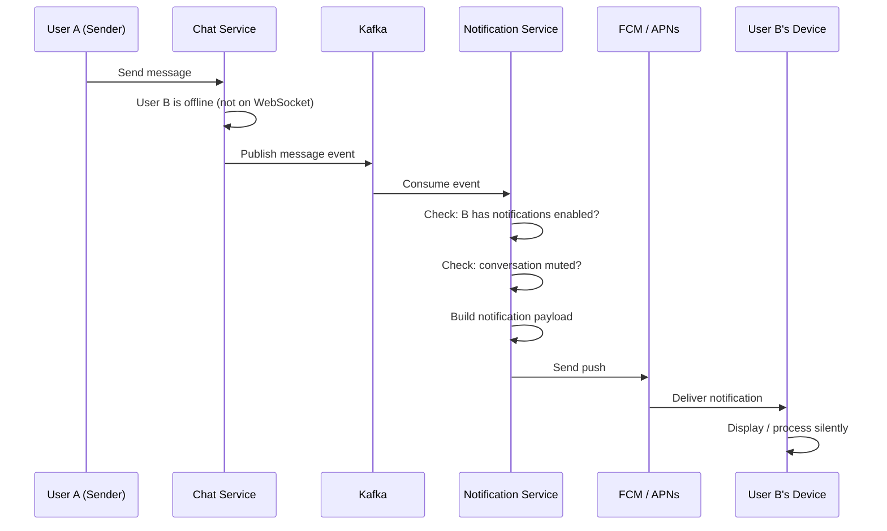
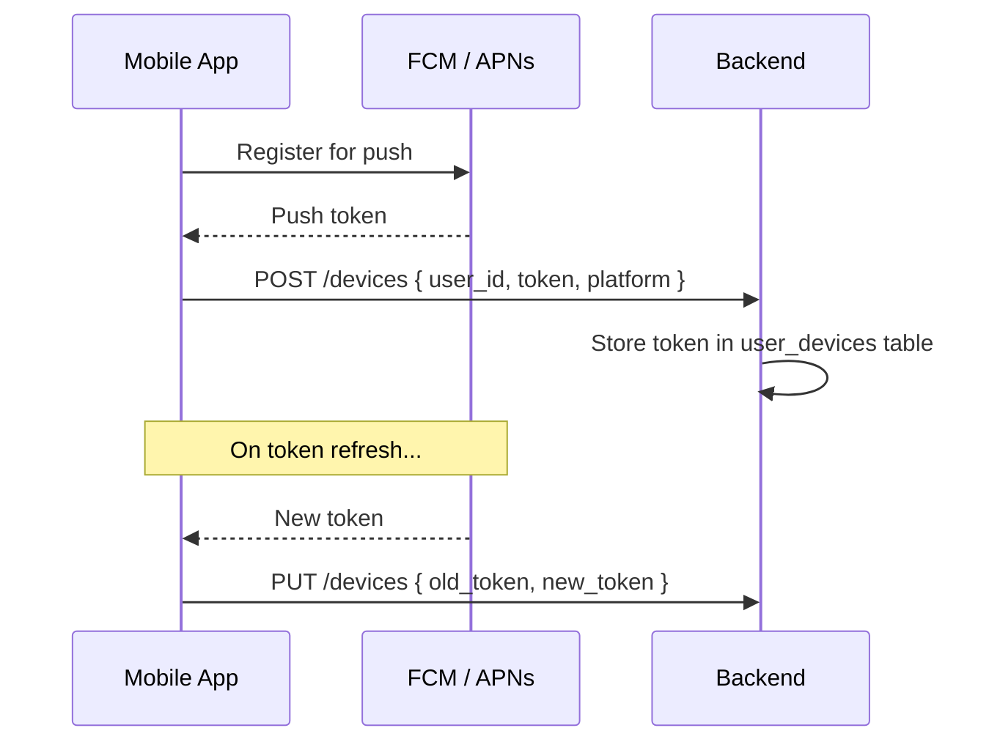
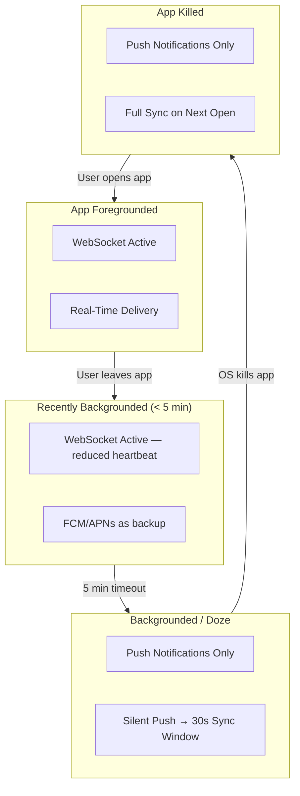

# Push Notifications & Background

When the chat app isn't in the foreground, push notifications are the only way to alert the user of new messages. This deep-dive covers FCM/APNs integration, silent vs. visible notifications, background processing constraints, and battery optimization.

---

## Push Notification Architecture



---

## FCM vs. APNs

| Aspect | FCM (Android) | APNs (iOS) |
|--------|--------------|------------|
| **Provider** | Google Firebase | Apple |
| **Transport** | HTTP/2 to FCM servers | HTTP/2 to APNs servers |
| **Token** | Registration token (per app + device) | Device token (per app + device) |
| **Payload limit** | 4 KB | 4 KB (visible), 4 KB (silent) |
| **Priority** | High (immediate) / Normal (batched) | Priority 10 (immediate) / 5 (opportunistic) |
| **Silent push** | Data-only message | `content-available: 1` |
| **Reliability** | Best-effort delivery | Best-effort delivery |
| **Token refresh** | Can change on app reinstall, restore, or new device | Changes on each app install |

### Token Registration Flow



---

## Notification Types

### Visible Notifications

Standard user-facing notifications that appear in the notification tray.

```json
{
  "to": "device_token_abc",
  "notification": {
    "title": "Alice",
    "body": "Hey, are you free tonight?",
    "image": "https://cdn.example.com/alice-avatar.jpg"
  },
  "data": {
    "conversation_id": "conv_42",
    "message_id": "msg_1001",
    "sender_id": "user_alice"
  }
}
```

### Silent Notifications (Data-Only)

Trigger background processing without displaying anything to the user.

=== "Android (FCM)"

    ```json
    {
      "to": "device_token_abc",
      "data": {
        "type": "sync",
        "conversation_id": "conv_42"
      }
    }
    ```

    ```kotlin
    class ChatFirebaseService : FirebaseMessagingService() {
        override fun onMessageReceived(message: RemoteMessage) {
            when (message.data["type"]) {
                "sync" -> {
                    val convId = message.data["conversation_id"]
                    SyncWorker.enqueue(this, convId)
                }
            }
        }
    }
    ```

=== "iOS (APNs)"

    ```json
    {
      "aps": {
        "content-available": 1
      },
      "conversation_id": "conv_42",
      "type": "sync"
    }
    ```

    ```swift
    func application(
        _ application: UIApplication,
        didReceiveRemoteNotification userInfo: [AnyHashable: Any]
    ) async -> UIBackgroundFetchResult {
        guard let convId = userInfo["conversation_id"] as? String else {
            return .noData
        }
        do {
            try await syncEngine.syncConversation(convId)
            return .newData
        } catch {
            return .failed
        }
    }
    ```

### When to Use Each

| Scenario | Notification Type | Why |
|----------|-------------------|-----|
| New message (app closed) | Visible | User needs to know |
| New message (app backgrounded recently) | Silent → sync → local notification | Avoids duplicate if WebSocket already delivered |
| Read receipt update | Silent | No need to alert the user |
| Conversation metadata change | Silent | Sync in background |
| Typing indicator | None | Ephemeral; not worth a push |

---

## Notification Grouping & Stacking

Avoid notification spam when multiple messages arrive.

### Android — Notification Channels & Groups

```kotlin
fun showMessageNotification(message: MessageData) {
    val groupKey = "chat_${message.conversationId}"

    // Individual message notification
    val notification = NotificationCompat.Builder(context, CHANNEL_MESSAGES)
        .setSmallIcon(R.drawable.ic_chat)
        .setContentTitle(message.senderName)
        .setContentText(message.content)
        .setGroup(groupKey)
        .setAutoCancel(true)
        .setContentIntent(createChatPendingIntent(message.conversationId))
        .build()

    // Summary notification (shown when grouped)
    val summary = NotificationCompat.Builder(context, CHANNEL_MESSAGES)
        .setSmallIcon(R.drawable.ic_chat)
        .setGroup(groupKey)
        .setGroupSummary(true)
        .setStyle(
            NotificationCompat.InboxStyle()
                .setSummaryText("${messageCount} new messages")
        )
        .build()

    notificationManager.notify(message.id.hashCode(), notification)
    notificationManager.notify(groupKey.hashCode(), summary)
}
```

### iOS — Notification Grouping

```swift
let content = UNMutableNotificationContent()
content.title = message.senderName
content.body = message.content
content.threadIdentifier = message.conversationId  // Groups by conversation
content.summaryArgument = message.senderName
```

### Grouping Strategy

| Messages | Display |
|----------|---------|
| 1 message from Alice | `Alice: Hey!` |
| 3 messages from Alice | `Alice (3 messages)` — stacked |
| Messages from Alice + Bob in same group | `Group Name: 5 new messages` — grouped by conversation |
| Messages from 4 different conversations | 4 separate notification groups |

---

## Badge Count Management

| Platform | Mechanism | Implementation |
|----------|-----------|----------------|
| **Android** | Launcher badge (via ShortcutBadger or OS API) | Increment on new notification; clear when conversation opened |
| **iOS** | `UIApplication.shared.applicationIconBadgeNumber` | Server sends badge count in push payload; client resets on app open |

### Server-Side Badge Calculation

```
badge_count = SUM(unread messages across all unmuted conversations)
```

Include the badge count in every push payload so the icon stays accurate even if the app isn't running.

---

## Background Processing Constraints

Mobile operating systems aggressively limit background execution to preserve battery.

### Android Background Limits

| OS Version | Constraint | Impact on Chat |
|------------|-----------|----------------|
| Android 6+ (Doze) | Defers network + jobs when idle | Heartbeats paused; push notifications still delivered via high-priority FCM |
| Android 8+ (Background limits) | No background services (except foreground services) | Must use WorkManager for background sync |
| Android 12+ (Exact alarm restrictions) | Exact alarms require permission | Use inexact alarms for non-critical sync |
| Android 13+ (Notification permission) | Must request `POST_NOTIFICATIONS` runtime permission | Prompt user on first message; explain value |

### iOS Background Limits

| Constraint | Impact on Chat |
|-----------|----------------|
| Background execution limited to ~30 seconds | Silent push processing must complete quickly |
| Background App Refresh | Opportunistic; OS decides when to grant time |
| No persistent connections in background | WebSocket must disconnect; rely on APNs |
| Background URLSession | Use for media upload/download that survives suspension |

### Working Within Constraints



---

## Battery Optimization

| Strategy | Implementation | Battery Impact |
|----------|---------------|----------------|
| **Batch network calls** | Combine sync + presence + read receipts into one request | Reduces radio wake-ups |
| **Adaptive heartbeat** | 30s foreground → 60s background → none when idle | Reduces keep-alive traffic |
| **Efficient serialization** | Use Protobuf instead of JSON for WebSocket frames | ~30% smaller payloads |
| **Image lazy loading** | Load thumbnails only; full images on tap | Reduces bandwidth |
| **WiFi preference** | Defer large media sync to WiFi (user-configurable) | Preserves cellular data |
| **Doze-friendly FCM** | Use high-priority FCM for messages (bypasses Doze) | Minimal — high-priority is rate-limited by OS |

### High-Priority vs. Normal Push

| Priority | Behavior | Use For |
|----------|----------|---------|
| **High** | Delivered immediately, even in Doze | New messages, calls |
| **Normal** | Batched by OS, delivered opportunistically | Read receipts, typing, presence |

!!! warning "High-Priority Rate Limits"
    Both Android and iOS throttle high-priority pushes. If your app sends too many, the OS may silently downgrade them to normal priority. Reserve high-priority for messages the user actually needs to see.

---

## Duplicate Prevention

A common pitfall: the user receives the same message via **both** WebSocket and push notification.

| Scenario | Solution |
|----------|---------|
| WebSocket delivers first, push arrives later | On push receipt, check if `message_id` exists in local DB; if yes, suppress notification |
| Push delivers first, WebSocket delivers later | WebSocket handler deduplicates by `message_id`; no double-insert |
| App in foreground when push arrives | Never show notification for foreground messages; the UI is already visible |

```kotlin
override fun onMessageReceived(message: RemoteMessage) {
    val messageId = message.data["message_id"] ?: return
    val exists = messageDao.exists(messageId)
    if (!exists) {
        messageDao.insert(message.toEntity())
        showNotification(message)
    }
}
```

---

??? question "Interview Questions"

    **Q: How do you ensure push notifications are delivered reliably?**
    You can't — FCM and APNs are best-effort. Mitigations: (1) use high-priority for important messages, (2) implement a full sync on app open (don't rely solely on push), (3) store undelivered notifications server-side and deliver on next connection, (4) use silent push to trigger sync rather than carrying message content.

    **Q: Why use silent push + local notification instead of a visible push?**
    Silent push triggers background sync, which pulls all missed messages and builds a proper notification with correct grouping, badge count, and conversation context. A visible push from the server only has the single message's data and can't account for client-side state (was the conversation already open? is the user muted?). The client makes better notification decisions.

    **Q: How do you handle token invalidation?**
    FCM/APNs tokens can change at any time (reinstall, restore, new device). The client re-registers on every app launch. The server stores multiple tokens per user (multi-device). When FCM/APNs returns an "invalid token" error, the server removes that token from the database. A periodic cleanup job removes tokens with no successful delivery in 30 days.

    **Q: What happens if the user has 100 unread conversations when they open the app?**
    Don't try to sync everything at once. Priority order: (1) sync the conversation the user is opening, (2) sync the 20 most recent conversations in the background, (3) lazy-sync older conversations when the user scrolls to them. Show cached data immediately and update as sync completes. Never block the UI on a full sync.

    **Q: How do you test push notifications in development?**
    (1) Use FCM/APNs test tools to send pushes directly. (2) Mock the push handler in integration tests to verify local behavior (dedup, sync trigger, notification display). (3) Use a staging FCM project with separate tokens. (4) Test Doze behavior with `adb shell dumpsys deviceidle` commands.

!!! tip "Further Reading"
    - [Firebase Cloud Messaging — Android](https://firebase.google.com/docs/cloud-messaging)
    - [APNs Overview — Apple Developer](https://developer.apple.com/documentation/usernotifications)
    - [Optimize for Doze and App Standby — Android](https://developer.android.com/training/monitoring-device-state/doze-standby)
    - [Background Execution Limits — Apple](https://developer.apple.com/documentation/backgroundtasks)
